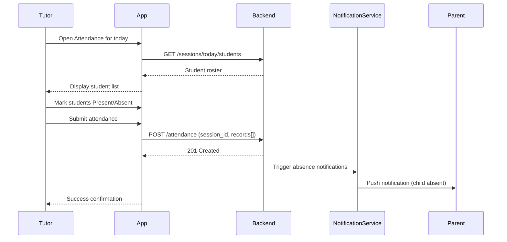
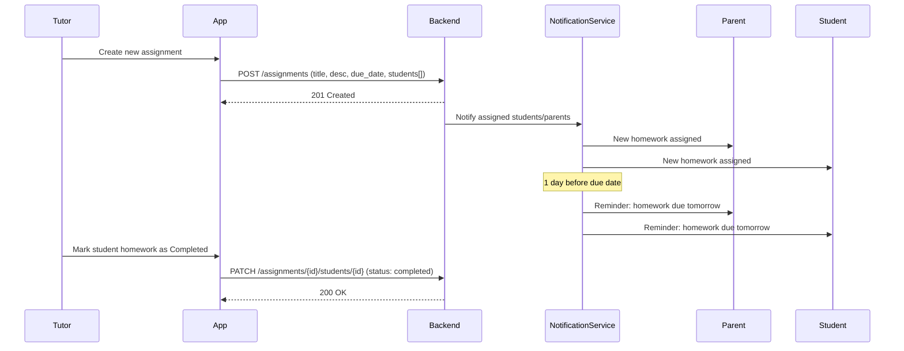
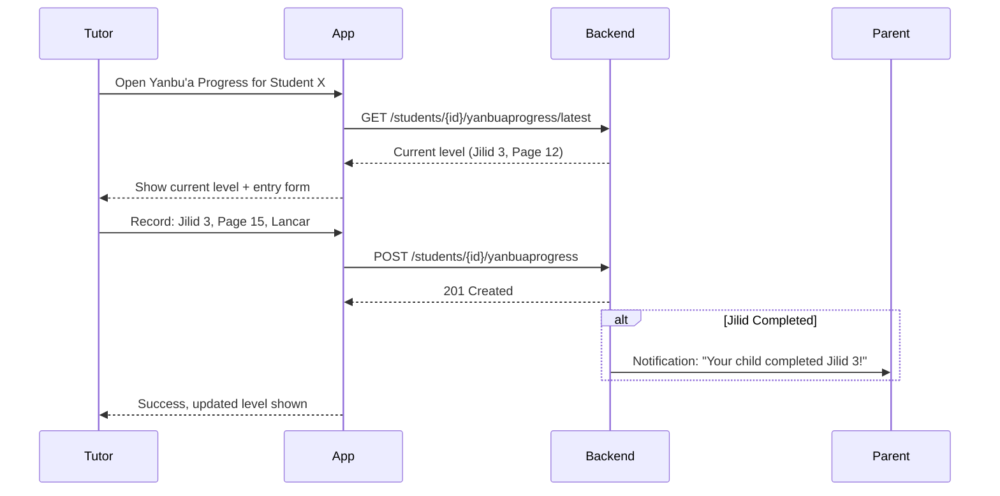
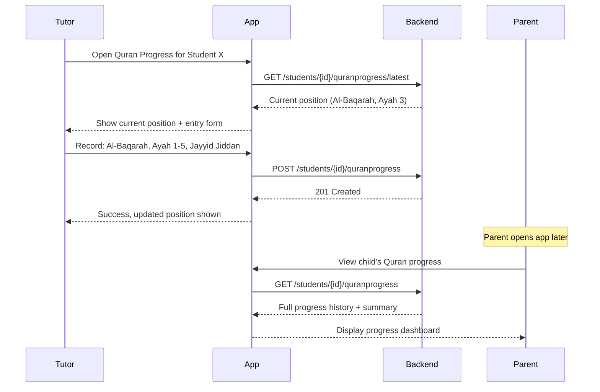
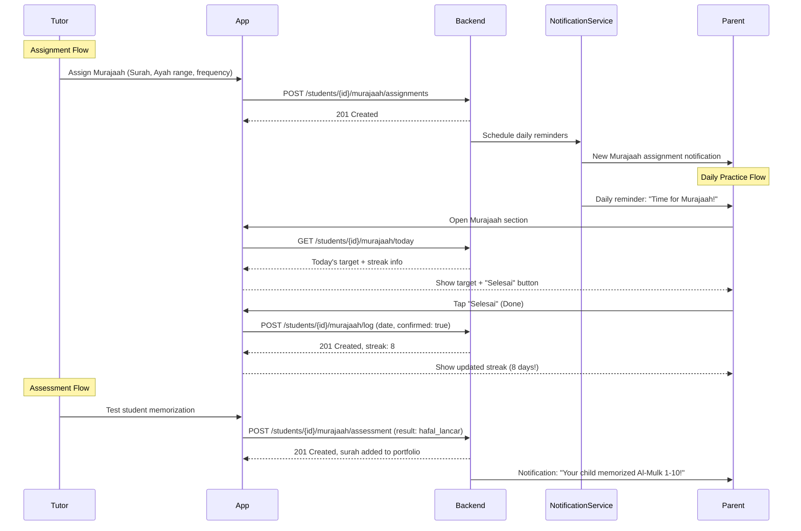
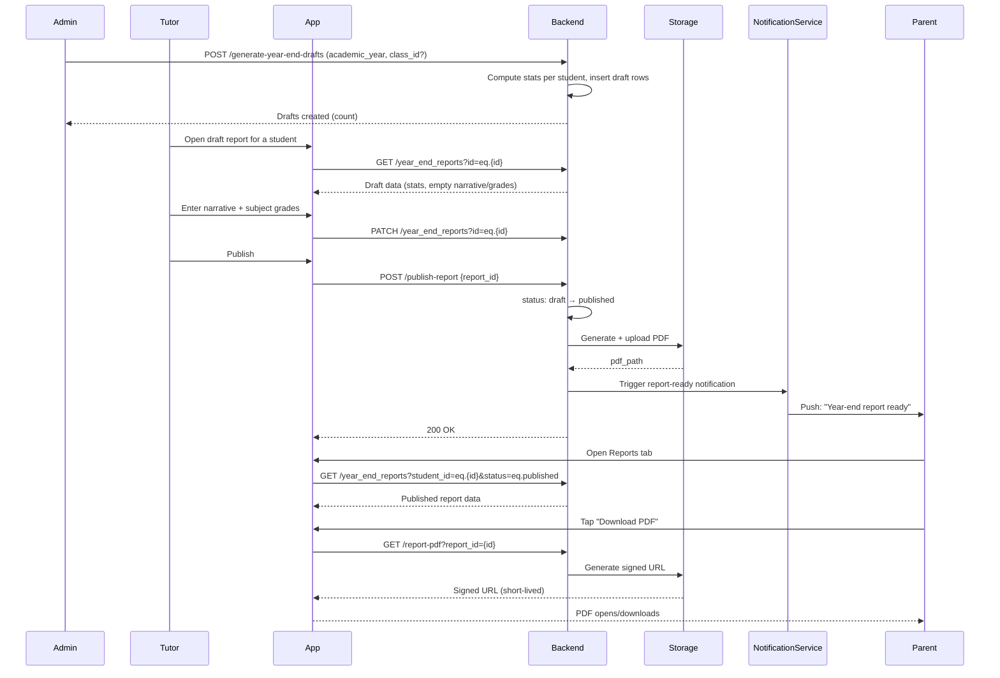

# Product Requirements Document: PPME - TPA

---

## Table of Contents
1. [Overview](#1-overview)
2. [Key Information](#2-key-information)
3. [Target Regions & Markets](#3-target-regions--markets)
4. [Goals and Success Metrics](#4-goals-and-success-metrics)
5. [EPIC Requirements](#5-epic-requirements)
6. [FEATURE Requirements](#6-feature-requirements)
7. [Timeline and Milestones](#7-timeline-and-milestones)
8. [Open Questions](#8-open-questions)
9. [Appendix](#appendix)

---

## 1. Overview

*   **Problem Statement:** Parents and tutors within PPME (Persatuan Pemuda Muslim se-Eropa) Den Haag's TPA (Taman Penitipan Al-Quran) program currently lack a centralized, digital system to track student attendance, homework assignments, and Quranic learning progress (Yanbu'a, Quran recitation, and Murajaah). Communication between tutors and parents is fragmented, making it difficult to monitor student development and ensure consistent learning both at the TPA and at home — particularly challenging for a diaspora community spread across multiple cities in the Netherlands.

*   **Goal:** Provide a unified digital platform that enables PPME tutors to manage attendance and assignments, track each student's Quranic learning journey, and give parents real-time visibility into their child's progress — ultimately improving student outcomes and strengthening the tutor-parent-student feedback loop across PPME's community.

*   **Vision:** To be the go-to digital companion for PPME's TPA education program, making Quranic education tracking as seamless and transparent as possible for the Indonesian Muslim community in the Netherlands.

*   **Business Driver:**
    *   **Strategic Rationale:** Community Development, Educational Quality Improvement, Parent Engagement, Digital Transformation of traditional TPA record-keeping, Supporting PPME's mission of personal and religious growth for its members
    *   **Conversion Rate Impact:** Expected to increase parent engagement by 50%+, reduce missed homework follow-ups by 70%, and improve student Yanbu'a/Quran progression rates by 30%

*   **Technical Principles:**
    *   **Authentication:** Google Authentication (OAuth 2.0) or equivalent trusted identity provider — no custom password management
    *   **Data Protection:** GDPR-compliant encrypted storage (at rest and in transit); EU-based data residency
    *   **Hosting:** Netlify (EU region) for easy deployments, high availability, and affordable pricing
    *   **Technology Providers:** European-based providers preferred wherever possible (hosting, storage, services)
    *   **Cost:** Leverage free tiers and affordable subscriptions suitable for a community/non-profit use case

*   **Design Direction (aligned with ppmedenhaag.nl):**
    *   **Color Palette:**
        *   Primary: PPME Royal Blue (~#0D50A0) — sampled from the PPME logo; trust, community, identity
        *   Primary (dark variant): ~#0A3E7A — hover states, pressed buttons, nav depth
        *   Secondary: White/off-white (#FFFFFF / #F8F9FA) — clean content backgrounds
        *   Accent: Gold/amber (~#C8A415) — highlights, CTAs, achievement badges (complementary to logo blue, used for milestone/celebration moments)
        *   Text: Dark charcoal (#333333) — readable body copy
        *   Danger/Alert: Warm red (#D32F2F) — absence markers, overdue items
        *   Success: Soft green (#4CAF50) — completion, streaks, present markers
    *   **Typography:**
        *   Font family: Clean sans-serif (Open Sans or equivalent) — matching ppmedenhaag.nl
        *   Headings: Bold weight, dark charcoal or white-on-blue
        *   Body: Regular weight, generous line-height (1.6) for readability
    *   **Layout & Components:**
        *   Mobile-first single-column layout with generous padding
        *   Card-based UI with subtle shadows and rounded corners (~8px border-radius)
        *   Top navigation bar: royal blue background (#0D50A0), white text, PPME logo left
        *   Bottom tab navigation on mobile (Attendance | Homework | Yanbu'a | Quran | Murajaah)
        *   Date badges overlaid on cards (matching ppmedenhaag.nl event card style)
    *   **Aesthetic & Tone:**
        *   Traditional-meets-modern: dignified, warm, community-oriented
        *   Not corporate or flashy — accessible and trustworthy
        *   Language toggle (ID/NL) in navigation, matching ppmedenhaag.nl pattern
        *   PPME logo and branding integrated naturally
    *   **Interactions:**
        *   Large tap targets for mobile (minimum 44px)
        *   Subtle animations for progress milestones (jilid completion, streak)
        *   Gold accent for achievement/celebration moments

*   **Design Validation (Figma Make prototype, reviewed 2026-07-01):**
    *   Prototype: https://www.figma.com/make/yiSqCIb1j1gV4OYyDHjqLy/Create-UI-UX-Prototypes
    *   Palette confirmed pixel-accurate against spec across all 15 screens reviewed: Primary `#0D50A0`, Accent `#C8A415`, Success `#4CAF50`, Danger `#D32F2F`, Secondary `#FFFFFF`/`#F8F9FA`.
    *   Layout/component patterns confirmed: card-based mobile-first UI, rounded corners, bottom tab nav in the specified order (Hadir | Tugas | Yanbu'a | Al-Quran | Murajaah), top nav with logo + language toggle, gold reserved specifically for achievement/streak moments (e.g. Murajaah streak flame, "Sudah Hafal" badges).
    *   **Note — prototype-only affordance:** the reviewed screens include a top-level "Pilih Peran" (Ustadz / Orang Tua / Santri) switcher used to demo all three role views in one prototype. This is **not** a feature to build — in production, role is derived from the authenticated user via Supabase Auth + RLS (see TAD, `user_role` enum), not manually switched.
        *   **Follow-up (TAD ADR-025):** this note still stands, and a control that *is* now built sits next to it — so the distinction is worth stating rather than leaving to be rediscovered. The app has an explicit **scope switch** on the six two-shaped screens, and it is not the affordance rejected above. The prototype's switcher offered all three roles to everybody, so that one prototype could demo three role views; it changed who you were pretending to be. The scope switch offers only the relationships the signed-in account actually holds, derived from the same predicates the RLS policies use, and it renders **only** for someone who holds more than one — a parent, a tutor, a santri or an admin who is one thing sees no control at all. It is labelled by subject ("Grup saya" / "Anak saya") and never by role, precisely so it cannot be read as picking one. Role is still derived from the authenticated user and never switched; what a person may now choose is *which of their own relationships a screen is about*. This became necessary rather than merely possible once ADR-019 established that a real person here holds several relationships at once — an ustadz whose own child attends had no route to that child's screens at all.
    *   **Open for follow-up:** notification center/list screen — **built** (Milestone 7 part 3, TAD ADR-017) and **reviewed against this design direction**, with the findings applied; see checklist §5 for the review itself. What that review could *not* do is stand in for PPME: it checked the screen against the documented palette, component patterns and interaction rules above, not against anyone's judgement of whether this is the right screen. A prototype-batch review with PPME is still outstanding, and the schema stays deliberately presentation-free so it can act on whatever that review says without a migration; language toggle (ID/NL) destination behavior not yet verified; "date badges overlaid on cards" from the design direction above appear as plain text timestamps in the current prototype rather than overlaid badges (minor, cosmetic).

## 2. Key Information

*   **Product Manager:** [TBD]
*   **Engineering Manager:** [TBD]
*   **Stakeholders:** PPME Den Haag Board, TPA Committee, Tutors (Ustadz/Ustadzah), Parents/Carers, Community Youth Leaders
*   **Document Status:** Draft
*   **Last Updated:** 2026-06-29
*   **Feature Type:** New Feature
*   **Feature Access:** External (Community-facing)
*   **Applies To:** PPME Den Haag — Taman Penitipan Al-Quran (TPA) Program
*   **Targeted Product Offerings:** PPME - TPA (Web App / Mobile App)

## 3. Target Regions & Markets

*   **Region/Market 1:** PPME Den Haag (Medlerstraat 4, Den Haag, Netherlands) — Primary market. The Indonesian Muslim community in Den Haag with families enrolled in the TPA program. Tutors and parents need a simple, mobile-friendly tool to replace paper-based tracking. Most members are comfortable with digital tools (WhatsApp, web apps) given the European context.

*   **Region/Market 2:** PPME Branch Communities (Rotterdam, Amsterdam, Heemskerk, Breda) — Secondary market. Potential expansion to other PPME branches that operate similar TPA/Quran education programs across the Netherlands.

## 4. Goals and Success Metrics

*   **Business Objectives:**
    *   Digitize 100% of attendance tracking within 2 months of launch
    *   Enable tutors to assign and track homework digitally
    *   Provide parents with real-time visibility into their child's Yanbu'a, Quran, and Murajaah progress
    *   Increase student completion rate of Yanbu'a levels by 30%

*   **Success Metrics:**
    *   90%+ daily attendance logging rate by tutors
    *   80%+ parent weekly active usage (viewing progress)
    *   50% reduction in miscommunication between tutors and parents regarding homework
    *   Measurable improvement in average student Yanbu'a level progression speed

## 5. EPIC Requirements

*   **Epic's Name:** Build a Digital Progress Tracking Platform for PPME Den Haag's TPA to Improve Student Quranic Learning Outcomes and Parent-Tutor Communication

*   **Epic Description:**
    *   **Claim:** PPME Den Haag's TPA program relies on manual, paper-based methods to track student attendance, homework, and Quranic learning progress (Yanbu'a, Quran recitation, Murajaah). This leads to lost records, poor parent visibility, and inconsistent follow-up on student learning — resulting in slower student progression and disengaged parents within the community.
    *   **Evidence:** Tutors spend significant time on manual record-keeping; parents frequently ask for updates via informal channels (WhatsApp messages); students' Murajaah progress at home is untracked; paper records are lost or inconsistent across tutors. As a diaspora community, some families may not attend every session in person, making digital access even more critical.
    *   **Reasoning:** A centralized digital platform will eliminate manual record-keeping overhead, provide parents with self-service access to their child's progress, create accountability for at-home Murajaah practice, and enable tutors to focus on teaching rather than administration. This aligns with PPME's mission of supporting members' personal and religious growth.

*   **WHAT:**
    *   A web/mobile application with three user roles (Tutor, Parent, Student)
    *   Attendance management module (check-in/check-out, absence reasons)
    *   Homework assignment module (create, assign, track completion)
    *   Yanbu'a progress tracker (level, page, jilid progression)
    *   Quran recitation progress tracker (surah, ayah, quality assessment)
    *   Murajaah/memorization tracker (assigned verses, home practice logging, parent confirmation)
    *   Year-end curriculum report generator (auto-drafted stats + tutor narrative/grades, PDF export)
    *   Dashboard views tailored to each user role
    *   **Scope Boundaries:**
        *   In scope: Attendance, homework, Yanbu'a, Quran, Murajaah tracking for PPME Den Haag TPA
        *   Out of scope (Phase 1): Payment/fee management, video recording of recitations, AI-based recitation assessment, gamification, multi-branch deployment
        *   Dependencies: Internet connectivity, user devices (smartphones), PPME Den Haag TPA enrollment data, Google Workspace/accounts for authentication
        *   Technology Stack: Netlify hosting (EU), Google OAuth 2.0, encrypted database (EU-based provider), GDPR-compliant architecture
        *   Delivery: Phased (MVP → Enhanced features → Multi-branch expansion)

*   **WHY:**
    *   Current paper-based tracking results in ~30% of student progress records being incomplete or lost
    *   Parents report feeling disconnected from their child's TPA learning journey
    *   Tutors spend an estimated 20-30 minutes per session on administrative tasks instead of teaching
    *   Murajaah (home memorization practice) has no accountability mechanism, leading to inconsistent practice
    *   PPME families spread across Den Haag may not always attend in person, increasing need for digital communication
    *   **Intended Outcomes:** 90% record completeness, 80% parent engagement, 50% reduction in tutor admin time, measurable increase in Murajaah consistency

*   **WHO:**
    *   **Primary Beneficiaries:**
        *   **Tutors (Ustadz/Ustadzah):** Reduced admin burden, better tools to track and report student progress
        *   **Parents/Carers:** Real-time visibility into child's attendance, homework, and Quranic progress
        *   **Students (Santri):** Clear learning path, accountability for home practice
    *   **Secondary Beneficiaries:**
        *   **PPME Den Haag Board & TPA Committee:** Aggregate reporting, operational oversight, alignment with PPME's educational mission
    *   **Target Market:** PPME Den Haag's Indonesian Muslim community families enrolled in TPA
    *   **Geographic Scope:** PPME Den Haag initially, expandable to PPME branches in Rotterdam, Amsterdam, Heemskerk, and Breda

### 5.1 User Personas

**Persona 1: Ustadz/Ustadzah (Tutor)**
*   **Role:** TPA Tutor/Teacher (volunteer within PPME community)
*   **Location:** Den Haag, Netherlands
*   **Tech-savvy:** Medium to High
*   **Needs:** Quick attendance logging, easy homework assignment creation, simple progress entry for Yanbu'a/Quran/Murajaah per student
*   **Pain Points:** Paper records are tedious and easily lost; difficult to communicate progress to parents individually; no overview of class-wide progression; limited time as volunteer tutors

**Persona 2: Parent/Carer**
*   **Role:** Parent or guardian of TPA student (PPME member family)
*   **Location:** Den Haag and surrounding areas, Netherlands
*   **Tech-savvy:** Medium (comfortable with WhatsApp and web apps in European digital context)
*   **Needs:** View child's attendance, see assigned homework and completion status, monitor Yanbu'a level and Quran/Murajaah progress, confirm home practice
*   **Pain Points:** No visibility into TPA activities; relies on child's verbal report; unsure what to help practice at home; no way to confirm Murajaah was done; may speak Dutch/Indonesian at home and needs bilingual support

**Persona 3: Student (Santri)**
*   **Role:** TPA student (child/youth from PPME member family)
*   **Location:** Den Haag, Netherlands
*   **Tech-savvy:** Medium (digital native, but young)
*   **Needs:** See homework assignments, know what to practice for Murajaah at home, view own progress
*   **Pain Points:** Forgets homework assignments; unclear on which ayah/surah to practice; no sense of achievement or progress visibility; balancing Dutch schoolwork with TPA studies

### 5.2 Use Cases

**Use Case 1: Tutor Records Daily Attendance**
*   **Scenario:** A tutor opens the app at the start of a TPA session to mark which students are present.
*   **Steps:**
    1.  Tutor opens app and selects today's session/class
    2.  Tutor sees list of enrolled students and marks each as present or absent
    3.  For absent students, tutor optionally records a reason (sick, family, etc.)
    4.  Tutor confirms and submits attendance
*   **Expected Result:** Attendance is recorded; parents of absent students receive a notification; historical attendance data is updated.

**Use Case 2: Tutor Assigns Homework**
*   **Scenario:** After a lesson, the tutor wants to assign homework for students to complete before the next session.
*   **Steps:**
    1.  Tutor navigates to Homework section and creates a new assignment
    2.  Tutor enters assignment details (title, description, due date)
    3.  Tutor assigns to specific students or entire class
    4.  Assignment is published
*   **Expected Result:** Students and parents can see the new homework assignment; reminders are sent before the due date.

**Use Case 3: Parent Monitors Yanbu'a Progress**
*   **Scenario:** A parent wants to check how far their child has progressed in the Yanbu'a curriculum.
*   **Steps:**
    1.  Parent opens app and navigates to child's profile
    2.  Parent selects "Yanbu'a Progress"
    3.  Parent views current jilid (volume), page, and historical progression
*   **Expected Result:** Parent sees a clear visual of child's current level, recent progress entries by tutor, and overall trajectory.

**Use Case 4: Parent Confirms Murajaah at Home**
*   **Scenario:** A student practices memorization at home, and the parent confirms completion.
*   **Steps:**
    1.  Parent opens app and sees assigned Murajaah for the week
    2.  Student recites the assigned verses to parent
    3.  Parent marks the Murajaah session as completed with optional quality rating
    4.  Confirmation is logged and visible to tutor
*   **Expected Result:** Tutor can see which students completed home practice; student's Murajaah streak is updated.

### 5.3 FAQs

#### 5.3.1 Internal FAQs

**Q: What happens if the tutor doesn't have internet access during a session?**
A: The app will support basic offline caching (Progressive Web App) with automatic sync when connection is restored. Netlify's edge network ensures high availability for the hosted frontend.

**Q: How do we handle multiple tutors for the same class?**
A: Each tutor will have their own login (via Google OAuth 2.0) and can be assigned to one or more classes. All tutors assigned to a class can view and edit attendance and progress for that class.

**Q: How is student data protected?**
A: The platform is fully GDPR-compliant. Student data (names, progress) is encrypted at rest and in transit (TLS 1.3). Data is stored on EU-based servers. Only assigned tutors and parents/carers can access their respective data via role-based access control. No data is shared externally or transferred outside the EU.

**Q: What authentication method is used?**
A: Google Authentication (OAuth 2.0) for all users — tutors, parents, and students (where applicable). This eliminates the need for custom password management and leverages existing Google accounts that most PPME members already have.

**Q: What does hosting cost?**
A: The app is hosted on Netlify (EU region), which offers generous free tiers for community projects. Backend services use affordable European providers. The total cost is designed to be sustainable for a community organization (free tier or minimal subscription).

#### 5.3.2 External FAQs

**Q: Do I need to install an app?**
A: No app store installation required. The TPA Progress Tracker is a Progressive Web App (PWA) hosted on Netlify — accessible via any modern browser. You can optionally "Add to Home Screen" for an app-like experience.

**Q: Can I track multiple children?**
A: Yes. A parent account can be linked to multiple student profiles if they have more than one child enrolled in the PPME TPA program.

**Q: What languages are supported?**
A: The app will support Bahasa Indonesia as the primary language with Dutch as a secondary language option. Islamic/Arabic terminology is preserved where appropriate (e.g., Murajaah, Yanbu'a, Surah, Ayah).

**Q: Do I need to be a PPME member to use the app?**
A: The app is available to all families enrolled in PPME Den Haag's TPA program. PPME membership is handled separately through the organization.

### 5.4 Go-to-Market Plan

#### Pilot Phase (Month 1-2)
**Objectives:**
*   Validate core workflows (attendance + Yanbu'a tracking) with real users
*   Identify usability issues for low-tech-savvy parents

**Activities:**
*   Onboard 2-3 tutors and their respective classes
*   Provide hands-on training sessions for tutors
*   Distribute parent onboarding guide (printed at PPME Den Haag + WhatsApp group)
*   Weekly feedback collection from tutors and parents

**Success Criteria:**
*   3+ tutors actively logging attendance daily
*   60%+ parents in pilot classes accessing the app weekly
*   No critical bugs blocking core workflows

#### Limited Availability (Month 3-4)
**Objectives:**
*   Expand to all classes/tutors in the TPA
*   Launch homework and Murajaah tracking features

**Activities:**
*   Roll out to remaining tutors with training
*   Launch Murajaah home practice confirmation feature
*   PPME community announcement and parent onboarding drive (via PPME channels and WhatsApp groups)
*   Bi-weekly feedback sync with tutors

**Success Criteria:**
*   All active tutors using the platform
*   80%+ parents onboarded
*   Murajaah logging used by 50%+ of families

#### General Availability (Month 5+)
**Objectives:**
*   Full feature set live and stable
*   Establish as standard operating tool for TPA

**Activities:**
*   Complete all features (Quran progress, reporting, dashboards)
*   Create self-service help documentation (Bahasa Indonesia + Dutch)
*   Evaluate expansion to other PPME branches (Rotterdam, Amsterdam, Heemskerk, Breda)

**Success Criteria:**
*   95%+ daily attendance logging compliance
*   80%+ weekly parent engagement
*   Positive qualitative feedback from tutors and parents

### 5.5 Release Updates

| Release Number | What is getting released? | Feature or EPIC number | Month and year |
|---|---|---|---|
| 0.1 (MVP) | Attendance tracking + Yanbu'a progress | EPIC-001 | [TBD] |
| 0.2 | Homework assignments + Parent view | EPIC-001 | [TBD] |
| 1.0 | Quran progress + Murajaah tracking | EPIC-001 | [TBD] |
| 1.1 | Dashboards + Reporting | EPIC-001 | [TBD] |

### 5.6 CS Documentation
*   Tutor Quick-Start Guide (Bahasa Indonesia + Dutch)
*   Parent Onboarding Guide (with screenshots, printable, bilingual)
*   FAQ sheet for common issues (login, linking child, viewing progress)
*   WhatsApp-friendly instruction cards (image-based step-by-step)
*   PPME community bulletin announcement template

### 5.7 Guides
*   Tutor: How to Log Attendance
*   Tutor: How to Record Yanbu'a/Quran/Murajaah Progress
*   Tutor: How to Create and Manage Homework
*   Parent: How to View Your Child's Progress
*   Parent: How to Confirm Murajaah at Home

### 5.8 Spec Updates
*   Data model specification for student progress records
*   API documentation for frontend-backend communication
*   Role-based access control specification
*   Notification system specification (push/WhatsApp integration)

### 5.9 Developer Docs
*   Database schema documentation
*   API endpoint reference
*   Authentication and authorization flow
*   Deployment and environment setup guide
*   Testing strategy and test data setup

### 5.10 Feedback Loop

**Ongoing Feedback Mechanisms:**
*   Weekly informal feedback from tutors during TPA sessions
*   Monthly parent survey (simple Google Form or in-app)
*   Observation of usage metrics (login frequency, feature adoption)
*   Quarterly review with TPA committee

**Feedback Channels:**
*   Dedicated WhatsApp group for feedback and issues
*   In-app feedback button
*   Direct communication with tutors during TPA sessions at PPME Den Haag
*   PPME monthly community meeting agenda item
*   PPME digital bulletin (successor to Al Falaah newsletter)

### 5.11 Metrics & Post-Launch

#### 5.11.1 KPIs

**Primary KPIs:**

1.  **Daily Attendance Logging Rate**
    *   Definition: Percentage of TPA session days where attendance is recorded digitally
    *   Target: 95%
    *   Measurement: Daily
    *   Red/Yellow/Green: < 70% / 70-90% / > 90%

2.  **Weekly Parent Active Usage**
    *   Definition: Percentage of parents who open the app at least once per week
    *   Target: 80%
    *   Measurement: Weekly
    *   Red/Yellow/Green: < 50% / 50-75% / > 75%

3.  **Murajaah Home Practice Completion**
    *   Definition: Percentage of assigned Murajaah sessions confirmed by parents
    *   Target: 70%
    *   Measurement: Weekly
    *   Red/Yellow/Green: < 40% / 40-65% / > 65%

**Secondary KPIs:**

4.  **Yanbu'a Level Progression Rate**
    *   Definition: Average time for students to advance one jilid compared to historical average
    *   Target: 20% improvement over baseline

5.  **Homework Completion Rate**
    *   Definition: Percentage of assigned homework marked as completed before due date
    *   Target: 75%

#### 5.11.2 Baseline vs. Target

| Metric | Current State (Baseline) | Target State (3 months post-GA) | Success Criteria |
|---|---|---|---|
| Attendance record completeness | ~70% (paper-based, often missed) | 95% digital logging | > 90% |
| Parent awareness of child progress | Low (verbal reports only) | 80% weekly app engagement | > 75% |
| Murajaah home practice tracking | 0% (no tracking mechanism) | 70% weekly confirmation rate | > 60% |
| Tutor admin time per session | 20-30 minutes | < 10 minutes | < 15 minutes |
| Yanbu'a progression records | Incomplete, paper-based | 100% digital, real-time | > 95% completeness |

**Success Definition:**
The product is considered successful if:
*   95%+ of TPA sessions have digital attendance recorded
*   80%+ of parents actively use the platform weekly
*   Murajaah home practice has measurable accountability (70%+ confirmation rate)
*   Tutors report meaningful reduction in administrative burden

#### 5.11.3 Post-MVP Roadmap

1.  **Gamification & Achievements**
    *   Badges and streaks for consistent attendance, Murajaah practice, and Yanbu'a progression to motivate students

2.  **Audio Recording for Recitation**
    *   Allow students/parents to upload audio recordings of Quran recitation for tutor review

3.  **Multi-Branch PPME Support**
    *   Expand platform to support PPME branches across the Netherlands (Rotterdam, Amsterdam, Heemskerk, Breda) with separate data spaces and shared admin tools

4.  **Report Cards / Certificates**
    *   Generate periodic progress reports and completion certificates for students

5.  **WhatsApp Bot Integration**
    *   Send automated progress updates and reminders to parents via WhatsApp for those who prefer not to use the app directly

---

## 6. FEATURE Requirements

### Feature 1: Attendance Tracking

#### 1.1. Feature Overview
Digital attendance management system allowing tutors to record student presence/absence for each TPA session, with historical tracking and parent visibility.

*   **Feature Name:** Feature-PRD-TPA-Attendance-Tracking
*   **Parent EPIC:** EPIC-001 - Build a Digital Progress Tracking Platform for TPA
*   **Product Code:** TPA
*   **Product:** PPME - TPA
*   **Feature Type:** New Feature
*   **Priority:** High
*   **Owner:** [TBD]
*   **Status:** Draft
*   **Feature Access:** External
*   **Applies To:** All TPA classes
*   **Region Availability:** Netherlands (PPME Den Haag, expandable to other branches)
*   **Targeted Product Offerings:** PPME - TPA (Web/Mobile)

#### 1.2. Feature User Stories
*   *As a tutor, I want to quickly mark attendance for my class at the start of each session, so that I can focus on teaching rather than paperwork.*
*   *As a parent, I want to be notified if my child is marked absent, so that I am aware of any attendance issues.*
*   *As a parent, I want to view my child's attendance history, so that I can monitor their consistency.*
*   *As a TPA admin, I want to see aggregate attendance reports, so that I can identify students with concerning absence patterns.*

#### 1.3. Functional Requirements

**FR-001: Class Roster Display**
- Priority: High
- System must display a list of all students enrolled in the tutor's assigned class for quick attendance marking.

**FR-002: Mark Present/Absent**
- Priority: High
- Tutor must be able to mark each student as Present, Absent (with reason), or Late for each session.

**FR-003: Absence Reason Selection**
- Priority: Medium
- When marking a student absent, tutor can select a reason from predefined options (Sick, Family matter, No reason given, Other) or enter a custom note.

**FR-004: Attendance History View**
- Priority: High
- Parents and tutors must be able to view attendance history for a student over any date range.

**FR-005: Absence Notification**
- Priority: Medium
- System should notify parents when their child is marked absent (configurable notification preference).
- *Implementation status: **built** (TAD ADR-015 part 1). A database trigger on `attendance` fires `notify-absence`, which sends one Web Push to the child's parent in that parent's own language. "Configurable" means opt-in: notifications are off until a parent enables them at `/settings/notifications`, and can be turned off again there. The message names the child and says they were not present — nothing more. The absence **reason is deliberately never included** and is never even sent out of the database, since that field can carry health information (DPIA R4/R6); a parent sees it by opening the app.*

**FR-006: Attendance Summary Dashboard**
- Priority: Medium
- Provide a summary view showing attendance percentage per student over time (weekly/monthly).

#### 1.4. Non-Functional Requirements
*   **Performance:** Attendance submission must complete within 2 seconds on 4G connection; Netlify CDN ensures fast asset delivery across EU
*   **Security:** Google OAuth 2.0 authentication; role-based access control (tutors mark, parents view own children only); all data encrypted at rest (AES-256) and in transit (TLS 1.3); GDPR-compliant EU data residency
*   **Compatibility:** PWA — must work on Android 8+ and iOS 13+ browsers; responsive web design; "Add to Home Screen" support
*   **Scalability:** Must support up to 200 students and 20 tutors simultaneously; Netlify handles frontend scaling automatically
*   **Reliability:** 99% uptime (Netlify SLA); attendance data must never be lost; automated backups on EU-based infrastructure

#### 1.5. Non-Goals (Out of Scope)
1.  Geolocation-based automatic attendance — manual marking only (Phase 1)
2.  Biometric or face recognition check-in — too complex for community setting
3.  Integration with school/formal education attendance systems — separate concern

#### 1.6. User Flows
1.  Tutor opens app → Selects "Attendance" → Current session auto-detected by date/time
2.  Student roster displayed → Tutor taps each student to mark Present (default) or Absent
    *   If Absent: Modal appears for reason selection
3.  Tutor reviews and submits → Confirmation shown → Parents notified of absences
4.  Tutor can edit attendance within same day if corrections needed

#### 1.7. Design & Technical Considerations
*   **Design Assets:** [TBD - Simple, mobile-first UI with large tap targets for quick marking]
*   **Dependencies:** Google OAuth 2.0 (authentication), student enrollment data, push notification service (EU provider), Netlify (hosting)
*   **Technical Constraints:** PWA with offline support and background sync; must work on low-end Android devices; minimize data usage; all PII encrypted per GDPR; EU-only data storage

#### 1.8. Acceptance Criteria

**AC-001:** Tutor can mark full class attendance
- **Given:** A tutor is logged in and has an assigned class with enrolled students
- **When:** The tutor opens the Attendance section for today's session
- **Then:** All enrolled students are displayed, and the tutor can mark each as Present or Absent and submit successfully

**AC-002:** Parent receives absence notification
- **Given:** A parent has notifications enabled for their child
- **When:** The tutor marks their child as Absent and submits
- **Then:** The parent receives a notification within 5 minutes indicating their child was marked absent
- *Implementation status: **built and verified end to end** against a real browser and a real push service — subscribe → attendance write → database webhook → push → notification displayed, with the other family's parent receiving nothing (test-plan §6). Delivery in practice is seconds, not minutes. Verified on desktop Chrome; **Android and iOS remain unverified for want of a device**, which is a gap in the test matrix rather than in the implementation.*

**AC-003:** Attendance history is accurate
- **Given:** A parent views their child's attendance history
- **When:** They select a date range
- **Then:** All recorded attendance entries within that range are displayed with correct dates, status, and any absence reasons

#### 1.9. Sequence Diagrams

---

### Feature 2: Homework Assignments

#### 2.1. Feature Overview
Enables tutors to create, assign, and track homework assignments for students. Parents and students can view assignments and their completion status.

*   **Feature Name:** Feature-PRD-TPA-Homework-Assignments
*   **Parent EPIC:** EPIC-001 - Build a Digital Progress Tracking Platform for TPA
*   **Product Code:** TPA
*   **Product:** PPME - TPA
*   **Feature Type:** New Feature
*   **Priority:** High
*   **Owner:** [TBD]
*   **Status:** Draft
*   **Feature Access:** External
*   **Applies To:** All TPA classes
*   **Region Availability:** Netherlands (PPME Den Haag, expandable to other branches)
*   **Targeted Product Offerings:** PPME - TPA (Web/Mobile)

#### 2.2. Feature User Stories
*   *As a tutor, I want to create homework assignments and assign them to students, so that they have clear tasks to complete between sessions.*
*   *As a parent, I want to see what homework my child has been assigned, so that I can help ensure they complete it.*
*   *As a student, I want to see my homework list and due dates, so that I know what I need to do.*
*   *As a tutor, I want to mark homework as completed or incomplete, so that I can track student follow-through.*

#### 2.3. Functional Requirements

**FR-001: Create Assignment**
- Priority: High
- Tutor must be able to create a homework assignment with title, description, due date, and optional attachments/notes.

**FR-002: Assign to Students**
- Priority: High
- Tutor can assign homework to an entire class or select individual students.

**FR-003: View Assignments (Parent/Student)**
- Priority: High
- Parents and students must see a list of current and past assignments with status (Pending, Completed, Overdue).

**FR-004: Mark Completion**
- Priority: High
- Tutor must be able to mark each student's homework as Completed, Incomplete, or Partially Done with optional notes.

**FR-005: Due Date Reminders**
- Priority: Medium
- System sends a reminder notification to parents/students 1 day before the due date.

**FR-006: Homework History**
- Priority: Low
- Historical view of all past assignments and their completion status.

#### 2.4. Non-Functional Requirements
*   **Performance:** Assignment list must load within 2 seconds via Netlify CDN
*   **Security:** Google OAuth 2.0; role-based access — only assigned tutors create/edit; parents see only their children's assignments; encrypted storage (GDPR)
*   **Compatibility:** PWA responsive design for mobile and tablet; text-based (no heavy media requirements)
*   **Scalability:** Support up to 50 active assignments per class at any time
*   **Reliability:** Assignment data persisted on EU-based encrypted database; no data loss on submission

#### 2.5. Non-Goals (Out of Scope)
1.  File upload for homework submissions (text/photo) — future phase
2.  Automated grading or scoring — tutor manually marks completion
3.  Peer review or group assignments — individual only for Phase 1

#### 2.6. User Flows
1.  Tutor opens "Homework" → Taps "Create New Assignment"
2.  Fills in title, description, due date → Selects recipients (class or individuals)
3.  Publishes assignment → Students and parents see it in their feed, **and receive a "new homework" push** (built, TAD ADR-015 part 2a — a database webhook fans out across the class roster to each family, naming only their own child; the assignment title stays out of the notification per DPIA R6)
4.  Before due date: Parent/student receives reminder notification — *FR-005, still deferred: this one is a scheduled Function (ADR-015 part 2b), unlike step 3 which is event-driven*
5.  After session: Tutor opens assignment → Marks each student's completion status

#### 2.7. Design & Technical Considerations
*   **Design Assets:** [TBD - Card-based UI showing assignment title, due date, status badge]
*   **Dependencies:** Google OAuth 2.0, class/student enrollment, EU-based notification service
*   **Technical Constraints:** Keep assignment descriptions text-only in MVP; support Bahasa Indonesia and Dutch input; all data encrypted at rest

#### 2.8. Acceptance Criteria

**AC-001:** Tutor can create and publish assignment
- **Given:** A tutor is logged in and has an assigned class
- **When:** They create an assignment with title, description, due date and assign to class
- **Then:** The assignment appears in the homework list for all students in that class and their parents

**AC-002:** Parent can view child's assignments
- **Given:** A parent is logged in and has a linked child with assigned homework
- **When:** They navigate to the Homework section
- **Then:** They see all active and recent assignments with status (Pending/Completed/Overdue)

**AC-003:** Tutor can mark completion status
- **Given:** An assignment's due date has passed and the tutor reviews submissions
- **When:** The tutor marks a student's homework as Completed
- **Then:** The status updates to "Completed" and is visible to the parent immediately

#### 2.9. Sequence Diagrams

---

### Feature 3: Yanbu'a Progress Tracking

#### 3.1. Feature Overview
Tracks each student's progression through the Yanbu'a curriculum (a structured method for learning to read the Quran). Tutors record which jilid (volume) and page the student is currently on, allowing parents to see their child's advancement.

*   **Feature Name:** Feature-PRD-TPA-Yanbu'a-Progress
*   **Parent EPIC:** EPIC-001 - Build a Digital Progress Tracking Platform for TPA
*   **Product Code:** TPA
*   **Product:** PPME - TPA
*   **Feature Type:** New Feature
*   **Priority:** High
*   **Owner:** [TBD]
*   **Status:** Draft
*   **Feature Access:** External
*   **Applies To:** All TPA students in Yanbu'a program
*   **Region Availability:** Netherlands (PPME Den Haag, expandable to other branches)
*   **Targeted Product Offerings:** PPME - TPA (Web/Mobile)

#### 3.2. Feature User Stories
*   *As a tutor, I want to record a student's current Yanbu'a jilid and page after each session, so that their progress is tracked accurately.*
*   *As a parent, I want to see which Yanbu'a jilid and page my child is on, so that I can understand their learning stage.*
*   *As a tutor, I want to add quality notes (e.g., "needs more practice on this page"), so that I can plan the next session effectively.*
*   *As a parent, I want to see a timeline of my child's Yanbu'a progression, so I can appreciate their growth over time.*

#### 3.3. Functional Requirements

**FR-001: Record Yanbu'a Progress**
- Priority: High
- Tutor must be able to record the student's current jilid (1-7) and page number after each learning session.

**FR-002: Quality/Mastery Assessment**
- Priority: High
- Tutor can assign a mastery level per entry: Lancar (Fluent), Kurang Lancar (Needs Practice), Ulang (Repeat).

**FR-003: Progress Timeline View**
- Priority: High
- Display a chronological timeline showing the student's Yanbu'a progression (dates, jilid, pages covered).

**FR-004: Current Level Summary**
- Priority: High
- Dashboard widget showing student's current Yanbu'a level at a glance (Jilid X, Page Y).

**FR-005: Tutor Notes**
- Priority: Medium
- Tutor can add free-text notes for each progress entry (observations, areas to improve).

**FR-006: Jilid Completion Milestone**
- Priority: Medium
- System marks and celebrates when a student completes a jilid (notification to parent, visual indicator).
- *Implementation status: **fully built** as of TAD ADR-015 part 2a. The visual indicator shipped with Milestone 1; the notification now runs on a database webhook over every Yanbu'a entry, with `notify-milestone` applying `src/lib/yanbua.ts#isJilidComplete` — the same function the screen uses, imported rather than copied, so the badge and the push can never disagree about what counts as complete. The jilid number is deliberately **not** in the notification (DPIA R6): the lock screen says the child finished a jilid, the app says which.*

#### 3.4. Non-Functional Requirements
*   **Performance:** Progress entry must save within 2 seconds
*   **Security:** Google OAuth 2.0; role-based access — tutors record, parents view own children only; all progress data encrypted (GDPR); EU data residency
*   **Compatibility:** PWA — works on all modern mobile browsers
*   **Scalability:** Must handle daily progress entries for 200 students without performance degradation
*   **Reliability:** Progress data is critical and must never be lost; optimistic saving with retry; automated EU-based backups

#### 3.5. Non-Goals (Out of Scope)
1.  Audio recording of student reading — future enhancement
2.  Automated page/jilid detection — manual tutor entry only
3.  Peer comparison or ranking — individual progress only to avoid unhealthy competition

#### 3.6. User Flows
1.  After a student finishes their Yanbu'a reading, tutor opens "Yanbu'a Progress" for that student
2.  Tutor selects/confirms current Jilid → Enters page number reached
3.  Tutor selects mastery level (Lancar/Kurang Lancar/Ulang) → Optionally adds notes
4.  Saves entry → Progress timeline updated → Parent can view in their app

#### 3.7. Design & Technical Considerations
*   **Design Assets:** [TBD - Visual progress bar showing jilid completion percentage; timeline with color-coded mastery levels]
*   **Dependencies:** Student profile system, Yanbu'a curriculum data (7 jilid, page counts per jilid)
*   **Technical Constraints:** Pre-load Yanbu'a structure (jilid 1-7 with page counts) as reference data; validate page numbers against jilid structure

#### 3.8. Acceptance Criteria

**AC-001:** Tutor records Yanbu'a session progress
- **Given:** A tutor has completed a Yanbu'a session with a student
- **When:** They record Jilid 3, Page 15, Mastery: Lancar
- **Then:** The entry is saved and the student's current level shows "Jilid 3, Page 15" with a Lancar indicator

**AC-002:** Parent views Yanbu'a progression timeline
- **Given:** A parent is logged in and their child has multiple Yanbu'a progress entries
- **When:** They open the Yanbu'a Progress section for their child
- **Then:** They see a chronological timeline of all entries with dates, jilid, pages, and mastery indicators

**AC-003:** Jilid completion celebration
- **Given:** A student's progress is recorded at the last page of Jilid 3
- **When:** The tutor saves this entry
- **Then:** The system marks Jilid 3 as complete, triggers a milestone notification to the parent, and advances the display to Jilid 4

#### 3.9. Sequence Diagrams

---

### Feature 4: Quran Recitation Progress Tracking

#### 4.1. Feature Overview
Tracks each student's progress in Quran recitation (tilawah), recording which surah and ayah they have reached, along with quality assessments by the tutor.

*   **Feature Name:** Feature-PRD-TPA-Quran-Progress
*   **Parent EPIC:** EPIC-001 - Build a Digital Progress Tracking Platform for TPA
*   **Product Code:** TPA
*   **Product:** PPME - TPA
*   **Feature Type:** New Feature
*   **Priority:** High
*   **Owner:** [TBD]
*   **Status:** Draft
*   **Feature Access:** External
*   **Applies To:** All TPA students in Quran recitation program
*   **Region Availability:** Netherlands (PPME Den Haag, expandable to other branches)
*   **Targeted Product Offerings:** PPME - TPA (Web/Mobile)

#### 4.2. Feature User Stories
*   *As a tutor, I want to record which surah and ayah a student has reached in their Quran recitation, so that their reading progress is tracked.*
*   *As a tutor, I want to assess the quality of recitation (tajweed, fluency), so that I can identify areas for improvement.*
*   *As a parent, I want to see how far my child has progressed in reading the Quran, so that I can encourage them.*
*   *As a parent, I want to know which surah my child is currently studying, so that I can support practice at home.*

#### 4.3. Functional Requirements

**FR-001: Record Quran Recitation Progress**
- Priority: High
- Tutor must be able to record the surah name/number and ayah range the student recited in a session.

**FR-002: Recitation Quality Assessment**
- Priority: High
- Tutor can rate recitation quality: Mumtaz (Excellent), Jayyid Jiddan (Very Good), Jayyid (Good), Maqbul (Acceptable), Perlu Perbaikan (Needs Improvement).

**FR-003: Tajweed Notes**
- Priority: Medium
- Tutor can note specific tajweed issues observed (e.g., "needs work on idgham", "ghunnah too short").

**FR-004: Progress Summary**
- Priority: High
- Dashboard showing current surah, total ayahs/pages completed, and progress through the Quran (juz-based or surah-based).

**FR-005: Historical Recitation Log**
- Priority: Medium
- Chronological log of all recitation sessions with surah, ayah range, and quality assessment.

#### 4.4. Non-Functional Requirements
*   **Performance:** Entry and retrieval within 2 seconds
*   **Security:** Google OAuth 2.0; role-based access; encrypted storage (GDPR); EU data residency
*   **Compatibility:** PWA mobile-first responsive design
*   **Scalability:** Support daily entries for all active students
*   **Reliability:** Data integrity guaranteed; no partial saves; EU-based encrypted backups

#### 4.5. Non-Goals (Out of Scope)
1.  Audio/video recording of recitation — future phase
2.  AI-based tajweed error detection — manual assessment only
3.  Quran text display within the app — tutor records reference only (surah + ayah numbers)

#### 4.6. User Flows
1.  After student recites, tutor opens "Quran Progress" for that student
2.  Tutor selects Surah (dropdown/search) → Enters ayah range (from-to)
3.  Tutor selects quality rating → Optionally adds tajweed notes
4.  Saves entry → Student's Quran progress summary updated

#### 4.7. Design & Technical Considerations
*   **Design Assets:** [TBD - Quran progress visualization showing juz/surah completion; quality trend chart]
*   **Dependencies:** Quran reference data (114 surahs with ayah counts), student profiles
*   **Technical Constraints:** Pre-load Quran structure (surah list with ayah counts) as reference data for validation

#### 4.8. Acceptance Criteria

**AC-001:** Tutor records Quran recitation session
- **Given:** A student has recited Surah Al-Baqarah, Ayah 1-5
- **When:** The tutor records this with quality "Jayyid Jiddan" and a note about mad practice
- **Then:** The entry is saved; student's current position shows "Al-Baqarah: Ayah 5"; the session appears in their recitation log

**AC-002:** Parent views Quran progress summary
- **Given:** A parent is logged in and their child has Quran recitation history
- **When:** They open the Quran Progress section
- **Then:** They see current surah/ayah position, overall Quran completion percentage, and recent session history with quality ratings

#### 4.9. Sequence Diagrams

---

### Feature 5: Murajaah (Memorization) Tracking

#### 5.1. Feature Overview
Tracks student progress in Murajaah (memorization review of Quranic verses), with a unique home practice component where parents confirm their child's daily/weekly recitation of memorized portions. This feature bridges TPA learning with home practice.

*   **Feature Name:** Feature-PRD-TPA-Murajaah-Tracking
*   **Parent EPIC:** EPIC-001 - Build a Digital Progress Tracking Platform for TPA
*   **Product Code:** TPA
*   **Product:** PPME - TPA
*   **Feature Type:** New Feature
*   **Priority:** High
*   **Owner:** [TBD]
*   **Status:** Draft
*   **Feature Access:** External
*   **Applies To:** All TPA students with memorization assignments
*   **Region Availability:** Netherlands (PPME Den Haag, expandable to other branches)
*   **Targeted Product Offerings:** PPME - TPA (Web/Mobile)

#### 5.2. Feature User Stories
*   *As a tutor, I want to assign specific surahs/ayahs for students to memorize and review at home, so that memorization is structured and tracked.*
*   *As a parent, I want to see what my child needs to practice for Murajaah this week, so that I can facilitate their home practice.*
*   *As a parent, I want to confirm that my child has completed their daily Murajaah practice, so that the tutor knows they are keeping up.*
*   *As a tutor, I want to see which students completed their home Murajaah and which didn't, so that I can follow up and adjust assignments.*
*   *As a student, I want to see my memorization streak, so that I feel motivated to maintain daily practice.*

#### 5.3. Functional Requirements

**FR-001: Assign Murajaah Target**
- Priority: High
- Tutor must be able to assign specific surah(s) and ayah range(s) for each student to memorize/review at home, with a target frequency (e.g., daily, 3x/week).

**FR-002: Parent Confirmation of Home Practice**
- Priority: High
- Parent must be able to confirm (with one tap) that their child completed Murajaah practice for the day. Optional: add a quality rating (Lancar/Kurang Lancar).

**FR-003: Practice Streak Tracking**
- Priority: Medium
- System tracks consecutive days of confirmed practice and displays a streak counter for motivation.

**FR-004: Tutor View of Home Practice Status**
- Priority: High
- Tutor can see a class overview showing which students completed home Murajaah practice and which haven't this week.

**FR-005: Memorization Milestone Tracking**
- Priority: High
- Track which surahs/juz a student has fully memorized (hafal) over time, building their memorization portfolio.
- *Implementation status: **fully built**. The portfolio shipped with Milestone 4 (a target is memorized when the tutor's "Tandai Sudah Hafal" sets `murajaah_assignments.active = false` — checklist §13). Since TAD ADR-015 part 2a that same transition also fires a celebration push to the parent, so the milestone the tutor records is the milestone the family hears about, with no separate inference. The surah name stays out of the notification (DPIA R6).*

**FR-006: Practice Reminders**
- Priority: Medium
- Automated daily reminders to parents/students for Murajaah practice if not yet confirmed for the day.

**FR-007: Murajaah Assessment at TPA**
- Priority: High
- Tutor can test and record a student's memorization quality during TPA sessions (Hafal Lancar, Hafal Kurang Lancar, Belum Hafal).

#### 5.4. Non-Functional Requirements
*   **Performance:** One-tap confirmation must complete within 1 second
*   **Security:** Google OAuth 2.0; parents can only confirm for their own children; tutor assessments are authoritative; all data encrypted (GDPR); EU data residency
*   **Compatibility:** PWA — one-tap confirmation must be extremely simple — optimized for quick daily use
*   **Scalability:** Handle daily practice logs for all students (potentially 200 entries/day)
*   **Reliability:** Streak data must be accurate; no false resets due to system issues; EU-based encrypted backups

#### 5.5. Non-Goals (Out of Scope)
1.  Audio verification of Murajaah (parent listening check is the verification) — future phase
2.  AI-based memorization quality detection — manual only
3.  Competitive leaderboards between students — individual tracking only
4.  Automatic surah advancement without tutor confirmation — tutor controls progression

#### 5.6. User Flows

**Tutor Assigns Murajaah:**
1.  Tutor opens "Murajaah" → Selects student → Taps "Assign New"
2.  Selects surah(s) and ayah range → Sets practice frequency (daily/3x week)
3.  Publishes assignment → Student and parent see it in their Murajaah section

**Parent Confirms Daily Practice:**
1.  Parent receives daily reminder notification (or opens app)
2.  Sees today's Murajaah target (e.g., "Surah Al-Fatihah, 1-7")
3.  Child recites to parent → Parent taps "Selesai" (Done) with optional quality note
4.  Streak counter increments → Tutor can see confirmation

**Tutor Tests Memorization:**
1.  During TPA session, tutor asks student to recite assigned portion
2.  Tutor opens student's Murajaah → Taps "Test/Assess"
3.  Records result: Hafal Lancar / Hafal Kurang Lancar / Belum Hafal
4.  If Hafal Lancar: Tutor can mark surah as "Memorized" and assign next portion

#### 5.7. Design & Technical Considerations
*   **Design Assets:** [TBD - Large "Done" button for easy daily confirmation; streak flame/counter visual; memorization portfolio showing mastered surahs]
*   **Dependencies:** Quran reference data, EU-based notification service (push + optional WhatsApp), Google OAuth 2.0 for accounts
*   **Technical Constraints:** Daily reminder timing configurable per family (e.g., after Maghrib); streak calculation must handle CET/CEST timezone correctly; WhatsApp integration for reminders; all PII encrypted per GDPR; Netlify scheduled functions for daily reminder triggers

#### 5.8. Acceptance Criteria

**AC-001:** Tutor assigns Murajaah to student
- **Given:** A tutor wants to assign Surah Al-Mulk, Ayah 1-10 for daily Murajaah
- **When:** They create the assignment for Student X with daily frequency
- **Then:** Student X and their parent see the Murajaah target in their app; daily reminders are scheduled

**AC-002:** Parent confirms daily Murajaah practice
- **Given:** A parent's child has a daily Murajaah assignment and hasn't confirmed today
- **When:** The parent taps "Selesai" (Done) after their child recites
- **Then:** Today's practice is logged, streak counter increments by 1, and the tutor's class view updates to show the student has practiced

**AC-003:** Streak resets on missed day
- **Given:** A student has a 7-day Murajaah streak and the parent does not confirm practice on Day 8
- **When:** The day passes without confirmation
- **Then:** The streak resets to 0 the following day; the historical 7-day streak is preserved in records

**AC-004:** Tutor tests and advances memorization
- **Given:** A student has been practicing Surah Al-Mulk, Ayah 1-10
- **When:** The tutor tests the student and records "Hafal Lancar"
- **Then:** The surah/ayah range is added to the student's "Memorized" portfolio; tutor can assign the next portion

#### 5.9. Sequence Diagrams

---

### Feature 6: Year-End Curriculum Reports

#### 6.1. Feature Overview
Generates a formal, per-student year-end report combining auto-computed statistics (attendance, Yanbu'a/Quran/Murajaah progress) with a tutor-written narrative and a tutor-assigned grade per subject. Reports are drafted automatically from existing data, reviewed and edited by the tutor, then published — at which point parents and 16+ students can view them in-app and download a PDF.

*   **Feature Name:** Feature-PRD-TPA-Year-End-Reports
*   **Parent EPIC:** EPIC-001 - Build a Digital Progress Tracking Platform for TPA
*   **Product Code:** TPA
*   **Product:** PPME - TPA
*   **Feature Type:** New Feature
*   **Priority:** Medium
*   **Owner:** [TBD]
*   **Status:** Draft
*   **Feature Access:** External
*   **Applies To:** All TPA classes
*   **Region Availability:** Netherlands (PPME Den Haag, expandable to other branches)
*   **Targeted Product Offerings:** PPME - TPA (Web/Mobile)

#### 6.2. Feature User Stories
*   *As a tutor, I want a draft report pre-filled with my student's attendance and progress stats, so that I don't have to compile numbers by hand.*
*   *As a tutor, I want to add a narrative comment and a grade per subject (Yanbu'a, Quran, Murajaah), so that the report reflects my personal assessment, not just raw numbers.*
*   *As a tutor, I want to review and edit the draft before it's visible to anyone, so that parents never see an incomplete or unreviewed report.*
*   *As a parent, I want to view and download a PDF of my child's year-end report, so that I have a lasting record of their progress.*
*   *As a 16+ student, I want to view and download my own year-end report.*

#### 6.3. Functional Requirements

**FR-001: Auto-Generated Draft**
- Priority: High
- On admin trigger (for a given academic year, optionally scoped to a class), the system creates one draft report per enrolled student, pre-filled with computed attendance stats (present/absent/late counts and rate) and links to that student's Yanbu'a/Quran/Murajaah history for the period. Narrative and grade fields start empty.

**FR-002: Tutor Review & Edit**
- Priority: High
- Tutor can edit the narrative (free text), and set a grade per subject (Yanbu'a, Quran, Murajaah) plus an optional overall grade, using the same 5-level scale already used elsewhere in the app (Mumtaz / Jayyid Jiddan / Jayyid / Maqbul / Perlu Perbaikan). Draft reports are visible only to the tutor and admin — never to parents/students.

**FR-003: Publish**
- Priority: High
- Tutor explicitly publishes a report when ready. Publishing is a one-way status change (draft → published) that triggers PDF generation and a notification to the parent (and the student, if 16+ self-login).
- Tutors may still edit a published report's narrative/grades if a correction is needed; each edit re-triggers PDF regeneration (see FR-006).

**FR-004: In-App View**
- Priority: High
- Parents and 16+ students can view their (child's/own) published report in-app: stats, subject grades, and narrative, formatted consistently with the rest of the app's design system.

**FR-005: PDF Export**
- Priority: High
- Published reports are available as a downloadable, brandable PDF (PPME logo, official layout) suitable for printing or archival.

**FR-006: PDF Regeneration on Edit**
- Priority: Medium
- If a tutor edits a published report, the PDF is regenerated to stay in sync; the previous PDF version is not retained (single current version per report).

**FR-007: Publish Notification**
- Priority: Medium
- When a report is published (or re-published after edit), the parent and any linked 16+ student receive a push notification.
- *Implementation status: **built** (TAD ADR-015 part 2a). A database webhook on `year_end_reports.status` reaching `published` triggers `notify-report-ready`, which notifies the parent and any linked 16+ student. Deliberately not a call inside `publish-report`: that flow's design is that a failure anywhere leaves the report untouched, and a push service having a bad minute must not sit in that path. Fires on the transition into published only — a re-publish after a correction (FR-006) leaves the status unchanged and preserves `published_at`, and an admin edit does not regenerate the PDF at all (ADR-014(e)), so a second "your report is ready" would announce a file that had not changed.*

#### 6.4. Non-Functional Requirements
*   **Performance:** PDF generation must complete within the Netlify Function execution limit (target <10s per report); bulk draft generation for a full class (~15-20 students) must complete without timeout, batched if needed.
*   **Security:** Draft reports are visible only to the authoring tutor and admins (RLS-enforced) — never to parents/students until published. PDFs are stored in a private Supabase Storage bucket, served only via short-lived signed URLs after an auth check — never public.
*   **Compatibility:** PDF must render correctly on mobile browsers (opened or downloaded from an iOS/Android PWA context) and be printable.
*   **Reliability:** A failed PDF generation must not leave a report stuck in an inconsistent state — publish should be atomic (status flips only once the PDF is confirmed generated), or retryable if it fails.

#### 6.5. Non-Goals (Out of Scope)
1.  Mid-year / semester reports — Phase 1 covers year-end only (see Open Questions re: academic year boundaries)
2.  Tutor-to-tutor collaborative editing of a single report — one authoring tutor per report
3.  Historical versioning of published PDFs — only the current version is retained, per FR-006
4.  Automated narrative generation (AI-written comments) — narrative is always tutor-authored

#### 6.6. User Flows
1.  Admin selects academic year (and optionally a class) → triggers draft generation
2.  System creates draft reports pre-filled with computed stats for each enrolled student
3.  Tutor opens their class's draft reports → for each student, reviews stats, writes narrative, sets subject grades
4.  Tutor publishes → PDF generated → parent (and 16+ student) notified
5.  Parent/student opens Reports tab → views in-app → optionally downloads PDF
6.  (If needed) Tutor edits a published report → PDF regenerated → parent/student re-notified

#### 6.7. Design & Technical Considerations
*   **Design Assets:** [TBD — new "Reports" screen not yet covered in the validated Figma Make prototype; recommend following the existing card-based visual language and brand palette (`#0D50A0` / `#C8A415`) for consistency]
*   **Dependencies:** Supabase Storage (new infra element — private bucket for PDFs), a serverless-compatible PDF generation library (see TAD ADR), existing attendance/Yanbu'a/Quran/Murajaah data as the stats source
*   **Technical Constraints:** PDF generation must run within Netlify Functions' serverless constraints (execution time, package size) — see TAD for library choice and rationale

#### 6.8. Acceptance Criteria

**AC-001:** Draft report is accurately pre-filled
- **Given:** An admin triggers draft generation for academic year 2025/2026 for Class A
- **When:** Generation completes
- **Then:** Every enrolled student in Class A has exactly one draft report with attendance counts/rate matching their actual attendance records for that period, and status = draft

**AC-002:** Draft is invisible to parents/students
- **Given:** A draft report exists for a student
- **When:** That student's parent or the student (16+) queries their reports
- **Then:** The draft report does not appear in results

**AC-003:** Publishing generates a PDF and notifies
- **Given:** A tutor has completed narrative + grades for a draft report
- **When:** The tutor publishes it
- **Then:** Status becomes published, a PDF is generated and stored, and the parent (and 16+ student, if applicable) receives a push notification within 5 minutes
- *Implementation status: **fully built and verified** as of ADR-015 part 2a — the status/PDF half since Milestone 6, the push half now. Verified live: publishing a draft notifies the parent and the 16+ student as two separate deliveries, the other family's parent receives nothing, and creating a draft or re-publishing an existing one notifies nobody. Delivery is seconds, not minutes.*

**AC-004:** Parent can view and download
- **Given:** A published report exists for a parent's child
- **When:** The parent opens the Reports tab and selects it
- **Then:** They see the in-app view matching the published data, and can download a PDF containing the same information with PPME branding

#### 6.9. Sequence Diagrams

---

## 7. Timeline and Milestones

*   **Target Release Date:** [TBD]
*   **Milestone 1:** MVP — Attendance Tracking + Yanbu'a Progress (Month 1-2)
*   **Milestone 2:** Homework Assignments + Parent Dashboard (Month 2-3)
*   **Milestone 3:** Quran Recitation Progress Tracking (Month 3-4)
*   **Milestone 4:** Murajaah/Memorization Tracking with Home Practice (Month 4-5)
*   **Milestone 5:** Full GA — All features stable, all users onboarded (Month 5-6)
*   **Milestone 6:** Year-End Curriculum Reports (Month 6, timed to precede PPME's actual academic year-end)

## 8. Open Questions

### Resolved Decisions
| # | Question | Decision |
|---|---|---|
| 1 | Platform | Progressive Web App (PWA) hosted on Netlify — no app store needed |
| 2 | Authentication | Google OAuth 2.0 (or equivalent) — leverages existing Google accounts |
| 3 | Hosting | Netlify (EU region) — easy deployments, high availability, affordable |
| 4 | Data Security | GDPR-compliant encrypted storage (AES-256 at rest, TLS 1.3 in transit), EU data residency |
| 5 | Technology Providers | European-based providers preferred; Netlify EU for hosting |
| 6 | Cost Model | Free tiers + affordable subscriptions suitable for community/non-profit |
| 7 | Multi-language | App supports both Bahasa Indonesia (primary) and Dutch (secondary), user-selectable via language toggle. Islamic/Arabic terminology (Murajaah, Yanbu'a, Surah, Ayah, etc.) stays untranslated in both locales. Covers second-generation members more comfortable in Dutch. |
| 8 | Backend Database Provider | Supabase (EU/Frankfurt region) confirmed sufficient — no need to evaluate PlanetScale, Railway, or Neon further |
| 9 | Domain & Branding | Subdomain of ppmedenhaag.nl (e.g. `tpa.ppmedenhaag.nl`) — brand consistency, zero additional cost |
| 10 | Student Age Range & Accounts | Hybrid model: every Student record is always linked to a Parent account. Majority of students are under 16 (parent-only access, no separate login). A minority are 16+ and likely have their own Google account — these students may additionally log in directly with `role=student`, scoped via RLS to their own data only. Parental consent/access is retained regardless of student age. |
| 11 | PPME Board Approval | Not required — no formal board sign-off/governance process gates development |
| 12 | Tutor Compensation Tracking | Not needed — PPME tutors are volunteers; no session-hours tracking feature required |
| 13 | GDPR Data Controller / DPIA Ownership | PPME Den Haag's IT team owns operational GDPR responsibility and the DPIA. Note: under GDPR, the *legal* data controller is the organization (PPME Den Haag) itself, not a department — the IT team's ownership here is best read as "responsible for compliance execution and the DPIA," with the organization remaining the controller of record. |
| 14 | Academic Year Boundaries | PPME's TPA academic year runs late August/early September to early/mid July. `academic_year` values follow the `YYYY/YYYY` convention (e.g. `2025/2026`). Year-end report generation (Feature 6, Milestone 6) is timed for early-to-mid July, ahead of the year's actual end date. |

### Remaining Open Questions

1.  **WhatsApp Integration:** Should notifications/reminders be sent via WhatsApp (very high adoption in the Indonesian-Dutch community) in addition to push notifications? What is the cost implication?
2.  **Multi-Branch from Day One:** Should the architecture support multiple PPME branches from the start, or focus solely on Den Haag first?
3.  **Yanbu'a Curriculum Variants:** Are there variations in the Yanbu'a curriculum used at PPME, or is the standard 7-jilid version universal?

---

## Appendix

### A. Glossary

*   **PPME (Persatuan Pemuda Muslim se-Eropa):** "Association of Young Muslims in Europe" — founded in 1971 by Indonesian students in the Netherlands, including future president Abdurrachman Wahid. Headquartered in Den Haag with branches across the Netherlands.
*   **TPA (Taman Penitipan Al-Quran):** Literally "Child Care Park" — in this context, PPME's community-based Islamic education program for children, focused on Quran learning.
*   **Yanbu'a:** A structured methodology for teaching children to read the Quran, organized into 7 volumes (jilid) of progressive difficulty.
*   **Jilid:** Volume/level within the Yanbu'a curriculum (Jilid 1 through Jilid 7).
*   **Murajaah:** The practice of reviewing and repeating previously memorized Quranic verses to maintain memorization.
*   **Tilawah:** The recitation/reading of the Quran (as opposed to memorization).
*   **Tajweed:** The set of rules governing pronunciation and recitation of the Quran.
*   **Hafal/Hafiz:** To have memorized (a portion of the Quran); one who has memorized.
*   **Surah:** A chapter of the Quran (114 total).
*   **Ayah:** A verse of the Quran.
*   **Juz:** One of 30 equal divisions of the Quran.
*   **Santri:** A student of Islamic studies/Quran.
*   **Ustadz/Ustadzah:** Male/Female Islamic teacher or tutor.
*   **Lancar:** Fluent/smooth (used as a quality assessment).
*   **Mumtaz:** Excellent (highest quality grade for recitation).
*   **Ahlus Sunnah wal Djama'ah:** The religious framework followed by PPME — mainstream Sunni Islam.
*   **Dakwah:** Islamic outreach and knowledge sharing — one of PPME's core activities.
*   **Al Falaah:** "The Victory" — PPME's original community bulletin/newsletter.

### B. References

*   PPME Den Haag — About: https://www.ppmedenhaag.nl/about/
*   Yanbu'a Curriculum Guide (7 Jilid structure)
*   Quran structure reference (114 Surahs, 6,236 Ayahs, 30 Juz)
*   GDPR — General Data Protection Regulation (EU 2016/679), especially provisions for children's data (Article 8)
*   Dutch GDPR Implementation Act (Uitvoeringswet AVG) — minimum age 16 for consent
*   Google OAuth 2.0 Documentation: https://developers.google.com/identity
*   Netlify Documentation (EU hosting): https://docs.netlify.com/
*   Progressive Web App (PWA) standards: https://web.dev/progressive-web-apps/
*   OWASP Top 10 Security Risks (application security baseline)

### C. Related Documents

*   [TBD] Technical Architecture Document
*   UI/UX Design Mockups — Figma Make: https://www.figma.com/make/yiSqCIb1j1gV4OYyDHjqLy/Create-UI-UX-Prototypes
*   [TBD] Database Schema Design
*   [TBD] API Specification
*   [TBD] User Onboarding Guide (Tutor) — Bahasa Indonesia + Dutch
*   [TBD] User Onboarding Guide (Parent) — Bahasa Indonesia + Dutch
*   [TBD] GDPR Data Protection Impact Assessment (DPIA)
*   [TBD] Privacy Policy (Dutch + Bahasa Indonesia)
*   [TBD] PPME Board Approval Documentation

---
