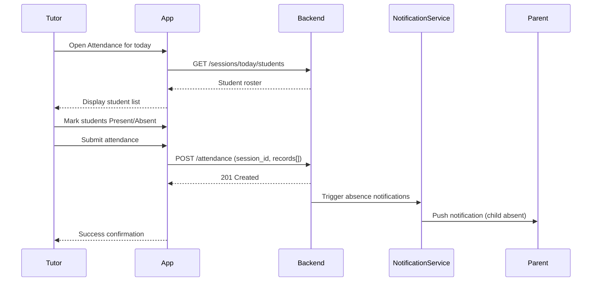
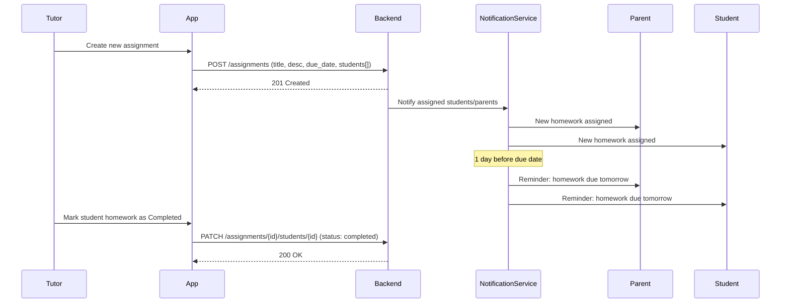
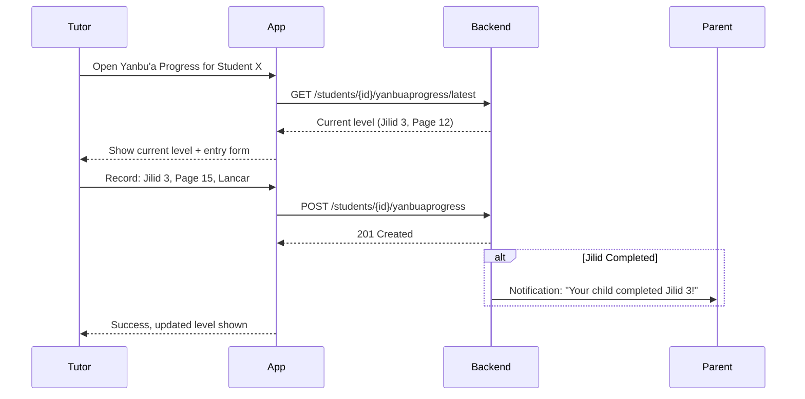
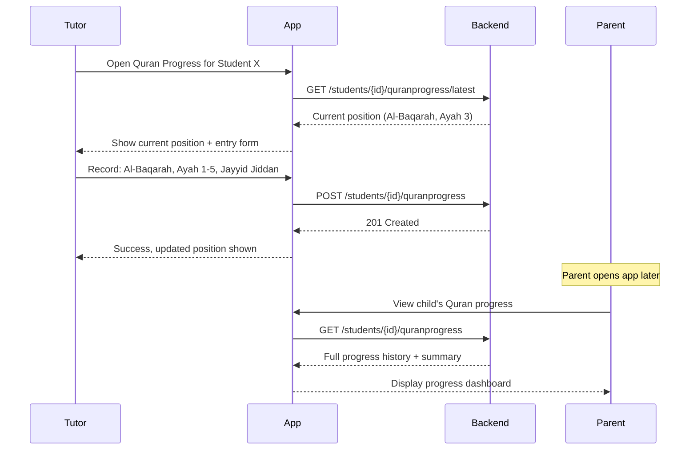
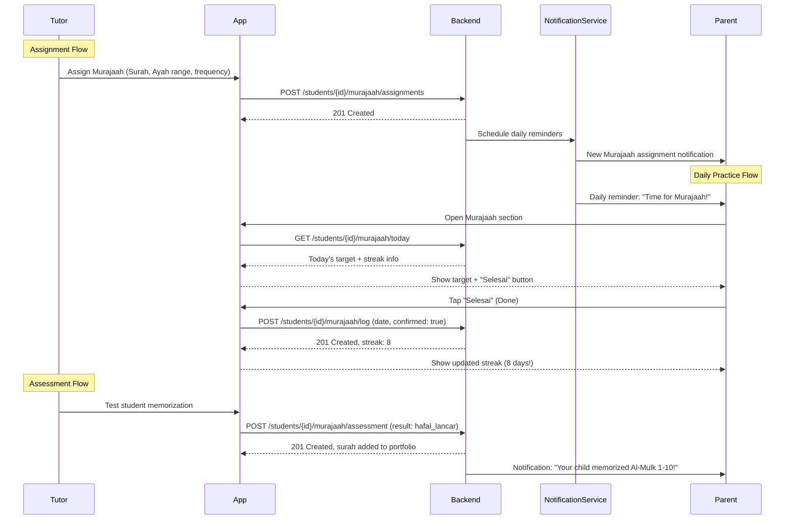
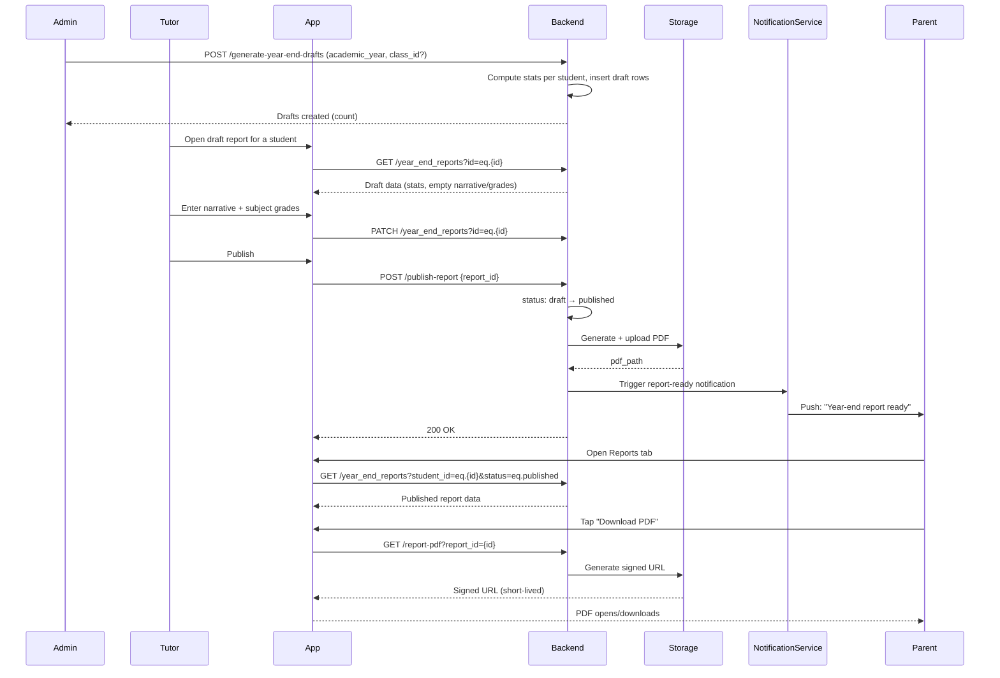
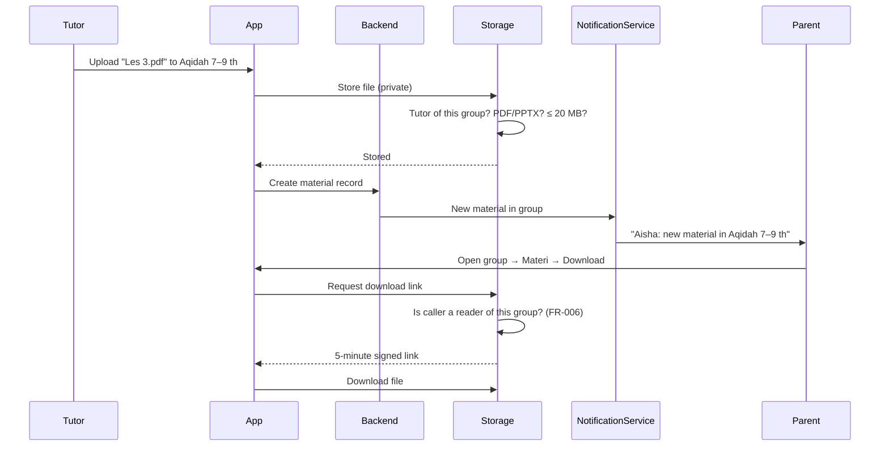

# Product Requirements Document: PPME - TPA

---

## Table of Contents
1. [Overview](#1-overview)
2. [Key Information](#2-key-information)
3. [Target Regions & Markets](#3-target-regions--markets)
4. [Goals and Success Metrics](#4-goals-and-success-metrics)
5. [EPIC Requirements](#5-epic-requirements)
6. [FEATURE Requirements](#6-feature-requirements)
7. [Timeline and Milestones](#7-timeline-and-milestones)
8. [Open Questions](#8-open-questions)
9. [Appendix](#appendix)

---

## 1. Overview

*   **Problem Statement:** Parents and tutors within PPME (Persatuan Pemuda Muslim se-Eropa) Den Haag's TPA (Taman Penitipan Al-Quran) program currently lack a centralized, digital system to track student attendance, homework assignments, and Quranic learning progress (Yanbu'a, Quran recitation, and Murajaah). Communication between tutors and parents is fragmented, making it difficult to monitor student development and ensure consistent learning both at the TPA and at home — particularly challenging for a diaspora community spread across multiple cities in the Netherlands.

*   **Goal:** Provide a unified digital platform that enables PPME tutors to manage attendance and assignments, track each student's Quranic learning journey, and give parents real-time visibility into their child's progress — ultimately improving student outcomes and strengthening the tutor-parent-student feedback loop across PPME's community.

*   **Vision:** To be the go-to digital companion for PPME's TPA education program, making Quranic education tracking as seamless and transparent as possible for the Indonesian Muslim community in the Netherlands.

*   **Business Driver:**
    *   **Strategic Rationale:** Community Development, Educational Quality Improvement, Parent Engagement, Digital Transformation of traditional TPA record-keeping, Supporting PPME's mission of personal and religious growth for its members
    *   **Conversion Rate Impact:** Expected to increase parent engagement by 50%+, reduce missed homework follow-ups by 70%, and improve student Yanbu'a/Quran progression rates by 30%

*   **Technical Principles:**
    *   **Authentication:** Google Authentication (OAuth 2.0) or equivalent trusted identity provider — no custom password management
    *   **Data Protection:** GDPR-compliant encrypted storage (at rest and in transit); EU-based data residency
    *   **Hosting:** Netlify (EU region) for easy deployments, high availability, and affordable pricing
    *   **Technology Providers:** European-based providers preferred wherever possible (hosting, storage, services)
    *   **Cost:** Leverage free tiers and affordable subscriptions suitable for a community/non-profit use case

*   **Design Direction (aligned with ppmedenhaag.nl):**
    *   **Color Palette:**
        *   Primary: PPME Royal Blue (~#0D50A0) — sampled from the PPME logo; trust, community, identity
        *   Primary (dark variant): ~#0A3E7A — hover states, pressed buttons, nav depth
        *   Secondary: White/off-white (#FFFFFF / #F8F9FA) — clean content backgrounds
        *   Accent: Gold/amber (~#C8A415) — highlights, CTAs, achievement badges (complementary to logo blue, used for milestone/celebration moments)
        *   Text: Dark charcoal (#333333) — readable body copy
        *   Danger/Alert: Warm red (#D32F2F) — absence markers, overdue items
        *   Success: Soft green (#4CAF50) — completion, streaks, present markers
    *   **Typography:**
        *   Font family: Clean sans-serif (Open Sans or equivalent) — matching ppmedenhaag.nl
        *   Headings: Bold weight, dark charcoal or white-on-blue
        *   Body: Regular weight, generous line-height (1.6) for readability
    *   **Layout & Components:**
        *   Mobile-first single-column layout with generous padding
        *   Card-based UI with subtle shadows and rounded corners (~8px border-radius)
        *   Top navigation bar: royal blue background (#0D50A0), white text, PPME logo left
        *   Bottom tab navigation on mobile (Attendance | Homework | Yanbu'a | Quran | Murajaah)
        *   Date badges overlaid on cards (matching ppmedenhaag.nl event card style)
    *   **Aesthetic & Tone:**
        *   Traditional-meets-modern: dignified, warm, community-oriented
        *   Not corporate or flashy — accessible and trustworthy
        *   Language toggle (ID/NL) in navigation, matching ppmedenhaag.nl pattern
        *   PPME logo and branding integrated naturally
    *   **Interactions:**
        *   Large tap targets for mobile (minimum 44px)
        *   Subtle animations for progress milestones (jilid completion, streak)
        *   Gold accent for achievement/celebration moments

*   **Design Validation (Figma Make prototype, reviewed 2026-07-01):**
    *   Prototype: https://www.figma.com/make/yiSqCIb1j1gV4OYyDHjqLy/Create-UI-UX-Prototypes
    *   Palette confirmed pixel-accurate against spec across all 15 screens reviewed: Primary `#0D50A0`, Accent `#C8A415`, Success `#4CAF50`, Danger `#D32F2F`, Secondary `#FFFFFF`/`#F8F9FA`.
    *   Layout/component patterns confirmed: card-based mobile-first UI, rounded corners, bottom tab nav in the specified order (Hadir | Tugas | Yanbu'a | Al-Quran | Murajaah), top nav with logo + language toggle, gold reserved specifically for achievement/streak moments (e.g. Murajaah streak flame, "Sudah Hafal" badges).
    *   **Note — prototype-only affordance:** the reviewed screens include a top-level "Pilih Peran" (Ustadz / Orang Tua / Santri) switcher used to demo all three role views in one prototype. This is **not** a feature to build — in production, role is derived from the authenticated user via Supabase Auth + RLS (see TAD, `user_role` enum), not manually switched.
        *   **Follow-up (TAD ADR-025):** this note still stands, and a control that *is* now built sits next to it — so the distinction is worth stating rather than leaving to be rediscovered. The app has an explicit **scope switch** on the six two-shaped screens, and it is not the affordance rejected above. The prototype's switcher offered all three roles to everybody, so that one prototype could demo three role views; it changed who you were pretending to be. The scope switch offers only the relationships the signed-in account actually holds, derived from the same predicates the RLS policies use, and it renders **only** for someone who holds more than one — a parent, a tutor, a santri or an admin who is one thing sees no control at all. It is labelled by subject ("Grup saya" / "Anak saya") and never by role, precisely so it cannot be read as picking one. Role is still derived from the authenticated user and never switched; what a person may now choose is *which of their own relationships a screen is about*. This became necessary rather than merely possible once ADR-019 established that a real person here holds several relationships at once — an ustadz whose own child attends had no route to that child's screens at all.
    *   **Open for follow-up:** notification center/list screen — **built** (Milestone 7 part 3, TAD ADR-017) and **reviewed against this design direction**, with the findings applied; see checklist §5 for the review itself. What that review could *not* do is stand in for PPME: it checked the screen against the documented palette, component patterns and interaction rules above, not against anyone's judgement of whether this is the right screen. A prototype-batch review with PPME is still outstanding, and the schema stays deliberately presentation-free so it can act on whatever that review says without a migration; language toggle (ID/NL) destination behavior not yet verified; "date badges overlaid on cards" from the design direction above appear as plain text timestamps in the current prototype rather than overlaid badges (minor, cosmetic).

## 2. Key Information

*   **Product Manager:** [TBD]
*   **Engineering Manager:** [TBD]
*   **Stakeholders:** PPME Den Haag Board, TPA Committee, Tutors (Ustadz/Ustadzah), Parents/Carers, Community Youth Leaders
*   **Document Status:** Draft
*   **Last Updated:** 2026-06-29
*   **Feature Type:** New Feature
*   **Feature Access:** External (Community-facing)
*   **Applies To:** PPME Den Haag — Taman Penitipan Al-Quran (TPA) Program
*   **Targeted Product Offerings:** PPME - TPA (Web App / Mobile App)

## 3. Target Regions & Markets

*   **Region/Market 1:** PPME Den Haag (Medlerstraat 4, Den Haag, Netherlands) — Primary market. The Indonesian Muslim community in Den Haag with families enrolled in the TPA program. Tutors and parents need a simple, mobile-friendly tool to replace paper-based tracking. Most members are comfortable with digital tools (WhatsApp, web apps) given the European context.

*   **Region/Market 2:** PPME Branch Communities (Rotterdam, Amsterdam, Heemskerk, Breda) — Secondary market. Potential expansion to other PPME branches that operate similar TPA/Quran education programs across the Netherlands.

## 4. Goals and Success Metrics

*   **Business Objectives:**
    *   Digitize 100% of attendance tracking within 2 months of launch
    *   Enable tutors to assign and track homework digitally
    *   Provide parents with real-time visibility into their child's Yanbu'a, Quran, and Murajaah progress
    *   Increase student completion rate of Yanbu'a levels by 30%

*   **Success Metrics:**
    *   90%+ daily attendance logging rate by tutors
    *   80%+ parent weekly active usage (viewing progress)
    *   50% reduction in miscommunication between tutors and parents regarding homework
    *   Measurable improvement in average student Yanbu'a level progression speed

## 5. EPIC Requirements

*   **Epic's Name:** Build a Digital Progress Tracking Platform for PPME Den Haag's TPA to Improve Student Quranic Learning Outcomes and Parent-Tutor Communication

*   **Epic Description:**
    *   **Claim:** PPME Den Haag's TPA program relies on manual, paper-based methods to track student attendance, homework, and Quranic learning progress (Yanbu'a, Quran recitation, Murajaah). This leads to lost records, poor parent visibility, and inconsistent follow-up on student learning — resulting in slower student progression and disengaged parents within the community.
    *   **Evidence:** Tutors spend significant time on manual record-keeping; parents frequently ask for updates via informal channels (WhatsApp messages); students' Murajaah progress at home is untracked; paper records are lost or inconsistent across tutors. As a diaspora community, some families may not attend every session in person, making digital access even more critical.
    *   **Reasoning:** A centralized digital platform will eliminate manual record-keeping overhead, provide parents with self-service access to their child's progress, create accountability for at-home Murajaah practice, and enable tutors to focus on teaching rather than administration. This aligns with PPME's mission of supporting members' personal and religious growth.

*   **WHAT:**
    *   A web/mobile application with three user roles (Tutor, Parent, Student)
    *   Attendance management module (check-in/check-out, absence reasons)
    *   Homework assignment module (create, assign, track completion)
    *   Yanbu'a progress tracker (level, page, jilid progression)
    *   Quran recitation progress tracker (surah, ayah, quality assessment)
    *   Murajaah/memorization tracker (assigned verses, home practice logging, parent confirmation)
    *   Year-end curriculum report generator (auto-drafted stats + tutor narrative/grades, PDF export)
    *   A student enrolled in any number of groups (e.g. a Yanbu'a/Quran group and an Aqidah group), with Yanbu'a/Quran/Murajaah tracking switched on or off per group; per-group announcements and downloadable course materials (Feature 8)
    *   Dashboard views tailored to each user role
    *   **Scope Boundaries:**
        *   In scope: Attendance, homework, Yanbu'a, Quran, Murajaah tracking for PPME Den Haag TPA
        *   Out of scope (Phase 1): Payment/fee management, video recording of recitations, AI-based recitation assessment, gamification, multi-branch deployment. *(The "Daftar Ulang" enrolment form asks families to confirm the annual re-registration payment via a bank link, but the app neither stores nor tracks that answer — the treasurer reconciles it against the bank. See TAD ADR-043.)*
        *   Dependencies: Internet connectivity, user devices (smartphones), PPME Den Haag TPA enrollment data, Google Workspace/accounts for authentication
        *   Technology Stack: Netlify hosting (EU), Google OAuth 2.0, encrypted database (EU-based provider), GDPR-compliant architecture
        *   Delivery: Phased (MVP → Enhanced features → Multi-branch expansion)

*   **WHY:**
    *   Current paper-based tracking results in ~30% of student progress records being incomplete or lost
    *   Parents report feeling disconnected from their child's TPA learning journey
    *   Tutors spend an estimated 20-30 minutes per session on administrative tasks instead of teaching
    *   Murajaah (home memorization practice) has no accountability mechanism, leading to inconsistent practice
    *   PPME families spread across Den Haag may not always attend in person, increasing need for digital communication
    *   **Intended Outcomes:** 90% record completeness, 80% parent engagement, 50% reduction in tutor admin time, measurable increase in Murajaah consistency

*   **WHO:**
    *   **Primary Beneficiaries:**
        *   **Tutors (Ustadz/Ustadzah):** Reduced admin burden, better tools to track and report student progress
        *   **Parents/Carers:** Real-time visibility into child's attendance, homework, and Quranic progress
        *   **Students (Santri):** Clear learning path, accountability for home practice
    *   **Secondary Beneficiaries:**
        *   **PPME Den Haag Board & TPA Committee:** Aggregate reporting, operational oversight, alignment with PPME's educational mission
    *   **Target Market:** PPME Den Haag's Indonesian Muslim community families enrolled in TPA
    *   **Geographic Scope:** PPME Den Haag initially, expandable to PPME branches in Rotterdam, Amsterdam, Heemskerk, and Breda

### 5.1 User Personas

**Persona 1: Ustadz/Ustadzah (Tutor)**
*   **Role:** TPA Tutor/Teacher (volunteer within PPME community)
*   **Location:** Den Haag, Netherlands
*   **Tech-savvy:** Medium to High
*   **Needs:** Quick attendance logging, easy homework assignment creation, simple progress entry for Yanbu'a/Quran/Murajaah per student
*   **Pain Points:** Paper records are tedious and easily lost; difficult to communicate progress to parents individually; no overview of class-wide progression; limited time as volunteer tutors

**Persona 2: Parent/Carer**
*   **Role:** Parent or guardian of TPA student (PPME member family)
*   **Location:** Den Haag and surrounding areas, Netherlands
*   **Tech-savvy:** Medium (comfortable with WhatsApp and web apps in European digital context)
*   **Needs:** View child's attendance, see assigned homework and completion status, monitor Yanbu'a level and Quran/Murajaah progress, confirm home practice
*   **Pain Points:** No visibility into TPA activities; relies on child's verbal report; unsure what to help practice at home; no way to confirm Murajaah was done; may speak Dutch/Indonesian at home and needs bilingual support

**Persona 3: Student (Santri)**
*   **Role:** TPA student (child/youth from PPME member family)
*   **Location:** Den Haag, Netherlands
*   **Tech-savvy:** Medium (digital native, but young)
*   **Needs:** See homework assignments, know what to practice for Murajaah at home, view own progress
*   **Pain Points:** Forgets homework assignments; unclear on which ayah/surah to practice; no sense of achievement or progress visibility; balancing Dutch schoolwork with TPA studies

### 5.2 Use Cases

**Use Case 1: Tutor Records Daily Attendance**
*   **Scenario:** A tutor opens the app at the start of a TPA session to mark which students are present.
*   **Steps:**
    1.  Tutor opens app and selects today's session/class
    2.  Tutor sees list of enrolled students and marks each as present or absent
    3.  For absent students, tutor optionally records a reason (sick, family, etc.)
    4.  Tutor confirms and submits attendance
*   **Expected Result:** Attendance is recorded; parents of absent students receive a notification; historical attendance data is updated.

**Use Case 2: Tutor Assigns Homework**
*   **Scenario:** After a lesson, the tutor wants to assign homework for students to complete before the next session.
*   **Steps:**
    1.  Tutor navigates to Homework section and creates a new assignment
    2.  Tutor enters assignment details (title, description, due date)
    3.  Tutor assigns to specific students or entire class
    4.  Assignment is published
*   **Expected Result:** Students and parents can see the new homework assignment; reminders are sent before the due date.

**Use Case 3: Parent Monitors Yanbu'a Progress**
*   **Scenario:** A parent wants to check how far their child has progressed in the Yanbu'a curriculum.
*   **Steps:**
    1.  Parent opens app and navigates to child's profile
    2.  Parent selects "Yanbu'a Progress"
    3.  Parent views current jilid (volume), page, and historical progression
*   **Expected Result:** Parent sees a clear visual of child's current level, recent progress entries by tutor, and overall trajectory.

**Use Case 4: Parent Confirms Murajaah at Home**
*   **Scenario:** A student practices memorization at home, and the parent confirms completion.
*   **Steps:**
    1.  Parent opens app and sees assigned Murajaah for the week
    2.  Student recites the assigned verses to parent
    3.  Parent marks the Murajaah session as completed with optional quality rating
    4.  Confirmation is logged and visible to tutor
*   **Expected Result:** Tutor can see which students completed home practice; student's Murajaah streak is updated.

### 5.3 FAQs

#### 5.3.1 Internal FAQs

**Q: What happens if the tutor doesn't have internet access during a session?**
A: The app will support basic offline caching (Progressive Web App) with automatic sync when connection is restored. Netlify's edge network ensures high availability for the hosted frontend.

**Q: How do we handle multiple tutors for the same class?**
A: Each tutor will have their own login (via Google OAuth 2.0) and can be assigned to one or more classes. All tutors assigned to a class can view and edit attendance and progress for that class.

**Q: How do we handle two parents, or a parent and a guardian, for the same child?**
A: A child is linked to one *or more* guardian accounts through the `student_guardians` table (TAD ADR-040). The guardians of a child form a symmetric set — every linked guardian gets the same full access (family view, Murajaah confirmation, data export, notifications), there is no "primary", and a child must always have at least one. An admin manages the links during enrolment. Removing a link revokes access at the database layer immediately; the link row is retained (marked unlinked) for audit rather than deleted.

**Q: How is student data protected?**
A: The platform is fully GDPR-compliant. Student data (names, progress) is encrypted at rest and in transit (TLS 1.3). Data is stored on EU-based servers. Only assigned tutors and parents/carers can access their respective data via role-based access control. No data is shared externally or transferred outside the EU.

**Q: What authentication method is used?**
A: Google Authentication (OAuth 2.0) for all users — tutors, parents, and students (where applicable). This eliminates the need for custom password management and leverages existing Google accounts that most PPME members already have.

**Q: What does hosting cost?**
A: The app is hosted on Netlify (EU region), which offers generous free tiers for community projects. Backend services use affordable European providers. The total cost is designed to be sustainable for a community organization (free tier or minimal subscription).

#### 5.3.2 External FAQs

**Q: Do I need to install an app?**
A: No app store installation required. The TPA Progress Tracker is a Progressive Web App (PWA) hosted on Netlify — accessible via any modern browser. You can optionally "Add to Home Screen" for an app-like experience.

**Q: Can I track multiple children?**
A: Yes. A parent account can be linked to multiple student profiles if they have more than one child enrolled in the PPME TPA program. The relationship also works the other way: a single child can have more than one guardian linked to them (see the next question).

**Q: Can both parents — or a parent and a guardian — follow the same child?**
A: Yes. A child can have any number of guardians, and they are equal: each linked guardian sees the full family view for that child, can confirm home Murajaah practice, can export the child's data, and receives every notification about the child in their own language. There is no "primary" guardian. A child always has at least one. Guardians are added and removed by a TPA admin as part of enrolment — there is no self-service way for one parent to invite another. When a guardian is removed they immediately lose access, and the record that they once had it is kept for audit (TAD ADR-040).

**Q: What languages are supported?**
A: The app will support Bahasa Indonesia as the primary language with Dutch as a secondary language option. Islamic/Arabic terminology is preserved where appropriate (e.g., Murajaah, Yanbu'a, Surah, Ayah).

**Q: Do I need to be a PPME member to use the app?**
A: The app is available to all families enrolled in PPME Den Haag's TPA program. PPME membership is handled separately through the organization.

### 5.4 Go-to-Market Plan

#### Pilot Phase (Month 1-2)
**Objectives:**
*   Validate core workflows (attendance + Yanbu'a tracking) with real users
*   Identify usability issues for low-tech-savvy parents

**Activities:**
*   Onboard 2-3 tutors and their respective classes
*   Provide hands-on training sessions for tutors
*   Distribute parent onboarding guide (printed at PPME Den Haag + WhatsApp group)
*   Weekly feedback collection from tutors and parents

**Success Criteria:**
*   3+ tutors actively logging attendance daily
*   60%+ parents in pilot classes accessing the app weekly
*   No critical bugs blocking core workflows

#### Limited Availability (Month 3-4)
**Objectives:**
*   Expand to all classes/tutors in the TPA
*   Launch homework and Murajaah tracking features

**Activities:**
*   Roll out to remaining tutors with training
*   Launch Murajaah home practice confirmation feature
*   PPME community announcement and parent onboarding drive (via PPME channels and WhatsApp groups)
*   Bi-weekly feedback sync with tutors

**Success Criteria:**
*   All active tutors using the platform
*   80%+ parents onboarded
*   Murajaah logging used by 50%+ of families

#### General Availability (Month 5+)
**Objectives:**
*   Full feature set live and stable
*   Establish as standard operating tool for TPA

**Activities:**
*   Complete all features (Quran progress, reporting, dashboards)
*   Create self-service help documentation (Bahasa Indonesia + Dutch)
*   Evaluate expansion to other PPME branches (Rotterdam, Amsterdam, Heemskerk, Breda)

**Success Criteria:**
*   95%+ daily attendance logging compliance
*   80%+ weekly parent engagement
*   Positive qualitative feedback from tutors and parents

### 5.5 Release Updates

| Release Number | What is getting released? | Feature or EPIC number | Month and year |
|---|---|---|---|
| 0.1 (MVP) | Attendance tracking + Yanbu'a progress | EPIC-001 | [TBD] |
| 0.2 | Homework assignments + Parent view | EPIC-001 | [TBD] |
| 1.0 | Quran progress + Murajaah tracking | EPIC-001 | [TBD] |
| 1.1 | Dashboards + Reporting | EPIC-001 | [TBD] |

### 5.6 CS Documentation
*   Tutor Quick-Start Guide (Bahasa Indonesia + Dutch)
*   Parent Onboarding Guide (with screenshots, printable, bilingual)
*   FAQ sheet for common issues (login, linking child, viewing progress)
*   WhatsApp-friendly instruction cards (image-based step-by-step)
*   PPME community bulletin announcement template

### 5.7 Guides
*   Tutor: How to Log Attendance
*   Tutor: How to Record Yanbu'a/Quran/Murajaah Progress
*   Tutor: How to Create and Manage Homework
*   Parent: How to View Your Child's Progress
*   Parent: How to Confirm Murajaah at Home

### 5.8 Spec Updates
*   Data model specification for student progress records
*   API documentation for frontend-backend communication
*   Role-based access control specification
*   Notification system specification (push/WhatsApp integration)

### 5.9 Developer Docs
*   Database schema documentation
*   API endpoint reference
*   Authentication and authorization flow
*   Deployment and environment setup guide
*   Testing strategy and test data setup

### 5.10 Feedback Loop

**Ongoing Feedback Mechanisms:**
*   Weekly informal feedback from tutors during TPA sessions
*   Monthly parent survey (simple Google Form or in-app)
*   Observation of usage metrics (login frequency, feature adoption)
*   Quarterly review with TPA committee

**Feedback Channels:**
*   Dedicated WhatsApp group for feedback and issues
*   In-app feedback button
*   Direct communication with tutors during TPA sessions at PPME Den Haag
*   PPME monthly community meeting agenda item
*   PPME digital bulletin (successor to Al Falaah newsletter)

### 5.11 Metrics & Post-Launch

#### 5.11.1 KPIs

**Primary KPIs:**

1.  **Daily Attendance Logging Rate**
    *   Definition: Percentage of TPA session days where attendance is recorded digitally
    *   Target: 95%
    *   Measurement: Daily
    *   Red/Yellow/Green: < 70% / 70-90% / > 90%

2.  **Weekly Parent Active Usage**
    *   Definition: Percentage of parents who open the app at least once per week
    *   Target: 80%
    *   Measurement: Weekly
    *   Red/Yellow/Green: < 50% / 50-75% / > 75%

3.  **Murajaah Home Practice Completion**
    *   Definition: Percentage of assigned Murajaah sessions confirmed by parents
    *   Target: 70%
    *   Measurement: Weekly
    *   Red/Yellow/Green: < 40% / 40-65% / > 65%

**Secondary KPIs:**

4.  **Yanbu'a Level Progression Rate**
    *   Definition: Average time for students to advance one jilid compared to historical average
    *   Target: 20% improvement over baseline

5.  **Homework Completion Rate**
    *   Definition: Percentage of assigned homework marked as completed before due date
    *   Target: 75%

**Feature 8 (multi-group) KPIs:**

6.  **Aqidah Roster Completeness** (8a)
    *   Definition: Aqidah is **optional**, so the app cannot know which children should be in it. The measure is therefore against the Aqidah tutors' own attendance lists: the percentage of children actually attending an Aqidah group who are enrolled in that group in the app, 4 weeks after 8a launch. The TPA coordinator checks this once with each Aqidah tutor.
    *   Target: 100%
    *   How measured: manual check by the TPA coordinator, as above
7.  **Aqidah Attendance Logging Rate** (8a)
    *   Definition: KPI 1, measured for groups with tracking off only
    *   Target: 90% (same bar as Yanbu'a/Quran groups)
    *   How measured: from existing data. Meeting days (`classes.meeting_days`) give the expected sessions; `sessions` rows give the recorded ones
8.  **Announcement Read Rate** (8b)
    *   Definition: Percentage of announcement notifications opened in the notification centre within 7 days
    *   Target: 60%
    *   How measured: from existing data (`notifications.read_at` against `created_at` for event `groupAnnouncement`). No new collection needed. Because notifications are pruned after their retention period (ADR-017), it is read within that window
9.  **WhatsApp Broadcast Reduction** (8b)
    *   Definition: Tutors' self-reported number of group broadcasts sent via WhatsApp per month, compared with before 8b
    *   Target: 50% fewer
    *   How measured: the TPA coordinator asks each tutor once before 8b and once 8 weeks after. Outside the app
10. **Guardrail: Push Opt-Out Rate**
    *   Definition: Percentage of push-subscribed guardians who switch push off in the 8 weeks after each release, compared with the 8 weeks before
    *   Target: no increase of more than 5 percentage points. More groups means more notifications per family, and this is the signal that it has become too many.
    *   How measured: the app keeps no history of opt-outs; turning push off simply clears the subscription. So a **weekly count of push-subscribed guardians** is recorded by an existing scheduled job, starting **before 8a ships** so there is a baseline (TAD ADR-045). It is a single number per week, with no personal data

#### 5.11.2 Baseline vs. Target

| Metric | Current State (Baseline) | Target State (3 months post-GA) | Success Criteria |
|---|---|---|---|
| Attendance record completeness | ~70% (paper-based, often missed) | 95% digital logging | > 90% |
| Parent awareness of child progress | Low (verbal reports only) | 80% weekly app engagement | > 75% |
| Murajaah home practice tracking | 0% (no tracking mechanism) | 70% weekly confirmation rate | > 60% |
| Tutor admin time per session | 20-30 minutes | < 10 minutes | < 15 minutes |
| Yanbu'a progression records | Incomplete, paper-based | 100% digital, real-time | > 95% completeness |

**Success Definition:**
The product is considered successful if:
*   95%+ of TPA sessions have digital attendance recorded
*   80%+ of parents actively use the platform weekly
*   Murajaah home practice has measurable accountability (70%+ confirmation rate)
*   Tutors report meaningful reduction in administrative burden

#### 5.11.3 Post-MVP Roadmap

1.  **Gamification & Achievements**
    *   Badges and streaks for consistent attendance, Murajaah practice, and Yanbu'a progression to motivate students

2.  **Audio Recording for Recitation**
    *   Allow students/parents to upload audio recordings of Quran recitation for tutor review

3.  **Multi-Branch PPME Support**
    *   Expand platform to support PPME branches across the Netherlands (Rotterdam, Amsterdam, Heemskerk, Breda) with separate data spaces and shared admin tools

4.  **Report Cards / Certificates**
    *   Generate periodic progress reports and completion certificates for students

5.  **WhatsApp Bot Integration**
    *   Send automated progress updates and reminders to parents via WhatsApp for those who prefer not to use the app directly

---

## 6. FEATURE Requirements

### Feature 1: Attendance Tracking

#### 1.1. Feature Overview
Digital attendance management system allowing tutors to record student presence/absence for each TPA session, with historical tracking and parent visibility.

*   **Feature Name:** Feature-PRD-TPA-Attendance-Tracking
*   **Parent EPIC:** EPIC-001 - Build a Digital Progress Tracking Platform for TPA
*   **Product Code:** TPA
*   **Product:** PPME - TPA
*   **Feature Type:** New Feature
*   **Priority:** High
*   **Owner:** [TBD]
*   **Status:** Draft
*   **Feature Access:** External
*   **Applies To:** All TPA classes
*   **Region Availability:** Netherlands (PPME Den Haag, expandable to other branches)
*   **Targeted Product Offerings:** PPME - TPA (Web/Mobile)

#### 1.2. Feature User Stories
*   *As a tutor, I want to quickly mark attendance for my class at the start of each session, so that I can focus on teaching rather than paperwork.*
*   *As a parent, I want to be notified if my child is marked absent, so that I am aware of any attendance issues.*
*   *As a parent, I want to view my child's attendance history, so that I can monitor their consistency.*
*   *As a TPA admin, I want to see aggregate attendance reports, so that I can identify students with concerning absence patterns.*
*   *As the TPA head, I want tutor attendance recorded on the same register and reviewable per tutor over time, so that I can monitor tutor turnout periodically.*

#### 1.3. Functional Requirements

**FR-001: Class Roster Display**
- Priority: High
- System must display a list of all students enrolled in the tutor's assigned class for quick attendance marking.

**FR-002: Mark Present/Absent**
- Priority: High
- Tutor must be able to mark each student as Present, Absent (with reason), or Late for each session.

**FR-003: Absence Reason Selection**
- Priority: Medium
- When marking a student absent, tutor can select a reason from predefined options (Sick, Family matter, No reason given, Other) or enter a custom note.

**FR-004: Attendance History View**
- Priority: High
- Parents and tutors must be able to view attendance history for a student over any date range.

**FR-005: Absence Notification**
- Priority: Medium
- System should notify parents when their child is marked absent (configurable notification preference).
- *Implementation status: **built** (TAD ADR-015 part 1). A database trigger on `attendance` fires `notify-absence`, which sends one Web Push to the child's parent in that parent's own language. "Configurable" means opt-in: notifications are off until a parent enables them at `/settings/notifications`, and can be turned off again there. The message names the child and says they were not present — nothing more. The absence **reason is deliberately never included** and is never even sent out of the database, since that field can carry health information (DPIA R4/R6); a parent sees it by opening the app.*

**FR-006: Attendance Summary Dashboard**
- Priority: Medium
- Provide a summary view showing attendance percentage per student over time (weekly/monthly).
- **Group attendance at a glance.** Above the register on the class-scope Attendance screen, a single "Kehadiran santri" / "Aanwezigheid leerlingen" tile shows the selected group's student attendance: the latest recorded session's rate in large type, "x dari y hadir" with that session's date, and a sparkline of the group's last 8 recorded sessions (oldest left, latest dot highlighted). Tapping the tile expands a per-session list (date, rate, present/total) and states the 8-session average; tapping again collapses it. It is shown to every tutor of the group and to an admin, for the group picked in the register — nobody sees a tile for a group whose register they cannot open.
- The rate counts **late as attended**, the same rule as every other rate in the app: (present + late) ÷ recorded. A session counts only once attendance has been recorded for it; the student-assistant marked on the roster counts like any other student. With no recorded session yet, the tile says so instead of drawing an empty chart.
- It is deliberately quiet: one number, one line, one colour (primary blue), no targets or red thresholds, and it never shows a tutor's own or a colleague's attendance.
- The "Grup saya | Anak saya" switch (for someone who both teaches and has a child enrolled) uses the same switch style as "Santri | Guru", so the app has one kind of switch. It sits above the page heading; the Santri | Guru switch sits below it.
- *Implementation status: **built** — TAD ADR-046, no migration.*
- **A child's own attendance at a glance (family view).** A parent sees **all their children in one graph** at the top of the Attendance screen: one row per child with the child's name and groups, the child's last 8 recorded sessions across all their groups as marks (filled dot = present, ring = late, cross = absent, oldest left), and the child's attendance rate. Marks and rate follow the date range chosen on the screen, so the rate in a child's row is the same number as that child's rate card. Tapping a child's name selects that child for the rate card and history below, which replaces the separate child picker. A parent with one child sees a one-row graph. A 16+ student with their own login sees only their own 8 marks, inside their attendance-rate card. The marks use the same shapes and legend as the admin's tutor overview, in the student colour, so the meaning never depends on colour alone. Tapping a mark shows its date, group and status, plus the absence reason, which the family already sees in the history list. With no recorded session yet, a child's row shows no marks and says so. The graph never shows a group total, classmates, or tutor attendance.

**FR-007: Class Meeting-Day Schedule**
- Priority: Medium
- When creating or editing a group, an admin selects the weekday(s) it meets from Monday–Sunday checkboxes; Saturday is preselected and more than one day is allowed.
- The attendance register is driven by that schedule: it opens on the current scheduled session (today if a meeting day, otherwise the most recent past meeting day) and a prev/next stepper walks the group's meeting days back through the current academic year so a missed week can be recorded after the fact.
- A `sessions` row can only be created for a date that is one of the group's meeting days — enforced in the database (`trg_sessions_meeting_day`, TAD ADR-037) for every caller including admin. Editing an already-recorded session is not restricted.
- Parents and 16+ students see the meeting days read-only on the child's attendance screen.
- *Implementation status: **built** (TAD ADR-037, migration 019). `classes.meeting_days` is a `dow` array (0=Sunday…6=Saturday); the free-text `schedule` field is kept for the time range.*

**FR-008: Tutor Attendance**
- Priority: Medium
- The class-scope Attendance screen has a tutor section below the student roster (labelled "Kehadiran guru" / "Aanwezigheid docenten") listing the tutors assigned to the selected class, each with the same Present / Late / Absent (with reason) control a student row has. The register records attendance only for the group's own students and its own assigned tutors; a student-assistant enrolled in the group is marked on the student roster and is not listed again as a tutor.
- A tutor of the class, or an admin, records it; it is submitted together with the student roster for the same session and the confirm dialog states the student count and the tutor count separately. It rides the FR-007 schedule stepper, so a missed session's tutor attendance can be backfilled through the current academic year exactly as student attendance can.
- **Tutor attendance statistics are for admins only, and live in the Attendance section, not in Beheer.** An admin's Attendance screen has a "Santri | Guru" / "Leerlingen | Docenten" switch that no one else sees:
  - **Santri** is the register exactly as a tutor has it, for any group — the student roster, the FR-006 tile and the "Kehadiran guru" block — so an admin covering a session records students and tutors in one place.
  - **Guru** is statistics only, all tutors at a glance: one row per tutor with their name, their last 8 sessions as marks, and their rate. Marks: filled = present, ring = late, cross = absent, dashed ring = "Belum dicatat" (a session of a group they teach was held but their attendance was not recorded), small grey dot = "Tidak ada jadwal" (none of their groups met that day). A legend explains the marks in words, so nothing depends on colour alone. Filters: group (default all groups) and a from/to date range (default the current academic year). The rate is over the whole filtered range, late counts as attended, and "Belum dicatat" is not counted either way. Tapping a row opens that tutor's detail: rate, counts, and a dated list (date, group, status, reason). A note says each tutor records their own group's tutor attendance in the register; the Guru view itself records nothing.
  - The former Beheer tab "Kehadiran Guru" (`/admin/tutor-attendance`) is removed; its address redirects to the Guru view so saved links keep working.
- A tutor sees **no** tutor attendance statistics — not a colleague's and not their own. They still see and correct the per-session statuses in the register's "Kehadiran guru" block, because that is where they record them.
- Tutor attendance is visible only to an admin and to a tutor of that class. Parents and 16+ students never see it. The absence reason is treated exactly like the student one — shown in-app only, never in a notification or an export.
- There is no tutor-absence notification (unlike FR-005 for students); this is a review record, not an alert.
- *Implementation status: **built** — capture + register in TAD ADR-041 / migration 022 (`public.tutor_attendance`, `fn_class_tutors`); the admin review timeline at `/admin/tutor-attendance` in ADR-041(g), same table, no new policy. The review moved into Attendance › Guru as an all-tutors overview (TAD ADR-046).*

**FR-009: User Directory & Role Management**
- Priority: Medium
- A Beheer screen ("Pengguna" / "Gebruikers") lists every account, with a free-text name/email search and a role filter. An admin can edit a user's display name and role inline. Creating and inviting accounts stays on the Registrations screen.
- An admin can **permanently delete** a `parent` or `student` account from this screen — the path to clean up a bogus account a malicious enrolment-form submission created (FR-010). The action refuses the admin's own account, any tutor/admin account, and any account still linked as a guardian of one or more students (those students must be removed first). Tutor/admin accounts are still only ever offboarded by a role change, never deleted.
- The signed-in admin cannot change their own role (the control is disabled, and the server refuses it), and the last remaining admin cannot be demoted.
- Changing a tutor to another role first shows the groups that tutor is assigned to and, on confirmation, removes them from those groups' tutor lists in the same step. Changing a parent or a linked 16+ student to another role warns that they keep their guardian links / self-login (those are relationships, not the role) but does not sever them.
- Every role change is recorded — who changed whose role, from what to what, when — in an admin-only log. A name-only edit is not logged. The log is not shown in the app yet.
- *User story:* As the TPA head, I can correct someone's role or the spelling of their name from one screen, without asking a developer to run SQL, and I can see afterwards that a role was changed and by whom.
- *Implementation status: **built** — TAD ADR-042 / migration 023 (`public.user_role_changes`, `fn_admin_update_user`, `fn_admin_user_role_impact`); screen at `/admin/users`. The delete action is TAD ADR-043 (`delete-user` Netlify Function).*

**FR-010: Form-Driven Enrolment**
- Priority: Medium
- Families are enrolled through the annual "Daftar Ulang" Google Form. Each submission (one per child, with the guardian signed into Google so the e-mail is verified) is turned automatically into a guardian account, a student record and the guardian link, and the guardian is sent the branded invitation e-mail — no admin re-typing. The enrolment form is the one place a guardian is added automatically; an admin manages every other guardian and all removals.
- A submission is matched to an existing child by this guardian already having that child at the same name + birthdate; a match updates the records in place rather than creating duplicates, and does not resend the invitation. If only the name + birthdate match — typically a second guardian enrolling a child the first already registered — nothing is created and the row is flagged `needs_attention` for an admin to link the guardian (or confirm it is a different child). A guardian who re-submits with a *corrected* student name creates a duplicate record (same-day twins with different names are legitimate, so this is not blocked); an admin removes the duplicate with the **Hapus** action on Beheer → Santri.
- **Student self-login:** if the guardian supplies the student's e-mail, the app links their existing `role=student` account (adding this guardian) or, for a new/unregistered address, creates the account and invites the student — no age gate (ADR-021); a mismatched or non-student address is flagged `needs_attention`.
- No Grup is set from the form. An admin enrols the student in their groups (any number; Feature 8 FR-002) in Beheer afterwards. The re-registration payment is **not** stored or tracked by the app; the form asks families to confirm it via a bank link and the treasurer reconciles it separately.
- Every submission — success or failure — is recorded in an admin-only enrolment log with its outcome (`enrolled` / `updated` / `needs_attention` / `error`), and the outcome is also written back onto the response sheet row. A row needing a human (e.g. the parent's e-mail already belongs to an unrelated account) is flagged `needs_attention` for an admin to finish.

**The Google Form** — one submission per child. It collects: the guardian's Google-**verified** e-mail (auto), student name, date of birth, guardian name, preferred language (`Bahasa Indonesia` / `Nederlands`), relationship to the child (optional), an optional student e-mail (→ self-login), and an "I have read the privacy policy" tick that is **recorded but not required** (ADR-044 — a submission without it still enrols; the lawful basis is the educational relationship, [IT TEAM] to confirm). It also asks the family to confirm the re-registration payment via a bank link — an answer the app deliberately does not read. Form requirements: e-mail collection set to **Verified**; response editing on; "limit to 1 response" off; a question a submission maps to must **not be renamed after go-live** (the Apps Script matches responses by question title); and the form *and* its response sheet must be owned by an organisation-controlled Google account, not a volunteer's personal one, since the Apps Script, its trigger and the shared secret live there.

- *User story:* As the TPA admin, I publish one Google Form for re-registration and the families appear in the app as I go, already linked guardian-to-child, without me copying every response by hand.
- *Implementation status: **built** — TAD ADR-043 / migration 024 (`public.enrolment_submissions`, `fn_enrol_from_form`), the `enrol-from-form` Netlify Function, and `apps-script/enrol-from-form.gs` (installed by hand on the response sheet).*

#### 1.4. Non-Functional Requirements
*   **Performance:** Attendance submission must complete within 2 seconds on 4G connection; Netlify CDN ensures fast asset delivery across EU
*   **Security:** Google OAuth 2.0 authentication; role-based access control (tutors mark, parents view own children only); all data encrypted at rest (AES-256) and in transit (TLS 1.3); GDPR-compliant EU data residency
*   **Compatibility:** PWA — must work on Android 8+ and iOS 13+ browsers; responsive web design; "Add to Home Screen" support
*   **Scalability:** Must support up to 200 students and 20 tutors simultaneously; Netlify handles frontend scaling automatically
*   **Reliability:** 99% uptime (Netlify SLA); attendance data must never be lost; automated backups on EU-based infrastructure

#### 1.5. Non-Goals (Out of Scope)
1.  Geolocation-based automatic attendance — manual marking only (Phase 1)
2.  Biometric or face recognition check-in — too complex for community setting
3.  Integration with school/formal education attendance systems — separate concern

#### 1.6. User Flows
1.  Tutor opens app → Selects "Attendance" → The current *scheduled* session is auto-selected (today if the group meets today, otherwise its most recent past meeting day — FR-007)
2.  Student roster displayed → Tutor taps each student to mark Present (default) or Absent
    *   If Absent: Modal appears for reason selection
3.  Tutor reviews and submits → Confirmation shown → Parents notified of absences
4.  Tutor can step back through the group's meeting days to any session in the current academic year to correct it, or to record a week that was missed (FR-007)

#### 1.7. Design & Technical Considerations
*   **Design Assets:** [TBD - Simple, mobile-first UI with large tap targets for quick marking]
*   **Dependencies:** Google OAuth 2.0 (authentication), student enrollment data, push notification service (EU provider), Netlify (hosting)
*   **Technical Constraints:** PWA with offline support and background sync; must work on low-end Android devices; minimize data usage; all PII encrypted per GDPR; EU-only data storage

#### 1.8. Acceptance Criteria

**AC-001:** Tutor can mark full class attendance
- **Given:** A tutor is logged in and has an assigned class with enrolled students
- **When:** The tutor opens the Attendance section for today's session
- **Then:** All enrolled students are displayed, and the tutor can mark each as Present or Absent and submit successfully

**AC-002:** Parent receives absence notification
- **Given:** A parent has notifications enabled for their child
- **When:** The tutor marks their child as Absent and submits
- **Then:** The parent receives a notification within 5 minutes indicating their child was marked absent
- *Implementation status: **built and verified end to end** against a real browser and a real push service — subscribe → attendance write → database webhook → push → notification displayed, with the other family's parent receiving nothing (test-plan §6). Delivery in practice is seconds, not minutes. Verified on desktop Chrome; **Android and iOS remain unverified for want of a device**, which is a gap in the test matrix rather than in the implementation.*

**AC-003:** Attendance history is accurate
- **Given:** A parent views their child's attendance history
- **When:** They select a date range
- **Then:** All recorded attendance entries within that range are displayed with correct dates, status, and any absence reasons

#### 1.9. Sequence Diagrams

```mermaid
sequenceDiagram
    participant Tutor
    participant App
    participant Backend
    participant NotificationService
    participant Parent

    Tutor->>App: Open Attendance for today
    App->>Backend: GET /sessions/today/students
    Backend-->>App: Student roster
    App-->>Tutor: Display student list
    Tutor->>App: Mark students Present/Absent
    Tutor->>App: Submit attendance
    App->>Backend: POST /attendance (session_id, records[])
    Backend-->>App: 201 Created
    Backend->>NotificationService: Trigger absence notifications
    NotificationService->>Parent: Push notification (child absent)
    App-->>Tutor: Success confirmation
```

---

### Feature 2: Homework Assignments

#### 2.1. Feature Overview
Enables tutors to create, assign, and track homework assignments for students. Parents and students can view assignments and their completion status.

*   **Feature Name:** Feature-PRD-TPA-Homework-Assignments
*   **Parent EPIC:** EPIC-001 - Build a Digital Progress Tracking Platform for TPA
*   **Product Code:** TPA
*   **Product:** PPME - TPA
*   **Feature Type:** New Feature
*   **Priority:** High
*   **Owner:** [TBD]
*   **Status:** Draft
*   **Feature Access:** External
*   **Applies To:** All TPA classes
*   **Region Availability:** Netherlands (PPME Den Haag, expandable to other branches)
*   **Targeted Product Offerings:** PPME - TPA (Web/Mobile)

#### 2.2. Feature User Stories
*   *As a tutor, I want to create homework assignments and assign them to students, so that they have clear tasks to complete between sessions.*
*   *As a parent, I want to see what homework my child has been assigned, so that I can help ensure they complete it.*
*   *As a student, I want to see my homework list and due dates, so that I know what I need to do.*
*   *As a tutor, I want to mark homework as completed or incomplete, so that I can track student follow-through.*

#### 2.3. Functional Requirements

**FR-001: Create Assignment**
- Priority: High
- Tutor must be able to create a homework assignment with title, description and due date. Homework is **text-only** for every group. File attachments are out of scope; files are shared as group course materials instead (Feature 8 FR-005).

**FR-002: Assign to Students**
- Priority: High
- Tutor can assign homework to an entire group or select individual students of that group. Works identically for every group (Feature 8 FR-003).

**FR-003: View Assignments (Parent/Student)**
- Priority: High
- Parents and students must see a list of current and past assignments with status (Pending, Completed, Overdue).

**FR-004: Mark Completion**
- Priority: High
- Tutor must be able to mark each student's homework as Completed, Incomplete, or Partially Done with optional notes.

**FR-005: Due Date Reminders**
- Priority: Medium
- System sends a reminder notification to parents/students 1 day before the due date.

**FR-006: Homework History**
- Priority: Low
- Historical view of all past assignments and their completion status.

#### 2.4. Non-Functional Requirements
*   **Performance:** Assignment list must load within 2 seconds via Netlify CDN
*   **Security:** Google OAuth 2.0; role-based access — only assigned tutors create/edit; parents see only their children's assignments; encrypted storage (GDPR)
*   **Compatibility:** PWA responsive design for mobile and tablet; text-based (no heavy media requirements)
*   **Scalability:** Support up to 50 active assignments per class at any time
*   **Reliability:** Assignment data persisted on EU-based encrypted database; no data loss on submission

#### 2.5. Non-Goals (Out of Scope)
1.  File upload for homework submissions (text/photo) — future phase
2.  Automated grading or scoring — tutor manually marks completion
3.  Peer review or group assignments — individual only for Phase 1

#### 2.6. User Flows
1.  Tutor opens "Homework" → Taps "Create New Assignment"
2.  Fills in title, description, due date → Selects recipients (class or individuals)
3.  Publishes assignment → Students and parents see it in their feed, **and receive a "new homework" push** (built, TAD ADR-015 part 2a — a database webhook fans out across the class roster to each family, naming only their own child; the assignment title stays out of the notification per DPIA R6)
4.  Before due date: Parent/student receives reminder notification — *FR-005, still deferred: this one is a scheduled Function (ADR-015 part 2b), unlike step 3 which is event-driven*
5.  After session: Tutor opens assignment → Marks each student's completion status

#### 2.7. Design & Technical Considerations
*   **Design Assets:** [TBD - Card-based UI showing assignment title, due date, status badge]
*   **Dependencies:** Google OAuth 2.0, class/student enrollment, EU-based notification service
*   **Technical Constraints:** Keep assignment descriptions text-only in MVP; support Bahasa Indonesia and Dutch input; all data encrypted at rest

#### 2.8. Acceptance Criteria

**AC-001:** Tutor can create and publish assignment
- **Given:** A tutor is logged in and has an assigned class
- **When:** They create an assignment with title, description, due date and assign to class
- **Then:** The assignment appears in the homework list for all students in that class and their parents

**AC-002:** Parent can view child's assignments
- **Given:** A parent is logged in and has a linked child with assigned homework
- **When:** They navigate to the Homework section
- **Then:** They see all active and recent assignments with status (Pending/Completed/Overdue)

**AC-003:** Tutor can mark completion status
- **Given:** An assignment's due date has passed and the tutor reviews submissions
- **When:** The tutor marks a student's homework as Completed
- **Then:** The status updates to "Completed" and is visible to the parent immediately

#### 2.9. Sequence Diagrams

```mermaid
sequenceDiagram
    participant Tutor
    participant App
    participant Backend
    participant NotificationService
    participant Parent
    participant Student

    Tutor->>App: Create new assignment
    App->>Backend: POST /assignments (title, desc, due_date, students[])
    Backend-->>App: 201 Created
    Backend->>NotificationService: Notify assigned students/parents
    NotificationService->>Parent: New homework assigned
    NotificationService->>Student: New homework assigned

    Note over NotificationService: 1 day before due date
    NotificationService->>Parent: Reminder: homework due tomorrow
    NotificationService->>Student: Reminder: homework due tomorrow

    Tutor->>App: Mark student homework as Completed
    App->>Backend: PATCH /assignments/{id}/students/{id} (status: completed)
    Backend-->>App: 200 OK
```

---

### Feature 3: Yanbu'a Progress Tracking

#### 3.1. Feature Overview
Tracks each student's progression through the Yanbu'a curriculum (a structured method for learning to read the Quran). Tutors record which jilid (volume) and page the student is currently on, allowing parents to see their child's advancement.

*   **Feature Name:** Feature-PRD-TPA-Yanbu'a-Progress
*   **Parent EPIC:** EPIC-001 - Build a Digital Progress Tracking Platform for TPA
*   **Product Code:** TPA
*   **Product:** PPME - TPA
*   **Feature Type:** New Feature
*   **Priority:** High
*   **Owner:** [TBD]
*   **Status:** Draft
*   **Feature Access:** External
*   **Applies To:** All TPA students in Yanbu'a program
*   **Region Availability:** Netherlands (PPME Den Haag, expandable to other branches)
*   **Targeted Product Offerings:** PPME - TPA (Web/Mobile)

#### 3.2. Feature User Stories
*   *As a tutor, I want to record a student's current Yanbu'a jilid and page after each session, so that their progress is tracked accurately.*
*   *As a parent, I want to see which Yanbu'a jilid and page my child is on, so that I can understand their learning stage.*
*   *As a tutor, I want to add quality notes (e.g., "needs more practice on this page"), so that I can plan the next session effectively.*
*   *As a parent, I want to see a timeline of my child's Yanbu'a progression, so I can appreciate their growth over time.*

#### 3.3. Functional Requirements

**FR-001: Record Yanbu'a Progress**
- Priority: High
- Tutor must be able to record the student's current jilid (1-7) and page number after each learning session.

**FR-002: Quality/Mastery Assessment**
- Priority: High
- Tutor can assign a mastery level per entry: Lancar (Fluent), Kurang Lancar (Needs Practice), Ulang (Repeat).

**FR-003: Progress Timeline View**
- Priority: High
- Display a chronological timeline showing the student's Yanbu'a progression (dates, jilid, pages covered).

**FR-004: Current Level Summary**
- Priority: High
- Dashboard widget showing student's current Yanbu'a level at a glance (Jilid X, Page Y).

**FR-005: Tutor Notes**
- Priority: Medium
- Tutor can add free-text notes for each progress entry (observations, areas to improve).

**FR-006: Jilid Completion Milestone**
- Priority: Medium
- System marks and celebrates when a student completes a jilid (notification to parent, visual indicator).
- *Implementation status: **fully built** as of TAD ADR-015 part 2a. The visual indicator shipped with Milestone 1; the notification now runs on a database webhook over every Yanbu'a entry, with `notify-milestone` applying `src/lib/yanbua.ts#isJilidComplete` — the same function the screen uses, imported rather than copied, so the badge and the push can never disagree about what counts as complete. The jilid number is deliberately **not** in the notification (DPIA R6): the lock screen says the child finished a jilid, the app says which.*

#### 3.4. Non-Functional Requirements
*   **Performance:** Progress entry must save within 2 seconds
*   **Security:** Google OAuth 2.0; role-based access — tutors record, parents view own children only; all progress data encrypted (GDPR); EU data residency
*   **Compatibility:** PWA — works on all modern mobile browsers
*   **Scalability:** Must handle daily progress entries for 200 students without performance degradation
*   **Reliability:** Progress data is critical and must never be lost; optimistic saving with retry; automated EU-based backups

#### 3.5. Non-Goals (Out of Scope)
1.  Audio recording of student reading — future enhancement
2.  Automated page/jilid detection — manual tutor entry only
3.  Peer comparison or ranking — individual progress only to avoid unhealthy competition

#### 3.6. User Flows
1.  After a student finishes their Yanbu'a reading, tutor opens "Yanbu'a Progress" for that student
2.  Tutor selects/confirms current Jilid → Enters page number reached
3.  Tutor selects mastery level (Lancar/Kurang Lancar/Ulang) → Optionally adds notes
4.  Saves entry → Progress timeline updated → Parent can view in their app

#### 3.7. Design & Technical Considerations
*   **Design Assets:** [TBD - Visual progress bar showing jilid completion percentage; timeline with color-coded mastery levels]
*   **Dependencies:** Student profile system, Yanbu'a curriculum data (7 jilid, page counts per jilid)
*   **Technical Constraints:** Pre-load Yanbu'a structure (jilid 1-7 with page counts) as reference data; validate page numbers against jilid structure

#### 3.8. Acceptance Criteria

**AC-001:** Tutor records Yanbu'a session progress
- **Given:** A tutor has completed a Yanbu'a session with a student
- **When:** They record Jilid 3, Page 15, Mastery: Lancar
- **Then:** The entry is saved and the student's current level shows "Jilid 3, Page 15" with a Lancar indicator

**AC-002:** Parent views Yanbu'a progression timeline
- **Given:** A parent is logged in and their child has multiple Yanbu'a progress entries
- **When:** They open the Yanbu'a Progress section for their child
- **Then:** They see a chronological timeline of all entries with dates, jilid, pages, and mastery indicators

**AC-003:** Jilid completion celebration
- **Given:** A student's progress is recorded at the last page of Jilid 3
- **When:** The tutor saves this entry
- **Then:** The system marks Jilid 3 as complete, triggers a milestone notification to the parent, and advances the display to Jilid 4

#### 3.9. Sequence Diagrams

```mermaid
sequenceDiagram
    participant Tutor
    participant App
    participant Backend
    participant Parent

    Tutor->>App: Open Yanbu'a Progress for Student X
    App->>Backend: GET /students/{id}/yanbuaprogress/latest
    Backend-->>App: Current level (Jilid 3, Page 12)
    App-->>Tutor: Show current level + entry form
    Tutor->>App: Record: Jilid 3, Page 15, Lancar
    App->>Backend: POST /students/{id}/yanbuaprogress
    Backend-->>App: 201 Created

    alt Jilid Completed
        Backend->>Parent: Notification: "Your child completed Jilid 3!"
    end

    App-->>Tutor: Success, updated level shown
```

---

### Feature 4: Quran Recitation Progress Tracking

#### 4.1. Feature Overview
Tracks each student's progress in Quran recitation (tilawah), recording which surah and ayah they have reached, along with quality assessments by the tutor.

*   **Feature Name:** Feature-PRD-TPA-Quran-Progress
*   **Parent EPIC:** EPIC-001 - Build a Digital Progress Tracking Platform for TPA
*   **Product Code:** TPA
*   **Product:** PPME - TPA
*   **Feature Type:** New Feature
*   **Priority:** High
*   **Owner:** [TBD]
*   **Status:** Draft
*   **Feature Access:** External
*   **Applies To:** All TPA students in Quran recitation program
*   **Region Availability:** Netherlands (PPME Den Haag, expandable to other branches)
*   **Targeted Product Offerings:** PPME - TPA (Web/Mobile)

#### 4.2. Feature User Stories
*   *As a tutor, I want to record which surah and ayah a student has reached in their Quran recitation, so that their reading progress is tracked.*
*   *As a tutor, I want to assess the quality of recitation (tajweed, fluency), so that I can identify areas for improvement.*
*   *As a parent, I want to see how far my child has progressed in reading the Quran, so that I can encourage them.*
*   *As a parent, I want to know which surah my child is currently studying, so that I can support practice at home.*

#### 4.3. Functional Requirements

**FR-001: Record Quran Recitation Progress**
- Priority: High
- Tutor must be able to record the surah name/number and ayah range the student recited in a session.

**FR-002: Recitation Quality Assessment**
- Priority: High
- Tutor can rate recitation quality: Mumtaz (Excellent), Jayyid Jiddan (Very Good), Jayyid (Good), Maqbul (Acceptable), Perlu Perbaikan (Needs Improvement).

**FR-003: Tajweed Notes**
- Priority: Medium
- Tutor can note specific tajweed issues observed (e.g., "needs work on idgham", "ghunnah too short").

**FR-004: Progress Summary**
- Priority: High
- Dashboard showing current surah, total ayahs/pages completed, and progress through the Quran (juz-based or surah-based).

**FR-005: Historical Recitation Log**
- Priority: Medium
- Chronological log of all recitation sessions with surah, ayah range, and quality assessment.

#### 4.4. Non-Functional Requirements
*   **Performance:** Entry and retrieval within 2 seconds
*   **Security:** Google OAuth 2.0; role-based access; encrypted storage (GDPR); EU data residency
*   **Compatibility:** PWA mobile-first responsive design
*   **Scalability:** Support daily entries for all active students
*   **Reliability:** Data integrity guaranteed; no partial saves; EU-based encrypted backups

#### 4.5. Non-Goals (Out of Scope)
1.  Audio/video recording of recitation — future phase
2.  AI-based tajweed error detection — manual assessment only
3.  Quran text display within the app — tutor records reference only (surah + ayah numbers)

#### 4.6. User Flows
1.  After student recites, tutor opens "Quran Progress" for that student
2.  Tutor selects Surah (dropdown/search) → Enters ayah range (from-to)
3.  Tutor selects quality rating → Optionally adds tajweed notes
4.  Saves entry → Student's Quran progress summary updated

#### 4.7. Design & Technical Considerations
*   **Design Assets:** [TBD - Quran progress visualization showing juz/surah completion; quality trend chart]
*   **Dependencies:** Quran reference data (114 surahs with ayah counts), student profiles
*   **Technical Constraints:** Pre-load Quran structure (surah list with ayah counts) as reference data for validation

#### 4.8. Acceptance Criteria

**AC-001:** Tutor records Quran recitation session
- **Given:** A student has recited Surah Al-Baqarah, Ayah 1-5
- **When:** The tutor records this with quality "Jayyid Jiddan" and a note about mad practice
- **Then:** The entry is saved; student's current position shows "Al-Baqarah: Ayah 5"; the session appears in their recitation log

**AC-002:** Parent views Quran progress summary
- **Given:** A parent is logged in and their child has Quran recitation history
- **When:** They open the Quran Progress section
- **Then:** They see current surah/ayah position, overall Quran completion percentage, and recent session history with quality ratings

#### 4.9. Sequence Diagrams

```mermaid
sequenceDiagram
    participant Tutor
    participant App
    participant Backend
    participant Parent

    Tutor->>App: Open Quran Progress for Student X
    App->>Backend: GET /students/{id}/quranprogress/latest
    Backend-->>App: Current position (Al-Baqarah, Ayah 3)
    App-->>Tutor: Show current position + entry form
    Tutor->>App: Record: Al-Baqarah, Ayah 1-5, Jayyid Jiddan
    App->>Backend: POST /students/{id}/quranprogress
    Backend-->>App: 201 Created
    App-->>Tutor: Success, updated position shown

    Note over Parent: Parent opens app later
    Parent->>App: View child's Quran progress
    App->>Backend: GET /students/{id}/quranprogress
    Backend-->>App: Full progress history + summary
    App-->>Parent: Display progress dashboard
```

---

### Feature 5: Murajaah (Memorization) Tracking

#### 5.1. Feature Overview
Tracks student progress in Murajaah (memorization review of Quranic verses), with a unique home practice component where parents confirm their child's daily/weekly recitation of memorized portions. This feature bridges TPA learning with home practice.

*   **Feature Name:** Feature-PRD-TPA-Murajaah-Tracking
*   **Parent EPIC:** EPIC-001 - Build a Digital Progress Tracking Platform for TPA
*   **Product Code:** TPA
*   **Product:** PPME - TPA
*   **Feature Type:** New Feature
*   **Priority:** High
*   **Owner:** [TBD]
*   **Status:** Draft
*   **Feature Access:** External
*   **Applies To:** All TPA students with memorization assignments
*   **Region Availability:** Netherlands (PPME Den Haag, expandable to other branches)
*   **Targeted Product Offerings:** PPME - TPA (Web/Mobile)

#### 5.2. Feature User Stories
*   *As a tutor, I want to assign specific surahs/ayahs for students to memorize and review at home, so that memorization is structured and tracked.*
*   *As a parent, I want to see what my child needs to practice for Murajaah this week, so that I can facilitate their home practice.*
*   *As a parent, I want to confirm that my child has completed their daily Murajaah practice, so that the tutor knows they are keeping up.*
*   *As a tutor, I want to see which students completed their home Murajaah and which didn't, so that I can follow up and adjust assignments.*
*   *As a student, I want to see my memorization streak, so that I feel motivated to maintain daily practice.*

#### 5.3. Functional Requirements

**FR-001: Assign Murajaah Target**
- Priority: High
- Tutor must be able to assign specific surah(s) and ayah range(s) for each student to memorize/review at home, with a target frequency (e.g., daily, 3x/week).

**FR-002: Parent Confirmation of Home Practice**
- Priority: High
- Parent must be able to confirm (with one tap) that their child completed Murajaah practice for the day. Optional: add a quality rating (Lancar/Kurang Lancar).

**FR-003: Practice Streak Tracking**
- Priority: Medium
- System tracks consecutive days of confirmed practice and displays a streak counter for motivation.

**FR-004: Tutor View of Home Practice Status**
- Priority: High
- Tutor can see a class overview showing which students completed home Murajaah practice and which haven't this week.

**FR-005: Memorization Milestone Tracking**
- Priority: High
- Track which surahs/juz a student has fully memorized (hafal) over time, building their memorization portfolio.
- *Implementation status: **fully built**. The portfolio shipped with Milestone 4 (a target is memorized when the tutor's "Tandai Sudah Hafal" sets `murajaah_assignments.active = false` — checklist §13). Since TAD ADR-015 part 2a that same transition also fires a celebration push to the parent, so the milestone the tutor records is the milestone the family hears about, with no separate inference. The surah name stays out of the notification (DPIA R6).*

**FR-006: Practice Reminders**
- Priority: Medium
- Automated daily reminders to parents/students for Murajaah practice if not yet confirmed for the day.

**FR-007: Murajaah Assessment at TPA**
- Priority: High
- Tutor can test and record a student's memorization quality during TPA sessions (Hafal Lancar, Hafal Kurang Lancar, Belum Hafal).

#### 5.4. Non-Functional Requirements
*   **Performance:** One-tap confirmation must complete within 1 second
*   **Security:** Google OAuth 2.0; parents can only confirm for their own children; tutor assessments are authoritative; all data encrypted (GDPR); EU data residency
*   **Compatibility:** PWA — one-tap confirmation must be extremely simple — optimized for quick daily use
*   **Scalability:** Handle daily practice logs for all students (potentially 200 entries/day)
*   **Reliability:** Streak data must be accurate; no false resets due to system issues; EU-based encrypted backups

#### 5.5. Non-Goals (Out of Scope)
1.  Audio verification of Murajaah (parent listening check is the verification) — future phase
2.  AI-based memorization quality detection — manual only
3.  Competitive leaderboards between students — individual tracking only
4.  Automatic surah advancement without tutor confirmation — tutor controls progression

#### 5.6. User Flows

**Tutor Assigns Murajaah:**
1.  Tutor opens "Murajaah" → Selects student → Taps "Assign New"
2.  Selects surah(s) and ayah range → Sets practice frequency (daily/3x week)
3.  Publishes assignment → Student and parent see it in their Murajaah section

**Parent Confirms Daily Practice:**
1.  Parent receives daily reminder notification (or opens app)
2.  Sees today's Murajaah target (e.g., "Surah Al-Fatihah, 1-7")
3.  Child recites to parent → Parent taps "Selesai" (Done) with optional quality note
4.  Streak counter increments → Tutor can see confirmation

**Tutor Tests Memorization:**
1.  During TPA session, tutor asks student to recite assigned portion
2.  Tutor opens student's Murajaah → Taps "Test/Assess"
3.  Records result: Hafal Lancar / Hafal Kurang Lancar / Belum Hafal
4.  If Hafal Lancar: Tutor can mark surah as "Memorized" and assign next portion

#### 5.7. Design & Technical Considerations
*   **Design Assets:** [TBD - Large "Done" button for easy daily confirmation; streak flame/counter visual; memorization portfolio showing mastered surahs]
*   **Dependencies:** Quran reference data, EU-based notification service (push + optional WhatsApp), Google OAuth 2.0 for accounts
*   **Technical Constraints:** Daily reminder timing configurable per family (e.g., after Maghrib); streak calculation must handle CET/CEST timezone correctly; WhatsApp integration for reminders; all PII encrypted per GDPR; Netlify scheduled functions for daily reminder triggers

#### 5.8. Acceptance Criteria

**AC-001:** Tutor assigns Murajaah to student
- **Given:** A tutor wants to assign Surah Al-Mulk, Ayah 1-10 for daily Murajaah
- **When:** They create the assignment for Student X with daily frequency
- **Then:** Student X and their parent see the Murajaah target in their app; daily reminders are scheduled

**AC-002:** Parent confirms daily Murajaah practice
- **Given:** A parent's child has a daily Murajaah assignment and hasn't confirmed today
- **When:** The parent taps "Selesai" (Done) after their child recites
- **Then:** Today's practice is logged, streak counter increments by 1, and the tutor's class view updates to show the student has practiced

**AC-003:** Streak resets on missed day
- **Given:** A student has a 7-day Murajaah streak and the parent does not confirm practice on Day 8
- **When:** The day passes without confirmation
- **Then:** The streak resets to 0 the following day; the historical 7-day streak is preserved in records

**AC-004:** Tutor tests and advances memorization
- **Given:** A student has been practicing Surah Al-Mulk, Ayah 1-10
- **When:** The tutor tests the student and records "Hafal Lancar"
- **Then:** The surah/ayah range is added to the student's "Memorized" portfolio; tutor can assign the next portion

#### 5.9. Sequence Diagrams

```mermaid
sequenceDiagram
    participant Tutor
    participant App
    participant Backend
    participant NotificationService
    participant Parent

    Note over Tutor: Assignment Flow
    Tutor->>App: Assign Murajaah (Surah, Ayah range, frequency)
    App->>Backend: POST /students/{id}/murajaah/assignments
    Backend-->>App: 201 Created
    Backend->>NotificationService: Schedule daily reminders
    NotificationService->>Parent: New Murajaah assignment notification

    Note over Parent: Daily Practice Flow
    NotificationService->>Parent: Daily reminder: "Time for Murajaah!"
    Parent->>App: Open Murajaah section
    App->>Backend: GET /students/{id}/murajaah/today
    Backend-->>App: Today's target + streak info
    App-->>Parent: Show target + "Selesai" button
    Parent->>App: Tap "Selesai" (Done)
    App->>Backend: POST /students/{id}/murajaah/log (date, confirmed: true)
    Backend-->>App: 201 Created, streak: 8
    App-->>Parent: Show updated streak (8 days!)

    Note over Tutor: Assessment Flow
    Tutor->>App: Test student memorization
    App->>Backend: POST /students/{id}/murajaah/assessment (result: hafal_lancar)
    Backend-->>App: 201 Created, surah added to portfolio
    Backend->>Parent: Notification: "Your child memorized Al-Mulk 1-10!"
```

---

### Feature 6: Year-End Curriculum Reports

#### 6.1. Feature Overview
Generates a formal, per-student year-end report combining auto-computed statistics (attendance, Yanbu'a/Quran/Murajaah progress) with a tutor-written narrative and a tutor-assigned grade per subject. Reports are drafted automatically from existing data, reviewed and edited by the tutor, then published — at which point parents and 16+ students can view them in-app and download a PDF.

*   **Feature Name:** Feature-PRD-TPA-Year-End-Reports
*   **Parent EPIC:** EPIC-001 - Build a Digital Progress Tracking Platform for TPA
*   **Product Code:** TPA
*   **Product:** PPME - TPA
*   **Feature Type:** New Feature
*   **Priority:** Medium
*   **Owner:** [TBD]
*   **Status:** Draft
*   **Feature Access:** External
*   **Applies To:** All TPA classes
*   **Region Availability:** Netherlands (PPME Den Haag, expandable to other branches)
*   **Targeted Product Offerings:** PPME - TPA (Web/Mobile)

#### 6.2. Feature User Stories
*   *As a tutor, I want a draft report pre-filled with my student's attendance and progress stats, so that I don't have to compile numbers by hand.*
*   *As a tutor, I want to add a narrative comment and a grade per subject (Yanbu'a, Quran, Murajaah), so that the report reflects my personal assessment, not just raw numbers.*
*   *As a tutor, I want to review and edit the draft before it's visible to anyone, so that parents never see an incomplete or unreviewed report.*
*   *As a parent, I want to view and download a PDF of my child's year-end report, so that I have a lasting record of their progress.*
*   *As a 16+ student, I want to view and download my own year-end report.*

#### 6.3. Functional Requirements

**FR-001: Auto-Generated Draft**
- Priority: High
- On admin trigger (for a given academic year, optionally scoped to a class), the system creates one draft report per enrolled student, pre-filled with computed attendance stats (present/absent/late counts and rate) and links to that student's Yanbu'a/Quran/Murajaah history for the period. Narrative and grade fields start empty.

**FR-002: Tutor Review & Edit**
- Priority: High
- Tutor can edit the narrative (free text), and set a grade per subject (Yanbu'a, Quran, Murajaah) plus an optional overall grade, using the same 5-level scale already used elsewhere in the app (Mumtaz / Jayyid Jiddan / Jayyid / Maqbul / Perlu Perbaikan). Draft reports are visible only to the tutor and admin — never to parents/students.

**FR-003: Publish**
- Priority: High
- Tutor explicitly publishes a report when ready. Publishing is a one-way status change (draft → published) that triggers PDF generation and a notification to the parent (and the student, if 16+ self-login).
- Tutors may still edit a published report's narrative/grades if a correction is needed; each edit re-triggers PDF regeneration (see FR-006).

**FR-004: In-App View**
- Priority: High
- Parents and 16+ students can view their (child's/own) published report in-app: stats, subject grades, and narrative, formatted consistently with the rest of the app's design system.

**FR-005: PDF Export**
- Priority: High
- Published reports are available as a downloadable, brandable PDF (PPME logo, official layout) suitable for printing or archival.

**FR-006: PDF Regeneration on Edit**
- Priority: Medium
- If a tutor edits a published report, the PDF is regenerated to stay in sync; the previous PDF version is not retained (single current version per report).

**FR-007: Publish Notification**
- Priority: Medium
- When a report is published (or re-published after edit), the parent and any linked 16+ student receive a push notification.
- *Implementation status: **built** (TAD ADR-015 part 2a). A database webhook on `year_end_reports.status` reaching `published` triggers `notify-report-ready`, which notifies the parent and any linked 16+ student. Deliberately not a call inside `publish-report`: that flow's design is that a failure anywhere leaves the report untouched, and a push service having a bad minute must not sit in that path. Fires on the transition into published only — a re-publish after a correction (FR-006) leaves the status unchanged and preserves `published_at`, and an admin edit does not regenerate the PDF at all (ADR-014(e)), so a second "your report is ready" would announce a file that had not changed.*

#### 6.4. Non-Functional Requirements
*   **Performance:** PDF generation must complete within the Netlify Function execution limit (target <10s per report); bulk draft generation for a full class (~15-20 students) must complete without timeout, batched if needed.
*   **Security:** Draft reports are visible only to the authoring tutor and admins (RLS-enforced) — never to parents/students until published. PDFs are stored in a private Supabase Storage bucket, served only via short-lived signed URLs after an auth check — never public.
*   **Compatibility:** PDF must render correctly on mobile browsers (opened or downloaded from an iOS/Android PWA context) and be printable.
*   **Reliability:** A failed PDF generation must not leave a report stuck in an inconsistent state — publish should be atomic (status flips only once the PDF is confirmed generated), or retryable if it fails.

#### 6.5. Non-Goals (Out of Scope)
1.  Mid-year / semester reports — Phase 1 covers year-end only (see Open Questions re: academic year boundaries)
2.  Tutor-to-tutor collaborative editing of a single report — one authoring tutor per report. *Exception (Feature 8 FR-008): each group with tracking unticked that the student is in (e.g. Aqidah) adds its own section, written by that group's tutor. The Yanbu'a/Quran/Murajaah part still has one author.*
3.  Historical versioning of published PDFs — only the current version is retained, per FR-006
4.  Automated narrative generation (AI-written comments) — narrative is always tutor-authored

#### 6.6. User Flows
1.  Admin selects academic year (and optionally a class) → triggers draft generation
2.  System creates draft reports pre-filled with computed stats for each enrolled student
3.  Tutor opens their class's draft reports → for each student, reviews stats, writes narrative, sets subject grades
4.  Tutor publishes → PDF generated → parent (and 16+ student) notified
5.  Parent/student opens Reports tab → views in-app → optionally downloads PDF
6.  (If needed) Tutor edits a published report → PDF regenerated → parent/student re-notified

#### 6.7. Design & Technical Considerations
*   **Design Assets:** [TBD — new "Reports" screen not yet covered in the validated Figma Make prototype; recommend following the existing card-based visual language and brand palette (`#0D50A0` / `#C8A415`) for consistency]
*   **Dependencies:** Supabase Storage (new infra element — private bucket for PDFs), a serverless-compatible PDF generation library (see TAD ADR), existing attendance/Yanbu'a/Quran/Murajaah data as the stats source
*   **Technical Constraints:** PDF generation must run within Netlify Functions' serverless constraints (execution time, package size) — see TAD for library choice and rationale

#### 6.8. Acceptance Criteria

**AC-001:** Draft report is accurately pre-filled
- **Given:** An admin triggers draft generation for academic year 2025/2026 for Class A
- **When:** Generation completes
- **Then:** Every enrolled student in Class A has exactly one draft report with attendance counts/rate matching their actual attendance records for that period, and status = draft

**AC-002:** Draft is invisible to parents/students
- **Given:** A draft report exists for a student
- **When:** That student's parent or the student (16+) queries their reports
- **Then:** The draft report does not appear in results

**AC-003:** Publishing generates a PDF and notifies
- **Given:** A tutor has completed narrative + grades for a draft report
- **When:** The tutor publishes it
- **Then:** Status becomes published, a PDF is generated and stored, and the parent (and 16+ student, if applicable) receives a push notification within 5 minutes
- *Implementation status: **fully built and verified** as of ADR-015 part 2a — the status/PDF half since Milestone 6, the push half now. Verified live: publishing a draft notifies the parent and the 16+ student as two separate deliveries, the other family's parent receives nothing, and creating a draft or re-publishing an existing one notifies nobody. Delivery is seconds, not minutes.*

**AC-004:** Parent can view and download
- **Given:** A published report exists for a parent's child
- **When:** The parent opens the Reports tab and selects it
- **Then:** They see the in-app view matching the published data, and can download a PDF containing the same information with PPME branding

#### 6.9. Sequence Diagrams

```mermaid
sequenceDiagram
    participant Admin
    participant Tutor
    participant App
    participant Backend
    participant Storage
    participant NotificationService
    participant Parent

    Admin->>Backend: POST /generate-year-end-drafts (academic_year, class_id?)
    Backend->>Backend: Compute stats per student, insert draft rows
    Backend-->>Admin: Drafts created (count)

    Tutor->>App: Open draft report for a student
    App->>Backend: GET /year_end_reports?id=eq.{id}
    Backend-->>App: Draft data (stats, empty narrative/grades)
    Tutor->>App: Enter narrative + subject grades
    App->>Backend: PATCH /year_end_reports?id=eq.{id}
    Tutor->>App: Publish
    App->>Backend: POST /publish-report {report_id}
    Backend->>Backend: status: draft → published
    Backend->>Storage: Generate + upload PDF
    Storage-->>Backend: pdf_path
    Backend->>NotificationService: Trigger report-ready notification
    NotificationService->>Parent: Push: "Year-end report ready"
    Backend-->>App: 200 OK

    Parent->>App: Open Reports tab
    App->>Backend: GET /year_end_reports?student_id=eq.{id}&status=eq.published
    Backend-->>App: Published report data
    Parent->>App: Tap "Download PDF"
    App->>Backend: GET /report-pdf?report_id={id}
    Backend->>Storage: Generate signed URL
    Storage-->>App: Signed URL (short-lived)
    App-->>Parent: PDF opens/downloads
```

---

### Feature 7: Self-Service Registration Context

#### 7.1. Feature Overview
When someone signs in with Google for the first time and has no account yet, they see an "account not registered — contact the admin" screen. This feature adds a short form to that screen so the person can submit their full name and an optional free-text note (who they are, which child they belong to, why they need access). The admin sees that information on the Registrations page when deciding which role to assign, instead of approving a bare email address. Submitting the form does not grant access — an admin still has to create the account.

*   **Feature Name:** Feature-PRD-TPA-Registration-Context
*   **Parent EPIC:** EPIC-001 - Build a Digital Progress Tracking Platform for TPA
*   **Product Code:** TPA
*   **Product:** PPME - TPA
*   **Feature Type:** New Feature
*   **Priority:** Low
*   **Owner:** [TBD]
*   **Status:** Draft
*   **Feature Access:** External
*   **Applies To:** Any authenticated user without a profile
*   **Region Availability:** Netherlands (PPME Den Haag, expandable to other branches)
*   **Targeted Product Offerings:** PPME - TPA (Web/Mobile)

#### 7.2. Feature User Stories
*   *As a person who just signed in and cannot get further, I want to tell the admin who I am and which child I'm here for, so that my request is approved faster and with the right role.*
*   *As an admin, I want to see the applicant's own stated name and context next to their email, so that I'm not typing a name blind or guessing whether they're a parent, tutor or student.*
*   *As a person who already submitted a request, I want to see and correct what I sent, so that a typo doesn't follow me into my account.*

#### 7.3. Functional Requirements
*   **FR-001: Submit name + context.** The unauthorized screen shows a form with a required full-name field (1–120 characters) and an optional free-text note (up to 2,000 characters). The full-name field is pre-filled from the Google profile the user signed in with, and stays editable. Submit is disabled until the name is non-empty.
*   **FR-002: Revise before approval.** If the user has already submitted, the form loads pre-filled with their previous values and re-submitting overwrites them. This is allowed up until an admin approves the account.
*   **FR-003: Confirmation state.** After a successful submission the screen shows a "request received, an admin will review it" message instead of the plain "contact the admin" line, and keeps showing it on reload.
*   **FR-004: Admin context.** On the Registrations page, a pending entry's editable name field is pre-filled with the applicant's submitted name (still editable), and the note, when present, is shown read-only above it. Entries with no submission (invited accounts, or sign-ins from before this feature) appear exactly as before.
*   **FR-005: Cleanup on approval.** Once the admin creates the account, the submitted request — including the free-text note — is deleted automatically.
*   **FR-006: Reject a request.** The Registrations page has a "Reject" button beside "Register" on each pending entry. It asks for confirmation (naming the email), then deletes the pending account and its submitted request. Rejecting an entry whose account has meanwhile been created is refused. Rejection is not a ban: the same Google account can sign in again and will reappear as a new pending entry — the confirmation dialog says so.

#### 7.4. Non-Functional Requirements
*   **Security/Privacy:** The request is visible only to the submitting user and to admins (enforced at the database layer). The free-text note may contain a child's name, so it is treated as personal data: deleted on approval, deleted on rejection, and never exposed to other users. See DPIA draft and TAD ADR-038 / ADR-039.
*   **i18n:** All new copy is available in Bahasa Indonesia and Dutch.

#### 7.5. Non-Goals (Out of Scope)
*   A "banned email" / blocklist so a rejected address cannot sign in again — this app has no such concept and this feature does not add one.
*   Any automatic expiry of a request that is never approved and never rejected.
*   Letting the applicant choose or suggest their own role.

#### 7.6. User Flows
1.  User signs in with Google → lands on the unauthorized screen → name field pre-filled from their Google profile.
2.  User edits the name if needed, optionally writes a note, taps submit → screen switches to the "request received" state.
3.  Admin opens Registrations → sees the email, the submitted name (pre-filled, editable) and the note (read-only).
4a. Admin picks a role → registers the account → the request row is deleted; the user, on their next load, is taken into the app.
4b. *or* Admin clicks Reject → confirms → the pending account and its request are deleted and the entry disappears from the list.

#### 7.7. Design & Technical Considerations
*   A dedicated `registration_requests` staging table rather than a provisional row in the accounts table, so "registered" keeps its single meaning. Database-enforced cleanup by trigger. See TAD ADR-038 and migration 020.
*   Reject has no database mechanism — the pending entry is an `auth.users` row with no profile, outside PostgREST/RLS — so it is an admin-only Netlify Function (`reject-registration`, TAD ADR-039) using the service-role key, mirroring `invite-user`.

#### 7.8. Acceptance Criteria
*   **AC-001:** A signed-in user with no profile can submit a name and note, and the admin sees both on the Registrations page.
*   **AC-002:** Re-opening the screen after submitting shows the "request received" state and the previously entered values.
*   **AC-003:** After the admin registers the account, no `registration_requests` row remains for that user.
*   **AC-004:** A pending entry with no submission still shows a blank, editable name field and no note.
*   **AC-005:** Rejecting a pending entry removes it from the list and deletes its account and request; rejecting an entry whose account already exists is refused.

---

### Feature 8: Multi-Group Enrolment, Announcements & Course Materials

#### 8.1. Feature Overview
PPME's TPA runs two kinds of group, and today the app treats every group as the first kind:

*   **Yanbu'a/Quran groups**: students are placed by reading and recitation level. These are the groups the app has always had. Yanbu'a, Quran and Murajaah progress is recorded in them.
*   **Aqidah groups**: students are placed by **age**. They teach Islamic belief, not recitation.

Most students attend one of each. Today a student can belong to only **one** group (`students.class_id`), so an Aqidah group cannot be represented without taking the child out of their Yanbu'a/Quran group. This feature does three things:

1.  Adds one setting to every group, a **"Yanbu'a/Quran/Murajaah tracking"** checkbox. It is on for a Yanbu'a/Quran group and off for an Aqidah group. There is no separate list of group types.
2.  Lets a student be enrolled in **any number of groups**.
3.  Gives **every** group's tutors two new tools, in addition to the attendance and homework they already have: free-form **announcements** to the group, and downloadable **course materials** (PDF and PPTX, e.g. presentation slides).

A group with tracking off otherwise behaves like any other group. It has meeting days, an attendance register (students and tutors), homework, and absence and new-homework notifications. It does **not** get Yanbu'a/Quran/Murajaah recording.

**Release plan: two releases, not one.** Only enrolment is urgent. Aqidah groups are already meeting on paper, and their tutors need nothing but a roster, a register and homework.

| Release | Contents | Why this order |
|---|---|---|
| **8a — Multi-group enrolment** | FR-001 tracking setting · FR-002 multi-group enrolment · FR-003 group-scoped attendance/homework (incl. per-group absence notification) · FR-006 visibility rules for attendance, homework and progress · FR-009 bulk enrolment · FR-010 group archiving · the per-group parent attendance screens (FR-003) | Unblocks Aqidah tutors. Contains the database access-rule migration, which is the riskiest part, in the smallest reviewable change |
| **8b — Group content**, shipped in two parts (Resolved Decision 33) | **8b-1:** FR-004 announcements · FR-005 course materials · FR-006 visibility for announcements/materials · the "Pengumuman & Materi" page in FR-007. **8b-2:** FR-008 year-end report sections | Needs 8a's memberships. Report sections are needed only by July (Resolved Decision 14) |

*   **Feature Name:** Feature-PRD-TPA-Multi-Group-And-Content
*   **Parent EPIC:** EPIC-001 - Build a Digital Progress Tracking Platform for TPA
*   **Product Code:** TPA
*   **Product:** PPME - TPA
*   **Feature Type:** Enhancement (data model change to enrolment) + New Feature (announcements, materials)
*   **Priority:** High
*   **Owner:** TPA coordinator
*   **Status:** Approved. First signed off 2026-09-25, **re-signed off 2026-09-25** after two product review rounds (Resolved Decisions 21–31). This version is the one approved for development.
*   **Feature Access:** External
*   **Applies To:** All TPA groups
*   **Region Availability:** Netherlands (PPME Den Haag, expandable to other branches)
*   **Targeted Product Offerings:** PPME - TPA (Web/Mobile)

#### 8.2. Feature User Stories
*   *As a TPA admin, I want to switch Yanbu'a/Quran/Murajaah tracking off for an Aqidah group, so that its tutors get attendance and homework but cannot record recitation progress.*
*   *As a TPA admin, I want to enrol a student in both their Yanbu'a/Quran group and their Aqidah group, so that both of their tutors can work with them.*
*   *As an Aqidah tutor, I want to take attendance and set homework for my group exactly as the Yanbu'a/Quran tutors do, so that I don't need a separate paper process.*
*   *As a tutor of any group, I want to post an announcement to my group, so that every family in it is informed without a WhatsApp broadcast.*
*   *As a tutor of any group, I want to upload the slides I teach from, so that students and parents can review them at home.*
*   *As a parent, I want to see each of my child's groups, with their announcements, materials and homework, so that I know what is happening in all of them.*
*   *As a 16+ student with my own login, I want to see and download my groups' materials myself.*

#### 8.3. Functional Requirements

**FR-001: Per-Group Tracking Setting**
- Priority: High
- Every group has one yes/no setting, **"Yanbu'a/Quran/Murajaah tracking"** ("Pencatatan Yanbu'a/Al-Quran/Murajaah" / "Registratie Yanbu'a/Al-Quran/Murajaah"). It is shown as a checkbox on the group create/edit form in Beheer → Grup.
- Every group, ticked or not, has the same base set of tools for its tutors: the attendance register (students and tutors), homework, announcements and course materials.
  - **Off:** the base set only. Its tutors cannot record Yanbu'a, Quran or Murajaah progress. This is the setting for an Aqidah group.
  - **On:** the base set **plus** Yanbu'a, Quran and Murajaah progress recording, exactly as today. All existing groups are set to on.
- In other words, an Aqidah tutor can do a subset of what a Yanbu'a/Quran tutor can do: everything except progress recording.
- The checkbox is **ticked by default** for a newly created group, since most groups are Yanbu'a/Quran groups. The admin unticks it when creating an Aqidah group.
- The group list in Beheer shows whether tracking is on for each group.
- There is **no group-type list** to manage. "Aqidah" is simply the name an admin gives a group (e.g. "Aqidah 7–9 th"). The app decides behaviour from the checkbox, never from the name.
- An admin can change the setting on an existing group. Switching it off stops further recording through that group but keeps all past progress records.
- **Murajaah targets must not be orphaned.** Before any of these three actions, the admin is shown the affected students' **active Murajaah targets**:
  - switching tracking off on a group;
  - **archiving** a group with tracking on (FR-010);
  - removing a student from their last active group with tracking on.

  For each target, the admin must close it or keep it. **"Keep" is offered only when the student is still in another active group with tracking on**, i.e. a tutor who can manage the target exists. Otherwise the only option is to close it. As a safety net, daily Murajaah reminders are **not sent** for a target whose student is no longer in any active group with tracking on, so a family is never reminded about a target no tutor can change.
- *Implementation status: **built — release 8a** (TAD ADR-045, migration 026).*

**FR-002: Multi-Group Enrolment**
- Priority: High
- A student can be enrolled in **zero or more groups**, in any combination. A student may be in two groups with tracking on, or two with tracking off.
- Enrolment stays **admin-only**, set on the student form in Beheer → Santri. The single "Grup" dropdown becomes a multi-select listing every group.
- The Santri list shows all of a student's groups and can be filtered by group, including a **"No group"** filter. The Beheer landing screen shows a count of students in no group, linking to that filter. Every student enrolled from the "Daftar Ulang" form arrives there, and no tutor can see them until they are placed.
- For enrolling many students at once, see FR-009.
- **No age check.** Aqidah placement is by age as a matter of practice, but the app neither enforces nor suggests it. The admin chooses the right group, as they do today.
- **Form-driven enrolment (Feature 1 FR-010) is unchanged.** A student enrolled from the "Daftar Ulang" form still arrives in no group, and an admin adds them to their groups afterwards.
- **Existing data:** every existing group keeps its name, tutors, meeting days, homework and attendance history, and has tracking switched on. Every student's current group becomes their first group membership. Nothing is lost or re-entered.
- Removing a student from a group does not delete that group's past attendance or homework records for the student. The family keeps seeing those records for their own child. They **lose access** to that group's announcements and course materials from the moment the student leaves.
- *Implementation status: **built — release 8a** (TAD ADR-045, migration 026).*

**FR-003: Group-Scoped Attendance, Homework and Rosters**
- Priority: High
- Everything that is scoped to "the tutor's class" today is scoped to **a group**, and works the same way for every group, whether tracking is on or off. This covers:
  - the attendance register for students and tutors (Feature 1 FR-001/002/007/008)
  - absence notifications (Feature 1 FR-005)
  - homework creation, recipients, completion marking and the due-tomorrow reminder (Feature 2)
  - the new-homework notification
- A student in two groups appears on both registers and is marked separately on each. An absence in one group triggers one absence notification for that group's session. The notification names the group, so a parent can tell which session was missed. If a child misses sessions of two groups on the same day, the guardians get two notifications, one per group; they are no longer merged into one per day.
- Homework stays **text-only** for every group. Feature 2 FR-001's "optional attachments" is not in scope, and course materials (FR-005) are the way to share files.
- Parents see homework from all their child's groups in one list, each item labelled with its group.
- **Parent attendance screens:**
  - The child's attendance history is one list, each session labelled with its group.
  - The attendance summary shows **one percentage per group**, plus the overall figure. A single combined figure would hide a child who misses only one group.
  - The weekly digest's attendance line is also per group.
  - The meeting days shown (Feature 1 FR-007) are listed per group.
- *Implementation status: **built — release 8a** (TAD ADR-045, migration 026).* The per-group split of two same-day absence notifications in the *in-app list* is built in the contract migration, 027 (ADR-045(g)), applied in production on 2026-09-26. Both pushes already arrive separately, each naming its group.

**FR-004: Group Announcements**
- Priority: High
- A tutor of the group, or an admin, can post an announcement to one group. An announcement has:
  - a required title (up to 200 characters)
  - a text body (up to 2,000 characters, plain text). Only `https://` links are made clickable. The link shows its full domain, and opens in a new tab with no access back to the app. Every other scheme is shown as plain text.
- Everyone who can see the group's content (see FR-006) can read it in the app. **Notifications go to families only**: the guardians of each enrolled student and an enrolled 16+ student with their own login. Tutors, including tutors of the group and tutors of the same child in another group, are not notified; they find announcements on the group page.
- Announcements go to the **whole group** only. There is no per-student targeting. Families cannot reply.
- Posting sends an **in-app notification** and a **Web Push** to each family recipient who has push on. There are **no per-category notification settings**: the app has one push on/off switch, and announcements follow it like every other notification. There is no e-mail or WhatsApp delivery.
- Like every other notification, it is sent **per child**. The push names the child's first name and the group (e.g. "Aisha: new announcement in Aqidah 7–9 th"). A guardian with two children in the same group therefore receives two, as with homework today. Neither the title nor the body is put in the push payload, following the same rule that keeps homework titles out of pushes (DPIA R6). The full text is read in the app.
- The author, or an admin, can edit or delete an announcement. An edit does not notify again. An edited announcement is marked **"diubah" / "gewijzigd"** (Resolved Decision 33), so a family who read it before knows it changed.
- Announcements are listed newest first on the group's page (see FR-007).
- *Implementation status: **built — release 8b-1** (TAD ADR-045(e)/(g), migration 028).*

**FR-005: Course Materials**
- Priority: High
- A tutor of the group, or an admin, can upload a **course material** to a group. A material has:
  - a required title (up to 200 characters)
  - an optional short description
  - exactly one file, **or** one link to a Google or personal Microsoft OneDrive file (see below)
- **Accepted file types:** PDF (`.pdf`) and PowerPoint (`.pptx`) only. Other types are refused at upload, with a message saying which types are allowed.
- **Maximum size per file:** 20 MB.
- Recipients can **download** the file. A PDF will also usually open in the browser's own viewer, but the app promises only a download, because no mobile browser shows `.pptx` inline.
- Files are stored **privately** in the EU, like year-end report PDFs, and are never publicly reachable. Every download is checked against FR-006 before it is served.
- Posting a material sends an in-app notification and a Web Push (under the same single push switch) to the same family recipients as announcements. Tutors are not notified. The push names the child's first name and the group, never the title, file name or link. Several materials posted to one group on the same day produce one notification per child.
- The uploader, or an admin, can rename or delete a material, or replace its file. Deleting a material deletes the stored file. An admin can **take down** any material or announcement in one action, in any group, including an archived one.
- **Accepted risk: a compromised tutor account.** Files are not virus-scanned; no scanning service fits the free-tier stack. Someone who takes over a tutor's Google account could send a harmful PDF, or a phishing link in an announcement, to every family in that tutor's groups, carrying the TPA's authority. Mitigations: the uploader is always recorded; only PDF/PPTX and narrowly allow-listed links are accepted; only `https` links are clickable; admins can take content down at once. The residual risk is recorded in the DPIA.
- **Links to a Google Docs/Slides/Drive file or a personal Microsoft OneDrive file** are allowed as a second kind of material. A link material has the same title, description, notification and FR-006 visibility as an upload, and opens in a new tab.
  - Only the *listing* is protected by the app. The file itself is governed by the provider's sharing setting. It must be shared as "Anyone with the link" for families to open it, and then a forwarded link opens for anyone. The tutor's form states this plainly when they add a link.
  - Restricted sharing (named people only) was rejected, because every parent's account would have to be added to every file by hand.
  - The file is hosted by Google or Microsoft, outside PPME's EU-provider preference. This is acceptable only because course materials contain no personal data (Feature 8 §8.4).
  - If the tutor deletes, moves or unshares the file, the link breaks without the app knowing. The tutor then edits or deletes the material.
  - There is no in-app preview; the link opens in the provider's own viewer. A `.pptx` shared from OneDrive opens in PowerPoint for the web, so families can view it without downloading.
  - **Accepted addresses:**
    - Google Docs and Slides documents only: `https://docs.google.com/document/d/…` and `https://docs.google.com/presentation/d/…`
    - A single Google Drive file: `https://drive.google.com/file/d/…`
    - Microsoft, **personal accounts only**, as a full address: `https://onedrive.live.com/…`
  - **Refused on purpose:**
    - **Google Forms** (`docs.google.com/forms/…`) and every other Google path. A form would let anyone with a tutor's account collect personal data from families outside the app, the DPIA and EU hosting, with the TPA's authority.
    - Drive folders.
    - **OneDrive short links (`1drv.ms/…`).** A short link hides where it leads, so the app cannot check it. OneDrive's "Copy link" button produces this short form, so a tutor opens the link once and pastes the full `onedrive.live.com` address from the browser. The form explains this when a `1drv.ms` link is pasted.
  - **Work/school Microsoft 365 links (`*.sharepoint.com`) are refused.** Many organisations switch off "Anyone with the link" sharing. Families would then be asked to sign in and could not open the file, and the tutor would not notice when adding the link.
  - All other URLs are refused.
  - Links use no app storage.
- *Implementation status: **built — release 8b-1** (TAD ADR-045(f)/(g), migration 028).*

**FR-006: Who Can See a Group's Content**
- Priority: High
- A group's **announcements and course materials**, and its **homework list** (titles, descriptions, due dates), are visible to:
  - the group's own tutors
  - admins
  - every guardian of a student enrolled in the group
  - every enrolled student with their own login
  - **every tutor who teaches one of the group's students in another group**. For example, a child's Yanbu'a/Quran tutor can read that child's Aqidah group's announcements, materials and homework list.
- **Attendance:**
  - Any current tutor of a student can **read that student's own attendance** from all of their groups, read-only: date, group and status (present / absent / late). This includes groups the student has since left, so a tutor who receives a child mid-year sees the child's attendance record.
  - **The absence reason is not shared across groups.** It can contain health information, so it is visible only to the tutors of the group whose session it is, admins, and the child's own family. Another group's tutor sees "Absent" without the reason.
  - A group's **whole register** (its other students and its tutor attendance) stays visible only to that group's own tutors and admins.
  - Only the group's own tutors (and admins) can record or change attendance for its sessions.
- **Guardian contact details** (names and e-mail addresses): a group's own tutors see those of its members' guardians, **unchanged from today**, and only while the group is active (FR-010). A tutor never sees guardian details through another group. The privacy policy states this.
- **Homework completion marks** are not shared across groups. They stay visible only to that group's own tutors, admins, and the student's own family.
- **Yanbu'a/Quran/Murajaah history:** any tutor of the student, in any group, can **read** it. Only a tutor of a group with tracking ticked that the student is in can **record** it. Being a student's tutor no longer implies write access to all of that student's records, as it does today.
- **Limits on "teaches the student":**
  - Only **active** groups count. A tutor of an archived group loses every cross-group read above for its former members (FR-010).
  - **Student assistants** (16+ students who also tutor a group) get **no cross-group reads**. They see what they need for the group they teach and nothing from the child's other groups: no other groups' announcements, materials or homework, no attendance from other groups, and Yanbu'a/Quran/Murajaah history only for students of a group they teach with tracking on.
- Only the group's own tutors and admins can post, edit or delete there. A tutor who can read another group's content through a shared student cannot change it.
- A parent of a child in groups A and B sees A's and B's content. A parent with no child in group C sees nothing of C. This family isolation is re-verified live against the database, not only in the automated suite.
- *Implementation status: attendance, homework and progress visibility **built — release 8a** (TAD ADR-045, migration 026); announcements and materials **built — release 8b-1** (migration 028).*

**FR-007: Family and Tutor Screens**
- Priority: High
- A new **"Pengumuman & Materi" / "Mededelingen & lesmateriaal"** page, reached from a Dashboard tile, lists each of the child's groups (or the tutor's groups). It is deliberately **not** called "Grup saya": that label already belongs to the scope switch ("Grup saya" / "Mijn groep", TAD ADR-025). Opening a group shows the **group's tutors by name**, so families know who teaches it, and two sections:
  - **Pengumuman / Mededelingen** (announcements)
  - **Materi / Lesmateriaal** (course materials)
- The bottom tab bar is unchanged.
- For a child who is in **no** group with Yanbu'a/Quran/Murajaah tracking on, the Yanbu'a, Al-Quran and Murajaah screens show a short explanation instead of an empty history.
- Tutor screens that pick a group (the attendance register, homework, the scope switch) list every **active** group the tutor teaches. Archived groups (FR-010) are left out of pickers, and their history stays reachable from the student's records.
- *Implementation status: the per-group family attendance screens, the no-tracking explanation and the tutor pickers are **built — release 8a**; the "Pengumuman & Materi" page is **built — release 8b-1** (migration 028). Decided with it (Resolved Decision 33): the page shows no "new"/unread markers; a tutor's list shows only the groups they teach (the other groups of their pupils stay readable, from the child's records and notifications, but are not listed); the page names a group's adult tutors, not a 16+ student assistant.*

**FR-008: Year-End Reports Across Groups**
- Priority: Medium
- There is still **one report per student per academic year**.
- For each group with tracking **unticked** that the student **attended during the academic year** (at least one attendance record in that year, or a current membership), the report gains a **section named after that group**. A child who was in Aqidah from September to March and then moved therefore still gets a section for it. That section's attendance figures cover that group's sessions only. Each section has a grade on the existing five-level scale and a narrative, written by a tutor of that group. These tutors can edit only their own group's section.
- The existing Yanbu'a/Quran/Murajaah grades and narrative are unchanged. A tutor of the student's group with tracking ticked writes them, as today.
- The report is **published once every section is filled in**, by the report's author or an admin.
- **An admin can publish with a section left empty** when its tutor cannot complete it (they left, or cannot be reached). The empty section is left out of the report and PDF, and the admin confirms this explicitly. One missing section can never block a report forever.
- **Each tutor edits only their own group's section** (Resolved Decision 34): the report's author reads the sections and edits none of them.
- **After publishing, sections are locked** for their tutors. A correction to a section goes through an admin, who edits it and re-publishes, which regenerates the PDF (Feature 6 FR-006). This keeps the PDF and the in-app report identical.
- **Report author:** draft generation picks a default author, the first tutor of the student's first group with tracking ticked. If the student has no such group, it picks the first tutor of their first group. **An admin can reassign the author** of any draft report, which covers a student in two tracking groups and any other case where the default is wrong. The author writes the Yanbu'a/Quran/Murajaah part and publishes.
- This relaxes Feature 6's "one authoring tutor per report" non-goal, for group sections only.
- A 16+ student assistant is never a report's author or a section's named writer: that name is printed on the family's PDF (Resolved Decision 33).
- *Implementation status: **built — release 8b-2** (TAD ADR-045(h), migration 029).*

**FR-009: Bulk Enrolment from the Group Screen**
- Priority: High (release 8a)
- On a group's admin screen (Beheer → Grup → a group), an admin can **add several students at once**. The picker lists every student with a checkbox, shows their current groups and date of birth, and can be filtered by:
  - name
  - **date-of-birth range**
  - current group, including "No group"
- Filtering by date of birth is a tool for the admin, not a placement suggestion. The app still proposes nothing (non-goal 1).
- The same screen lists the group's current members, each with a **remove** action. Removing follows FR-002's leaving rules.
- **Enrolment grants access to children's data, so it is confirmed and logged:**
  - Before a bulk save, the admin sees a summary: how many students are added and removed, and which tutors gain access to their records (progress history, attendance, guardian contact details).
  - **Every membership change is logged**: who added or removed which student to or from which group, and when, whether through bulk enrolment or the student form. The log is admin-only, like the role-change log (Feature 1 FR-009), and is not shown in the app yet.
- Adding a student already in the group is a no-op, not an error.
- *User story:* As the TPA admin, at the start of the year I open "Aqidah 7–9 th", filter by birthdate, tick the children and save once, instead of editing 40 student records one by one.
- *Implementation status: **built — release 8a** (TAD ADR-045, migration 026).*

**FR-010: Group Archiving**
- Priority: High (release 8a)
- Groups change every year: Aqidah groups by age each September, Yanbu'a groups by level during the year. An admin can **archive** a group from Beheer → Grup.
- An archived group:
  - is **fully frozen**: no new or changed sessions, attendance, tutor attendance, homework, completion marks, announcements, materials or memberships, for every role including admin. To correct something, the admin unarchives the group, fixes it, and archives it again. Deletions forced by the law are the one exception: erasing a student (GDPR right to erasure) still removes their rows, and an admin can still take down a material or announcement (FR-005).
  - is hidden from every tutor picker and from the enrolment pickers;
  - keeps all its history. Its own tutors keep **read-only** access to its register, homework, announcements and materials. Families keep seeing their own child's records from it.
  - **stops counting as "teaching" a student.** A tutor of an archived group loses the cross-group reads of FR-006 for its former members: their progress history, attendance from other groups, and guardian contact details. Otherwise, archiving every year would leave each former tutor with indefinite access to every child they ever taught (GDPR data minimisation).
  - is shown on Beheer → Grup under an "Archived" filter;
  - can be **unarchived**.
- **Nothing automatic runs for an archived group:** no homework-due reminders for its homework, no weekly-digest lines for it, and no Murajaah reminders driven only by it (FR-001). Its past items still appear in each child's history.
- **Warning before archiving:** if the group had a session in the last 7 days, the admin is warned that a tutor may still have an unsynced offline register (TAD ADR-029), which would be refused once the group is archived.
- Archiving removes nobody's membership. Its former members still appear on it for history, and the admin enrols them in their new groups (FR-009).
- **Groups with history cannot be deleted.** Deleting a group today would silently erase its sessions, attendance and homework. Delete is offered only for a group that has never had a session, homework, announcement or material, e.g. one created by mistake.
- **Deferred to a later release:** a bulk "move these students from group A to group B" action. It is named here so the need is recorded. Until then, the admin archives the old group and uses FR-009 on the new one.
- *Implementation status: **built — release 8a** (TAD ADR-045, migration 026).*

#### 8.4. Non-Functional Requirements
*   **Security/Privacy:** every rule in FR-006 is enforced in the database (RLS). File downloads are authorised by the storage service against the same rule before it issues a 5-minute download link (TAD ADR-045(f)). Cross-family isolation is re-verified live. Course materials are **teaching content and must not contain images or personal data of children**. This is confirmed by PPME, and the tutor upload screen states it. The DPIA and privacy policy (both languages) are updated **in release 8a**, before cross-group reading goes live, since families must be told that a child's tutors in other groups can read their progress and attendance status. They are updated again in 8b for announcements, stored files and the accepted-risk entry above.
*   **Audit:** every enrolment change is logged (FR-009). Group archiving and unarchiving are logged the same way.
*   **Safe rollout (release 8a):** the database change must not break the app at any moment of the rollout. Database migrations are applied by hand, while the app deploys automatically when merged, so the two go live at different times. Therefore:
    *   the first database step only **adds** the new membership table and keeps the old single-group field working;
    *   the new app ships and is verified;
    *   the old field is removed in a later, separate step.
    *   A full database backup is taken before the first step, and the rollback procedure is written down before starting (TAD ADR-045).
*   **Storage cost:** Supabase's free tier gives 1 GB of storage in total, shared with year-end report PDFs (tens of MB per year). At 20 MB per file, that budget holds around 45 maximum-size files. Typical slide PDFs are 1–5 MB, which gives several hundred. The admin screen shows total storage used so the limit is visible before it is reached. **Owner: the TPA admin role** (this may be the TPA coordinator, or someone else; Feature 8 §8.10). At **80%** of the allowance, Beheer shows a warning banner to every admin. At that point the admin either deletes old materials or asks PPME to approve the Supabase Pro plan. Materials and announcements are **kept across academic years** until a tutor or admin deletes them. Nothing is cleared automatically at year end.
*   **Performance:** a group's page loads within 2 seconds. Downloads are streamed straight from storage and do not pass through a Function.
*   **i18n:** all new copy in Bahasa Indonesia and Dutch.
*   **Admin console:** the students-in-no-group count and the storage warning both appear on the Beheer landing screen.
*   **Offline:** announcements and materials are not part of the offline write queue (TAD ADR-029/030). Posting them is desk-based work on reliable connectivity.

#### 8.5. Non-Goals (Out of Scope)
1.  Automatic or suggested placement by age or level. The admin places students.
2.  Setting groups from the "Daftar Ulang" enrolment form.
3.  Parent or student replies, comments or read receipts on announcements.
4.  Announcements to individual students, or across several groups at once.
5.  E-mail or WhatsApp delivery of announcements.
6.  File types other than PDF and PPTX: no video, audio, images, `.docx` or `.key`.
7.  File attachments on homework. Homework stays text-only.
8.  Students or parents uploading anything.
9.  An in-app PPTX viewer.
10. Content ideas specific to Aqidah (curricula, quizzes, grading scales other than the existing five levels).
11. A bulk "move students from group A to group B" action, or automatic year rollover. Deferred; FR-010 records the need.
12. Hard-deleting a group that has any history.

#### 8.6. User Flows
1.  **Admin sets up the group:** Beheer → Grup → creates "Aqidah 7–9 th" with meeting days and tutors, and leaves "Yanbu'a/Quran/Murajaah tracking" unticked.
2.  **Admin enrols:** at the start of the year, Beheer → Grup → "Aqidah 7–9 th" → Add students → filters by date of birth → ticks the children → saves once (FR-009). For a single child: Beheer → Santri → the student → Grup multi-select.
2a. **Year end:** Beheer → Grup → archives last year's groups (FR-010) → creates the new ones → enrols as in step 2.
3.  **Aqidah tutor teaches:** opens the attendance register → picks "Aqidah 7–9 th" → marks students and tutors → sets homework for the group, exactly as today.
4.  **Tutor posts:** Pengumuman & Materi → "Aqidah 7–9 th" → Pengumuman → writes and posts → families with push on are notified. Materi → uploads `les-3-rukun-iman.pdf` → families notified.
5.  **Parent reads:** gets the push → opens the app → Pengumuman & Materi → the child's Aqidah group → reads the announcement → downloads the slides.

#### 8.7. Design & Technical Considerations
*   **Design Assets:**
    *   **8a admin screens** are built from the existing card and form patterns, with no mockups first: the group admin screen (members, bulk-add picker with confirmation, archive), the Murajaah-target dialog, and the report-author picker. They are reviewed at the live click-through before merge.
    *   **8b's family-facing "Pengumuman & Materi" page and the report-section editor** get wireframes first, reviewed with PPME before they are built.
*   **Dependencies:** the existing group, enrolment, attendance, homework and notification features; Supabase Storage (already used for report PDFs); Web Push (ADR-015).
*   **Critical-path dependency, outside the team:** **PPME's IT team must review the DPIA and privacy-policy update before 8a can ship** (Feature 8 §8.4), and again before 8b. There is no agreed turnaround, so the draft update goes to them **at the start of 8a development**, in parallel with the build, not after it.
*   **Technical Constraints:** a student's single `class_id` becomes a many-to-many enrolment. Every RLS rule that currently means "the tutor's class's students" must be re-read against multiple groups, and progress recording must be limited to groups with tracking on (FR-006). The architecture is TAD **ADR-045**.

#### 8.8. Acceptance Criteria

**AC-001:** Existing data carries over
- **Given:** the database before this change
- **When:** the change is applied
- **Then:** every group has tracking switched on; every student is a member of exactly the group they had before; all attendance, homework and progress history is unchanged and visible to the same people as before

**AC-002:** A student in two groups
- **Given:** a student enrolled in "Kelas A" (tracking on) and "Aqidah 7–9 th" (tracking off)
- **When:** each group's tutor opens their attendance register for a meeting day
- **Then:** the student appears on both, is recorded separately on each, and an absence in the Aqidah session notifies the guardians once, naming the Aqidah group

**AC-003:** Aqidah tutors cannot record recitation progress
- **Given:** a tutor who teaches only "Aqidah 7–9 th" (tracking off)
- **When:** they try to record Yanbu'a, Quran or Murajaah progress for one of its students, in the app or directly against the API
- **Then:** the write is refused

**AC-004:** Announcement delivery and isolation
- **Given:** an Aqidah tutor posts an announcement to "Aqidah 7–9 th"
- **When:** guardians check the app
- **Then:** the guardians of every enrolled student see it and receive the push if opted in; a guardian with no child in the group sees nothing and receives nothing; the push contains the child's first name and the group name, but not the title or body

**AC-005:** Material upload rules
- **Given:** a tutor uploading to their group
- **When:** they select a `.docx`, or a PDF over the size limit
- **Then:** the upload is refused with a message naming the allowed types and the limit; a valid PDF or PPTX uploads and can be downloaded by every FR-006 reader and by no one else

**AC-006:** Cross-group reading
- **Given:** a student in "Kelas A" and "Aqidah 7–9 th"
- **When:** Kelas A's tutor opens that student's groups
- **Then:** they can read the Aqidah group's announcements and materials, but cannot post, edit or delete there

**AC-007:** Enrolment via the student form
- **Given:** an admin editing a student in "Kelas A"
- **When:** they add "Aqidah 7–9 th" in the Grup multi-select and save
- **Then:** the student is in both groups, appears on both registers, and both groups' tutors can see them

**AC-008:** Bulk enrolment
- **Given:** an admin on "Aqidah 7–9 th"'s screen
- **When:** they filter by a date-of-birth range, tick ten students (two already members) and save
- **Then:** the group has the eight new members plus its existing ones, with no error for the two duplicates, and no other group's membership changed

**AC-009:** Leaving a group
- **Given:** a student removed from "Aqidah 7–9 th"
- **When:** their guardian opens the app
- **Then:** the child's own past Aqidah attendance and homework still show, labelled with the group; the group's announcements and materials no longer show; the next announcement there does not notify this family

**AC-010:** Students in no group
- **Given:** a student enrolled from the "Daftar Ulang" form
- **When:** an admin opens Beheer
- **Then:** the no-group count includes them, and the Santri "No group" filter lists them

**AC-011:** Per-group absence notification *(met: pushes since 8a; the in-app list since migration 027 swapped the notification key, applied in production on 2026-09-26 — ADR-045(g))*
- **Given:** a child absent from both "Kelas A" and "Aqidah 7–9 th" on the same day
- **When:** both registers are saved
- **Then:** the guardians receive two notifications, each naming its group

**AC-012:** Cross-group attendance read
- **Given:** a child who moved from "Kelas A" to "Kelas B" mid-year
- **When:** Kelas B's tutor opens the child's attendance
- **Then:** they see the child's Kelas A attendance read-only (date, group, status) with **no absence reason**, including via the API, and cannot see or change any other Kelas A student's attendance or Kelas A's tutor attendance

**AC-013:** Archiving
- **Given:** an archived group with sessions and homework
- **When:** a tutor looks for it in the attendance or homework picker, or an admin tries to delete it
- **Then:** it is not in the pickers; its history is still visible to its former families; delete is not offered (and is refused by the database); unarchiving restores it to the pickers

**AC-014:** Year-end report sections
- **Given:** a draft report for a student in "Kelas A" and "Aqidah 7–9 th"
- **When:** the author tries to publish before the Aqidah tutor has filled in their section
- **Then:** publishing is refused with a message naming the missing section; once it is filled in, publishing succeeds and the PDF contains the Aqidah section; an admin can reassign the author before publishing; an admin can also publish with the section left empty, which leaves it out; after publishing, the Aqidah tutor can no longer edit the section

**AC-015:** Link allow-list
- **Given:** a tutor adding a link material
- **When:** they paste, in turn, a `docs.google.com/presentation/d/…` link, a `docs.google.com/forms/…` link, a `1drv.ms/…` link, and a `contoso.sharepoint.com` link
- **Then:** the first is accepted; the form, short-link and SharePoint links are refused. The message for each names what is allowed, and for `1drv.ms` explains how to get the full address. The same links are also refused by the database when inserted directly through the API

**AC-016:** Archived group access ends
- **Given:** "Aqidah 7–9 th" (2025/26) is archived, and its tutor no longer teaches any of its former students elsewhere
- **When:** that tutor opens a former student's progress, attendance history or guardians, including directly through the API
- **Then:** they get nothing; they can still read the archived group's own register and homework; nobody, including an admin, can change its attendance until it is unarchived

**AC-017:** Enrolment is logged and confirmed
- **Given:** an admin bulk-adds 12 students to a group
- **When:** they save
- **Then:** they first see how many students are added and which tutors gain access; after confirming, 12 log entries record who added whom and when; removing one adds a removal entry

**AC-018:** Student assistant scope
- **Given:** a 16+ student who tutors "Aqidah 7–9 th" (tracking off)
- **When:** they look at one of its students
- **Then:** they see the Aqidah register and homework, but none of the child's Yanbu'a/Quran/Murajaah history, attendance from other groups, or other groups' announcements, materials or homework

**AC-019:** No orphaned Murajaah targets
- **Given:** a student with an active Murajaah target is removed from their only group with tracking on
- **When:** the admin saves
- **Then:** they are first asked about the target; because no other active tracking group remains, "keep" is not offered and the target is closed. The same happens when the admin archives that group instead. If a target were ever left active without a managing tutor by any other route, it produces no further reminders (safety net)

**AC-020:** Safe announcement links
- **Given:** an announcement body containing `https://example.org/x` and `javascript:alert(1)`
- **When:** a parent views it
- **Then:** the first is a link showing `example.org` and opening in a new tab; the second is plain, unclickable text

**AC-021:** Per-group attendance for parents
- **Given:** a child attended 9 of 10 "Kelas A" sessions and 5 of 10 "Aqidah 7–9 th" sessions
- **When:** a guardian opens the attendance summary, and when the weekly digest is shown
- **Then:** both show Kelas A 90% and Aqidah 50% separately, plus the overall 70%; the history list labels each session with its group

**AC-022:** No-tracking explanation
- **Given:** a child whose only group has tracking off
- **When:** a guardian opens Yanbu'a, Al-Quran or Murajaah
- **Then:** each shows a short explanation that this child's groups do not record recitation progress, not an empty timeline

**AC-023:** Announcement edit rights
- **Given:** an announcement posted by tutor A in a group co-taught by tutors A and B
- **When:** A edits it, B tries to edit or delete it, and an admin deletes another one
- **Then:** A's edit is saved and **sends no notification**; B is refused, in the app and directly through the API; the admin's delete succeeds

**AC-024:** Replacing a material's file
- **Given:** a material with file `les-3.pdf`
- **When:** its uploader replaces the file with `les-3-v2.pdf`
- **Then:** readers download the new file; the old file no longer exists in storage; no new notification is sent

**AC-025:** Storage warning
- **Given:** total storage use crosses 80% of the 1 GB allowance
- **When:** any admin opens Beheer
- **Then:** a warning banner shows the percentage used and what to do; tutors and families see no banner

#### 8.9. Sequence Diagrams

```mermaid
sequenceDiagram
    participant Tutor
    participant App
    participant Backend
    participant Storage
    participant NotificationService
    participant Parent

    Tutor->>App: Upload "Les 3.pdf" to Aqidah 7–9 th
    App->>Storage: Store file (private)
    Storage->>Storage: Tutor of this group? PDF/PPTX? ≤ 20 MB?
    Storage-->>App: Stored
    App->>Backend: Create material record
    Backend->>NotificationService: New material in group
    NotificationService->>Parent: "Aisha: new material in Aqidah 7–9 th"

    Parent->>App: Open group → Materi → Download
    App->>Storage: Request download link
    Storage->>Storage: Is caller a reader of this group? (FR-006)
    Storage-->>App: 5-minute signed link
    App->>Storage: Download file
```

#### 8.10. Rollout

*   **8a:**
    *   Brief the Aqidah tutors in person. They are new users, so give them the tutor onboarding guide (§5.7) and a 10-minute walkthrough of the register and homework.
    *   The admin runs bulk enrolment (FR-009) for every Aqidah group **before** the tutors' first digital session.
    *   Tell parents through the usual PPME channels that Aqidah attendance and homework now appear in the app.
*   **8b:** announce the "Pengumuman & Materi" page to families. Ask tutors to post their first announcement there instead of in WhatsApp, and to upload the current term's slides.
*   **User manual:** both languages (`docs/user-manual/manual-nl.md` / `manual-id.md`), screenshots and PDFs are updated in the same PR as each release's UI.
*   **Owner:** the **TPA coordinator** runs the rollout: briefs the Aqidah tutors, confirms bulk enrolment is complete before the first digital Aqidah session, and announces each release to families.
*   **Two roles, which may or may not be one person.** The **TPA coordinator** owns the rollout. The **TPA admin** (whoever holds the admin role) owns the Beheer tasks: bulk enrolment, archiving, the storage warning, and the enrolment log. When they are different people, the coordinator confirms with the admin that enrolment is complete before telling the Aqidah tutors to start. Neither role is assumed to be the other.
*   **Aqidah is optional.** Not every student attends it, so no requirement or KPI assumes every student is in an Aqidah group (KPI 6).
*   **Dates:** both releases go live at the **earliest possible date** (see §7). Because merging to `main` deploys production, go-live is the merge date, and the TPA coordinator is told in advance so enrolment and the tutor briefing can be ready.

---

## 7. Timeline and Milestones

*   **Target Release Date:** [TBD]
*   **Milestone 1:** MVP — Attendance Tracking + Yanbu'a Progress (Month 1-2)
*   **Milestone 2:** Homework Assignments + Parent Dashboard (Month 2-3)
*   **Milestone 3:** Quran Recitation Progress Tracking (Month 3-4)
*   **Milestone 4:** Murajaah/Memorization Tracking with Home Practice (Month 4-5)
*   **Milestone 5:** Full GA — All features stable, all users onboarded (Month 5-6)
*   **Milestone 6:** Year-End Curriculum Reports (Month 6, timed to precede PPME's actual academic year-end)
*   **Milestone 7 — Feature 8a, multi-group enrolment:** **earliest possible.** Ships as soon as it is built, passes the full test suite, is verified against a real database with its access rules, and the DPIA/privacy-policy update has been reviewed by PPME's IT team. Each week of delay is another week of Aqidah attendance kept on paper.
*   **Milestone 8 — Feature 8b, announcements, course materials, report sections:** **earliest possible after 8a is live**, meeting the same bar. Hard deadline: before year-end report draft generation in early-to-mid July 2027, which needs the Aqidah report sections.

## 8. Open Questions

### Resolved Decisions
| # | Question | Decision |
|---|---|---|
| 1 | Platform | Progressive Web App (PWA) hosted on Netlify — no app store needed |
| 2 | Authentication | Google OAuth 2.0 (or equivalent) — leverages existing Google accounts |
| 3 | Hosting | Netlify (EU region) — easy deployments, high availability, affordable |
| 4 | Data Security | GDPR-compliant encrypted storage (AES-256 at rest, TLS 1.3 in transit), EU data residency |
| 5 | Technology Providers | European-based providers preferred; Netlify EU for hosting |
| 6 | Cost Model | Free tiers + affordable subscriptions suitable for community/non-profit |
| 7 | Multi-language | App supports both Bahasa Indonesia (primary) and Dutch (secondary), user-selectable via language toggle. Islamic/Arabic terminology (Murajaah, Yanbu'a, Surah, Ayah, etc.) stays untranslated in both locales. Covers second-generation members more comfortable in Dutch. |
| 8 | Backend Database Provider | Supabase (EU/Frankfurt region) confirmed sufficient — no need to evaluate PlanetScale, Railway, or Neon further |
| 9 | Domain & Branding | Subdomain of ppmedenhaag.nl (e.g. `tpa.ppmedenhaag.nl`) — brand consistency, zero additional cost |
| 10 | Student Age Range & Accounts | Hybrid model: every Student record is always linked to one or more Guardian accounts (`student_guardians`, TAD ADR-040). Most students are under 16 (guardian-only access, no separate login). Some students have their own Google account and may additionally log in with `role=student`, scoped via RLS to their own data only. **This app enforces no age rule** (TAD ADR-021): auth is Google OAuth only, `date_of_birth` is stored but never gated on, and Google's own minimum age for a self-managed account is the only threshold — applied upstream at sign-in. **The self-login may be set up during enrolment**: when a guardian supplies the student's e-mail on the "Daftar Ulang" form (TAD ADR-043), the app creates the `role=student` account and sends the student their invitation. The form's privacy-policy consent tick is **recorded when given but not required** (TAD ADR-044) — the lawful basis is the educational relationship / legitimate interest (DPIA §3, **[IT TEAM]** to confirm) — and whether the account is usable still depends on Google's age check at sign-in. An admin can also link a self-login to a student created earlier (ADR-032). Parental consent/access is retained regardless of student age. |
| 11 | PPME Board Approval | Not required — no formal board sign-off/governance process gates development |
| 12 | Tutor Compensation Tracking | Not needed — PPME tutors are volunteers; no session-hours tracking feature required |
| 13 | GDPR Data Controller / DPIA Ownership | PPME Den Haag's IT team owns operational GDPR responsibility and the DPIA. Note: under GDPR, the *legal* data controller is the organization (PPME Den Haag) itself, not a department — the IT team's ownership here is best read as "responsible for compliance execution and the DPIA," with the organization remaining the controller of record. |
| 14 | Academic Year Boundaries | PPME's TPA academic year runs late August/early September to early/mid July. `academic_year` values follow the `YYYY/YYYY` convention (e.g. `2025/2026`). Year-end report generation (Feature 6, Milestone 6) is timed for early-to-mid July, ahead of the year's actual end date. |
| 15 | Groups and enrolment (Feature 8) | A student can be in **any number of groups**; enrolment is admin-only, with no age check or suggestion. There is **no list of group types**. Each group has one checkbox, "Yanbu'a/Quran/Murajaah tracking", **ticked by default** and unticked for an Aqidah group. Every group has attendance, homework, announcements and course materials; a ticked group also has progress recording. Existing groups start ticked, and every student keeps their current group. |
| 16 | Cross-group visibility (Feature 8) | Any tutor of a student can **read** that student's Yanbu'a/Quran/Murajaah history, **that student's own attendance from any group** (read-only, including groups they have left; date, group and status only — **the absence reason stays with the session's own group**, admins and the family), and their other groups' announcements, materials and homework list. Only tutors of a ticked group can **record** progress. A group's whole register, tutor attendance and homework completion marks are not shared across groups. |
| 17 | Announcements (Feature 8) | Whole group only; in-app plus Web Push under the app's single push switch (no per-category settings); no e-mail, WhatsApp or replies. Notifications go to families only, per child, and name the child and the group, never the content. Tutors are not notified. Absences in two groups on the same day give two notifications. |
| 18 | Course materials (Feature 8) | PDF and PPTX uploads (max **20 MB**, private EU storage, download only) **and** links to a Google Doc, Google Slides deck or single Drive file, or a **personal** OneDrive file by its full `onedrive.live.com` address. Refused: Google Forms and other Google paths, Drive folders, `1drv.ms` short links, and work/school `sharepoint.com` links. For links, the tutor is told the app cannot restrict who opens the file. Materials contain no personal data or images of children. Kept across years until deleted. A family loses access to a group's announcements and materials when the student leaves it. |
| 19 | Where it lives in the app (Feature 8) | A "Pengumuman & Materi" / "Mededelingen & lesmateriaal" page reached from a Dashboard tile, showing each group's tutors. Not "Grup saya", which is the existing scope switch's label. No new bottom tab. |
| 20 | Year-end report with Aqidah (Feature 8) | One report per student per year. Each group with tracking unticked adds its own graded, narrated section, written by that group's tutor. Published once every section is complete. |
| 21 | Report author for multi-group students (Feature 8) | Draft generation picks a default author; an admin can reassign it on any draft. |
| 22 | Enrolment at scale and year change (Feature 8) | Bulk enrolment from the group screen, with date-of-birth filtering (not a suggestion). Groups are **archived**, not deleted, once they have history. A bulk "move group" is deferred. |
| 23 | Release split (Feature 8) | 8a (enrolment, tracking setting, access rules, bulk enrolment, archiving) ships first; 8b (announcements, materials, report sections) follows. |
| 24 | Archived groups (Feature 8) | Fully frozen for every role (unarchive to correct). Their tutors keep read-only access to the group's own records, but lose cross-group reads of its former members. |
| 25 | Enrolment audit (Feature 8) | Every membership change is logged, admin-only. A bulk save shows who gains access before it is confirmed. |
| 26 | Student assistants (Feature 8) | No cross-group reads for 16+ students who also tutor. |
| 27 | Year-end sections (Feature 8) | One section per group with tracking off that the student attended during the year. An admin may publish with a section left empty. Sections lock after publishing. |
| 28 | Material links (Feature 8) | Only Google Docs/Slides documents, single Drive files, and full `onedrive.live.com` addresses. Google Forms, Drive folders, `1drv.ms` short links and SharePoint are refused. Announcement links: `https` only. A compromised tutor account is a recorded accepted risk. |
| 29 | Murajaah targets (Feature 8) | The admin must close or keep targets when tracking is switched off or a student leaves their last tracking group. No reminders are sent for a target without an active tracking group. |
| 30 | Rollout safety (Feature 8a) | Additive migration first, old field removed only after the new app is verified; backup and written rollback before starting. The privacy policy and DPIA update ship with 8a. |
| 31 | Aqidah participation and ownership (Feature 8) | Aqidah is optional, and nothing assumes every student is in an Aqidah group. KPI 6 measures the app roster against the Aqidah tutors' actual attendance. The TPA coordinator (rollout) and the TPA admin role (Beheer tasks) may be the same person or different people, and the PRD assigns tasks to each role explicitly. |
| 32 | Final review (Feature 8) | Murajaah targets can be kept only if another active tracking group still covers the student; archiving a tracking group triggers the same prompt. 8a admin screens are built from existing patterns and reviewed at the click-through; the 8b family page and section editor are wireframed first. Archived groups run no reminders or digests. Guardian contact details stay within each active group. KPIs state how they are measured, including a weekly push-subscriber count started before 8a. |
| 33 | Release 8b split and page details (Feature 8) | 8b ships as **8b-1** (announcements, materials, the "Pengumuman & Materi" page; migration 028) and **8b-2** (year-end report sections; migration 029, needed by July). The page shows no unread badges; read rate stays measured from the notification centre (KPI 8). A tutor's list shows only the groups they teach. Edited announcements and materials are labelled "diubah". Student assistants are not named as a group's tutor or as an author to families. |
| 34 | Who edits and publishes a report with sections (Feature 8) | An admin can publish any report, not only the author (supersedes the authoring-tutor-only rule of TAD ADR-013/ADR-014). Each tutor edits only their own group's section, while the report is a draft; the author does not edit other groups' sections. After publishing, an admin corrects a section and re-publishes. |

### Remaining Open Questions

1.  **WhatsApp Integration:** Should notifications/reminders be sent via WhatsApp (very high adoption in the Indonesian-Dutch community) in addition to push notifications? What is the cost implication?
2.  **Multi-Branch from Day One:** Should the architecture support multiple PPME branches from the start, or focus solely on Den Haag first?
3.  **Yanbu'a Curriculum Variants:** Are there variations in the Yanbu'a curriculum used at PPME, or is the standard 7-jilid version universal?

---

## Appendix

### A. Glossary

*   **PPME (Persatuan Pemuda Muslim se-Eropa):** "Association of Young Muslims in Europe" — founded in 1971 by Indonesian students in the Netherlands, including future president Abdurrachman Wahid. Headquartered in Den Haag with branches across the Netherlands.
*   **TPA (Taman Penitipan Al-Quran):** Literally "Child Care Park" — in this context, PPME's community-based Islamic education program for children, focused on Quran learning.
*   **Yanbu'a:** A structured methodology for teaching children to read the Quran, organized into 7 volumes (jilid) of progressive difficulty.
*   **Jilid:** Volume/level within the Yanbu'a curriculum (Jilid 1 through Jilid 7).
*   **Murajaah:** The practice of reviewing and repeating previously memorized Quranic verses to maintain memorization.
*   **Tilawah:** The recitation/reading of the Quran (as opposed to memorization).
*   **Tajweed:** The set of rules governing pronunciation and recitation of the Quran.
*   **Hafal/Hafiz:** To have memorized (a portion of the Quran); one who has memorized.
*   **Surah:** A chapter of the Quran (114 total).
*   **Ayah:** A verse of the Quran.
*   **Juz:** One of 30 equal divisions of the Quran.
*   **Santri:** A student of Islamic studies/Quran.
*   **Grup / Groep (group):** A teaching group the app tracks. Earlier versions of this document call it a "class". A student may belong to several groups (Feature 8).
*   **Yanbu'a/Quran/Murajaah tracking (group setting):** A per-group checkbox. When it is on, the group's tutors can record recitation progress. It is off for Aqidah groups.
*   **Aqidah:** Islamic creed/belief. PPME's Aqidah groups are arranged by age, not by recitation level.
*   **Ustadz/Ustadzah:** Male/Female Islamic teacher or tutor. The app UI uses the gender-neutral **"Guru"** (Indonesian) / **"Docent"** (Dutch) instead.
*   **Lancar:** Fluent/smooth (used as a quality assessment).
*   **Mumtaz:** Excellent (highest quality grade for recitation).
*   **Ahlus Sunnah wal Djama'ah:** The religious framework followed by PPME — mainstream Sunni Islam.
*   **Dakwah:** Islamic outreach and knowledge sharing — one of PPME's core activities.
*   **Al Falaah:** "The Victory" — PPME's original community bulletin/newsletter.

### B. References

*   PPME Den Haag — About: https://www.ppmedenhaag.nl/about/
*   Yanbu'a Curriculum Guide (7 Jilid structure)
*   Quran structure reference (114 Surahs, 6,236 Ayahs, 30 Juz)
*   GDPR — General Data Protection Regulation (EU 2016/679), especially provisions for children's data (Article 8)
*   Dutch GDPR Implementation Act (Uitvoeringswet AVG) — minimum age 16 for consent
*   Google OAuth 2.0 Documentation: https://developers.google.com/identity
*   Netlify Documentation (EU hosting): https://docs.netlify.com/
*   Progressive Web App (PWA) standards: https://web.dev/progressive-web-apps/
*   OWASP Top 10 Security Risks (application security baseline)

### C. Related Documents

*   [TBD] Technical Architecture Document
*   UI/UX Design Mockups — Figma Make: https://www.figma.com/make/yiSqCIb1j1gV4OYyDHjqLy/Create-UI-UX-Prototypes
*   [TBD] Database Schema Design
*   [TBD] API Specification
*   [TBD] User Onboarding Guide (Tutor) — Bahasa Indonesia + Dutch
*   [TBD] User Onboarding Guide (Parent) — Bahasa Indonesia + Dutch
*   [TBD] GDPR Data Protection Impact Assessment (DPIA)
*   [TBD] Privacy Policy (Dutch + Bahasa Indonesia)
*   [TBD] PPME Board Approval Documentation

---
