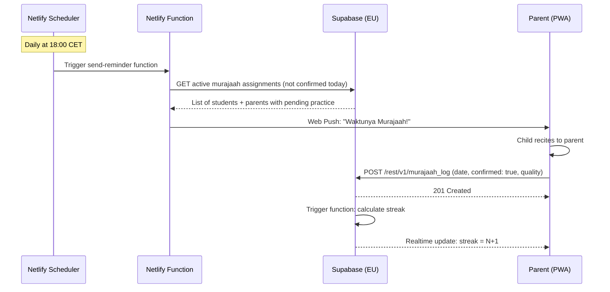

# Technical Architecture Document: PPME - TPA

**Product:** PPME - TPA
**Author:** Solution Architect
**Date:** 2026-06-29
**Status:** Draft
**Related PRD:** PRD-PPME-TPA.md

---

## Table of Contents
- [Requirements Overview](#requirements-overview)
- [Scope](#scope)
- [Assumptions](#assumptions)
- [Dependencies](#dependencies)
- [High-Level Components](#high-level-components)
- [Key Architecture Decisions](#key-architecture-decisions)
- [Impact](#impact)
  - [Domain Model](#domain-model)
  - [API Spec](#api-spec)
  - [Batch Files Spec](#batch-files-spec)
  - [Notification Spec](#notification-spec)
  - [Flows](#flows)
  - [Database](#database)
  - [Billing](#billing)
  - [CS Tools](#cs-tools)
  - [Scheduler](#scheduler)
- [Other Artifacts](#other-artifacts)
- [Questions](#questions)
- [References](#references)

---

# Requirements Overview

Build a Progressive Web App (PWA) for PPME Den Haag's TPA (Taman Penitipan Al-Quran) program that enables:

1. **Attendance Tracking** — Tutors record daily student presence/absence; parents receive notifications and view history
2. **Homework Assignments** — Tutors create and assign homework; parents/students view and track completion
3. **Yanbu'a Progress Tracking** — Record student progression through the 7-jilid Yanbu'a curriculum with mastery assessments
4. **Quran Recitation Tracking** — Track surah/ayah progress with tajweed quality ratings
5. **Murajaah (Memorization) Tracking** — Assign memorization targets, enable parent-confirmed home practice with streaks, tutor assessment

**Key Non-Functional Requirements:**
- GDPR-compliant (EU data residency, encrypted storage, children's data protection)
- Google OAuth 2.0 authentication
- Hosted on Netlify (EU region)
- European technology providers preferred
- Affordable/free-tier cost model suitable for community organization
- Mobile-first PWA with offline support
- Bilingual: Bahasa Indonesia (primary) + Dutch (secondary)

# Scope

### In Scope (Phase 1 — MVP)
* Attendance management (present/absent/late with reasons)
* Yanbu'a progress recording (jilid, page, mastery level)
* Google OAuth 2.0 authentication for all user roles
* Role-based access control (Tutor, Parent, Student, Admin)
* PWA with offline-first capability and background sync
* Netlify deployment (EU region)
* Push notifications for absence alerts

### In Scope (Phase 2)
* Homework assignment module
* Parent dashboard with progress overview
* Quran recitation progress tracking

### In Scope (Phase 3)
* Murajaah home practice with parent confirmation
* Streak tracking and milestone celebrations
* Daily reminder notifications (push + optional WhatsApp)
* Reporting dashboards for TPA Admin

### Out of Scope
* Payment/fee management
* Audio/video recording of recitations
* AI-based tajweed assessment
* Gamification/leaderboards
* Multi-branch PPME deployment (future phase)
* Native mobile apps (iOS/Android app store)

# Assumptions

* All tutors, parents, and students (where applicable) have access to a Google account for authentication
* PPME Den Haag (Medlerstraat 4) has reliable WiFi during TPA sessions
* Parents have smartphones with modern browsers (Android 8+/iOS 13+)
* The standard 7-jilid Yanbu'a curriculum is used universally at PPME
* PPME Den Haag serves up to ~200 students and ~20 tutors maximum
* Tutors are volunteers and not compensated via this platform
* The TPA committee designates an Admin user to manage enrollment data
* The app will be accessed primarily from CET/CEST timezone (Netherlands)
* Netlify free tier or Pro tier ($19/mo) is sufficient for initial traffic volumes
* The PPME board approves use of Google services for member data (per GDPR assessment)

# Dependencies

| Dependency | Provider | Purpose |
|---|---|---|
| Google OAuth 2.0 | Google (Identity Platform) | Authentication for all users — no custom password management |
| Netlify | Netlify Inc. (EU region) | Frontend hosting, CDN, serverless functions, scheduled functions |
| Supabase (EU) | Supabase (Frankfurt region) | PostgreSQL database, Row Level Security, real-time subscriptions, file storage |
| Supabase Auth | Supabase | Google OAuth integration layer, session management |
| Web Push API | Browser-native (VAPID) | Push notifications to subscribed devices |
| WhatsApp Business API | Meta (optional Phase 3) | Reminder notifications via WhatsApp for Murajaah |
| Quran Reference Data | Open-source (quran.com API or static JSON) | 114 Surahs with ayah counts — loaded as seed data |
| Yanbu'a Curriculum Data | Manual seed | 7 Jilid with page counts — pre-loaded reference data |

# High-Level Components

```
┌─────────────────────────────────────────────────────────────────────┐
│                        CLIENT (PWA)                                   │
│  ┌───────────┐ ┌───────────┐ ┌───────────┐ ┌───────────┐ ┌───────┐ │
│  │Attendance │ │ Homework  │ │  Yanbu'a  │ │   Quran   │ │Murajaah│ │
│  │  Module   │ │  Module   │ │  Module   │ │  Module   │ │ Module │ │
│  └───────────┘ └───────────┘ └───────────┘ └───────────┘ └───────┘ │
│  ┌─────────────────────────────────────────────────────────────────┐ │
│  │              Shared: Auth, Offline Cache, Notifications          │ │
│  └─────────────────────────────────────────────────────────────────┘ │
│  Framework: Next.js (Static Export) / React + Vite                   │
│  Styling: Tailwind CSS (PPME brand theme)                            │
│  PWA: Service Worker + Workbox                                       │
└──────────────────────────────┬──────────────────────────────────────┘
                               │ HTTPS (TLS 1.3)
                               ▼
┌─────────────────────────────────────────────────────────────────────┐
│                     HOSTING & EDGE (Netlify EU)                       │
│  ┌───────────────┐  ┌────────────────────┐  ┌────────────────────┐  │
│  │  Static CDN   │  │ Netlify Functions   │  │ Scheduled Functions │  │
│  │  (PWA assets) │  │ (API edge handlers) │  │ (Daily reminders)  │  │
│  └───────────────┘  └────────┬───────────┘  └────────┬───────────┘  │
└──────────────────────────────┼────────────────────────┼──────────────┘
                               │                        │
                               ▼                        ▼
┌─────────────────────────────────────────────────────────────────────┐
│                     BACKEND (Supabase — Frankfurt EU)                 │
│  ┌──────────────┐  ┌──────────────┐  ┌──────────────┐              │
│  │  PostgreSQL   │  │  Auth (GoTrue)│  │   Storage    │              │
│  │  (encrypted)  │  │  Google OAuth │  │  (avatars)   │              │
│  └──────────────┘  └──────────────┘  └──────────────┘              │
│  ┌──────────────┐  ┌──────────────┐                                 │
│  │  Row Level    │  │  Realtime     │                                │
│  │  Security     │  │  (WebSocket)  │                                │
│  └──────────────┘  └──────────────┘                                 │
└─────────────────────────────────────────────────────────────────────┘
                               │
                               ▼
┌─────────────────────────────────────────────────────────────────────┐
│                     EXTERNAL SERVICES                                 │
│  ┌──────────────┐  ┌──────────────┐  ┌──────────────┐              │
│  │  Web Push     │  │  WhatsApp    │  │  Google      │              │
│  │  (VAPID)      │  │  Business API│  │  Identity    │              │
│  └──────────────┘  └──────────────┘  └──────────────┘              │
└─────────────────────────────────────────────────────────────────────┘
```

**Technology Stack Summary:**

| Layer | Technology | Rationale |
|---|---|---|
| Frontend | React + Vite (or Next.js static export) | Fast, lightweight PWA; excellent DX; static export for Netlify |
| Styling | Tailwind CSS | Utility-first; easy to apply PPME brand tokens; small bundle |
| PWA | Workbox (Service Worker) | Offline caching, push notification support. Offline **write** sync is app-layer, not Workbox's Background Sync API (ADR-029) |
| Hosting | Netlify (EU) | Free/affordable; automatic deployments from Git; serverless functions; scheduled functions |
| Backend/DB | Supabase (Frankfurt, EU) | PostgreSQL with Row Level Security; built-in Auth; real-time; free tier generous (500MB DB, 1GB storage) |
| Auth | Google OAuth 2.0 via Supabase Auth | Trusted provider; no password management; PPME members have Google accounts |
| Notifications | Web Push API (VAPID) | Browser-native; no third-party dependency; free |
| Language | TypeScript | Type safety across frontend and serverless functions |
| Testing | Vitest + Playwright | Unit + E2E testing; fast CI on Netlify |

# Key Architecture Decisions

| # | Decision | Rationale | Alternatives Considered |
|---|---|---|---|
| ADR-001 | **PWA (not native app)** | No app store approval needed; single codebase; instant updates via Netlify; "Add to Home Screen" gives native-like experience; most cost-effective | React Native (too complex for community project); Flutter (added complexity) |
| ADR-002 | **Supabase (Frankfurt) as backend** | EU data residency (GDPR); PostgreSQL with Row Level Security; built-in Google OAuth; real-time subscriptions; generous free tier (up to 500MB DB); open-source | Firebase (US-centric data by default; Google lock-in); PlanetScale (no RLS); self-hosted Postgres (ops overhead) |
| ADR-003 | **Google OAuth 2.0 only (no password auth)** | Eliminates password storage liability; PPME members already have Google accounts; reduces security attack surface; simpler UX | Email+password (password management burden); Magic links (email deliverability issues); Phone OTP (SMS costs) |
| ADR-004 | **Netlify (EU) for hosting** | Automatic Git-based deployments; CDN for fast global delivery; serverless functions for API logic; scheduled functions for reminders; affordable Pro tier; EU edge nodes | Vercel (similar but less EU focus); AWS Amplify (over-engineered for community app); self-hosted (ops burden) |
| ~~ADR-005~~ | ~~**Offline-first with Workbox**~~ — **PARTLY SUPERSEDED by ADR-029** | TPA sessions may have intermittent WiFi; parents log Murajaah anywhere; service worker caches app shell + recent data; background sync when online | Online-only (poor UX for mobile users); SQLite WASM (too complex) |
| ADR-006 | **Row Level Security (RLS) at database level** | Parents can ONLY see their children's data; tutors can ONLY access their assigned classes; enforced at DB layer regardless of API bugs; GDPR data minimization principle | Application-level auth only (single point of failure); API middleware checks (bypassable if misconfigured) |
| ADR-007 | **Tailwind CSS with PPME brand tokens** | Matches ppmedenhaag.nl look and feel; royal blue (#0D50A0) + gold + white palette (sampled from PPME logo) encoded as CSS variables; responsive mobile-first; tiny production bundle | Material UI (too generic); Bootstrap (dated); Custom CSS (maintenance overhead) |
| ADR-008 | **Supabase Realtime for live updates** | When tutor submits attendance, parent sees it instantly; Murajaah confirmations reflect immediately for tutors; WebSocket-based, included in Supabase free tier | Polling (wasteful, delayed); Server-Sent Events (less browser support); Firebase Realtime DB (non-EU) |
| ADR-009 | **Web Push (VAPID) for notifications** | Free; no third-party service needed; browser-native; works on Android and desktop; iOS 16.4+ supports web push | FCM (Google dependency); OneSignal (extra service); WhatsApp only (not all parents use it) |
| ADR-010 | **Netlify Scheduled Functions for reminders** | Cron-based daily Murajaah reminders; no separate scheduler infrastructure; runs in EU region; included in Netlify plan | Supabase pg_cron (limited); External cron service (extra dependency); AWS Lambda (overkill) |
| ADR-011 | **pdfkit for year-end report PDF generation** | Pure-JS, no headless browser — fits comfortably within Netlify Functions' package-size and execution-time limits; sufficient for a structured single/two-page report (header, stats table, grades table, narrative) | Puppeteer/Playwright + Chromium (HTML→PDF gives more layout flexibility but the Chromium binary is heavy for serverless — tight fit on free tier, slower cold starts); @react-pdf/renderer (viable alternative, similar tradeoffs to pdfkit but React-based — reconsider if design needs grow past what pdfkit's imperative API comfortably supports) |
| ~~ADR-012~~ | ~~**Admin role scoped to enrollment/setup only, not operational data**~~ — **SUPERSEDED by ADR-014** | Explicit product decision during the admin UI build: admin manages users/classes/students but cannot view attendance, Yanbu'a/Quran/Murajaah progress, homework, or reports — those nav tabs are hidden for admin and the routes redirect if visited directly (`AdminRestricted.tsx`). This is an **application-layer** restriction only — RLS still grants admin `ALL` at the DB layer per ADR-006/the RLS policy table below, kept for legitimate support/data-recovery needs. Narrows the "CS Tools → Admin Dashboard" scope below from the original spec (which included Attendance Reports and Progress Overview). *Kept on the record because Milestones 1–6 were all built around it — `AdminRestricted.tsx`, the exclusive admin nav, and `report-pdf`'s admin denial all existed because of this row.* | Full CS Tools scope as originally specced (rejected at the time: puts student progress/attendance data in front of a role with no pedagogical relationship to the student, beyond what enrollment administration requires — **this is the alternative ADR-014 ultimately adopted**) |
| ~~ADR-013~~ | ~~**Year-end draft generation is admin-triggered; everything about a report's content stays with the tutor**~~ — **PARTLY SUPERSEDED by ADR-014** (the content-blindness half; the publishing half stands) | Resolved the one apparent conflict between the Netlify Functions table below (which describes `generate-year-end-drafts` as "Admin-triggered") and ADR-012. Bulk-creating one draft per enrolled student for a whole academic year genuinely needs an enrollment-wide view, which only admin has — so the *trigger* is admin's, exposed at `/admin/reports` as a form with two inputs (academic year, optional class) whose only output is `created_count` / `skipped_existing` / `skipped_no_tutor`. That screen never listed the drafts, never showed a narrative or grade, and offered no route to one; `/reports` blocked admin via `AdminRestricted`, and `report-pdf` refused admin outright even though RLS grants admin ALL. **The one part of this row that ADR-014 leaves exactly as written**: `publish-report` accepts **only the authoring tutor**, not admin, matching what `yer_tutor_rw`'s WITH CHECK (`tutor_id = auth.uid()`) already allows through PostgREST | Admin able to browse/review report content (rejected then as the pedagogical data ADR-012 excluded — **adopted by ADR-014**); tutor-triggered generation (rejected, and still rejected: a tutor sees only their own classes, so nobody could generate for the whole TPA in one action, and per-class triggers would silently miss students whose class has no tutor assigned); admin allowed to publish as a break-glass (rejected then and now: publishing is what makes a report visible to a family — an authoring judgement, not an enrollment operation) |
| ADR-014 | **`admin` is a super admin: full read *and* write access to every feature, on every class** | Reverses ADR-012 and the content-blind half of ADR-013 at PPME's request. An administrator of a ~200-student TPA needs to be able to see and fix operational data — cover a session when a tutor is away, correct a mis-recorded absence, finish a report — and the previous fence made the only account with an org-wide view the one account that could do none of that.<br><br>**No migration and no RLS change.** Migration 003 has always granted admin `ALL` on every table (`*_admin_all` policies plus the `or fn_is_admin()` branches on the tutor policies) and migration 005 does the same for `year_end_reports` (`yer_admin_all`), so the fence was only ever application-layer. The whole change is the removal of `AdminRestricted.tsx`, the six `role === 'admin'` guards in the feature pages, and `report-pdf`'s `default: return false`. An unchanged-green pgTAP run is the evidence RLS was untouched; RLS-22…RLS-27 were added to assert the admin writes land *and* that no other role's scope widened.<br><br>Five decisions inside it:<br>**(a) Class-shaped, not family-shaped.** Admin gets the tutor view of every screen (class picker → roster → drill-down). `useMyClasses` already returns all classes for admin, so this needed no new query. The family views are child-scoped and their `useMyStudents` query has no `parent_id` predicate for admin — a ChildPicker would list all ~200 students as though they were the admin's own children.<br>**(b) `tutor_id` records the admin's own id.** Six tables carry a NOT NULL `tutor_id` FK meaning "who recorded this row". An admin write stores the admin's id: simplest, and honest — it really was the admin. The consequence is that `tutor_id` no longer implies membership of `classes.tutor_ids`, which nothing downstream may assume (asserted as RLS-24). `year_end_reports.tutor_id` is unaffected: it is set once at draft generation from the class's first tutor and is the authorship record that `publish-report` checks.<br>**(c) Home-practice confirmation stays with parents.** `murajaah_log.confirmed_by` means "the parent who watched the child recite"; a confirmation from an administrator is a claim nobody witnessed. `mlog_admin_all` permits the insert at the DB layer (RLS-25 asserts it still does) — the app simply never offers the control, since it lives only in `FamilyMurajaahView`. Every other operational write being available is what makes this exception meaningful rather than arbitrary.<br>**(d) Nav: the five operational tabs stay, the enrollment screens move down a level.** 5 operational + 4 admin tabs will not fit a mobile bottom nav at 44px tap targets, and the 5-tab order is prototype-validated (checklist §5). Admin now gets exactly the same bottom nav as everyone else, plus one "Kelola" entry point (dashboard tile + a sixth desktop tab) into `/admin/*`, where a secondary tab strip (`AdminSectionNav`) moves between Pendaftaran/Grup/Santri. `RequireAdmin` still guards those routes.<br>**(e) Reports: read and edit yes, publish no.** Admin sees every report including drafts, edits narratives and grades, and downloads PDFs (`report-pdf` gained an admin branch). Publishing stays authoring-tutor-only per ADR-013. That combination has a sharp edge: editing does not regenerate the PDF (the client calls `publish-report` afterwards, which 403s for admin), so an admin edit to a published report leaves the stored PDF stale. The editor hides the publish button for admin and shows "the PDF will not update until *[tutor]* re-publishes" — the mismatch is made visible rather than silently produced or prevented. `/admin/reports` (the counts-only generation screen) folded into the admin's own Reports view as a panel, since a deliberately content-blind screen had nothing left to protect | A 5th `user_role` enum value, so PPME could have both a narrow enrollment admin and a super admin (rejected: no concrete need for both was identified, and it would mean a migration, an RLS rewrite and a fixture change for a distinction nobody asked for — revisit if PPME ever wants a volunteer registrar who is not a full administrator); read-only super admin (rejected: the stated need is to *fix* things, and RLS already permits the writes); letting the admin pick which tutor an entry is attributed to (rejected as more UI for a worse record — it invites putting a tutor's name on something they did not do; better records here would mean a separate `recorded_by` column, which is a schema change, not this one); blocking admin edits on published reports to avoid the stale PDF (rejected: it takes away the one repair the role most obviously needs, at year-end when the authoring tutor may be unreachable); letting admin publish as a break-glass (rejected — see ADR-013) |
| ADR-015 | **Web Push pipeline: family-facing recipients, lock-screen-minimal copy, a database webhook as the trigger, and timezone handled in code rather than in cron** | The notification work in checklist §4 is larger than any single milestone this project has shipped, and part of it (the real-device matrix, test-plan §6) cannot be verified from a development machine at all. It is therefore being delivered in three parts; this row records the decisions that all three depend on, taken while building the first.<br><br>**Part 1:** VAPID + `web-push`, `push-subscribe`, the payload builder, the service-worker handlers, the notification-settings screen, and `notify-absence` end to end — the highest-value single flow, and the one that exercises every layer of the pipeline once. **Part 2a:** the remaining *event-driven* notifications over that same proven webhook path — jilid completed, surah memorized, new homework assigned, year-end report published (migration 010, `notify-milestone`, `notify-assignment`, `notify-report-ready`). **Part 2b:** the *scheduled* Functions, `streak-status`, and the `calculate-streak-resets` consequences (`src/lib/murajaah.ts`'s docstring, the domain-model footnote and checklist §13 all described a system with no streak-reset job, and had to be rewritten *together with* whatever invalidated them). **Delivered — see ADR-016**, which resolved it in the other direction: three scheduled Functions built, and `calculate-streak-resets` and `streak-status` superseded rather than built, because deriving the streak removes the reason for either to exist. **Part 3:** the in-app notification centre, which needs a new table, RLS policies and pgTAP cases — and whose screen §5 records as never having been design-reviewed in the prototype batch. Deferring it was not a scheduling convenience: building an unreviewed screen and a migration together is how a schema gets locked in around a design nobody agreed to. **Delivered — see ADR-017**, which answers that risk rather than accepting it: the table records domain events and nothing about presentation, so any reviewed design can be built on it without a migration. The screen still has not been reviewed, and says so in its own docstring.
| ADR-016 | **Streaks are derived, not stored; two of the four planned scheduled Functions are therefore not built; and the dedup tag gains the child** | ADR-015 part 2b: the three time-driven notifications, plus the one genuine design decision the notification work had left open.<br><br>**(a) A streak is computed from the log, in the period its frequency asks for.** `murajaah_log.streak_count` (migration 002) was written by a trigger on INSERT and so could only change when a *new* confirmation arrived: a row from three days ago reading 7 described a run that had already been broken, and the database had no way to know. It also counted only *days*, while a target carries a `frequency` — a `3x_week` target confirmed every Monday, Wednesday and Friday for a year had a stored streak of 1, because no two confirmations were ever consecutive. `computeStreak` (`src/lib/murajaah.ts`) answers both at read time over the right period: a day for `daily`, a Mon–Sun week needing three confirmations for `3x_week`, a week needing one for `weekly`. Counting runs backwards from the current period if it is already met and otherwise from the previous one, so a family who has not practised *yet today* has not lost anything, and a day that is over and was missed ends the run — PRD AC-003, which the stored column could not express. The week a target is assigned in asks only for as many confirmations as there were days to give them (test-plan §4.1's "assignment created mid-week"), never fewer than one. Migration 011 drops the column and `fn_set_streak_count` rather than leaving a second, wrong answer in the table.<br>**(b) `calculate-streak-resets` is superseded, not deferred.** Its entire job was to go and zero stored streaks that had gone stale overnight. A derived streak cannot go stale, so the job has nothing to do. Recorded here rather than deleted from the Scheduler table.<br>**(c) `streak-status` is not built, and is a five-line addition if PPME ever wants it.** It would return a number computed from rows the caller already has: both screens that show a streak (`FamilyMurajaahView`, `TutorOverviewView`) fetch the confirmation history anyway, and now run the same shared function over it that the reminder job runs. An endpoint would add a network round trip, a second authorization path and a second implementation of the same rule, to deliver an integer the client can compute. `openapi.yaml` keeps the path, marked not built, with this reasoning.<br>**(d) A scheduled Function authenticates nothing, and is built so that it does not need to.** `webhookAuth`'s shared secret works for the database webhooks because Postgres can be told to send a header; Netlify's scheduler cannot, so requiring one would mean the scheduler could never run the job. Instead: Netlify documents a scheduled function as not reachable over HTTP (its own `@netlify/functions` types say so) — **which this project has not been able to confirm on a deployed site**, because the only deployed environment available here is a password-protected deploy preview that 401s every path including `health`. So that documented guarantee is treated as an unverified claim and carries none of the weight on its own. What the design actually rests on is the rest: the handler reads **nothing** from the request — not the body, not the query, not a header, and `run` is never even given the `Request` — so every input comes from the database and the clock; outside its Amsterdam hour it returns before opening a database connection; and every notification it sends is idempotent per (recipient, event, child, local date), so a replay sends nothing new. The reasoning holds only because these jobs write nothing, and does not transfer to one that does. **Locally the platform boundary is definitely absent:** under `netlify dev` a scheduled Function is an ordinary HTTP endpoint on both GET and POST, confirmed by curl (README). That is why the design assumes no boundary at all, and why (e) matters.<br>**(e) A Function's response carries counts, never dedup tags.** A tag is `event:userId:studentId:date`. Returning the tag list — which every sender did — hands the caller two internal identifiers per delivery, through a channel whose purpose is to report a number, on endpoints that in at least one environment answer unauthenticated requests. `reportable()` strips them; the counts, which are not personal data, are what a Netlify log is read for.<br>**(f) The dedup tag gains the child.** Part 1 keyed it on (user, event, date) and pinned the consequence in a test as accepted: a parent of two absent children got **one** notification, naming one child, because the second silently replaced the first. That should not have been accepted — it is a parent not being told their child was missing from class — and 2b's senders fan out per child by design, so it would have stopped being an edge case. Adding the child narrows the key, so every idempotency property is preserved.<br>**(g) The weekly digest needed somewhere to land, so the dashboard got a weekly summary card.** The Scheduler table describes the digest as a push carrying "attendance %, new progress". DPIA R6 forbids that on a lock screen — it is the one figure a family would least like read over their shoulder. Applying ADR-015(b)'s two-tier model leaves the push saying only that a summary is ready, which is an invitation to look at nothing unless the summary exists. `src/features/dashboard/WeeklySummary.tsx` is it, sharing `fetchWeeklyActivity` with the Function so the notification and the screen can never disagree. A week with no activity at all sends nothing.<br>**(h) Reminders are sent on the last day they can still be acted on.** `daily` is every evening practice is unconfirmed (FR-006 as written); `3x_week` is the evening the days left drop to the confirmations still owed (Friday if none are done, Sunday if two are); `weekly` is Sunday. A family comfortably on track is not interrupted, which is the difference between a reminder and nagging — and the reason notifications stay switched on, which every other notification in the system depends on | A nightly `calculate-streak-resets` writing zeros into the log (rejected — see (a)/(b): it fixes staleness by scheduling more writes, and cannot fix the frequency bug at all); keeping `streak_count` as a cache alongside the derived value (rejected: two answers to one question, and the wrong one is the one a future query will find); prorating a mid-week assignment's streak to zero rather than to a reduced target (rejected: it punishes a family for the day the tutor happened to set the target); a shared secret on the scheduled Functions (rejected: Netlify's scheduler cannot send one, so the job would simply never run); a query parameter or header to move the clock for testing (rejected: it would be a way for whatever can reach the endpoint to move it — `scripts/invoke-scheduled.mjs` moves it from outside the process instead); putting the attendance percentage in the digest payload (rejected: DPIA R6); reminding every family every evening regardless of frequency (rejected — see (h)); leaving the dedup tag as it was and documenting the sibling collision (rejected — see (f)) |
| ADR-017 | **The in-app notification centre stores domain events, not a screen — and is the one place ADR-014's super admin does not reach** | ADR-015 part 3, the last of the notification work. Held back after parts 1 and 2 for a stated reason: the notification centre screen has never been through the prototype design review (PRD §71 still lists it as an open follow-up), and shipping a migration alongside an unreviewed screen is how a schema gets locked around a design nobody agreed to.<br><br>**(a) The schema is display-agnostic, which is how that risk was answered rather than accepted.** `public.notifications` (migration 012) records *this recipient was told this thing about this child on this day* — `user_id`, `student_id`, `event`, a `context` object, `event_date`, `read_at`. There is no ordering key, no category, no grouping, no icon, no pinned flag and no rendered string. Every sentence the screen shows is built at read time from `event` + `context` against the i18n copy. A design review can therefore regroup the list by child, split read from unread, add filters, add per-row dismissal or reword everything, and **none of it needs a migration**. The domain the table does encode — the Notification Spec's event list — *is* reviewed. What could not be de-risked this way is the screen itself, and it is deliberately built from the card-list pattern the Murajaah and Quran timelines already use rather than from a new idea, so a review has something conventional to react to.<br>**(b) A row is written for every recipient, whether or not they can be pushed to.** The centre's main audience is families who declined push, or whose browser never supported it — so recording cannot live inside `dispatch`, which by construction only iterates recipients holding a subscription. `buildAudiences` no longer drops an unsubscribed account; it returns them with `subscription: null`, and only the push half filters on that. `recorded` and `sent` are reported separately for exactly this reason, and `recorded` is normally the larger of the two. Recording also happens **before** the push: the push depends on a third party, and a family's own record of what they were told should not.<br>**(c) The unique key is the dedup tag.** `(user_id, student_id, event, event_date)` is the same tuple `dedupTag()` builds for the lock screen (ADR-016(f)), upserted rather than inserted. One concept of "the same notification" in both places, which is what makes the hourly scheduled Functions safe here too — the second run of `homework-due-reminders` must not leave a family with two identical lines.<br>**(d) Admin reads nobody's notifications.** The single place ADR-014's super admin stops. ADR-014 gave admin every *operational* screen on every class because running the TPA needs that; a notification is a message addressed to a named parent, an admin inbox of every family's messages adds nothing to running the TPA, and it would be hard to defend under data minimisation. Admin also receives none, by ADR-015(a). There is no admin policy on the table, asserted as NC-09.<br>**(e) The client can mark read and nothing else.** RLS has no column granularity, so a policy alone would let a recipient rewrite `event` or `context` on their own rows and make the app render something that never happened. Migration 012 revokes the blanket write grants and grants `update (read_at)` only — the database, not the app, is what makes that true (NC-04/NC-05). There is no client INSERT at all: a client that could insert here could put words in the TPA's mouth on another parent's screen.<br>**(f) Ninety-day retention, in its own job.** The centre is the first table here that grows because *time passed* rather than because someone recorded something — DPIA R5. `prune-notifications` deletes past 90 days, a window chosen to outlast the longest-lived reason to open the list (a year-end report notification a parent may not act on for weeks). Folding it into `weekly-progress-digest`, which already runs weekly, was rejected: retention is a legal obligation and the digest is a courtesy, so a Friday the digest skips would silently be a Friday nothing was deleted.<br>**(g) The child's name is joined, never stored.** A row carries `student_id`; the name is read through it. A corrected name therefore corrects every notification already written, and the name is not copied across hundreds of rows. `context` carries only what the copy interpolates beyond it — the jilid number, the surah, the assignment title and deadline — typed as scalars so a sender cannot casually widen what the centre stores about a child.<br>**(h) DPIA R6 does not apply here, and that is the point.** R6's threat model is a lock screen. These rows are read only by an authenticated recipient, so they carry the richer wording the Notification Spec originally drafted — which is what ADR-015(b) promised when it split the copy in two. The unit suite asserts the two blocks stay separate, and in particular that no `{{number}}`, `{{surah}}`, `{{title}}`, `{{date}}` or `{{count}}` ever appears in a push string | Storing the rendered sentence instead of `event` + `context` (rejected: it freezes the copy at write time, so a family switching language re-reads their history in the old one, and a reworded string never reaches rows already written); a `read` boolean rather than `read_at` (rejected: the timestamp costs the same and answers "when", which a subject access request may ask); giving admin read access for support purposes (rejected — see (d); an admin helping a parent can ask them what they received); letting a recipient delete their own rows (rejected: retention is central, and a per-user delete is a path by which the record of what a family was told disappears early); a realtime subscription for the badge (rejected: an open socket on every screen for every family, to make a count that only has to be right when someone looks at it); folding retention into an existing scheduled job (rejected — see (f)); building the screen first and the table around it (rejected — see (a), and it is the specific thing ADR-015 held part 3 back to avoid) |
| ADR-018 | **Transactional email via Resend, as a second channel alongside Web Push — and the two-emails problem that comes with it** | Web Push is not a channel every family actually has. On iOS it works only after the PWA is added to the Home Screen (checklist §5), an adoption step many families will never take, and one this project has never verified on an iOS device at all (test-plan §6). Email reaches the people push cannot.<br><br>**(a) Resend, not Supabase Auth's SMTP.** Supabase's built-in mail is rate-limited and documented as unsuitable for production transactional volume. It stays in use for exactly one thing — `inviteUserByEmail`, which is how the `auth.users` row gets created — but that is an *auth* mechanism, not a notification channel.<br>**(b) There are now two invitation emails, and that is recorded rather than hidden.** Wiring the branded invitation onto `invite-user` means a new user receives GoTrue's magic-link invite *and* our onboarding email. The obvious fix — drop the GoTrue one — is not an email change: `inviteUserByEmail` is what creates the `auth.users` row the profile insert depends on, so replacing it means moving to `auth.admin.createUser` and taking on the sign-in flow that invite link currently provides. That is an auth decision with its own risks, and it should be taken deliberately rather than as a side effect of adding a template. **Open**, and the first thing to settle if PPME finds the duplication confusing.<br>**(c) Email is additive and can never block what it accompanies.** `sendEmail` never throws; every failure is a returned value. It is called *after* the profile insert, and its result is reported in the response (`invitation_email`) rather than acted on. A mail provider having a bad minute must not turn a successful invite into a failed one — the same rule ADR-015(c) applies to push, for the same reason.<br>**(d) It fails *open*, unlike the webhook secret.** A missing `RESEND_API_KEY` logs and returns `not-configured`; a missing `NOTIFY_WEBHOOK_SECRET` refuses the request outright (ADR-015(d)). The asymmetry is deliberate: an unauthenticated endpoint is a security failure, an unsent courtesy email is a degraded feature.<br>**(e) Templates are keyed role → locale, in their own file.** Four roles because the invitation is genuinely four different messages — a parent is invited to follow their child, a 16+ student to follow their own progress, a tutor to record a class's work, an admin to run the platform. Locale from `users.locale`, role from `users.role`, the same two columns the push payload builder reads. They live in `lib/emailTemplates.ts` rather than inline in a Function because the people most likely to reword a sentence are not the people editing the Function. Values are HTML-escaped on substitution: a full name is user-supplied data going into an HTML document.<br>**(f) EU region, and a domain that must be verified.** Resend's EU region is selected in its dashboard, consistent with Frankfurt (ADR-002) and Netlify EU (ADR-004) — mail carries a parent's address and a child's name, so the same residency reasoning applies, and it cannot be applied retroactively to mail already sent. Separately, `tpa.ppmedenhaag.nl` must be verified in Resend before anything sends; until then Resend allows only `onboarding@resend.dev` to the account owner. Both are deployment prerequisites, not code defects — the `from` address is deliberately the real intended one so a misconfigured deploy fails loudly rather than sending from a sandbox nobody recognises<br><br>**Resolved by ADR-026**: (b)'s "Open" stands as a record of the reasoning at the time, but the duplication is gone — `invite-user` sends exactly one email now.<br><br>**Resolved by ADR-031**: (f)'s domain-verification half is also done — `ppmedenhaag.nl` (the bare domain, not `tpa.ppmedenhaag.nl` as (f) assumed) is verified in Resend and `FROM_ADDRESS` was updated to match, confirmed by a live send from the production key. The EU-region half of (f) is unaffected and still open. | Supabase Auth SMTP for transactional mail (rejected — rate-limited, not intended for it); dropping GoTrue's invite email in this change (rejected — see (b): it is an auth change wearing an email change's clothes); throwing on mail failure (rejected — see (c)); failing closed on a missing key (rejected — see (d)); one template with the role interpolated into a sentence (rejected: it produces copy that fits none of the four); inlining the copy in `invite-user.mts` (rejected — see (e)); sending real email during development (rejected: test-plan's "no real student data in any test environment, ever" extends to not putting mail in real inboxes, so the transport is injected and every test uses a fake) |
| ADR-019 | **One person can hold several relationships at once. The database already handles it correctly; capabilities are derived app-side, and two hooks stop letting RLS answer a wider question than the screen asked** | `users.role` holds one value, but a real person at the TPA is often several things: a tutor whose own child attends, an admin who also teaches. Nothing prevented that state — `students.parent_id` is a plain FK to `users(id)` with no role constraint, and while the admin UI has no way to set it up, the API always has. This row is the first of three changes making it work, and it is foundation only: no existing single-role user sees anything different.<br><br>**(a) The claim was proven before anything was built on it.** Migration 003 writes every family/tutor policy against a *relationship* — `parent_id = auth.uid()`, `auth.uid() = any (tutor_ids)`, `user_id = auth.uid()` — and across all 42 policies `fn_is_admin()` is the only role check. Permissive policies are OR-ed, so a person holding two relationships already gets the union of two grants, with no schema change and no policy change. RLS-28…RLS-34 assert this rather than assume it (39 new assertions, 104 → 143): a tutor-parent sees exactly their class plus their own child — not their child's classmates, not another family — and the same shape holds whether their `users.role` says `tutor` or `parent`. **The union is not a promotion**, which is the half worth having tests for: they can record Yanbu'a for a student in their class but not for their own child; they can confirm home practice for their own child but not for a student in their class; they see the draft report of a student they teach and still cannot see their own child's draft, only its published version. Nobody else's visibility widens, and `anon` still sees nothing.<br><br>**The model is n-ary, not dual, and RLS-34 says where that stops.** Nothing caps the number of relationships at two and the derivation is four independent booleans, so a triple-role person — `role='admin'`, tutor of one class, parent of a child in another — holds all three at once, each still derived its own way: `fn_is_admin()` true, `fn_my_classes()` exactly the class they are named in, `fn_my_children()` exactly their own child. But `fn_is_admin()` is an unconditional `ALL` (ADR-014), so once admin is in the union it swallows the other two whole: that person *does* see all four unrelated fixture children, *can* record Yanbu'a for their own child and *can* confirm home practice for a student they teach — each one the mirror image of a refusal in RLS-31/RLS-32. "The union is bounded by the relationships you hold" is true of every combination that does not include admin, and the assertions say so in both directions rather than leaving the reader to assume the pleasant half generalises.<br><br>**(b) Capabilities are derived in the app, with no migration.** `src/lib/capabilities.ts` derives four booleans — `isParentOfAnyone`, `isTutorOfAnyClass`, `isSelfStudent`, `isAdmin` — from the same predicates the policies use. A SQL helper was the obvious alternative and was rejected: the existing helpers are `security definer`, and a new `fn_my_capabilities()` would be a *second* definition of "who is a parent" living beside the policies, free to drift from them. The three queries behind the derivation are ordinary RLS-permitted selects the app is already entitled to make. And the distinction that settles it — a capability decides which screen is worth offering, never what data comes back, so a capability that said yes where RLS says no produces an empty screen, not a leak. A migration would mean changing the production database for no security gain. `isAdmin` stays a role check because `fn_is_admin()` is one: ADR-014's super admin is a granted position, not a relationship anyone acquires by enrolling a child.<br><br>**(c) Two hooks stopped trusting RLS to narrow their results, which is where the actual bug was.** `useMyStudents` ran `select id, full_name from students` with no filter at all and relied on RLS returning only your children. That is true for a pure parent and false for everyone else: `students` carries four permissive SELECT policies, so for a tutor-parent the ChildPicker offered their whole class of ~25 as "my children", and `students_admin_all` has no `parent_id` predicate at all, so for an admin it would have offered the entire school — the risk `AttendancePage` has carried a comment about since ADR-014, closed now at the query rather than by routing admins away from the screen. It now filters `parent_id.eq.<me>,user_id.eq.<me>`; **both** halves matter, because a 16+ self-login student has no `parent_id` row of their own and a `parent_id`-only filter would silently empty every screen they have. `useMyClasses` had the same defect on the tutor side, found by clicking through the dual-role fixture rather than by reading: `classes_read` also grants the classes a caller's *children* are in, so a tutor whose child attends elsewhere was offered a class they do not teach — a dead end where the roster returns their own child alone and the save fails on `fn_my_classes()`. It now filters on `tutor_ids`, with an explicit all-classes branch for admin, who is in no `tutor_ids` array and would otherwise get an empty picker.<br><br>**(d) `useCapabilities` deliberately has no consumer yet.** Swapping the existing `role ===` checks for capabilities is a behaviour change, not a refactor — a `role='tutor'` account an admin has not yet put in a class would lose its screens — and *which* view a dual-role person lands on is a UI question this change does not answer. Two known consequences are recorded rather than fixed here: `WeeklySummary`'s `isFamily` gate hides the weekly card from a tutor-parent, and a dual-role person whose `users.role` is `tutor` has no route to their own child's family views at all. Both belong with role switching, in the third change. | A `roles[]` column or a `user_roles` join table (rejected: RLS never reads `role` in the first place, so it would be a UI-only column dressed as authorization, and a second source of truth to keep in step with the relationships that actually decide access); a `fn_my_capabilities()` SQL helper (rejected — see (b): a second definition of the same predicates, free to drift); leaving `useMyStudents` to RLS and gating the ChildPicker on role instead (rejected: it makes the query's correctness depend on which screen calls it, and the query is the thing that was wrong); fixing `useMyStudents` alone as briefed (rejected: `useMyClasses` is the same defect one table over, and shipping the known half of a pair is how the other half becomes permanent) |
| ADR-020 | **A 16+ student who also tutors may record for the class they teach — "students are read-only" was a description of a relationship, not a rule the database enforces** | Found while extending ADR-019's cases past two relationships, and confirmed by reading every policy in the schema: `fn_current_role()` is called in exactly one place, inside `fn_is_admin()`. **Nothing anywhere refuses a write because the caller's role column says `student`.** RLS-07 has asserted since the first milestone that a 16+ student cannot write, and it is correct — but what it tests is a student who holds *no other relationship*, and until somebody held both, "read-only because they are a student" and "read-only because they teach nothing" were indistinguishable.<br><br>**(a) PPME's decision is that this is wanted, not tolerated.** A student assistant — an older santri who helps with a younger class — should be able to record attendance and progress for that class, exactly as any other tutor of it does. So the behaviour is now pinned by RLS-35 rather than merely permitted by omission: they can record Yanbu'a, set a murajaah target and correct attendance for the class they teach.<br><br>**(b) The boundary comes with it, and is asserted in the same breath.** The tutor grant reaches their class and stops: they cannot record progress for **their own** record (teaching one class does not let a student grade themselves — the mirror of ADR-019's "the union is not a promotion"), and they cannot touch a class they do not teach. Nor does sitting in a class as a student reveal their classmates: `students_self_read` is `user_id = auth.uid()`, so the roster they are *enrolled* in stays invisible while the roster they *teach* is fully readable. RLS-07 is unchanged and still green, because the persona it tests still holds no tutor relationship.<br><br>**(c) Six documents said "read-only" flatly, and they were amended rather than left to contradict this.** The TAD's RLS policy table, the development checklist §3, the DPIA §3 and risk R7, the README's role table, and both language halves of the privacy policy now say what is actually true: a 16+ student sees their own record and nothing else, and writes nothing — *unless* they are also a tutor, in which case the tutor grant applies to their class in the ordinary way. This is the same correction ADR-019 made to "access is by role", applied to the one role that had been described as a capability rather than a position.<br><br>**(d) The application does not offer it yet, and that is the gap this row records.** Routing is still `users.role`-shaped, so a student assistant lands on the family views and never reaches a recording screen; the entitlement exists at the data layer and is unreachable in the product. Closing it is role switching, which belongs with ADR-019's other deferred UI consequences in the third change. The dev fixture seeds Aisyah for exactly this reason — signing in as her is how the gap stays visible instead of being forgotten.<br><br>**Refined by ADR-023** (not superseded): the decision stands in full, and the boundary this row states in prose — that the tutor grant does not reach back to the assistant's own record — turned out never to have been enforced. Migration 013 enforces it for the evaluative writes, by relationship rather than by role, which is why it is consistent with the alternative rejected here rather than a reversal of it. | Adding a `student` check to the write policies to make the old sentence true (rejected: it would encode a role into a schema that deliberately has none, and it would take away a capability PPME wants); leaving it undocumented on the grounds that no such account exists yet (rejected: an accurate-by-accident document is the kind that misleads the first person to create one — and it is the DPIA and the privacy policy that were saying it); building the routing change here (rejected: it is role switching, explicitly the third change's scope, and doing it halfway would ship an affordance nobody has reviewed) |
| ADR-021 | **The minimum age for a self-login is the identity provider's rule, not one this project encodes — and assisting a class is not age-gated at all** | Two questions that surfaced together while pinning the student assistant (ADR-020), answered by PPME: *may an under-16 santri have their own login?* and *may an under-16 assist a younger class?*<br><br>**(a) The login question is Google's, and we follow it.** Authentication is Google OAuth and nothing else (ADR-003), so whether a santri can obtain the account they would sign in with is settled before they ever reach this app: Google applies its own minimum age for a self-managed account, which tracks each country's digital-consent age under GDPR — and the Netherlands sits at the top of that range. This project therefore adds **no age check of its own**. `students.date_of_birth` stays a record, not a gate. **The honest limit of that**: it is a strong default, not a guarantee. A **supervised (Family Link) account is a real Google account** — a child below the threshold can hold one under a parent's supervision, and it can complete an OAuth sign-in, subject to whatever third-party sign-in controls that parent has set in Family Link. So "Google will not let them" describes the ordinary case rather than an enforced boundary.<br><br>**What actually bounds this app is the enrolment step, not the identity.** Signing in successfully is not access: a Google identity with no matching `public.users` row lands on the "contact admin" screen and reads nothing (`App.tsx`), that row can only be created by an admin (registration approval or `invite-user`), and linking it to a student record through `students.user_id` is admin-only as well. A supervised child can therefore *authenticate* and still see nothing until an administrator decides otherwise — which is the same gate every other account passes through, and the reason no age check is needed to keep this safe. **[IT TEAM]** should confirm Google's current threshold for the Netherlands rather than trust this row's summary of it, and decide whether a supervised child account may be linked at all (checklist §6).<br><br>**(b) Assisting is not age-gated, by PPME's decision.** An older santri may help with a younger class whatever their age. Nothing in the schema expresses age, so RLS-35 already covers this exactly: to the database an under-16 assistant and an eighteen-year-old assistant are the same row. No test was added for the distinction, deliberately — a case that varies only `date_of_birth` would assert nothing, and pretending otherwise is worse than saying so here.<br><br>**(c) Assisting and recording are different things, and the gap between them is normal.** Helping in the room needs no account. *Recording* needs `auth.uid()`, which needs a Google account, which is (a). So an under-16 assistant may genuinely assist and never record, with a tutor entering the class's rows as before — that is a supported state, not a defect waiting on a fix.<br><br>**(d) The "16+" badge on the admin students list was a claim nothing checked, and is gone.** It rendered on `user_id` being set — i.e. it meant "has a linked login" while saying "is sixteen", with `date_of_birth` sitting unread in the same row. Linking an account to a younger santri therefore labelled them 16+ on the one screen where the enrolment decision is made. It now reads "own account" / "eigen account", and the form's "Link self-login **(16+)**" label has lost the same suffix. Renamed rather than derived from `date_of_birth`, which would have meant inventing the age rule (a) had just declined to own.<br><br>**Extended by ADR-032** (not superseded): this row's "linking it to a student record through `students.user_id` is admin-only as well" was true of the data layer from the start and false of the UI until then — the control this row renamed only ever existed in the create form. ADR-032 adds the missing edit path, so a student enrolled without a login can be linked to one later, not only at creation. | A check constraint or trigger refusing `user_id` on an under-16 record (rejected: it encodes one country's threshold into the schema, needs maintenance every time that law moves, duplicates a rule the identity provider already applies, and still changes nothing — the Google account either exists or it does not); deriving the badge from `date_of_birth` (rejected — see (d): a local age rule by the back door); forbidding under-16 assistants (rejected at PPME's decision — the TPA's older santri helping with the younger group is the practice the app is meant to record, not one to design out); leaving the badge as it was (rejected: an unchecked assertion about a child's age, displayed to the person deciding whether to give them an account) |
| ADR-022 | **Who receives a notification about a child is a question about their relationship to that child, not about their role — superseding half of ADR-015(a)** | ADR-015(a) settled that notifications are family-facing, and encoded it as `RECIPIENT_ROLES = ['parent','student']`: `buildAudiences` skipped any user whose `users.role` was not one of the two, `push-subscribe` returned 403 to the rest, and the bell, the settings screen and the notification centre each asked the same role question of their own. ADR-019 had already established that a person here holds relationships rather than a role — a tutor whose own child attends, an admin who also teaches — and this is the first place that turned out to be load-bearing rather than theoretical: **such a person received nothing at all about their own child.** No push, no in-app row, and no way to store a subscription in the first place. Silent, and from the family's side indistinguishable from a quiet week, which is the failure mode this whole feature keeps producing and the reason ADR-015(h) exists.<br><br>**(a) The reasoning behind ADR-015(a) was right about a class and wrong about a child.** Subscribing one account to two hundred children's lock screens is indefensible under data minimisation, and a tutor genuinely does learn about an absence by recording it. None of that is true of their *own* child, whose absence they find out about the same way any other parent does. The row is superseded in the half that confused the two and kept in the half that did not.<br>**(b) The surviving half is now a property of the query rather than a check beside it.** `buildAudiences` resolves recipients per student from `students.parent_id` and `students.user_id`, so a tutor is not in either column for the children they teach and cannot be reached by a notification about them whatever any predicate says. The role filter could therefore only ever *subtract* from a correct answer — which is exactly what it did. `UserRow` no longer carries `role` and the users query no longer selects it, so restoring the bug would take restoring the data first.<br>**(c) One rule, one derivation, five gates.** `push-subscribe`, `buildAudiences`, the settings screen, the bell and the notification centre all answered the same question separately, and a screen that offers a toggle the Function then 403s is how a role ends up with a button that always fails. `canReceiveNotifications` is now a predicate over two booleans — `isParentOfAnyone`, `isSelfStudent` — derived once in `capabilities.ts#familyRelationships`; `Capabilities` extends that interface, so the screens pass the value they already hold and the Function derives it from the same query with a service-role client. The predicate itself imports nothing, which is what lets the browser bundle and `netlify/functions/` share one copy.<br>**(d) The database needed no migration, and ADR-017(d) is refined rather than reversed.** `notifications_own_read` is `user_id = auth.uid()` — a relationship, and always was. So an admin whose own child attends reads that child's notifications and still nobody else's: `public.notifications` is the one table with no admin policy at all, which is why a parent relationship widens an admin here by exactly one child instead of by the school. NC-09 said "an admin reads no notifications at all", which was true of an admin who is nobody's parent; the sentence that survives is "none addressed to somebody else", asserted as NC-14 from both directions. NC-12…NC-16 add the tutor-parent, the admin-parent, the student assistant and the unaffected ordinary parent.<br>**(e) The email channel keeps its role key, and the reason is the moment it runs.** ADR-018's one template is the invitation, sent by `invite-user` as the `public.users` row is created — when the person holds no relationships at all, because no student row could have named them yet. `users.role` there is not a stand-in for a relationship; it is the admin's statement of why this person is being invited, which is what the letter is about. **The rule recorded for the templates that follow**: event email is addressed to a person *about a child*, so it must be selected the way the push payload is — through `notifyStudents`, from the child's row — and never from `users.role`, which would reintroduce this bug in a second channel.<br>**(f) Proven live, because inferring delivery is what went wrong the first time.** `scripts/verify-push.mjs` §4m drives a real Chromium as a tutor-parent and as an admin-parent: each subscribes, is pushed a real absence about their own child, gets the in-app row, and then receives **nothing** when a pupil in the class they teach is marked absent — asserted alongside that pupil's own parent receiving it, so the negative cannot pass because the pipeline was silent. The endpoint suite asserts the same rule from both sides: 403 for a tutor and an admin with no child of their own, 201 for a tutor and an admin with one. | Leaving the role filter and adding an exception for tutors who are parents (rejected: two rules to keep in step, and the exception is the general case — the relationship *is* the rule); a SQL helper `fn_is_notification_recipient()` (rejected for ADR-019(b)'s reason: a second definition of "who is a parent", free to drift from the policies, for a question no policy asks); giving `notifications` an admin read policy so an admin-parent's rows come back through the admin grant (rejected: it would hand every admin every family's inbox to solve a problem `user_id = auth.uid()` already solves); keeping `role` on `UserRow` for future use (rejected — see (b): an unused column within reach of a future gate is how this returns); deferring the fix until the role-switching PR (rejected: the switcher decides which screen someone lands on, and a notification is delivered whether or not anyone is looking at a screen) |
| ADR-023 | **A student assistant may not evaluate themselves — ADR-020's stated boundary, enforced rather than described** | ADR-020 decided a 16+ santri who also tutors may record for the class they teach, and stated the boundary that came with it: the tutor grant "does not reach back to their own record, which stays as read-only as any other student's". That sentence was never true of the database. It held in RLS-35 only because the fixture puts the assistant's own record in a class they do not teach — and the *likely* arrangement is the opposite, since a 16+ santri assists the group they already attend. Assign them to their own class and `fn_my_class_students()` contains their own id, so the tutor grant let them grade their own Yanbu'a mastery, set their own memorization target, mark their own homework verified, author their own year-end report, and read that draft report about themselves. RLS-37 found it while sweeping the combination space; the whole class of defect is the same one ADR-019 and ADR-022 are about — a property that looked like a rule but was a property of the fixture.<br><br>**(a) The rule is a relationship, not a role.** Migration 013 adds `fn_my_recordable_students()` — the class roster minus `fn_my_student_id()` — and the five evaluative write policies use it. ADR-020 explicitly rejected "adding a `student` check to the write policies" because it would encode a role into a schema that deliberately has none, and because it would take away a capability PPME wants. This is neither: it reads a *link column*, exactly as every other policy here does, and it takes away nothing about the class they teach.<br><br>**(b) `is distinct from`, not `<>`.** `fn_my_student_id()` is null for every tutor who is not also a santri, and `id <> null` is null, which a WITH CHECK reads as a refusal — the obvious spelling would have refused every tutor write in the school. RLS-37 asserts the trap by name.<br><br>**(c) `attendance` is deliberately excluded, and this half is a trade rather than a fix.** The register is submitted as one upsert of the whole roster (`submitAttendance`), so a policy refusing one row refuses the save for the entire class — the assistant could no longer mark anybody, which is a worse failure than the hole. Closing it needs the register screen to leave their own record out of what it submits, and a product answer to "who marks the assistant present?" (a co-tutor or an admin, but not every class has one). Marking yourself present is also materially weaker than recording your own mastery. RLS-37 asserts the current behaviour explicitly so the gap stays visible.<br><br>**(d) One read closes with the writes.** `yer_tutor_rw` is `for all`, so its USING gated DELETE as well as SELECT and had to narrow too; the effect is that an assistant can no longer read a **draft** year-end report about themselves. That is the rule RLS-16 already applies to parents — drafts must never leak — and `yer_student_read` remains published-only. The reads lost on the other three tables are returned by the `*_student_read` policies that exist for exactly that. | Leaving it characterised and deciding later (rejected: it is a santri grading themselves, and the test that found it would have sat green describing the hole); narrowing every tutor write including attendance (rejected: breaks the register for the one persona ADR-020 exists to enable — see (c)); filtering the assistant's own record out of the roster in the UI instead (rejected as the *only* fix: an app-layer filter in front of a permissive policy is the shape ADR-019 was written against, though it is still the right way to close (c) on top of this) |
| ADR-024 | **A tutor who teaches the class their own child is in may record for that child, year-end report included** | The second of the two questions RLS-36 and RLS-37 surfaced, and the opposite answer to ADR-023's. Every dual-role fixture in this project separates the tutor half from the parent half by class, so `RLS-31` ("a tutor-parent cannot record for their own child") and `RLS-32` ("…and cannot see their own child's draft report") read like rules while holding only because of that separation. Overlap the halves — an ustadzah teaching the group her own son attends — and the tutor grant already contains the child, so both refusals invert. PPME's answer is that this is correct: at a school of ~200 with a handful of volunteer teachers, an ustadz or ustadzah teaches their own children, and a rule against it would be a rule against the way the TPA actually runs.<br><br>**(a) No migration, and that is the whole implementation.** The behaviour was always there; what changes is that it is now a decision on the record instead of a property of a fixture nobody had varied. RLS-36 asserts it, and asserts the boundary that still holds: the grant is per class, so the *same account* is refused for a second child enrolled in a class they do not teach. The union is still not a promotion — it is just that the overlap is a bigger union than the disjoint case, not a wider grant.<br><br>**(b) The year-end report is included, deliberately, and it is the sharpest part.** `yer_tutor_rw` is what lets a tutor read a draft, so a tutor-parent sees and authors their own child's report before publication — the one thing `RLS-16` says must never reach a parent. Narrowing `yer_tutor_rw` to exclude the caller's own children (the shape ADR-023 used for their own record) was offered and declined: for this child that account is the teacher, and writing the report is part of teaching them. RLS-16 is unchanged and still correct for a parent who does *not* teach the class, which is every parent the app has today.<br><br>**(c) It is not the same finding as ADR-023, and the two must not be collapsed.** They look structurally identical — an overlap that puts a record inside its own tutor grant — and they are different in kind. A student assistant grading themselves is a person assessing their own work, and it contradicted a boundary ADR-020 had already stated in prose, so it was a defect. A tutor grading their child is a teacher assessing a pupil who happens to be theirs. `fn_my_recordable_students()` therefore excludes the caller's own `students` record and **never** their children, and a future change to it should not "tidy" the two into one rule.<br><br>**(d) Two documents were saying the opposite, in three languages.** The privacy policy told families in both Dutch and Indonesian that *"teaching does not give access to your own child's unpublished report"*. That sentence was true of every account that existed when it was written and false for this arrangement; both halves now describe what actually happens, including that the report is visible before release. `supabase/dev-fixture.sql` seeds Bapak Hasan as the persona to sign in as | Refusing the overlap outright, by excluding own children from the tutor write policies (rejected: it would forbid the ordinary arrangement at a small TPA, and there is no second tutor for many classes); allowing progress but excluding the year-end report — see (b) (offered and declined by PPME); leaving it characterised and deciding later (rejected: the tests were already green describing the behaviour, and an undecided rule about who may grade a child is not something to leave sitting in a test file); a `recorded_by` audit column so a report on one's own child is at least attributable (not rejected on merit — out of scope here, and `tutor_id` already records who wrote it) |
| ADR-025 | **A person moves between the views their relationships entitle them to with an explicit scope switch, labelled by subject rather than by role — and closing ADR-023(c) is part of the same change, not a follow-up** | The last of ADR-019's three changes, and the one that finally reaches the screens. The data layer has been relationship-shaped since ADR-019 and the notification pipeline since ADR-022; routing was still `users.role`-shaped, in exactly six places — `profile?.role === 'tutor' \|\| profile?.role === 'admin'`, once each in `AttendancePage`, `AssignmentsPage`, `YanbuaPage`, `QuranPage`, `MurajaahPage` and `ReportsPage` — where it picked a class view or a family view. A person who is both got one of them, chosen by a label. Ustadzah Aminah had no route to her own son's progress at all; Aisyah, whose entitlement RLS-35 pins and ADR-020(d) recorded as unreachable, was routed to the family views and never reached a register.<br><br>**(a) It is an explicit switch, and it is not the switcher PRD §70 rejected.** That note records the prototype's top-level "Pilih Peran" (Ustadz / Orang Tua / Santri) control as prototype-only, because production derives role from the authenticated user rather than letting anyone pick one. **That objection is kept in full, not reversed** — which is why this row exists rather than an inference in a commit message. The prototype's control offered all three roles to everyone so that one prototype could demo three role views; it changed who you were pretending to be. A `ViewScope` is not a role and cannot be assumed: `availableScopes` offers only what the signed-in account's own relationships already entitle it to, derived from the same predicates the policies use, and the switch renders **only** when `canSwitchScope` finds more than one — a pure parent, a pure tutor, a 16+ santri who assists nothing and a pure admin see no control and no changed markup. Choosing a scope changes which question a screen asks, never what comes back; RLS is untouched, so a scope that said yes where a policy says no produces an empty screen rather than a leak, exactly as ADR-019(b) says of capabilities. **The labels carry the distinction**: "Grup saya" / "Anak saya" ("Saya" for a 16+ self-login, "Keluarga saya" for the account that is both), never a role name, so nothing in the product claims a person can choose what they are. PRD §1's note is amended to point here rather than left to read as forbidding this.<br><br>**A merged view was the alternative PPME was offered, and it was declined on the merits.** The class half is a task with a deadline — the register is taken while the class is in the room — and the family half is a history to read; stacking them puts two full screens on one 390px column, leaves `attendance.title` vs `attendance.myTitle` with no answer, and shows a tutor-parent's own child twice, once as a roster row they mark and once as a child they read about. It would also have meant rewriting all twelve view components rather than choosing between them, which is the largest possible surface for the one risk this change carries.<br><br>**(b) The decision lives in `src/lib/viewScope.ts` as a pure function, and the role column survives in exactly one branch of it.** Coverage is scoped to `src/lib/**`, so a view-selection rule written inside a `.tsx` would be invisible to the gate — the same reasoning that put `canReceiveNotifications` in a library and stopped five notification gates drifting apart (ADR-022(c)). `resolveScope` consults `users.role` **only** when the person holds no relationship at all, and that branch is load-bearing rather than residual: a `role='tutor'` account an admin has not yet put in a class holds no capability, lands on the tutor screens today, and a purely capability-derived answer would move them to the family views and take their screens away. ADR-019(d) named that account as the reason the capability swap could not be a refactor. `scopeFallbackForRole` reproduces the old expression verbatim, and `tests/unit/viewScope.test.ts` sweeps **all sixteen capability combinations against all four roles — sixty-four cells** — asserting the role decides the four cells where nothing else can and is ignored in the other sixty, each of which is additionally run against every role to prove the answer does not move. `capabilities.test.ts` sweeps the lattice for the same reason: a selection can only ever demonstrate the cells it lists.<br><br>**(c) Two gates that were correct only by accident were found by building this, and are fixed here.** `FamilyMurajaahView` decided who may confirm home practice with `profile.role === 'parent'`, and the five family views chose their heading the same way. Both agreed with the database for every account that could exist before this change and disagreed the moment one could hold two relationships: Ustadzah Aminah's role column says `tutor`, `fn_my_children()` holds her son, and she would have reached his screens to find the confirm control missing and no explanation — a refusal RLS does not make (RLS-19, and ADR-019 asserts a tutor-parent *can* confirm for their own child and cannot for a pupil). Both now ask `isSelfRecord(studentId, selfStudentId)`, a question about the student on screen rather than about the account, which is correct for every combination including the person who is both a parent and a 16+ santri. `WeeklySummary`'s `isFamily` gate — the other consequence ADR-019(d) recorded — moves to the family relationship, so a tutor-parent stops receiving a Friday digest notification with nothing behind it.<br><br>**(d) ADR-023(c) becomes reachable in this change, so it is closed in it.** That row left `attendance` out of `fn_my_recordable_students()` deliberately — the register is one upsert of the whole roster, so a policy refusing one row refuses the class and the assistant could no longer mark anybody — and DPIA R7 accepted the residual risk **on the stated grounds that no screen routed an assistant to a register**. This change is what removes that mitigation, so shipping the routing without the fix would convert a documented trade into a live hole. The register now excludes the caller's own record from what it submits (`recordableStudents`, the app-side mirror of the SQL function), while still **showing** the row: she can see whether she has been marked, and the next tutor to open the register sees it waiting. **Who marks her is a co-tutor or an admin**, and that is an answer rather than a hope because ADR-014 gives an admin the class shape on *every* class — so even a class with no second tutor has someone who can complete it. The five other recording screens filter their rosters with the same predicate through `fetchRecordableRoster`, which is what stops her own name appearing on screens where migration 013 refuses every save. **No policy changed and no migration was written**; RLS-37 still asserts the data-layer behaviour, and the mitigation is now a screen rather than the absence of one, which is what DPIA R7 records.<br><br>**(e) The exclusion is her own record and never anyone's child, and the two must not be collapsed.** `isRecordableStudent` subtracts `selfStudentId` alone. Bapak Hasan holds no `students` row of his own, so his daughter Khadijah stays on every roster he opens and in his report editor, in draft — PPME's decision (ADR-024), and the reason ADR-024(c) warns that these two overlaps look identical and are different in kind. A future tidy-up that merged them would forbid the ordinary arrangement at a small TPA, on screens rather than in policies, where no RLS test would catch it.<br><br>**(f) Creating a dual-role person is deliberately not in scope.** `StudentsPage` loads its parent picker with `fetchUsersByRole('parent')` and `ClassesPage` its tutor picker with `fetchUsersByRole('tutor')`, so an admin still cannot name a tutor as a child's parent or add a parent to `tutor_ids`; every multi-role account in this project exists because SQL put it there. This change lets such a person *use* both halves and does not let anyone *create* one. Widening those pickers is an enrolment decision about who may be attached to a child's record, with its own DPIA question, and belongs to the admin-UI change that follows. | A merged view showing a tutor their class and their own child on one screen — see (a) (offered and declined); the prototype's role-labelled switcher (rejected: PRD §70's objection is right, and a control captioned with a role name would make the claim the code does not); persisting the chosen scope in `localStorage` (rejected: a scope that outlives the session means an ustadzah who browsed her son's progress last week opens the app in front of her class to a screen with no register on it — the default is the class scope every session, which is the shape with a deadline and one tap from the other); a sixth bottom-nav tab for the switch (rejected: five 44px targets is what 390px fits, the five are prototype-validated, and a scope is not a destination — pressing it leaves you on the same screen); deriving the switch from `users.role` having more than one meaning (rejected: there is no such column, which is the whole point — the switch is derived from the relationships, so an account whose role says `parent` and who teaches two classes gets both scopes without anything being written to their profile); shipping the routing change and deferring ADR-023(c) — see (d) (rejected: it converts an accepted residual risk into a live one) |
| ADR-026 | **`invite-user` sends one email, not two — ADR-018(b)'s "Open" note, resolved** | ADR-018(b) named the fix and declined to take it as a side effect of adding a template: `inviteUserByEmail` is what creates the `auth.users` row the profile insert depends on, so dropping it "means moving to `auth.admin.createUser` and taking on the sign-in flow that invite link currently provides. That is an auth decision with its own risks." This row takes that decision, on the strength of a fact `emailTemplates.ts` already stated in its own doc comment above `INVITATION`: **there is no sign-in flow that invite link provides.** Access is Google OAuth against the address an admin already registered (ADR-003) — no password, no magic link, anywhere in this app. GoTrue's invite token exists only to create the `auth.users` row; nobody ever clicks the link it emails.<br><br>**(a) The risk ADR-018(b) actually flagged was whether the row still links to Google OAuth the same way, and that was checked, not assumed.** Read directly from `internal/models/linking.go` in `supabase/auth` at `v2.195.0` — the exact GoTrue build this project's local stack pins (`docker inspect` on `supabase_auth_tpa-ppme-denhaag`) — `DetermineAccountLinking` matches an incoming OAuth identity to an existing `auth.users` row by the `email` column alone; nothing in that query reads `email_confirmed_at`. And in `internal/api/external.go`, `createAccountFromExternalIdentity` confirms an unconfirmed matched row automatically once the incoming provider email is verified, which Google's always is. So the sign-in path was never actually contingent on GoTrue's invite token or on the row's prior confirmation state — `inviteUserByEmail`'s rows link today only because they share an `email`, exactly as `createUser`'s will.<br><br>**(b) `email_confirm: true` is set anyway, deliberately, not because linking needs it.** (a) shows an unconfirmed row still links and auto-confirms on first Google sign-in — but that path exists to rescue an ordinary signup with an unverified address, a case that doesn't describe this one: the address was just typed by an admin who is vouching for it, not claimed by the person signing up. Marking it confirmed up front says that plainly and skips the rescue path's extra steps (`RemoveUnconfirmedIdentities`, a conditional confirmation branch) for a signup that was never in the state they exist to handle.<br><br>**(c) `createUser` is not idempotent the way `inviteUserByEmail` was, and the already-registered path moved with it.** The old code relied on that idempotency: inviting a taken email returned the existing user without error, and the *profile* insert's unique-violation was what actually produced the 409 "already registered" response. `createUser` errors immediately instead (`email_exists`), so `invite-user.mts` now catches that code at the `createUser` call and returns the same 409 there; the profile-insert unique-violation branch is now a plain 500, reachable only by an actual race rather than the ordinary "already registered" case.<br><br>**(d) No migration, no RLS change, no schema change.** This is a one-line swap in a Netlify Function plus the error-handling adjustment (c) required. `public.users`, every policy, and every other Function are untouched.<br><br>**(e) Verified live against the local Postgres + GoTrue stack (`netlify dev`, admin.dev@dev.local's JWT), not just typechecked.** A fresh invite returns 201 with a confirmed `auth.users` row (`email_confirmed_at` set, no `invited_at`) and the matching `public.users` profile; re-inviting the same address returns 409 "This email is already registered." from the `createUser` call itself, not the profile insert; and Mailpit — GoTrue's local mail catcher — received **zero** messages for either request, where it would have received one under the old code. The Resend send itself still fails locally on the pre-existing, unrelated prerequisite ADR-018(f) already names (the sending domain isn't verified in Resend yet), confirming the attempt happens exactly once rather than confirming delivery. What this machine cannot drive is an actual Google OAuth handshake — no test Google account is available here — so (a)'s claim rests on reading GoTrue's own source at the pinned version rather than on a click-through; that is the one part of this row for [IT TEAM] to click through once against a real Google account, the same category of gap ADR-021(a) already flags for this project's other Google-dependent claims. | Leaving the duplication and documenting it as a permanent limitation (rejected: ADR-018(b) already recorded it as a decision waiting to be taken, not a limitation, and the reason to take it — no consumer of GoTrue's link — was true the day ADR-018 shipped); a magic-link or password fallback kept alongside Google OAuth so the dropped invite email would still serve a purpose (rejected: ADR-003 already decided Google OAuth only, for reasons — no password storage liability, simpler UX — this row has no reason to reopen); trusting `inviteUserByEmail`'s idempotency and layering a `createUser` fallback under it (rejected: two account-creation code paths for one endpoint, for a saving of nothing — `createUser`'s `email_exists` error is a simpler signal than a unique-constraint violation two calls later) |
| ADR-027 | **`anon` and `authenticated` hold no CREATE privilege on the public schema** | Found by running the production drift check the test plan prescribes — `supabase db diff --linked --schema public`, read-only — which had never actually been run against Frankfurt. It reported **no object drift at all**: not a table, column, constraint, index, enum, function, trigger or policy differs from the migrations in this repo, which is the reassuring half. It also reported `GRANT ALL ON SCHEMA "public" TO "anon"` and the same for `authenticated`, and `ALL` on a schema is USAGE **and CREATE**. Migration 007 grants only `usage`, so nothing here ever asked for CREATE; it is Supabase's own provisioning default for a project of that vintage, inherited silently. The repo was therefore a partial description of production's privileges — precisely the state a drift check exists to catch, and the reason it is worth running rather than assuming.<br><br>**(a) This is hardening, not a breach.** CREATE on a schema permits creating objects in it; it is not a read of anybody's data, and it is not reachable through PostgREST, which issues DML and RPC and never DDL. Said plainly here so nobody later reads the migration as evidence of an incident. What makes it worth doing anyway is who holds it: `anon` is the role behind the publishable key that ships inside the app bundle, so it belongs to anyone who opens the site, and `authenticated` is every signed-in parent. Postgres ORs permissive policies but has no equivalent safety net for privileges — a grant nobody intended simply sits there, indefinitely, and the only thing that finds it is somebody looking.<br><br>**(b) USAGE stays; only CREATE is withdrawn.** PostgREST resolves every table it exposes through the schema, so revoking USAGE would take the API down for both roles — which is why migration 014 is two `revoke create` statements and not a `revoke all`. RLS-42 asserts both halves, because "we revoked too much" and "we revoked nothing" both fail silently in a migration that returns no rows. Confirmed live as well as in the suite: with production's actual grants reproduced on a local stack, the two statements take `anon`/`authenticated` from CREATE to no CREATE with USAGE intact, and an anonymous PostgREST read still answers `200 []` rather than a permission error.<br><br>**(c) `service_role` is deliberately left alone.** Its key never leaves the server, it bypasses RLS by design, and CREATE adds nothing to an account that can already read and write every row. Revoking it would trade no real exposure for the risk of breaking a Supabase platform operation that runs as that role. RLS-42 therefore asserts nothing about it in either direction — whether it holds CREATE depends on which image provisioned the database (Frankfurt grants it; a fresh `supabase start` does not), so an assertion would pass in one environment and fail in the other while saying nothing about the migration.<br><br>**(d) The migration is a no-op on a fresh local stack, and that is expected.** Current Supabase images no longer grant `ALL ON SCHEMA public` to the client roles, so there is nothing to revoke locally and `supabase db reset` shows no change. Its effect lands when it is pushed to Frankfurt, which is the environment the drift check found it in. The pgTAP assertions still earn their place there: they now fail if any future migration re-grants CREATE to either role. | Revoking from `service_role` too — see (c) (rejected: no exposure closed, and a real risk of breaking a platform operation); `revoke all on schema public` (rejected: it takes USAGE with it and the API stops resolving tables for every signed-in parent — the failure would be total and immediate); leaving it as found and documenting the difference (rejected: the repo would stay a partial description of production, and the next drift check would report the same line again with nobody able to tell whether it had been considered); fixing it in the Supabase dashboard rather than in a migration (rejected: it would close the gap and widen the drift, which is the thing this row exists to answer) |
| ADR-028 | **An admin can now create a person who holds more than one relationship — the enrolment pickers stop filtering by `users.role`** | ADR-025(f) deferred this deliberately and named it as the change that follows: `StudentsPage` loaded its parent picker with `fetchUsersByRole('parent')` and `ClassesPage` its tutor picker with `fetchUsersByRole('tutor')`, so **every multi-relationship account in this project existed because SQL put it there**. ADR-025 let such a person *use* both halves; this row lets somebody *create* one. Until now the four fixture personas — Ustadzah Aminah, Bapak Hasan, Ustadzah Laila and the assistant Aisyah — could not have been set up through the interface at all, which made ADR-024 a decision the product could not act on and ADR-020(d)'s "unreachable" entitlement unreachable from a second direction.<br><br>**(a) The filter was never a control, and removing it grants nobody anything.** `students.parent_id` is a plain FK to `users(id)` and `classes.tutor_ids` a plain uuid array; neither is role-constrained, and across all 42 policies `fn_is_admin()` is the only one that reads `role` (ADR-019, RLS-28…RLS-34). The API has always permitted these links. Only an admin reaches these screens, and an admin already holds unconditional access to every row (ADR-014) — so the widening adds nothing to the *admin's* reach. What it adds is the ability to attach a **different** account to a child or a class, and the consequence lands on that account: parenthood gives them that child's family view, `tutor_ids` gives them the class. Those are precisely the grants RLS already derives from those columns. DPIA R12 records the change for what it is — new reach, not new privilege.<br><br>**(b) The two lists differ, and each half follows a decision already taken.** A tutor or an admin may be named as a child's parent, because ADR-024 settled that a teacher of the class their own child attends is the ordinary arrangement at a small TPA. A 16+ santri may be named as a tutor, because ADR-020 says so and RLS-35 pins the grant that follows. So the tutor list is the whole enum and the parent list is the enum minus `student` — the asymmetry is the design, and `enrolmentLinks.test.ts` asserts it as a relationship (every parent-eligible role is tutor-eligible, and the tutor list is strictly longer) rather than as two lists that could drift apart.<br><br>**(c) `student` is deliberately not offered as a parent, and that is the one place role still narrows anything.** The database permits it; nothing in the record asks for it; and attaching a child's whole record to a teenager should follow a decision rather than a mis-click. This is not the role-gating ADR-019 removed — that gate decided *access*, and this one decides what a dropdown suggests to an administrator. Getting it wrong makes a screen unhelpful, never unsafe, which is the same line ADR-019(b) draws between a capability and a policy. If PPME wants it, it is one entry in a constant, a test, and an amendment to DPIA R12.<br><br>**(d) The lists live in `src/lib/enrolmentLinks.ts`, not beside the query.** Coverage is scoped to `src/lib/**`, so a rule written in `src/features/admin/api.ts` would be invisible to the gate — the reasoning that put `canReceiveNotifications` in a library (ADR-022(c)) and `resolveScope` in another (ADR-025(b)). Eight cases sweep all four roles against both predicates, including that no listed role is absent from the enum: a typo'd role silently narrows a picker, because `in ('tutorr')` returns nobody and the screen merely looks empty.<br><br>**(e) Each option now shows the account's role**, as a label rather than a filter — "Ustadzah Aminah · Ustadz" — so an admin choosing between two similar names can see what they are picking. Verified on the rendered screens at 390px: the parent picker offers three parents, three tutors and two admins and **no santri**; the tutor picker offers all ten accounts including Aisyah and Fatimah; zero console errors and no request over 400. | Offering every account in both pickers (rejected — see (c): it invites naming a santri as another child's parent, which nobody has asked for and which reads as a mistake rather than a decision); keeping the role filter and adding a separate "link an existing person" screen (rejected: two ways to write the same column, and the second one would be the one nobody finds — the fixture personas prove the need is ordinary rather than exceptional); a role-selection step on the form so an admin declares intent first (rejected: it re-introduces the idea that the link is *about* the role, which is exactly the confusion ADR-019 exists to end); adding a `roles[]` column so an account can be several things (rejected for the third time, and for the reason ADR-019 gives: RLS never reads `role`, so it would be a UI-only column dressed as authorization, kept in step by hand with the relationships that actually decide access) |
| ADR-029 | **The offline write queue for attendance/murajaah lives in the app, not in the service worker — ADR-005's "background sync when online" half, superseded** | Building §5's long-open offline gap (checklist) surfaced that ADR-005 had already named a specific mechanism — Workbox's Background Sync API, queuing in the service worker (see Flow 1's original sequence diagram) — and the actual build does not use it.<br><br>**(a) Background Sync does not exist on the platform this project cannot skip.** It is Chrome/Android-only; Safari has never implemented it, on desktop or iOS. iOS is an explicit target (checklist §5, test-plan §6's device matrix), so an SW-queue-only implementation would silently do nothing there — not degrade, do nothing — while looking identical to a working feature on the one platform anyone tests it on by default (a Chrome laptop). ADR-005's own alternatives column never weighed this, because it wasn't yet known which platforms push itself would need to support; ADR-015's later work made that answer concrete (Android and iOS are both in scope; test-plan §6 has columns for both).<br><br>**(b) The default plugin has no hook to refresh an expired session before replay, and that gap is silent.** `workbox-background-sync`'s `BackgroundSyncPlugin` replays the exact original request, auth header included. A queue left long enough for the Supabase access token to expire replays with a stale one; the response is `401`, which is a successful fetch, not a network error, so the plugin removes the entry as delivered. The write is gone and nothing records that it happened. Reaching in to fix this means dropping the declarative plugin for a hand-written `Queue` + custom `onSync`, but `supabase-js`'s session (and its own refresh logic) lives in the page, not the service worker — there is no `supabase.auth` inside a worker, so getting a fresh token there means `postMessage`-ing one out from the page proactively, on a guess about when the worker will need it.<br><br>**(c) An app-layer queue avoids both by construction, at the cost of true background replay.** `src/lib/offlineQueue.ts` (IndexedDB, hand-rolled — no new dependency, matching `push.ts`'s existing native-API convention) and `src/lib/offlineReplay.ts` run in the main thread, where `supabase.auth.getSession()` already lives and already refreshes a stale-but-refreshable token before anything replays. `useOnlineStatus` triggers replay on the `online` event and once on mount. It behaves identically on Safari, iOS and Chrome, because it never touches the Background Sync API at all — the cost is that replay only happens while the app is open, not while fully backgrounded or closed. That cost is smaller than it looks: Safari never offered true background replay either, so the SW approach was already down to "replay next time the app makes a request" on half the target platforms; this makes that the behaviour everywhere instead of a platform-dependent surprise.<br><br>**(d) What ADR-005 got right stands.** App-shell precaching and runtime caching are still Workbox (`generateSW`, unchanged) — only the "background sync when online" clause for *writes* is superseded. Flow 1's sequence diagram is corrected to show the app, not the service worker, owning the offline branch.<br><br>**(e) Scope stays "safe, idempotent replay," not a merge UI.** Attendance's `upsert` on `(session_id, student_id)` is already last-write-wins at the database layer online today; offline widens the window during which two devices could overwrite each other, it does not add a new failure mode, and no version-check/merge logic was built or asked for. Murajaah's replay treats a `23505` on `(assignment_id, date)` as already-delivered rather than an error — the reasoning `getOrCreateTodaySession` already established for its own race — since `murajaah_log` has no upsert path.<br><br>**Extended by ADR-030** (not superseded): the queue and replay mechanism described here is unchanged; ADR-030 widens which writes go through it (Yanbu'a and Quran recording, alongside attendance and murajaah) and adds a `client_ref` idempotency key for the two tables that, unlike attendance and murajaah_log, had no natural unique constraint to replay safely against. | Keeping Workbox's declarative `backgroundSync` runtime-caching option (rejected — see (a)/(b): silently inert on Safari/iOS, and no way to intervene before a stale-token replay is dropped); a hand-written `Queue` + custom `onSync` inside the service worker (rejected — see (b): the session that would make this safe does not live where the worker runs, and getting it there is more moving parts than the app-layer queue it would still need to trust); `fake-indexeddb` as a test dependency for the storage adapter (rejected: `createOfflineQueue`'s logic — ordering, retry bookkeeping, the murajaah unique-violation handling — is what's worth testing, and it's tested against a plain in-memory `QueueStore`; the real IndexedDB adapter is thin enough to leave unverified by vitest, the same treatment this project already gives other browser-API adapters); an optimistic-concurrency/version column for a merge UI (rejected — see (e): not asked for, and attendance's existing upsert semantics already answer the only conflict case named in the checklist) |
| ADR-030 | **The offline write queue (ADR-029) now covers Yanbu'a and Quran recording too, and both tables gained a `client_ref` column for it — a new idempotency mechanism, not more of the same one** | Extending the app-layer queue from two writes to four looked at first like reusing ADR-029's plumbing for two more screens (`TutorYanbuaView.handleSave`, `TutorQuranView.handleSave`, both calling their `insert*Progress` API function). Reading `002_tables.sql` first, per this project's standing rule of verifying against the real schema rather than assuming, showed why it could not be: `yanbua_progress` and `quran_progress` are bare `insert`s with **no unique constraint at all**, unlike attendance's `upsert` on `(session_id, student_id)` or `murajaah_log`'s `unique (assignment_id, date)`. A request that actually reaches the server and commits, but whose response is lost before the client sees it (the device drops offline at that exact instant, or the tab is closed) would be queued and replayed as a second insert — a silent duplicate progress row, with nothing on either table positioned to reject it.<br><br>**(a) Migration 015 adds a nullable, unique `client_ref uuid` to both tables.** Postgres unique indexes permit unlimited NULLs, so an ordinary online insert — which never sets it — is unaffected; only a queued write sets it, to a uuid generated client-side (`crypto.randomUUID()`, in `TutorYanbuaView`/`TutorQuranView`'s `handleSave`) and reused for the optimistic history row shown locally, rather than minting a second uuid purely for display. `offlineReplay.ts` inserts the queued row exactly as `insertYanbuaProgress`/`insertQuranProgress` already do online, and treats a `23505` on `client_ref` as already-delivered — the same `isUniqueViolation` check ADR-029 wrote for murajaah's `(assignment_id, date)`, applied to a constraint built for this purpose rather than one that already existed for another reason.<br><br>**(b) No RLS policy change, confirmed rather than assumed.** `yanbua_tutor_insert`/`quran_tutor_insert` (migration 013) check only `student_id in (select fn_my_recordable_students())` and `tutor_id = auth.uid()` — an additional nullable column is invisible to a row-scoped `WITH CHECK`, which reads whichever columns it names and nothing else. Confirmed against a local stack post-migration (`\d public.yanbua_progress`/`quran_progress`): both policies list unchanged, and a live insert as Ustadz Ahmad with a `client_ref` set still succeeds under them.<br><br>**(c) Verified end-to-end against a local Postgres+RLS stack, including the scenario this migration exists for.** A REST insert as a fixture tutor with a fresh `client_ref` returns `201`; repeating the identical payload (the response-lost/replay simulation) returns `409` with `code: 23505` on `yanbua_progress_client_ref_key`, and a follow-up read confirms exactly one row exists for that `client_ref` — no duplicate committed. A genuine rejection stays genuine: inserting with a `tutor_id` that does not match the caller's own `auth.uid()` returns `403`/`42501` (RLS), and an out-of-range `ayah_to < ayah_from` on `quran_progress` returns `400`/`23514` (the table's own check constraint) — both real answers, not network errors, so `isNetworkError` is false for both and the tutor sees the red error banner rather than a false "queued" state.<br><br>**(d) Everything else named in the checklist's offline row stays out of scope, on purpose.** Homework, murajaah target-setting, year-end reports, admin screens and notification settings are desk-based, on reliable connectivity, and reports in particular are written through a Netlify Function rather than plain PostgREST — a different replay problem this migration does not attempt. | Reusing attendance's `upsert`-based replay shape for Yanbu'a/Quran (rejected: neither table has a natural conflict target to upsert on — `student_id` alone is not unique, a student has many progress entries — so there is nothing to name in an `onConflict` clause); a server-generated idempotency key, e.g. hashing the payload (rejected: two genuinely identical recordings five minutes apart — same jilid, same page, same mastery — are not duplicates and must not collide; only a client-generated per-attempt key distinguishes "the same request replayed" from "the same values recorded twice on purpose"); widening scope to homework/reports while touching the same screens (rejected — see (d): reports go through a Netlify Function, a different failure mode not exercised by this change, and the rest is desk-based work the checklist deliberately left out of ADR-029) |
| ADR-031 | **The Resend sending domain, verified — as `ppmedenhaag.nl`, not the `tpa.` subdomain ADR-018(f) assumed** | ADR-018(f) named `tpa.ppmedenhaag.nl` as the domain to verify, matching the app's own hosting subdomain (ADR-006/checklist §9). PPME's Resend admin verified a working sender first at `tpa@mail.ppmedenhaag.nl` (confirmed by a real inbox screenshot, DKIM-signed by `mail.ppmedenhaag.nl`), then reconfigured to verify the bare `ppmedenhaag.nl` domain instead, judging it the better long-term choice, and issued a new production API key once that finished propagating.<br><br>**(a) `FROM_ADDRESS` updated to match.** `lib/email.ts` now sends as `TPA PPME Den Haag <tpa@ppmedenhaag.nl>`, not `notifications@tpa.ppmedenhaag.nl`. The app's own hosting domain is unaffected — this only ever concerned the *sending* domain in Resend, a separate configuration from where the site itself is served.<br>**(b) Verified with a real send, not just a dashboard glance.** A direct `POST` to Resend's `/emails` endpoint using the production key, `from: tpa@ppmedenhaag.nl`, to Resend's own documented safe test recipient `delivered@resend.dev` (never a real inbox), returned `200` with a message id — the same call that previously returned `400`/`403` (`"The associated domain with your API key is not verified"` / `"...not authorized to send emails from..."`) for both `tpa.ppmedenhaag.nl` and bare `ppmedenhaag.nl`, before reconfiguration and the new key.<br>**(c) Only the domain-verification half of ADR-018(f) is resolved.** The EU-region selection ADR-018(f) also named is a separate Resend dashboard setting, unconfirmed either way by this change, and still a prerequisite before any real family is invited. | Keeping `tpa.ppmedenhaag.nl` as the sending domain once PPME's admin judged the bare domain the better choice (rejected: PPME's own IT/communications judgement on their domain, not a technical constraint this project should override); verifying via the Resend dashboard UI alone (rejected — see (b): a live send is a stronger check than a dashboard status label, and costs one API call to a non-delivering test address) |
| ADR-032 | **An admin can now link a self-login account to a student created earlier — "link self-login" was create-only, with no way to attach one after enrollment** | Found while answering a plain product question: a student enrolled in September with no account, who gets a Google account (or turns 16) in January — how does an admin connect the two? Reading `StudentsPage.tsx` and `api.ts` to answer it found there was no path at all. `StudentForm`'s "Tautkan Akun Login Mandiri" control (ADR-021(d)) only ever rendered inside the *create* form; every existing student row on the page was plain read-only text, with no edit action, and `api.ts` had no `updateStudent` — only `createStudent`. The hybrid account model (checklist "Confirmed Decisions", PRD open question 2) always intended `user_id` to be attachable after enrollment, and the RLS layer already agrees: `students_admin_all` (migration 003) grants admin `UPDATE` on every column of every student row, `user_id` included. The gap was the missing screen, not a missing grant.<br><br>**(a) The fix mirrors `ClassesPage`/`ClassForm`'s existing edit-in-place pattern exactly, rather than inventing a second shape for it.** Each student row gained an "Ubah" action that opens the same `StudentForm` used to create one, now accepting an optional `initial` (prefilling name, birthdate, class, parent and current link) and `onCancel`, identical to how `ClassForm` already takes `initial`/`onCancel` for classes. `api.ts` gained `updateStudent(id, patch)`, a plain `.update().eq('id', id)` mirroring `updateClass`. No new component, no new admin route, no new interaction pattern to learn — a second, narrower form for "just the login" was considered and rejected (see Alternatives): an admin fixing a typo'd name or reassigning a class while they're in there is the same shape of problem this form already solves.<br><br>**(b) The one real wrinkle: the picker had to be taught to show a value it deliberately excludes.** `fetchUnlinkedStudentAccounts` (built for the *create* form) returns role=`student` accounts not yet linked to **any** student — which, for a student being edited who already has a self-login, excludes their own account. Without a fix the edit form's dropdown would have no option matching the row's current `user_id`, and saving would silently unlink it. Rather than add an `excludeStudentId` parameter and a second round trip whenever the edit form opens, `fetchAllStudents`'s existing query grew one more join — `user:users!students_user_id_fkey(full_name, email)`, alongside the `class`/`parent` joins it already carries — and `StudentsPage.tsx#unlinkedFor` merges that student's own linked account back into the picker's options client-side. Nothing queried twice, nothing new to fetch when opening a row.<br><br>**(c) Two independent on-ramps feed the same missing step, and this closes both.** A student's account can arrive two ways, neither new: they sign in with Google unprompted and land under "Menunggu Pendaftaran" for an admin to register (`RegistrationsPage`), or an admin invites their known email address ahead of time via "Undang Pengguna Baru" (ADR-026), before the student has ever touched Google — GoTrue links the two by email whenever they eventually do sign in (ADR-026(a)). Both paths only ever create the `public.users` identity; neither has ever known which `students` enrollment row it belongs to. This change is the step both were missing, not an alternative to either.<br><br>**(d) Verified twice against a real local Postgres+RLS stack, once for each on-ramp.** First, with a pending role=`student` account seeded directly (simulating "already signed in, not yet registered"): opened the edit form for an existing unlinked student, confirmed the picker offered exactly that one account, selected and saved, confirmed in Postgres that `user_id` updated, then minted that account's own JWT and confirmed over PostgREST it can now read its own `students` row and — correctly — not a sibling's. Second, end to end through the real `invite-user` Function under `netlify dev` against the same local stack (the real production `RESEND_API_KEY` shadowed empty first, so a local demo invite could not place a live call against it — `sendEmail` fails open on a missing key per ADR-018(d), so the invite still succeeds): invited a fresh email as role `student` (`201`, the in-app "Undangan berhasil dikirim" banner shown), linked it through the same edit flow, and confirmed the identical RLS result from that account's own JWT. | A dedicated "link account" screen or dialog separate from the general edit form (rejected — see (a): `ClassesPage` already established the edit-in-place shape for the sibling admin screen, and a name/class edit and a login link are the same kind of change to the same row); an `excludeStudentId` parameter added to `fetchUnlinkedStudentAccounts`, re-queried on opening the edit form (rejected — see (b): an extra round trip for data `fetchAllStudents` can carry in the query it already runs); a `students.user_id` trigger or constraint enforcing it can only be set once (rejected: nothing about the product wants that — an admin correcting a wrongly-linked account, not just attaching a first one, is the same operation and should not need a special case) |

*Part 2 was split into 2a and 2b while building it, for the same reason the milestone was split in the first place. 2b introduced a runtime this project had never run — a scheduled Function, including whatever it does under `netlify dev` — **and** the one genuine design decision left in the notification work: `3x_week`/`weekly` streak semantics were undefined (checklist §4, test-plan §4.1), and defining them changed the `fn_set_streak_count` trigger plus three documents that explained why no such job existed. That was an ADR of its own — **ADR-016**, above — and it had nothing to do with the four event-driven senders in 2a. Both halves are now delivered.*<br><br>Eight decisions:<br>**(a) ~~Recipients are families only~~ — the *reasoning* stands, the *rule* was wrong. PARTLY SUPERSEDED by ADR-022.** ~~`push-subscribe` returns 403 for `tutor` and `admin`, and `buildAudiences` skips any user whose `users.role` is not `parent` or `student`.~~ **What survives, and is now enforced somewhere better:** a tutor learns about an absence by recording it, and subscribing one account to two hundred children's lock screens is indefensible under data minimisation — ADR-014 does not change that for admin, because making admin a super admin granted access to *screens*, which is not the same thing. That property is now a consequence of the audience query itself, which pairs a child only with that child's own `parent_id`/`user_id`, rather than of a role test sitting beside it. **What was wrong:** it read "family" as a role. A tutor whose own child attends the TPA — and the TPA has several — therefore received nothing about their own child, and could not store a subscription to receive it with. See ADR-022. The settings screen still renders for everyone and still shows the lock-screen privacy note, which everyone has reason to be able to read; what it says to a non-recipient is now about the relationship rather than the role.<br>**(b) Push copy is minimal; the drafted richer copy becomes the in-app wording.** DPIA risk R6 limits a payload to the child's first name and the event type. Several strings drafted from the Notification Spec table interpolate more than that (jilid number, surah name, assignment title). Rather than choose between the DPIA and reviewed copy, the two are separated: `notifications.push.*` carries the lock-screen text (name and event type only) and the existing `notifications.*` strings become the in-app wording for Part 3's notification list, shown to someone already signed in. Enforced two ways — `buildPayload` accepts no parameter that *could* carry a reason, grade or position, so there is no channel for one; and the unit suite rejects any string under `notifications.push` that interpolates a placeholder other than `{{name}}`.<br>**(c) The trigger is a database webhook, written as a migration.** Attendance is written from the tutor screen, the admin screen and potentially any future import; a webhook fires for all of them without each write path remembering to ask, and a client that crashes mid-save cannot skip the notification. Supabase's dashboard "Database Webhooks" feature builds exactly this (a pg_net trigger) but by hand, per project, with the URL and secret baked into the trigger body. Migration 009 writes the trigger instead — version-controlled, reproduced by `db reset`, identical in CI — and reads the per-environment target from Supabase Vault at fire time. With no Vault configuration the trigger is a no-op, which is what keeps a fresh local stack and CI silent. It also never fails an attendance write: recording attendance is the product, the push is a courtesy.<br>**(d) A scheduled/webhook Function authenticates its channel, not a caller.** `callerAuth.ts` validates a user's JWT and looks up their role — the right shape when a signed-in person is asking for something, and the wrong one when the request comes from Postgres or from Netlify's scheduler. `webhookAuth.ts` is the counterpart: a shared secret (Netlify `NOTIFY_WEBHOOK_SECRET`, Vault `notify_webhook_secret`), compared in constant time, **failing closed** when unset — a misconfigured deploy that sends nothing is a visible bug; an endpoint that serves unauthenticated requests to real families is not. Proving the channel only earns the right to ask: `notify-absence` re-reads the attendance row from the database rather than trusting the posted body, and derives the recipient from `students.parent_id`. Nothing about who receives a notification comes from the request.<br>**(e) DST is handled in the Function, not the cron expression.** Netlify cron is UTC-only, and the Scheduler table's original entries were written against CET — `0 17 * * *` is 18:00 in winter and 19:00 through the whole CEST summer term. Rather than being wrong for half the year or hand-editing crons twice a year, the reminder Functions run **hourly** and decide for themselves whether it is the target hour in `Europe/Amsterdam`, using the runtime's IANA database (`isAmsterdamHour`). The dedup tag, keyed on the family's local date, makes a repeated run harmless. Cost: 24 invocations/day per scheduled Function — see Billing. (Helpers and their DST tests ship with Part 1; the crons themselves are Part 2.)<br>**(f) Push handlers are imported into the generated service worker.** `workbox.importScripts: ['/push-sw.js']` rather than switching vite-plugin-pwa to `injectManifest`, which would hand us a working precache/runtime-cache configuration to maintain by hand in order to add two event listeners.<br>**(g) One subscription per user, not per device.** `users.push_sub` is a single jsonb column (migration 002, and the Technical Implementation note below). Enabling notifications on a second device therefore *moves* them rather than adding one, and the settings screen says so instead of quietly overwriting. Multi-device would need a `push_subscriptions` table keyed on (user_id, endpoint) and a fan-out in every sender — a schema change worth making only if PPME reports families wanting it.<br>**(h) The settings screen reads server state, not the browser's.** A push service can invalidate an endpoint at any time; `notify-absence` clears `users.push_sub` when it does. The browser keeps its own subscription object regardless, so a screen keyed on `pushManager.getSubscription()` would tell a family notifications were on when nothing could ever arrive again — silent, and indistinguishable from a quiet week. This happened during live verification, which is how it was found | Calling `notify-absence` from the client after a successful attendance save (rejected — see (c): it would need re-adding to every write path, and a client could then fire notifications at will); configuring the webhook in the Supabase dashboard (rejected: not version-controlled, not reproducible in CI, and invisible to anyone reading the repo); baking the webhook URL into the migration (rejected: one migration cannot be right for a laptop, CI and Frankfurt at once); a service-account JWT for scheduled Functions (rejected: a long-lived credential with a real user identity, to solve a problem a shared secret solves without one); trusting the webhook body's `record` (rejected: it makes the trigger's payload security-relevant for no gain, since the Function has database access anyway); pinning the crons to CEST and accepting winter drift (rejected: the same bug in the other half of the year); two cron entries with a seasonal comment (rejected: nobody will remember to switch them); rewriting the drafted notification copy to be R6-safe (rejected in favour of (b) — the celebration in "Alhamdulillah! [name] finished Jilid 3" is worth keeping where it can safely be read); shipping the notification centre with a schema before its design review (rejected — see above) |

# Impact

| Component | Details |
|---|---|
| Domain Model | 12 core entities: User, Student, Class, Session, Attendance, Assignment, YanbuaProgress, QuranProgress, MurajaahAssignment, MurajaahLog, YearEndReport, Notification |
| API Spec | RESTful API via Supabase auto-generated endpoints + Netlify Functions for custom logic (notifications, reports, invites). Streak calculation is a shared pure function rather than an endpoint — ADR-016(c) |
| Batch Files Spec | N/A — no batch file processing required |
| Notification Spec | Web Push (VAPID) for absence alerts, homework reminders, milestone celebrations; optional WhatsApp via Business API (Phase 3). Every notification in the Spec below is built, plus a weekly digest the Scheduler table asked for, plus the in-app notification centre every one of them also writes to (ADR-017). **Email is a third channel** as of ADR-018 (Resend, EU region) — currently one template, the role-aware invitation sent on `invite-user`; the event notifications stay push-only for now |
| Flows | 5 primary flows: Attendance recording, Homework lifecycle, Yanbu'a entry, Quran entry, Murajaah assignment + daily confirmation |
| Database | PostgreSQL on Supabase (Frankfurt EU); encrypted at rest (AES-256); TLS in transit; Row Level Security; automated daily backups |
| Billing | Supabase Free Tier (500MB DB, 1GB storage, 50K monthly active users); Netlify Free/Pro ($0-$19/mo); Google OAuth (free); Total estimated: $0-$19/month |
| CS Tools | Admin dashboard for TPA committee: enrollment management, class management, user registration/invite — plus, since ADR-014, full read/write access to every operational screen (attendance, homework, Yanbu'a, Quran, Murajaah, year-end reports) on every class, using the same class-shaped views a tutor gets |
| Scheduler | Netlify Scheduled Functions: Murajaah reminders (18:00 Europe/Amsterdam), homework-due reminders (08:00), weekly digest (Friday 08:00). Built — ADR-015 part 2b. Crons run hourly with a local-time gate rather than at a fixed UTC hour, so they stay correct across DST. The originally-planned streak-reset job is superseded: streaks are derived, not stored (ADR-016) |
| Others | PWA manifest, Service Worker, i18n (Bahasa Indonesia + Dutch), PPME branding assets |

## Domain Model

```
┌─────────────────────────────────────────────────────────────────┐
│                        CORE ENTITIES                             │
└─────────────────────────────────────────────────────────────────┘

┌──────────────┐       ┌──────────────┐       ┌──────────────┐
│    User      │       │   Student    │       │    Class     │
├──────────────┤       ├──────────────┤       ├──────────────┤
│ id (UUID)    │◄──────│ parent_id FK │       │ id (UUID)    │
│ google_id    │◄ ─ ─ ─│ user_id FK*  │       │ name         │
│ email        │       │ id (UUID)    │       │ schedule     │
│ full_name    │       │ full_name    │       │ tutor_ids[]  │
│ role (enum)  │       │ class_id FK  │──────►│ created_at   │
│ locale (enum)│       │ date_of_birth│       └──────────────┘
│ push_sub JSON│       │ enrollment_dt│
│ created_at   │       │ yanb_level   │
└──────────────┘       │ quran_pos    │
                        └──────────────┘
                        * user_id: set only when student is 16+
                          and self-registers with their own Google
                          account (role=student); NULL for under-16
     │                        │
     │ role=tutor             │
     ▼                        ▼
┌──────────────┐       ┌──────────────┐       ┌──────────────┐
│   Session    │       │  Attendance  │       │  Assignment  │
├──────────────┤       ├──────────────┤       ├──────────────┤
│ id (UUID)    │       │ id (UUID)    │       │ id (UUID)    │
│ class_id FK  │◄──────│ session_id FK│       │ class_id FK  │
│ date         │       │ student_id FK│       │ tutor_id FK  │
│ tutor_id FK  │       │ status (enum)│       │ title        │
│ created_at   │       │ reason       │       │ description  │
└──────────────┘       │ created_at   │       │ due_date     │
                       └──────────────┘       │ created_at   │
                                              └──────────────┘
                                                     │
                                                     ▼
                                              ┌──────────────┐
                                              │AssignmentStat│
                                              ├──────────────┤
                                              │ id (UUID)    │
                                              │ assignment_id│
                                              │ student_id   │
                                              │ status (enum)│
                                              │ notes        │
                                              │ updated_at   │
                                              └──────────────┘

┌──────────────┐       ┌──────────────┐       ┌──────────────┐
│YanbuaProgress│       │QuranProgress │       │MurajaahAssign│
├──────────────┤       ├──────────────┤       ├──────────────┤
│ id (UUID)    │       │ id (UUID)    │       │ id (UUID)    │
│ student_id FK│       │ student_id FK│       │ student_id FK│
│ tutor_id FK  │       │ tutor_id FK  │       │ tutor_id FK  │
│ jilid (1-7)  │       │ surah_num    │       │ surah_num    │
│ page         │       │ ayah_from    │       │ ayah_from    │
│ mastery(enum)│       │ ayah_to      │       │ ayah_to      │
│ notes        │       │ quality(enum)│       │ frequency    │
│ recorded_at  │       │ tajweed_notes│       │ active       │
└──────────────┘       │ recorded_at  │       │ created_at   │
                       └──────────────┘       └──────────────┘
                                                     │
                                                     ▼
                                              ┌──────────────┐
                                              │ MurajaahLog  │
                                              ├──────────────┤
                                              │ id (UUID)    │
                                              │ assignment_id│
                                              │ confirmed_by │
                                              │ quality(enum)│
                                              │ date         │
                                              │ created_at   │
                                              └──────────────┘

┌────────────────────────────┐
│      YearEndReport         │
├────────────────────────────┤
│ id (UUID)                  │
│ student_id FK              │
│ academic_year (text)       │
│ tutor_id FK                │
│ status (enum: draft/pub)   │
│ narrative (text)           │
│ attendance_present/absent/ │
│   late (int), rate (numeric)│
│ yanbua_grade (enum)        │
│ yanbua_notes (text)        │
│ quran_grade (enum)         │
│ quran_notes (text)         │
│ murajaah_grade (enum)      │
│ murajaah_notes (text)      │
│ overall_grade (enum, null) │
│ pdf_path (text, nullable)  │
│ generated_at, published_at │
│ created_at, updated_at     │
│ UNIQUE(student_id, year)   │
└────────────────────────────┘

┌──────────────────────────────┐
│      Notification *****      │
├──────────────────────────────┤
│ id (UUID)                    │
│ user_id FK  (the recipient)  │
│ student_id FK (who it's about)│
│ event (enum: notification_   │
│   event, 8 values)           │
│ context (jsonb)              │
│ event_date (date, Amsterdam) │
│ created_at, read_at          │
│ UNIQUE(user_id, student_id,  │
│        event, event_date)    │
└──────────────────────────────┘

* stats snapshotted at draft generation; grades reuse the
  report_grade enum (same 5-level scale as quran_quality,
  kept separate so report grading isn't coupled to Quran-
  specific semantics)
** Student.quran_pos (current_surah/current_ayah) is a
   denormalized cache, never written by the Quran feature —
   current position is derived client-side from the latest
   quran_progress row instead (mirrors Yanbu'a's jilid-
   completion detection; see src/lib/quran.ts's docstring)
*** Murajaah has no stored streak. streak_count and its
    fn_set_streak_count trigger were dropped in migration 011:
    the column only changed on INSERT, so it could not tell a
    live run from a broken one, and it counted days even for a
    3x_week or weekly target. The streak is computed from the
    log at read time, in the period the frequency asks for, by
    computeStreak in src/lib/murajaah.ts — the same function
    the reminder job uses (ADR-016)
***** Notification stores a domain event, never a rendered
      sentence and nothing about presentation — no ordering
      key, category, icon or pinned flag — so the notification
      centre's design can change without a migration (ADR-017).
      The child's name is NOT a column: it is joined through
      student_id, so a corrected name corrects every past
      notification. `context` carries only what the in-app copy
      interpolates beyond the name (jilid number, surah,
      assignment title and deadline) — richer than a push
      payload may be, because DPIA R6's threat model is a lock
      screen and these rows need a signed-in reader. The unique
      key is the same tuple as the push dedup tag. Rows are
      written for every recipient, subscribed to push or not;
      admin can read none of them
**** FR-005/FR-007's tutor "mark as Memorized" assessment has
     no RLS write path into murajaah_log (parent-insert only)
     and murajaah_assignments has no quality column — resolved
     by flipping murajaah_assignments.active to false instead,
     the tutor's only lever on this table (see
     src/features/murajaah/api.ts's docstring)
***** YearEndReport.academic_year ('YYYY/YYYY') maps to a
      1 Aug – 31 Jul window for the attendance snapshot
      (src/lib/reports.ts#academicYearWindow) — deliberately
      wider than the teaching period so no session can fall
      between two years. The snapshot reuses the app's own
      computeAttendanceRate ('late' counts as attended), so a
      report can never disagree with the attendance screens.
      tutor_id is the first entry of the class's tutor_ids;
      a student with no class, or a class with no tutor, is
      reported back as skipped_no_tutor rather than given a
      report nobody can author. Bulk generation is admin-
      triggered (ADR-013); since ADR-014 admin also reads and
      edits the resulting reports, but publishing one remains
      the authoring tutor's alone
****** `tutor_id` on Session/Assignment/YanbuaProgress/
       QuranProgress/MurajaahAssignment means "who recorded
       this row", not "a tutor of this class" — an admin
       write stores the admin's own id, which is in no
       class's tutor_ids (ADR-014(b), asserted as RLS-24)
```

**Enums:**

| Enum | Values |
|---|---|
| user_role | `admin`, `tutor`, `parent`, `student` |
| locale | `id` (Indonesia), `nl` (Dutch) |
| attendance_status | `present`, `absent`, `late` |
| assignment_status | `pending`, `completed`, `incomplete`, `partial` — PRD FR-003's "Overdue" is not a 5th value here; it's derived client-side (`pending` past the assignment's `due_date`) since the underlying verdict a tutor records is always one of these 4 |
| yanbuah_mastery | `lancar`, `kurang_lancar`, `ulang` |
| quran_quality | `mumtaz`, `jayyid_jiddan`, `jayyid`, `maqbul`, `perlu_perbaikan` |
| murajaah_quality | `hafal_lancar`, `hafal_kurang_lancar`, `belum_hafal` |
| murajaah_frequency | `daily`, `3x_week`, `weekly` |
| report_status | `draft`, `published` |
| report_grade | `mumtaz`, `jayyid_jiddan`, `jayyid`, `maqbul`, `perlu_bimbingan` |

## API Spec

Supabase auto-generates RESTful endpoints from the PostgreSQL schema via PostgREST. Custom logic is handled by Netlify Functions.

### Supabase Auto-Generated Endpoints (PostgREST)

| Method | Endpoint | Description | RLS Policy |
|---|---|---|---|
| GET | `/rest/v1/students?parent_id=eq.{id}` | Parent views their children | Parent sees own children only |
| GET | `/rest/v1/attendance?session_id=eq.{id}` | Get attendance for a session | Tutor: own classes; Parent: own children |
| POST | `/rest/v1/attendance` | Record attendance | Tutor: own classes only |
| GET | `/rest/v1/assignments?class_id=eq.{id}` | Get class assignments | Tutor: own classes; Parent: own children's classes |
| POST | `/rest/v1/assignments` | Create assignment | Tutor: own classes only |
| PATCH | `/rest/v1/assignment_status?id=eq.{id}` | Update homework status | Tutor only |
| GET | `/rest/v1/yanbua_progress?student_id=eq.{id}` | Get Yanbu'a history | Tutor: own students; Parent: own children |
| POST | `/rest/v1/yanbua_progress` | Record Yanbu'a progress | Tutor only |
| GET | `/rest/v1/quran_progress?student_id=eq.{id}` | Get Quran history | Tutor: own students; Parent: own children |
| POST | `/rest/v1/quran_progress` | Record Quran progress | Tutor only |
| GET | `/rest/v1/murajaah_assignments?student_id=eq.{id}` | Get Murajaah assignments | Tutor + Parent |
| POST | `/rest/v1/murajaah_assignments` | Assign Murajaah | Tutor only |
| POST | `/rest/v1/murajaah_log` | Confirm daily practice | Parent only (own children) |
| GET | `/rest/v1/murajaah_log?assignment_id=eq.{id}` | Get practice log | Tutor + Parent |
| GET | `/rest/v1/year_end_reports?student_id=eq.{id}` | Get reports for a student | Tutor: own students (any status); Parent/Student 16+: own children/self, `status=eq.published` only |
| PATCH | `/rest/v1/year_end_reports?id=eq.{id}` | Edit narrative/grades (draft or published) | Authoring tutor, own students; admin, any report (ADR-014) |

### Netlify Functions (Custom API Logic)

| Method | Path | Description |
|---|---|---|
| POST | `/.netlify/functions/notify-absence` | **Built.** Invoked by the database webhook on `public.attendance` (migration 009), not by the client that saved the attendance — so it fires for a tutor write, an admin write (ADR-014) and any future import alike. Authenticates the *channel* with a shared secret (`webhookAuth.ts`), then trusts nothing else the request said: it re-reads the attendance row by id and derives the recipient from `students.parent_id`. Sends one push to that child's parent, in the parent's own locale, containing the child's first name and the event type only. Clears `users.push_sub` if the push service reports the endpoint gone |
| POST | `/.netlify/functions/notify-milestone` | **Built.** Serves both celebration rows, distinguished by the webhook envelope's `table`: `yanbua_progress` (applies `isJilidComplete`, imported from `src/lib/yanbua.ts` — the rule is not restated here) and `murajaah_assignments` (the `active` true → false transition, i.e. the tutor's own "Tandai Sudah Hafal" judgement, so nothing is inferred). One Function rather than two because the two differ only in which row to read; recipients, payload rules and dedup are identical |
| POST | `/.netlify/functions/notify-assignment` | **Built.** Not in the original 5-Function list — added because the Notification Spec's "New homework assigned" row had no Function against it. The only sender that fans out across a **class**: one assignment → every enrolled student → each student's parent and, for a 16+ self-login student, the student too. Sends with bounded concurrency so a large roster cannot run the Function into its timeout, and one dead subscription never costs the rest of the class their notification |
| POST | `/.netlify/functions/notify-report-ready` | **Built**, closing PRD Feature 6 FR-007. Also not in the original 5. Fires on the `draft → published` transition only: re-publishing after a correction (FR-006) leaves `status` at `published` and preserves `published_at`, and an admin edit does not regenerate the PDF at all (ADR-014(e)), so a second "your report is ready" would be announcing a file that had not changed |
| GET | `/.netlify/functions/streak-status` | **Not built, and superseded** — ADR-016(c). It would return an integer the caller can compute from rows it already has: every screen showing a streak fetches the confirmation history anyway and runs `computeStreak` (`src/lib/murajaah.ts`) over it, which is the same function `send-murajaah-reminders` uses. Adding the endpoint would add a round trip, a second authorization path and a second implementation of one rule |
| POST/DELETE | `/.netlify/functions/push-subscribe` | **Built.** POST stores the caller's own Web Push subscription in `users.push_sub`; DELETE clears it. Caller-authenticated (`callerAuth.ts`) and writes only to the id from the validated JWT. Returns 403 when no student row points at the caller — neither `students.parent_id` nor `students.user_id` (ADR-022): a notification is always about a child, so a push endpoint is not collected for an account nothing would send to. A **relationship**, not a role: a tutor or admin whose own child attends the TPA is accepted, and a tutor of a class with no child of their own is not. The check reads `students` with the caller's own id in both link columns — the same query and the same predicate the settings screen uses, so the screen and the endpoint cannot disagree. Validates the subscription shape — the column is untyped `jsonb` and the sender will POST to whatever is in it — and rate-limits per caller (checklist §6) |
| POST | `/.netlify/functions/send-reminder` | Not built (ADR-015 part 2) |
| POST | `/.netlify/functions/generate-year-end-drafts` | **Admin-only** (verified in-function via the caller's JWT + `public.users.role`, same as `invite-user`). Computes the attendance stats snapshot and inserts one draft `year_end_reports` row per enrolled student for the given `academic_year` (optionally scoped to `class_id`). Idempotent: students who already have a report for that year are skipped (unique constraint on `(student_id, academic_year)`), and the response is three counts — `created_count`, `skipped_existing`, `skipped_no_tutor`. Under ADR-013 that counts-only response was a privacy boundary; since ADR-014 it is just the shape of a bulk job, and the trigger lives on the admin's own Reports screen rather than a separate `/admin/reports` page |
| POST | `/.netlify/functions/publish-report` | **Authoring tutor only** (narrowed from "tutor or admin" by ADR-013 — it matches `yer_tutor_rw`'s WITH CHECK, so a co-tutor who cannot edit a report cannot publish it either. ADR-014 made admin a super admin over everything else and left this check exactly as it is, which is why an admin edit to a published report leaves the stored PDF stale until the authoring tutor re-publishes — surfaced as a notice in the report editor). Renders the PDF (pdfkit — ADR-011), uploads it to Storage, and only then flips `draft → published` and sets `pdf_path`/`published_at`; a failed render or upload leaves the row untouched (PRD 6.4 reliability). Requires a non-empty `narrative` (PRD 6.8 AC-003; grades stay optional). Also the FR-006 path — re-publishing after a post-publish edit overwrites the same object and preserves the original `published_at`. **The report-ready notification is not sent**: no push infrastructure exists yet (see Notification Spec) |
| GET | `/.netlify/functions/report-pdf` | Returns a short-lived signed URL (300s) for a report's PDF after verifying the caller is authorized — **admin: any report, any status** (ADR-014, mirroring `yer_admin_all`; was denied outright under ADR-012/ADR-013); tutor: own class, any status; parent: own children, published only; student 16+: self, published only. This check is load-bearing: a signed URL bypasses RLS and the bucket has no client read policy, so it is the only gate in front of the file |
| POST | `/.netlify/functions/invite-user` | **Admin-only** (verified in-function via the caller's JWT + `public.users.role`, not trusted from the client). Not part of the original 8-function spec — added to support inviting a user by email (§ ADR-012 area, admin enrollment). Calls `auth.admin.createUser()` under the service-role key (ADR-026; `inviteUserByEmail()` until then, which also sent GoTrue's own invite mail) and creates the matching `public.users` profile in the same request, collapsing the "sign in once, then get registered" two-step flow into one admin action. Requires `SUPABASE_SERVICE_ROLE_KEY` — the project's first Function to actually need it |

### Custom Postgres Functions (RPC)

Client-callable via PostgREST's `/rest/v1/rpc/{fn}`, distinct from the read-only internal helpers (`fn_is_admin()`, `fn_my_children()`, etc.) that only ever run inside RLS policy expressions:

| Method | Path | Description |
|---|---|---|
| POST | `/rest/v1/rpc/fn_pending_registrations` | Admin-only, enforced inside the function (`and public.fn_is_admin()` folded into its `WHERE` clause — empty result for anyone else, not an error). `security definer` — the only way to read `auth.users` (id/email/created_at only) from a client role, since that schema isn't otherwise PostgREST-exposed. Added in migration 008 to power the Registrations admin page's fallback path (someone signed in directly, wasn't invited) |

### Supabase Storage

A new infrastructure element for this feature — the `reports` bucket:

* **Bucket:** `reports`, **private** (not publicly readable)
* **Path convention:** `reports/{student_id}/{academic_year}.pdf`, with the academic year's slash replaced by a hyphen — `reports/{student_id}/2025-2026.pdf`. Storage reads `/` as a path separator, so the literal `2025/2026` would nest every report a directory deeper. The path is deterministic per (student, year), which is what makes FR-006's re-publish overwrite in place instead of accumulating versions (`src/lib/reports.ts#reportPdfPath`)
* **Access:** never served directly; always via `/.netlify/functions/report-pdf`, which checks the caller's authorization (mirroring the `year_end_reports` RLS rule) before minting a signed URL (recommended TTL: 5 minutes)
* **Storage policies:** service-role only for `INSERT`/`UPDATE` (PDF writes happen server-side in `publish-report`, not from the client); no direct client `SELECT`/read policy — signed URLs bypass RLS by design, which is why the function-level auth check is load-bearing here

### Authentication Flow

```
Client                    Supabase Auth              Google
  │                            │                       │
  │── signInWithOAuth('google') ──►│                   │
  │                            │── OAuth redirect ────►│
  │                            │                       │── User consents
  │                            │◄── Auth code ─────────│
  │                            │── Exchange for tokens │
  │◄── Session (JWT + refresh) ──│                     │
  │                            │                       │
  │── API calls with JWT ─────►│                       │
  │                            │── Validate JWT        │
  │                            │── Apply RLS policies  │
  │◄── Filtered data ─────────│                       │
```

## Batch Files Spec

Not applicable. The PPME - TPA does not process batch files. All data entry is real-time via the PWA interface.

## Notification Spec

### Web Push Notifications (VAPID)

The **Recipient** column is a relationship to the child the row is about, never a role (ADR-022): "Parent" means that child's own `students.parent_id`, and "Student" their own `students.user_id`. A person who is a tutor or an admin *and* a parent is a recipient through the second of those, for their own child only.

| Trigger | Recipient | Message (ID) | Message (NL) | Priority |
|---|---|---|---|---|
| Student marked absent | Parent | "[Nama] tidak hadir hari ini di TPA" | "[Naam] was vandaag niet aanwezig bij TPA" | High |
| New homework assigned | Parent + Student | "Tugas baru: [Judul] — deadline [Tanggal]" | "Nieuwe huiswerkopdracht: [Titel] — deadline [Datum]" | Medium |
| Homework due tomorrow | Parent + Student | "Pengingat: Tugas [Judul] deadline besok" | "Herinnering: Huiswerkopdracht [Titel] deadline morgen" | Medium |
| Jilid completed | Parent | "Alhamdulillah! [Nama] selesai Jilid [X]!" | "Alhamdulillah! [Naam] heeft Jilid [X] afgerond!" | High |
| Surah memorized | Parent | "[Nama] hafal Surah [Nama Surah]!" | "[Naam] heeft Surah [Naam Surah] gememoriseerd!" | High |
| Daily Murajaah reminder | Parent | "Waktunya Murajaah! [Nama]: [Surah] ayat [X-Y]" | "Tijd voor Murajaah! [Naam]: [Surah] ayat [X-Y]" | Medium |
| Year-end report published | Parent + Student (16+) | "Rapor akhir tahun [Nama] sudah siap" | "Jaarrapport van [Naam] is klaar" | Medium |

**Implementation status.** All of them are live as of ADR-015 part 2b.

| Trigger | Status |
|---|---|
| Student marked absent | **Built** (part 1). Webhook on `public.attendance` (migration 009) → `notify-absence` |
| New homework assigned | **Built** (part 2a). Webhook on `public.assignments` (migration 010) → `notify-assignment`. The only sender that fans out across a whole class roster |
| Homework due tomorrow | **Built** (part 2b). Scheduled Function `homework-due-reminders`, 08:00 Europe/Amsterdam. Skips any student who has already marked the assignment `completed` |
| Jilid completed | **Built** (part 2a). Webhook on `public.yanbua_progress` → `notify-milestone`, which applies `src/lib/yanbua.ts#isJilidComplete` — the same module the Yanbu'a screen uses |
| Surah memorized | **Built** (part 2a). Webhook on `murajaah_assignments.active` going true → false, which is exactly the tutor's "Tandai Sudah Hafal" action (checklist §13) |
| Daily Murajaah reminder | **Built** (part 2b). Scheduled Function `send-murajaah-reminders`, 18:00 Europe/Amsterdam, closing PRD FR-006. Sent on the last evening the target's frequency can still be met, not unconditionally — ADR-016(h) |
| Weekly progress digest | **Built** (part 2b). Not a row the Spec originally had: the Scheduler table asked for a Friday summary push and no notification was ever defined for it, because what it describes (attendance %, new progress) cannot go on a lock screen. The push says the summary is ready; the summary is on the dashboard — ADR-016(g) |
| Year-end report published | **Built** (part 2a), closing PRD FR-007. Webhook on `year_end_reports.status` reaching `published` — deliberately *not* a call inside `publish-report`, so a push service having a bad minute can never affect whether a report published |

All of them are verified end to end against a real browser and a real
push service (`scripts/verify-push.mjs`), including that the other
family's parent received nothing. The scheduled ones are driven through
`scripts/invoke-scheduled.mjs`, which pins the clock from outside the
process so the Europe/Amsterdam gate can be exercised on both a CET and
a CEST date and the second, idempotent run asserted.

The message column above is the **in-app** wording. What reaches a lock
screen is the shorter text under `notifications.push.*` — the child's
first name and the event type, nothing else (DPIA R6, ADR-015(b)). This
is why the jilid *number*, the surah *name* and the assignment *title*
appear nowhere in a notification, and are asserted absent both in unit
tests and live.

**Where the milestone rules live.** `notify-milestone` imports
`isJilidComplete` from `src/lib/yanbua.ts` rather than restating it, the
way `netlify/functions/` already imports `src/lib/reports.ts`. The
trigger in migration 010 is correspondingly *unselective* — it fires for
every Yanbu'a entry and lets the Function decide — because any filter in
SQL would be a second copy of a curriculum rule, free to drift from the
first. The cost is invocations, not correctness; see Billing.

### Technical Implementation

* VAPID key pair generated once per environment, stored in Netlify environment variables (`VAPID_PUBLIC_KEY`, `VAPID_PRIVATE_KEY`, plus `VITE_VAPID_PUBLIC_KEY` — the public half is also needed in the browser to subscribe). Rotating the pair invalidates every stored subscription
* Push subscriptions stored in `users.push_sub` (JSONB column, migration 002), written only through `push-subscribe`, which validates the shape — the column is untyped `jsonb` and the sender POSTs to whatever endpoint it holds. **One subscription per user**, not per device (ADR-015(g))
* Payload includes: title, localized body, PPME icon, deep-link URL, notification type tag. Built server-side only (`netlify/functions/lib/notifications.ts`) so the R6 content rules have one implementation and one test suite
* The recipient's own `users.locale` selects the language — never the sender's, never a default
* Notifications are deduplicated by a tag of `(event, user, local date)`, which both replaces rather than stacks in the browser and acts as the idempotency key for hourly scheduled Functions (ADR-015(e))
* Delivery is best-effort by design: a push service that reports an endpoint gone (404/410) has it cleared from `users.push_sub`, and the settings screen reads that server state rather than the browser's (ADR-015(h))
* Service-worker handlers live in `public/push-sw.js`, imported into the Workbox-generated worker (ADR-015(f))

### WhatsApp Integration (Phase 3 — Optional)

For families who don't enable push notifications, send reminders via WhatsApp Business API:
- Provider: 360dialog (EU-based WhatsApp BSP) or MessageBird (Dutch company)
- Cost: ~€0.05/message (template messages)
- Estimated volume: 200 students × daily = ~6,000 messages/month = ~€300/month
- Decision: Only implement if push notification adoption < 60%

## Flows

### Flow 1: Attendance Recording

```mermaid
sequenceDiagram
    participant T as Tutor (PWA)
    participant SW as Service Worker
    participant N as Netlify CDN
    participant NF as Netlify Function
    participant S as Supabase (EU)
    participant P as Parent (PWA)

    T->>N: Load Attendance page (cached by SW)
    T->>S: GET /rest/v1/students?class_id=eq.{id}
    S-->>T: Student roster (RLS: tutor's class only)
    T->>T: Mark each student present/absent
    T->>S: POST /rest/v1/attendance (batch insert)
    S-->>T: 201 Created
    S->>NF: Database webhook (on INSERT where status='absent')
    NF->>NF: Lookup parent push subscriptions
    NF->>P: Web Push: "[Name] tidak hadir hari ini"

    alt Offline scenario (ADR-029 — app layer, not the service worker)
        T->>T: POST fails as a network error; queue in IndexedDB (offlineQueue.ts)
        T-->>T: Show "Saved offline, will sync"
        Note over T,S: On the next `online` event or app load...
        T->>S: supabase.auth.getSession() (refresh if stale), then replay POST
        S-->>T: 201 Created
    end
```

### Flow 2: Murajaah Daily Practice (Home)



### Flow 3: Yanbu'a Progress Entry

```mermaid
sequenceDiagram
    participant T as Tutor (PWA)
    participant S as Supabase (EU)
    participant NF as Netlify Function
    participant P as Parent (PWA)

    T->>S: GET /rest/v1/yanbua_progress?student_id=eq.{id}&order=recorded_at.desc&limit=1
    S-->>T: Latest: Jilid 3, Page 12, Lancar
    T->>T: Record new: Jilid 3, Page 15, Lancar
    T->>S: POST /rest/v1/yanbua_progress (client_ref: fresh uuid)
    S-->>T: 201 Created

    alt Last page of Jilid
        S->>NF: Database webhook (jilid completion detected)
        NF->>P: Web Push: "Alhamdulillah! Selesai Jilid 3!"
        NF->>S: UPDATE student SET yanb_level = 'jilid_4'
    end

    alt Offline scenario (ADR-029/ADR-030 — app layer, same queue as Flow 1)
        T->>T: POST fails as a network error; queue in IndexedDB (offlineQueue.ts)
        T-->>T: Show "Saved offline, will sync"; jilid-complete banner still runs off local state
        Note over T,S: On the next `online` event or app load...
        T->>S: supabase.auth.getSession() (refresh if stale), then replay POST (same client_ref)
        alt Response was lost, write already landed
            S-->>T: 409 client_ref unique violation — treated as already delivered
        else Write had not landed
            S-->>T: 201 Created
        end
    end

    Note over P: Parent opens app (anytime)
    P->>S: GET /rest/v1/yanbua_progress?student_id=eq.{child_id}
    S-->>P: Full timeline (RLS: own child only)
```

Quran recitation recording (`TutorQuranView`) follows the identical shape against `quran_progress` — same `client_ref` mechanism, same offline branch — and is not diagrammed separately.

## Database

### Provider & Configuration

| Property | Value |
|---|---|
| Provider | Supabase (self-hosted option available) |
| Region | Frankfurt, Germany (eu-central-1) |
| Engine | PostgreSQL 15 |
| Encryption at rest | AES-256 (Supabase default) |
| Encryption in transit | TLS 1.3 |
| Backups | Daily automated (7-day retention on free tier; 30-day on Pro) |
| Point-in-time recovery | Available on Pro plan ($25/mo) |
| Connection pooling | PgBouncer (built-in via Supabase) |
| Row Level Security | Enabled on ALL tables |

### Storage Estimates (Year 1)

| Entity | Records/year (est.) | Avg row size | Total |
|---|---|---|---|
| Users | ~250 | 1 KB | 0.25 MB |
| Students | ~200 | 0.5 KB | 0.1 MB |
| Attendance | 200 students × 100 sessions | 0.2 KB | 4 MB |
| Assignments | ~500 | 1 KB | 0.5 MB |
| Yanbu'a Progress | 200 × 100 entries | 0.3 KB | 6 MB |
| Quran Progress | 200 × 50 entries | 0.4 KB | 4 MB |
| Murajaah Logs | 200 × 200 days | 0.2 KB | 8 MB |
| **Total (Year 1)** | | | **~23 MB** |

Well within Supabase free tier (500 MB database limit).

### Row Level Security Policies

RLS policies enforce data isolation at the database level:

| Table | Role | Access | Rule |
|---|---|---|---|
| `attendance` | Parent | SELECT | Only rows where `student_id` belongs to parent's children |
| `attendance` | Tutor | INSERT | Only rows for sessions in tutor's assigned classes. Deliberately **not** narrowed by ADR-023: the register is one upsert of the whole roster, so refusing one row refuses the class. Closed in the interface instead by ADR-025 — the register omits the caller's own record from what it submits, and a co-tutor or an admin fills that row in. The policy is unchanged and RLS-37 still asserts it, so this row describes the data layer and DPIA R7 describes what now stands in front of it |
| `murajaah_log` | Parent | INSERT | Only rows for assignments belonging to parent's children |
| `yanbua_progress` | Tutor | INSERT | Only rows for students in tutor's assigned classes, **minus the tutor's own student record** if they are also a santri (`fn_my_recordable_students()`, ADR-023). A nullable, unique `client_ref` column (migration 015, ADR-030) is unrelated to this policy — it is read by no `WITH CHECK` clause; it exists solely so a replayed offline write can be told apart from a duplicate |
| `quran_progress` | Tutor | INSERT | Only rows for students in tutor's assigned classes, minus their own record (ADR-023). Same `client_ref` column and reasoning as `yanbua_progress` (ADR-030) |
| `assignment_status`, `murajaah_assignments` | Tutor | ALL | Same set, minus their own record (ADR-023). The USING clause narrows too, because it gates DELETE as well as SELECT |
| All student-scoped tables | Student (16+, self-login) | SELECT | Only rows where `student_id` matches the Student record whose `user_id = auth.uid()`. Read-only **as a consequence of holding no other relationship, not because of the role**: no policy in the schema tests for `student`, so a 16+ student who is also named in a class's `tutor_ids` gets that class's tutor grants in the ordinary way (ADR-020, RLS-35). Being *enrolled* in a class still reveals nothing about classmates. Since ADR-023 those tutor grants stop short of the assistant's **own** record for every evaluative write — they may not grade themselves, set their own target, mark their own homework verified or author their own report, even when they teach the class they sit in (RLS-37); `attendance` is the one exception, and it is stated as such |
| `year_end_reports` | Tutor | SELECT, INSERT, UPDATE | Only rows for students in tutor's assigned classes; any status (drafts included) — **minus their own record** (ADR-023), so a student assistant cannot author, or read the draft of, a report about themselves. `yer_student_read` still gives them the published one |
| `year_end_reports` | Parent | SELECT | Only rows where `student_id` belongs to parent's children **and** `status = 'published'` — drafts never visible |
| `year_end_reports` | Student (16+) | SELECT | Only own row **and** `status = 'published'` |
| Storage `reports` bucket | All non-service roles | — | No direct read/write policy; access only via the `report-pdf` function's signed URL after an auth check |
| `users.push_sub` | Self | UPDATE | Covered by the existing `users_self_update` policy (which only pins `role`), so storing a push subscription needed no migration and no new policy. Writes still go through `push-subscribe` rather than PostgREST — the column is untyped `jsonb` and the sender POSTs to whatever endpoint it holds, so shape validation, rate limiting and the recipient check all live in that Function (ADR-015). That check is a relationship — is any student row's `parent_id` or `user_id` this caller — rather than a role, since ADR-022 |
| `public.fn_webhook_config()` | anon, authenticated | — | EXECUTE revoked. It returns the webhook shared secret from Vault; no client role may call it (asserted as WH-06 in the pgTAP suite) |
| `public` schema itself | anon, authenticated | — | CREATE revoked (migration 014, ADR-027). `ALL ON SCHEMA public` — USAGE **and** CREATE — was granted to both roles at project provisioning and never asked for by any migration here; found by `supabase db diff --linked`. USAGE remains, because PostgREST resolves every exposed table through the schema. `service_role` is deliberately not narrowed |
| All tables | Admin | ALL | Full access for TPA committee admin role (`*_admin_all` / `fn_is_admin()`, migrations 003 + 005). Unchanged since it was written — ADR-012 fenced admin out of these screens in the *application* only, and ADR-014 removed that fence without touching a single policy. The one write the app still declines to offer admin is `murajaah_log` (home-practice confirmation), which RLS does permit — see ADR-014(c) |

**"Parent", "Tutor" and "Student" in the table above name
*relationships*, not the `users.role` column** (ADR-019). Every rule in
it is written against a link the row itself carries — `parent_id =
auth.uid()`, `auth.uid() = any (tutor_ids)`, `user_id = auth.uid()` —
and `fn_is_admin()` is the only policy in the schema that reads `role`.
One person may hold several of these at once, in which case Postgres ORs
the permissive policies and they get the union of the grants, each half
keeping its own limits: a tutor whose own child attends can record
progress for the class they teach and not for their own child, and sees
their own child's published report but not its draft. Proven, not
assumed — RLS-28…RLS-34, which also cover three relationships at once
and record the exception: an admin's grant is unconditional, so a
combination that includes it is bounded by nothing.

## Billing

### Cost Breakdown (Monthly)

| Service | Tier | Cost/month | Notes |
|---|---|---|---|
| Supabase | Free | €0 | 500MB DB, 1GB storage, 50K MAU, 500K edge function invocations |
| Netlify | Free (or Pro) | €0 — €19 | 100GB bandwidth, 125K function invocations (free); Pro if needed |
| Google OAuth | Free | €0 | No cost for OAuth 2.0 |
| Web Push | Free | €0 | VAPID-based, no third-party service |
| Domain | Annual | ~€12/year (~€1/mo) | Confirmed: `tpa.ppmedenhaag.nl` (subdomain = free, CNAME to Netlify) |
| **Total (Free tier)** | | **€0 — €1/mo** | Sufficient for 200 students, 20 tutors |
| **Total (Pro tier)** | | **€19 — €44/mo** | If scaling to multi-branch (500+ users) |

**Year-end report PDFs:** at ~200 students × 1 report/year × ~150-300KB per PDF, total storage is on the order of tens of MB/year — comfortably inside Supabase's 1GB free-tier storage allowance alongside the database itself. No additional cost line needed.

**Notification function invocations** (against Netlify's 125K/month free
allowance). The scaling-trigger table used to flag this as "possible with
daily notifications × 200 users", which was never checked; ADR-015 makes
the arithmetic explicit because its hourly-cron approach deliberately
trades invocations for correctness:

| Source | Invocations/month | Note |
|---|---|---|
| `notify-absence` (webhook) | ~1,000 | One per absence. ~200 students × ~4 TPA days/month × a ~10–15% absence rate |
| `notify-milestone` — Yanbu'a (webhook) | ~800 | **One per progress entry, not one per completion.** The trigger is deliberately unselective so the completion rule stays in one place (`src/lib/yanbua.ts`); roughly 30 of these are real milestones and the rest exit after two queries with no push. Paying ~770 no-op invocations a month to avoid a second copy of a curriculum rule in SQL is a trade worth making at this scale, and worth revisiting only if the free tier ever comes into view |
| `notify-milestone` — murajaah (webhook) | ~50 | One per "Tandai Sudah Hafal"; a state transition, so no no-ops |
| `notify-assignment` (webhook) | ~40 | One per assignment created, not per student — the fan-out happens inside the Function |
| `notify-report-ready` (webhook) | ~200/year | One per report, once, at year end |
| 4 scheduled Functions, hourly | 2,880 | 24 × ~30 × 4. The 23 hourly runs that are not the target hour return immediately (part 2b) |
| `push-subscribe` | negligible | Once per family per device change |
| Report/enrollment Functions | a few hundred | Seasonal (year-end), unchanged by this work |
| **Total** | **~5,000–6,000/month** | **~4–5% of the free allowance** |

Even at ten times the absence rate, or with a scheduled Function added
per feature, this stays an order of magnitude inside the free tier. Note
that the per-minute cron the hourly approach *avoided* would have been
43,200 invocations/month — still free, but wasteful. Nothing here
requires Netlify Pro.

### Scaling Triggers

| Metric | Free Tier Limit | Action |
|---|---|---|
| Database size > 500MB | Supabase Pro ($25/mo) | Unlikely in 3+ years at current growth |
| MAU > 50,000 | Supabase Pro | Not applicable (max ~500 users) |
| Bandwidth > 100GB/mo | Netlify Pro ($19/mo) | Unlikely for text-based PWA |
| Function invocations > 125K/mo | Netlify Pro | Examined rather than assumed — see below. Comfortably inside the free tier at PPME's size |

## CS Tools

### Admin Dashboard (TPA Committee)

Built into the PWA with `admin` role access. **ADR-012's narrowing has been
reversed by ADR-014**: admin is now a super admin with full read *and* write
access to every operational screen, reached through the same five tabs every
other role uses. The enrollment/setup screens below sit one level down,
behind a single "Kelola" entry point, and remain admin-only (`RequireAdmin`).

| Feature | Description | Status |
|---|---|---|
| Student Enrollment | Add students; link to parent accounts; assign to classes (`/admin/students`) | Built — no remove/deactivate yet |
| Class Management | Create classes; assign tutors; set schedules (`/admin/classes`) | Built |
| Tutor Management | View active tutors; manage class assignments | Built, folded into Class Management (assigning tutors to a class doubles as "who's active") — no standalone tutor list/view |
| User Registration | Invite a user by email, or register one who signed in directly (`/admin/registrations`) | Built — not in the original spec; see `invite-user.mts` |
| Year-End Draft Generation | Trigger bulk draft-report creation for an academic year, optionally one class | Built — a panel on the admin's own Reports screen since ADR-014. Was a separate content-blind screen at `/admin/reports` under ADR-013; that route no longer exists |
| Attendance Reports | Per-class attendance, recorded and reviewed through the normal Attendance screen on any class | Built by ADR-014 — the *aggregate* cross-class rate report originally specced here is still not built |
| Progress Overview | Yanbu'a/Quran/Murajaah progression, per class and per student, through the normal feature screens | Built by ADR-014 — again per class, not a single TPA-wide summary view |
| Export (CSV) | Export attendance and progress data for TPA committee reporting | Not built. ADR-012's blocker is gone (admin may read this data now), so what remains is GDPR art. 20 scope and DPIA risk R4 — an export must exclude the absence-`reason` field, which can carry health data |

### Self-Service for Parents

| Feature | Description |
|---|---|
| Profile Management | Update name, notification preferences, locale (ID/NL) |
| Link Children | Connect parent account to student profile (admin-approved) |
| Notification Settings | Enable/disable push (`/settings/notifications`, reached from the dashboard) — **built**. Also states what a notification can contain, which is shown to everyone including accounts that receive nothing. Whether the toggle is offered is decided by the caller's relationships, not their role (ADR-022): a tutor whose own child attends gets it, a tutor with no child of their own is told plainly that this account is linked to no santri. **Per-family Murajaah reminder time is not built**: it would need a column on `users` and only matters once `send-murajaah-reminders` exists (ADR-015 part 2), so it is deferred to the milestone that would use it. Until then the reminder hour is one TPA-wide default, 18:00 local |

## Scheduler

### Netlify Scheduled Functions

**Built as of ADR-015 part 2b** — three of them. The fourth is
superseded rather than pending; see the row. The cron column was
rewritten before any of this was implemented, because the original was
wrong for most of the year and would otherwise have been copied straight
into the code.

| Function | Schedule (Cron, UTC) | Local gate | Description |
|---|---|---|---|
| `send-murajaah-reminders` | `0 * * * *` (hourly) | 18:00 Europe/Amsterdam | **Built.** Active Murajaah targets whose family can no longer afford to skip today — `daily` every unconfirmed evening, `3x_week` once the days left in the week drop to the confirmations still owed, `weekly` on Sunday (ADR-016(h)). Push to parents |
| ~~`calculate-streak-resets`~~ | — | — | **Superseded by ADR-016(a)/(b)**, not deferred. Its job was to zero stored streaks that had gone stale overnight; the streak is now computed from the log at read time and cannot go stale, and `murajaah_log.streak_count` was dropped in migration 011. There is nothing left for it to do |
| `homework-due-reminders` | `0 * * * *` (hourly) | 08:00 Europe/Amsterdam | **Built.** Assignments due tomorrow, across each class's roster, skipping any student who has already marked it `completed`. Parent + 16+ student |
| `weekly-progress-digest` | `0 * * * *` (hourly) | 08:00 Europe/Amsterdam, Friday | **Built.** Push to parents of any child with activity this week; a quiet week (school holidays) sends nothing. The attendance figure and progress counts are *in the app* — `src/features/dashboard/WeeklySummary.tsx` — because DPIA R6 will not have them on a lock screen (ADR-016(g)) |
| `prune-notifications` | `0 * * * *` (hourly) | 03:00 Europe/Amsterdam | **Built** (ADR-017(f)). Deletes notification-centre rows past the 90-day retention window — DPIA R5. Its own job rather than folded into the weekly digest: retention is an obligation and the digest is a courtesy, so a Friday the digest skips must not silently be a day nothing was deleted |

None of them authenticate their caller, and are built so that they do not
need to — ADR-016(d), which also records that a scheduled Function *is*
reachable over plain HTTP under `netlify dev`, whatever the deployed
platform does. They read nothing from the request, return before opening
a database connection outside their hour, return counts rather than
dedup tags, and send nothing new on a repeat run.

**Why hourly with a gate instead of a fixed UTC hour (ADR-015(e)).**
Netlify cron expressions are UTC-only. The previous table read
`0 17 * * *` "= 18:00 CET", which is true for the winter and one hour
late for the whole of CEST — including the entire TPA summer term. The
alternatives were being wrong half the year, or editing four crons twice
a year and remembering to. Instead each Function runs every hour and asks
`isAmsterdamHour(target)` (`netlify/functions/lib/notifications.ts`),
which resolves the offset from the runtime's IANA database rather than
arithmetic, and is unit-tested on both switchover Sundays. The dedup tag
is keyed on the family's local date, so a duplicate run cannot produce a
duplicate notification — including in the repeated 02:00–03:00 hour of
the autumn switch.

### Implementation Approach

Each scheduled function follows the same pattern:
1. Authenticate the channel, not a caller (`webhookAuth.ts`) — a scheduled Function has no signed-in user, and must not be usefully invokable by a stranger over HTTP
2. Return immediately unless it is the target hour in `Europe/Amsterdam`
3. Query Supabase for pending items (e.g., unconfirmed Murajaah assignments for today)
4. Retrieve associated parent push subscriptions
5. Send Web Push notifications via `web-push` library (VAPID), building payloads with the shared builder so the R6 content limits apply identically
6. Clear any subscription the push service reports as gone; log delivery status for monitoring

# Other Artifacts

* **PWA Manifest** (`manifest.json`): App name "TPA PPME Den Haag", theme color #0D50A0, icons in PPME branding — 192/512/maskable-512, generated from the high-resolution logo masters in `assets/brand/` by `scripts/generate-brand-assets.py`. The square icons carry the **globe mark alone**, not the full 1.933:1 lockup, so they stay legible at launcher size; the maskable variant sits inside the 80% safe zone. The same script emits `public/logo.png` (full colour, light backgrounds) and `public/logo-white.png` (reversed, for the brand-blue top bar), and inlines the reversed wordmark into `netlify/functions/lib/logoAsset.ts` for the report PDF header
* **Service Worker**: Workbox precaching for app shell; runtime caching for API responses. Offline submissions (attendance, murajaah, Yanbu'a and Quran recording) are queued and replayed from the **app**, not the service worker — ADR-029, which supersedes ADR-005's original service-worker-level Background Sync plan (Chrome/Android-only, and no way to refresh an expired session before replay); Yanbu'a and Quran additionally carry a `client_ref` idempotency key (ADR-030), since neither table had a natural unique constraint to replay safely against
* **i18n Configuration**: `react-i18next` with `id` and `nl` locale files; Islamic/Arabic terms untranslated in both locales
* **Seed Data**:
  - Yanbu'a structure: 7 jilid with page counts per jilid
  - Quran structure: 114 surahs with names (Arabic + transliteration) and ayah counts
* **GDPR Documentation** (owned by PPME Den Haag IT team, per confirmed decision):
  - Privacy Policy (NL + ID)
  - Data Processing Agreement (if using Supabase managed)
  - DPIA (Data Protection Impact Assessment) for children's data
  - Right to erasure implementation (delete student + all related records, **plus the year-end report PDF object in Storage**, which `on delete cascade` does not reach — manual runbook in README until an automated flow exists)
  - Data export (GDPR Article 20 portability — CSV export)
* **CI/CD Pipeline**: Git push → Netlify auto-build → Preview deploy (PR) → Production deploy (main branch). **Production builds are currently stopped on purpose** (`build_settings.stop_builds` on the `ppme-tpa` site), to conserve the account's Netlify build credits while the project is still being built out — so `ppme-tpa.netlify.app` stays pinned to whatever commit was last published and does **not** track `main`. Per-PR deploy previews are unaffected and still build, which is why CI can be green on a change that is not live. Production is published deliberately, by re-enabling builds, and the plan is to do that once the work is close to complete. Two consequences worth knowing before diagnosing anything: a merged change is expected *not* to appear on the production URL, and whenever builds are re-enabled the release will carry every merged-but-undeployed commit at once rather than one increment
* **Monitoring**: Netlify Analytics (built-in) + Supabase Dashboard (query performance, active connections)

# Questions

| # | Question | Status | Answer |
|---|---|---|---|
| 1 | Can PPME Den Haag use Supabase (Australian company, EU servers) under GDPR? | Open | Need PPME IT team to review Supabase DPA; data stays in Frankfurt EU — likely acceptable |
| 2 | Should students under 16 have their own accounts or access through parents only? | Answered | Hybrid: Student always linked to Parent (`parent_id`); students 16+ may additionally have their own Google-linked account (`Student.user_id`, nullable) for self-login as `role=student`. Under-16 students have no login — parent-only access. |
| 3 | Is a subdomain (tpa.ppmedenhaag.nl) or separate domain preferred? | Answered | Confirmed: subdomain of ppmedenhaag.nl (`tpa.ppmedenhaag.nl`) |
| 4 | Will PPME provide the Google Workspace for admin service account? | Open | Needed for server-side operations if required |
| 5 | WhatsApp Business API budget approved for Phase 3? | Open | ~€300/mo for 6K messages; alternative: push-only |
| 6 | Should progress data be retained indefinitely or have a retention period? | Open | GDPR requires data minimization; recommend 3 years post-enrollment then archive |
| 7 | Does PPME want multi-tenant architecture from day one or single-tenant? | Open | Single-tenant recommended for Phase 1; multi-tenant refactor when branching |
| 8 | What is the Murajaah reminder default time? Configurable per family? | Open | Recommend 18:00 CET default (after Maghrib); per-family override in settings |

# References

* **PRD:** `PRD-TPA-Progress-Tracker.md` (companion document)
* **PPME Den Haag:** https://www.ppmedenhaag.nl/about/
* **Supabase Documentation:** https://supabase.com/docs
* **Supabase Row Level Security:** https://supabase.com/docs/guides/auth/row-level-security
* **Netlify Documentation:** https://docs.netlify.com/
* **Netlify Scheduled Functions:** https://docs.netlify.com/functions/scheduled-functions/
* **Google OAuth 2.0:** https://developers.google.com/identity/protocols/oauth2
* **Web Push (VAPID):** https://web.dev/push-notifications-overview/
* **Workbox (PWA):** https://developer.chrome.com/docs/workbox/
* **GDPR Article 8 (Children's Consent):** https://gdpr-info.eu/art-8-gdpr/
* **Uitvoeringswet AVG (Dutch GDPR):** https://wetten.overheid.nl/BWBR0040940/
* **Tailwind CSS:** https://tailwindcss.com/
* **react-i18next:** https://react.i18next.com/

---
