# Panduan Pengguna Aplikasi TPA PPME Den Haag

*Bahasa: **Indonesia** · [Nederlands](./manual-nl.md)*

Aplikasi TPA PPME Den Haag digunakan untuk mencatat dan memantau perkembangan santri di TPA (Taman Pendidikan Al-Qur'an) PPME Den Haag: kehadiran, tugas/huiswerk, bacaan Yanbu'a, tilawah Al-Qur'an, murajaah (hafalan ulang), dan rapor akhir tahun. Panduan ini menjelaskan setiap layar, kolom, dan tombol yang akan Anda temui, dengan tangkapan layar dari tampilan ponsel (mobile).

## Daftar Isi

1. [Peran Pengguna](#1-peran-pengguna)
2. [Masuk ke Aplikasi](#2-masuk-ke-aplikasi)
3. [Navigasi Umum](#3-navigasi-umum)
4. [Beranda](#4-beranda)
5. [Kehadiran](#5-kehadiran)
6. [Tugas](#6-tugas)
7. [Yanbu'a](#7-yanbua)
8. [Al-Quran](#8-al-quran)
9. [Murajaah](#9-murajaah)
10. [Rapor](#10-rapor)
11. [Notifikasi](#11-notifikasi)
12. [Kelola (Khusus Admin)](#12-kelola-khusus-admin)
13. [Akun dengan Peran Ganda](#13-akun-dengan-peran-ganda)
14. [Elemen & Istilah Umum](#14-elemen--istilah-umum)
15. [Lampiran: Istilah Indonesia ⟷ Belanda](#15-lampiran-istilah-indonesia--belanda)

---

## 1. Peran Pengguna

Aplikasi ini melayani empat jenis hubungan (bukan sekadar satu "peran" tetap per akun):

| Peran | Bisa apa |
|---|---|
| **Ustadz/Ustadzah** (tutor) | Mencatat kehadiran, tugas, Yanbu'a, Al-Quran, dan menetapkan target murajaah untuk grup yang diampu; menulis dan menerbitkan rapor. |
| **Orang Tua** | Melihat riwayat kehadiran, tugas, Yanbu'a, Al-Quran, dan rapor anaknya; mengonfirmasi murajaah harian di rumah. |
| **Santri** (16+ dengan akun sendiri) | Melihat riwayat miliknya sendiri, seperti orang tua, tetapi **tidak bisa** mengonfirmasi murajaah untuk dirinya sendiri — itu tetap tugas orang tua. |
| **Admin** | Mengelola pendaftaran pengguna, grup, dan data santri; memiliki akses baca/tulis penuh yang setara ustadz di semua grup; membuat draf rapor massal — tetapi **tidak bisa menerbitkan** rapor. |

Satu akun bisa memegang **lebih dari satu** hubungan sekaligus — misalnya seorang ustadz yang juga orang tua dari santri di grup lain. Akun seperti ini mendapat **saklar tampilan (scope switch)** untuk berpindah antara "Grup saya" (tampilan ustadz) dan "Anak saya" (tampilan orang tua) — lihat [§13](#13-akun-dengan-peran-ganda).

---

## 2. Masuk ke Aplikasi

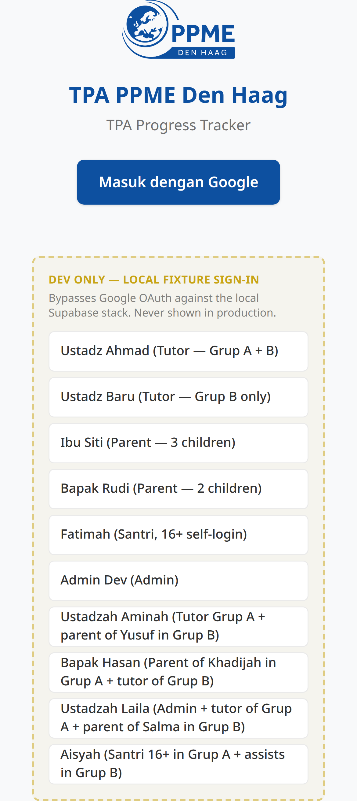

Layar pertama yang tampil sebelum masuk.

| Elemen | Fungsi |
|---|---|
| Logo & nama aplikasi | "TPA PPME Den Haag" — tampilan statis. |
| Tagline | "TPA Progress Tracker" |
| **Tombol "Masuk dengan Google"** | Memulai proses masuk melalui akun Google (Google OAuth). Ini satu-satunya cara masuk untuk pengguna sungguhan. |

Jika akun Google Anda belum terdaftar oleh admin TPA, setelah masuk Anda akan melihat layar **"Akun Anda belum terdaftar. Hubungi admin TPA."** dengan tombol **Keluar**. Hubungi admin untuk didaftarkan (lihat [§12.1](#121-pendaftaran)).

> Catatan: pada versi pengembangan (developer), muncul kotak tambahan "Dev only — local fixture sign-in" untuk menguji berbagai akun contoh tanpa Google. Kotak ini **tidak pernah muncul** di aplikasi produksi/nyata dan tidak relevan bagi pengguna sehari-hari.

---

## 3. Navigasi Umum

Setelah masuk, setiap layar memiliki bagian-bagian tetap berikut (tampak di hampir semua tangkapan layar pada panduan ini).

### Bilah Atas (Top Bar)
| Elemen | Fungsi |
|---|---|
| Logo | Tautan kembali ke Beranda. |
| 🔔 Ikon Lonceng | Hanya muncul untuk akun yang bisa menerima notifikasi (orang tua, atau santri 16+ dengan akun sendiri). Menampilkan angka jika ada notifikasi belum dibaca (maks. tampilan "9+"). Tekan untuk membuka [Pusat Notifikasi](#111-pusat-notifikasi). |
| 🌙/☀️ Ikon bulan/matahari | Beralih mode gelap/terang. |
| **ID** / **NL** | Mengganti bahasa antarmuka ke Indonesia atau Belanda. Pilihan tersimpan di perangkat. |
| **Keluar** | Keluar dari akun dan kembali ke layar masuk. |

### Bilah Bawah (Bottom Tab — hanya di ponsel)
Lima tab tetap, sama untuk semua peran termasuk admin:

**Hadir · Tugas · Yanbu'a · Al-Quran · Murajaah**

Menu **Rapor** dan **Kelola** (khusus admin) tidak ada di bilah bawah — keduanya diakses lewat ubin di Beranda, karena hanya ada ruang untuk lima tombol yang nyaman disentuh di layar ponsel.

### Saklar Tampilan (Scope Switch)
Muncul di atas konten, **hanya untuk akun dengan lebih dari satu hubungan** (misalnya ustadz yang juga orang tua), dan **hanya** pada enam layar berikut: Hadir, Tugas, Yanbu'a, Al-Quran, Murajaah, Rapor. Lihat [§13](#13-akun-dengan-peran-ganda) untuk detail lengkap.

---

## 4. Beranda

Layar pertama setelah masuk. Isinya berbeda sedikit tergantung peran.

### 4.1 Tampilan Ustadz

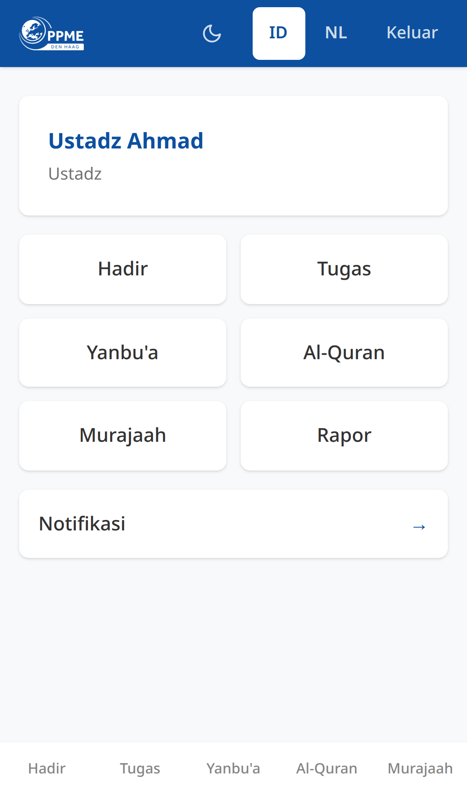

| Elemen | Fungsi |
|---|---|
| Kartu sapaan | Nama pengguna + daftar hubungan yang dimiliki (mis. "Ustadz", atau gabungan "Ustadz · Orang Tua" jika kedua-duanya). |
| Kartu **"Minggu ini"** *(hanya muncul untuk akun dengan anak/santri terkait — lihat §4.2)* | Tidak tampil untuk ustadz murni. |
| Ubin **Hadir / Tugas / Yanbu'a / Al-Quran / Murajaah / Rapor** | Tekan salah satu untuk membuka fitur terkait. |
| Baris **Notifikasi →** | Membuka halaman [Pengaturan Notifikasi](#112-pengaturan-notifikasi) — tersedia untuk semua peran, bukan hanya penerima notifikasi, karena semua orang berhak membaca apa isi sebuah notifikasi. |

### 4.2 Tampilan Keluarga (Orang Tua / Santri)

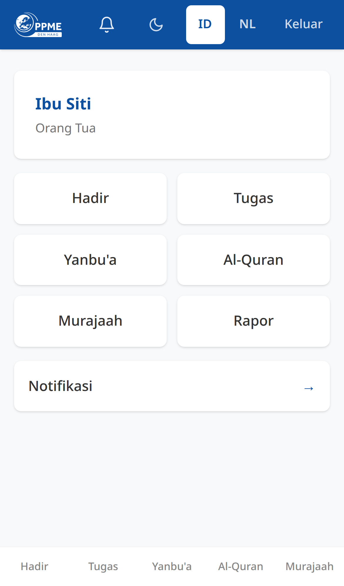

Sama seperti di atas, ditambah kartu **"Minggu ini"** yang merangkum aktivitas anak (atau diri sendiri, untuk santri 16+) sejak Senin sampai hari ini:

| Kolom di kartu "Minggu ini" | Isi |
|---|---|
| Kehadiran | Persentase kehadiran minggu ini, atau "—" jika belum ada catatan. |
| Yanbu'a | Jumlah sesi Yanbu'a yang dicatat minggu ini. |
| Al-Quran | Jumlah sesi tilawah minggu ini. |
| Murajaah | Jumlah konfirmasi murajaah minggu ini. |

Kartu ini otomatis **tersembunyi** jika tidak ada aktivitas sama sekali minggu itu — minggu yang sepi tidak ditampilkan sebagai kartu penuh angka nol. Jika anak memiliki lebih dari satu, setiap anak dengan aktivitas mendapat kartunya sendiri.

### 4.3 Tampilan Admin

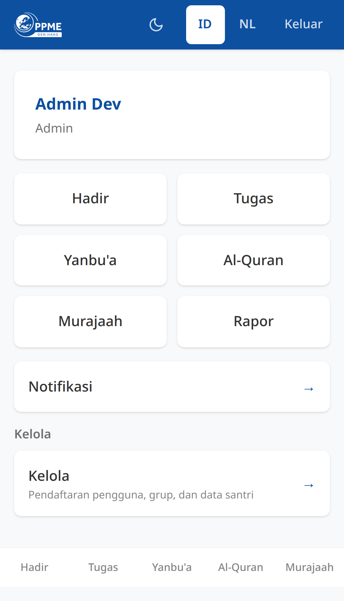

Sama seperti tampilan ustadz, ditambah bagian **"Kelola"** di bagian bawah — satu-satunya jalan masuk ke [halaman administrasi](#12-kelola-khusus-admin) (pendaftaran, grup, santri).

---

## 5. Kehadiran

### 5.1 Tampilan Ustadz — Mencatat Kehadiran

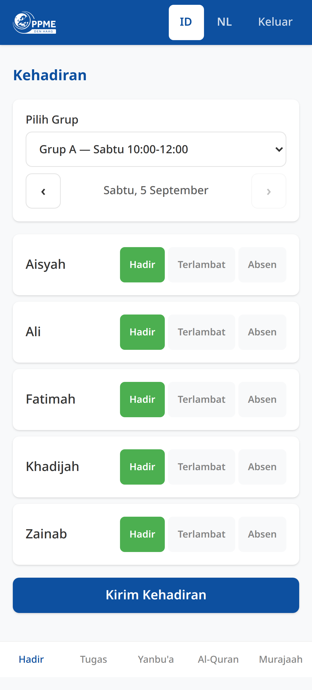

Layar untuk mencatat kehadiran hari ini per grup.

| Elemen | Fungsi |
|---|---|
| **Pilih Grup** | Muncul hanya jika ustadz mengampu lebih dari satu grup. Memilih grup memuat ulang daftar santri dan sesi hari ini. |
| Tanggal | Hari ini, ditampilkan otomatis (tidak bisa diubah — pencatatan selalu untuk sesi hari ini). |
| Baris santri + tombol **Hadir / Terlambat / Absen** | Tekan salah satu untuk menetapkan status santri tersebut. Warna hijau = status aktif yang tersimpan sementara di layar (belum terkirim ke server sampai ditekan **Kirim Kehadiran**). Status awal semua santri adalah "Hadir". |

Menekan **Absen** membuka kolom alasan tambahan:

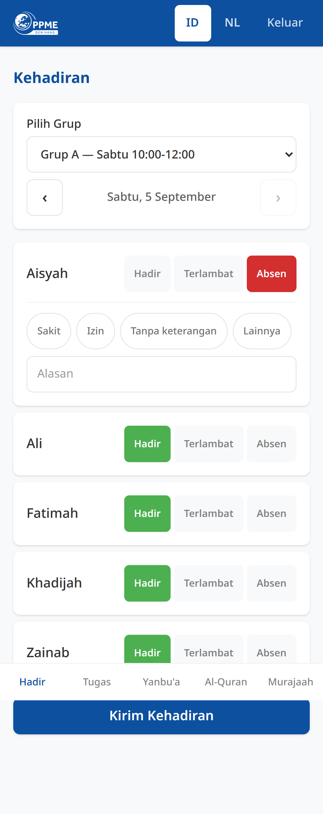

| Elemen | Fungsi |
|---|---|
| Chip **Sakit / Izin / Tanpa keterangan** | Tekan salah satu untuk langsung mengisi kolom alasan dengan teks tersebut. |
| Chip **Lainnya** | Mengosongkan kolom alasan agar Anda bisa mengetik alasan sendiri. |
| Kolom teks **Alasan** | Bisa diedit bebas, menimpa pilihan chip di atas. |

Di bagian bawah:

| Elemen | Fungsi |
|---|---|
| **Kirim Kehadiran** | Membuka kotak konfirmasi berisi jumlah santri yang akan dikirim (santri asisten yang menjadi bagian dari grup — lihat catatan di bawah — tidak dihitung). |
| **Konfirmasi** / **Batal** | Konfirmasi mengirim data ke server; Batal membatalkan tanpa mengirim apa pun. |

**Catatan khusus — santri asisten**: jika seorang santri berusia 16+ juga membantu mengajar di grup itu, namanya tetap muncul di daftar hadir dengan status yang sudah tersimpan (tanda "Hadir" default), tetapi baris itu **tidak bisa diubah olehnya sendiri** — hanya ustadz lain atau admin yang bisa mencatat kehadirannya. Keterangan ini muncul langsung di bawah namanya di layar.

**Status offline**: jika koneksi internet terputus saat mengirim, aplikasi menyimpan data itu di perangkat dan menampilkan pesan *"Anda sedang offline. Data akan dikirim saat kembali online."* — data akan otomatis terkirim begitu koneksi kembali, tanpa perlu mencatat ulang.

### 5.2 Tampilan Keluarga — Melihat Riwayat Kehadiran

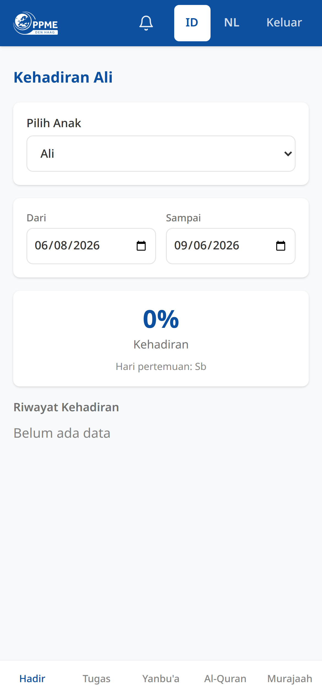

Layar ini **hanya untuk melihat** — orang tua dan santri tidak bisa mengubah data kehadiran.

| Elemen | Fungsi |
|---|---|
| **Pilih Anak** | Muncul hanya jika akun memiliki lebih dari satu anak terkait. |
| Judul | "Kehadiranku" (untuk santri yang melihat datanya sendiri) atau "Kehadiran {nama anak}". |
| Kolom **Dari** / **Sampai** | Rentang tanggal untuk memfilter riwayat (default: 90 hari terakhir sampai hari ini). |
| Angka persentase besar | Tingkat kehadiran pada rentang tanggal yang dipilih. |
| **Riwayat Kehadiran** | Daftar per tanggal dengan status **Hadir / Terlambat / Tidak Hadir**, dan alasan (jika ada) untuk yang tidak hadir. |

---

## 6. Tugas

### 6.1 Tampilan Ustadz — Membuat & Menilai Tugas

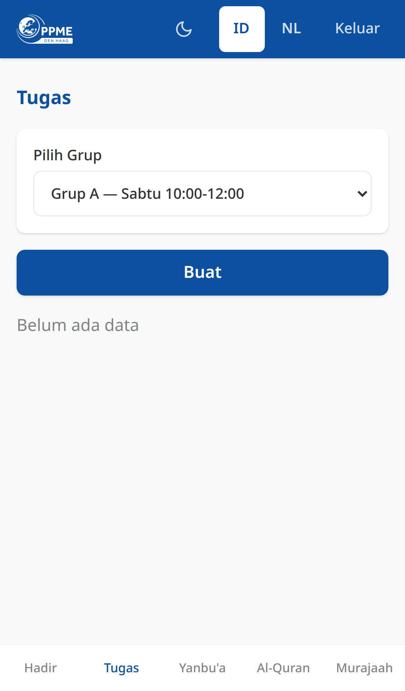

| Elemen | Fungsi |
|---|---|
| **Pilih Grup** | Sama seperti di Kehadiran. |
| **Buat** | Membuka formulir tugas baru. |
| Daftar tugas | Menampilkan judul dan tenggat waktu tiap tugas; tugas yang lewat tenggat mendapat label **"Lewat Tenggat"**. Tekan salah satu tugas untuk membuka layar penilaian. |

Formulir **Buat**:

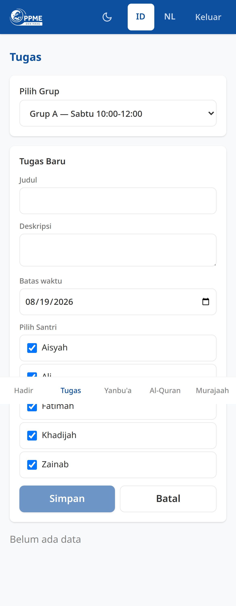

| Kolom | Fungsi |
|---|---|
| **Judul** | Wajib diisi, maksimal 200 karakter. |
| **Deskripsi** | Opsional, teks bebas. |
| **Batas waktu** | Wajib diisi, default hari ini. |
| **Pilih Santri** | Daftar centang santri di grup yang dipilih — **semua santri tercentang secara otomatis**; hilangkan centang untuk mengecualikan santri tertentu. |
| **Simpan** | Aktif hanya jika judul terisi, tanggal terisi, dan minimal satu santri dicentang. |
| **Batal** | Menutup formulir tanpa menyimpan. |

Layar penilaian (setelah menekan salah satu tugas dari daftar):

| Elemen | Fungsi |
|---|---|
| **← Kembali** | Kembali ke daftar tugas. |
| Judul, deskripsi, dan batas waktu tugas | Informasi tugas yang dipilih. |
| Baris santri + tombol **Menunggu / Selesai / Terlambat / Sebagian** | Menetapkan status pengumpulan tugas santri tersebut. Setiap kali ditekan, status **langsung tersimpan** ke server (tidak perlu tombol "Kirim" terpisah seperti di Kehadiran). |
| Kolom **Catatan** per santri | Catatan bebas dari ustadz untuk santri itu; tersimpan otomatis saat kolom kehilangan fokus (misalnya setelah Anda mengetik lalu menekan bagian lain layar). |

> Perhatian: label status "Terlambat" pada Tugas berarti **tugas dikumpulkan terlambat/tidak selesai**, berbeda dari "Terlambat" pada Kehadiran yang berarti **datang terlambat ke kelas** — kata yang sama, arti berbeda di dua layar berbeda.

### 6.2 Tampilan Keluarga — Melihat Tugas

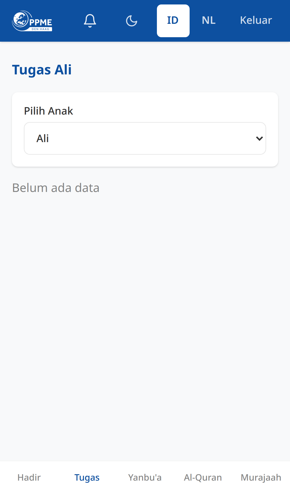

Hanya untuk melihat — status tugas hanya bisa diubah oleh ustadz.

| Elemen | Fungsi |
|---|---|
| **Pilih Anak** | Sama seperti di Kehadiran. |
| Baris jumlah tugas aktif | "{jumlah} tugas aktif" — menghitung tugas berstatus "Menunggu" atau yang sudah lewat tenggat. |
| Kartu tiap tugas | Judul, deskripsi, batas waktu, catatan dari ustadz (jika ada), dan lencana status: **Menunggu / Selesai / Terlambat / Sebagian / Lewat Tenggat**. |

---

## 7. Yanbu'a

Yanbu'a adalah metode belajar membaca Al-Qur'an bertahap (jilid 1–7 + halaman). Layar ini mencatat jilid, halaman, dan tingkat penguasaan bacaan santri.

### 7.1 Tampilan Ustadz — Mencatat Progres

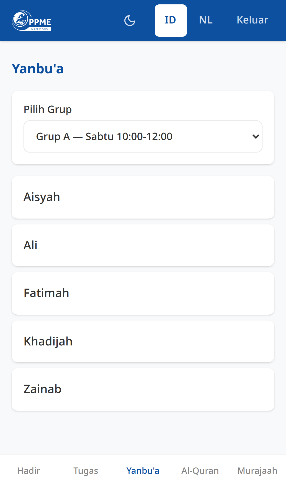

| Elemen | Fungsi |
|---|---|
| **Pilih Grup** | Sama seperti di layar lain. |
| Daftar santri | Tekan nama santri untuk membuka layar pencatatan. |

Layar pencatatan (setelah memilih santri):

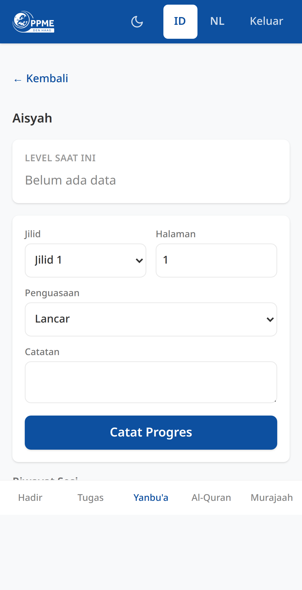

| Elemen | Fungsi |
|---|---|
| **← Kembali** | Kembali ke daftar santri. |
| Kartu **Level saat ini** | Menampilkan jilid, halaman, dan penguasaan terakhir yang tercatat untuk santri ini. |
| **Jilid** | Pilihan jilid 1–7. |
| **Halaman** | Nomor halaman dalam jilid tersebut. |
| **Penguasaan** | Lancar / Kurang Lancar / Ulang. |
| **Catatan** | Teks bebas, opsional. |
| **Catat Progres** | Menyimpan entri baru. Jika halaman yang dicatat adalah halaman terakhir jilid tersebut **dan** penguasaan "Lancar", muncul pesan perayaan **"Selesai Jilid {n}! 🎉"** dan formulir otomatis berpindah ke jilid berikutnya, halaman 1 — siap untuk sesi berikutnya. |
| **Riwayat Sesi** | Daftar semua entri sebelumnya untuk santri ini, dengan tanggal. |

**Status offline**: sama seperti Kehadiran — jika gagal terkirim karena jaringan, data disimpan di perangkat dan dikirim otomatis saat online kembali.

### 7.2 Tampilan Keluarga — Melihat Progres

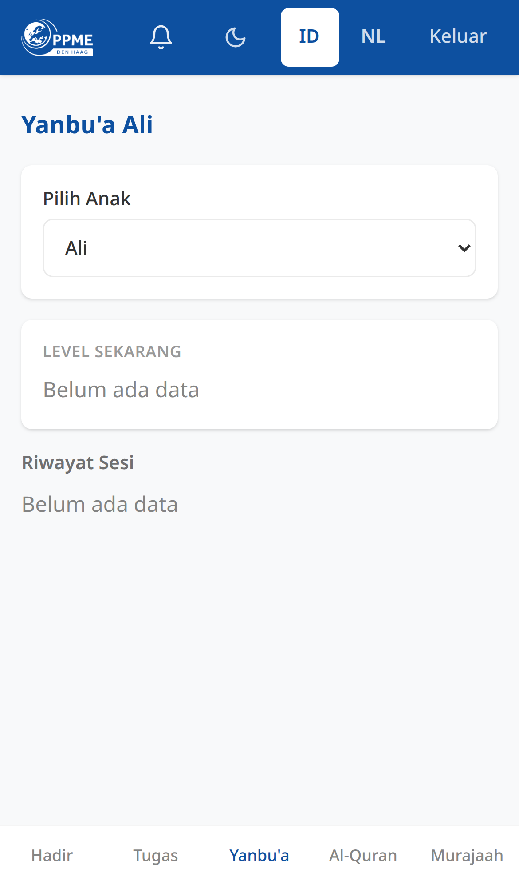

Hanya untuk melihat.

| Elemen | Fungsi |
|---|---|
| **Pilih Anak** | Sama seperti layar lain. |
| Kartu **Level sekarang** | Jilid, halaman, dan penguasaan terkini. |
| **Riwayat Sesi** | Sama seperti tampilan ustadz — daftar seluruh riwayat, tanpa kemampuan mengubah apa pun. |

---

## 8. Al-Quran

Mencatat posisi tilawah (bacaan) Al-Qur'an santri: surah, rentang ayat, dan kualitas bacaan.

### 8.1 Tampilan Ustadz — Mencatat Tilawah

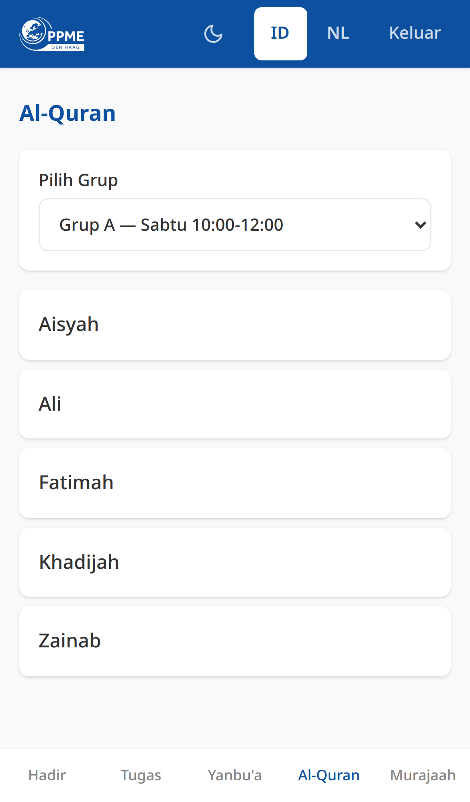

Struktur sama seperti Yanbu'a: **Pilih Grup** → daftar santri → tekan nama untuk mencatat.

Layar pencatatan:

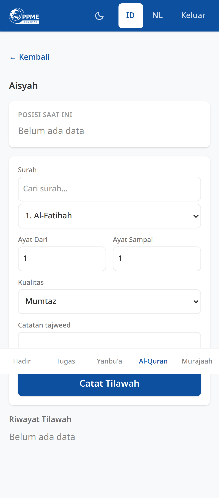

| Elemen | Fungsi |
|---|---|
| Kartu **Posisi saat ini** | Surah dan ayat terakhir yang tercatat, plus perkiraan persentase Al-Qur'an yang telah ditempuh santri (mis. "~12% Al-Quran"). |
| **Surah** | Kolom pencarian teks (ketik nama atau nomor surah untuk menyaring) + dropdown pilihan surah. |
| **Ayat Dari** / **Ayat Sampai** | Rentang ayat yang dibaca pada sesi ini. |
| **Kualitas** | Mumtaz / Jayyid Jiddan / Jayyid / Maqbul / Perlu Perbaikan (dari terbaik ke yang perlu perbaikan). |
| **Catatan tajweed** | Teks bebas, opsional. |
| **Catat Tilawah** | Menyimpan entri. Berbeda dari Yanbu'a, di sini **tidak ada** perayaan otomatis atau lompat-surah otomatis — kolom surah/ayat/kualitas tetap seperti sebelumnya untuk entri berikutnya. |
| **Riwayat Tilawah** | Daftar seluruh entri sebelumnya. |

**Status offline**: sama seperti Kehadiran/Yanbu'a.

### 8.2 Tampilan Keluarga — Melihat Tilawah

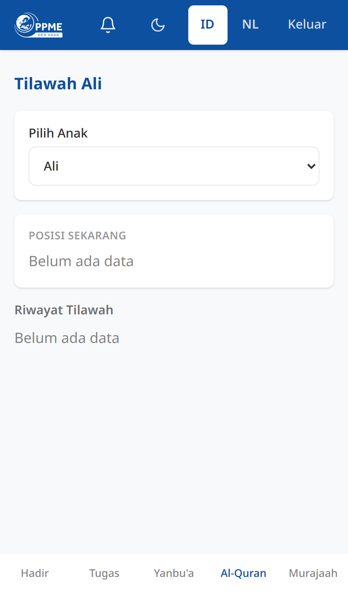

Hanya untuk melihat: kartu **Posisi sekarang** + **Riwayat Tilawah**, sama seperti Yanbu'a.

---

## 9. Murajaah

Murajaah adalah kegiatan mengulang hafalan Al-Qur'an secara rutin di rumah. Ustadz menetapkan target (surah + rentang ayat + frekuensi), lalu orang tua mengonfirmasi setiap kali dikerjakan di rumah.

Menu Murajaah untuk ustadz memiliki **dua tab**:

### 9.1 Tab "Tetapkan Target"

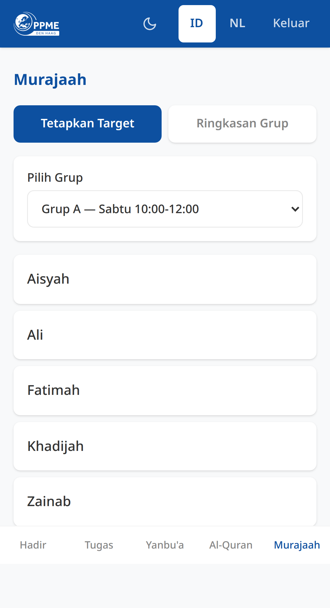

Sama seperti Yanbu'a/Al-Quran: **Pilih Grup** → daftar santri → tekan nama untuk membuka detail.

Di layar detail santri, Anda akan menemukan:

| Elemen | Fungsi |
|---|---|
| Daftar target aktif | Setiap target ditampilkan sebagai kartu: nama surah, rentang ayat, dan frekuensi (Setiap hari / 3x seminggu / Seminggu sekali). |
| **Tandai Sudah Hafal** (per kartu target) | Menandai target tersebut selesai dihafal — target berpindah ke bagian "Hafalan Selesai". |
| **Tetapkan Target Baru** | Membuka formulir target baru: pilih **Surah**, rentang **Ayat Dari/Sampai**, dan **Frekuensi**. Tombol **Simpan** aktif hanya jika rentang ayat valid. |
| **Hafalan Selesai** | Daftar target yang sudah ditandai selesai dihafal — tidak bisa diubah lagi dari sini. |
| **Riwayat Konfirmasi** | Daftar tanggal setiap kali murajaah dikonfirmasi oleh orang tua, beserta kualitasnya. |

### 9.2 Tab "Ringkasan Grup"

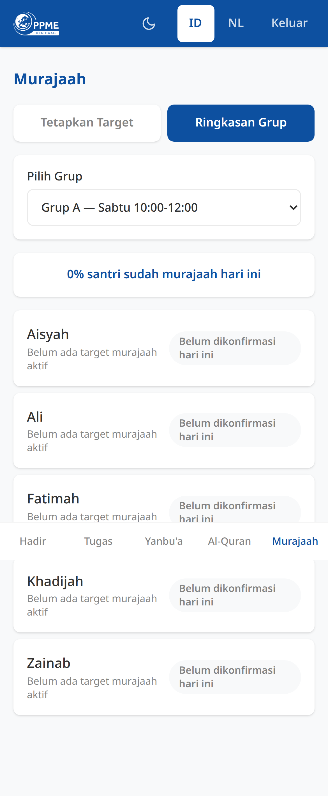

Layar ini **hanya untuk melihat** — ustadz tidak bisa mengonfirmasi murajaah untuk santri (hanya orang tua yang bisa).

| Elemen | Fungsi |
|---|---|
| Ringkasan persentase | "{persen}% santri sudah murajaah hari ini". |
| Baris per santri | Target aktif (jika ada), status **"✓ Selesai Murajaah"** atau **"Belum dikonfirmasi hari ini"**, dan jumlah hari terkonfirmasi minggu ini (mis. "3/7 minggu ini"). |

### 9.3 Tampilan Keluarga — Konfirmasi Murajaah

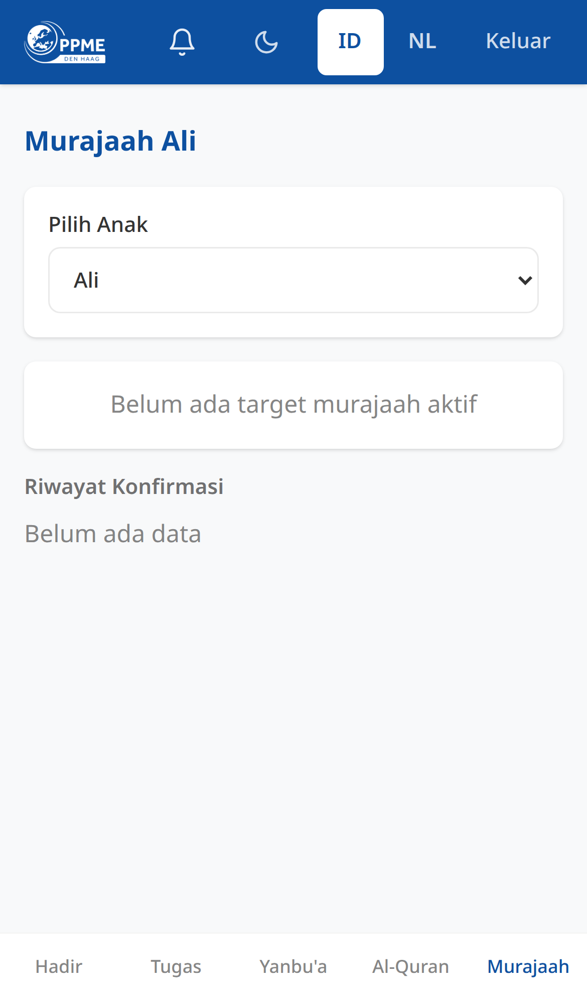

| Elemen | Fungsi |
|---|---|
| **Pilih Anak** | Sama seperti layar lain. |
| Kartu target aktif | Surah, rentang ayat, frekuensi, **jumlah hari/minggu berturut-turut (streak)**, dan rekor terbaik jika ada. |
| **Kualitas** (dropdown) | Hafal Lancar / Hafal Kurang Lancar / Belum Hafal — dipilih sebelum mengonfirmasi. |
| **✓ Selesai Murajaah** (tombol) | Mencatat bahwa murajaah hari ini sudah dilakukan. **Hanya muncul untuk orang tua** — jika Anda santri 16+ yang melihat data Anda sendiri, tombol ini tidak tersedia; hanya orang tua yang bisa mengonfirmasi murajaah, walaupun santri bisa melihat progresnya. |
| **Hafalan Selesai** & **Riwayat Konfirmasi** | Sama seperti tampilan ustadz. |

**Status offline**: jika konfirmasi gagal terkirim karena jaringan, tampil pesan *"Anda sedang offline..."* dan tercatat sementara di perangkat sampai bisa dikirim ulang otomatis.

---

## 10. Rapor

Rapor akhir tahun merangkum kehadiran, nilai per bidang (Yanbu'a, Al-Quran, Murajaah), dan catatan ustadz, lalu diterbitkan sebagai PDF yang bisa diunduh keluarga.

### 10.1 Tampilan Ustadz/Admin — Daftar Rapor

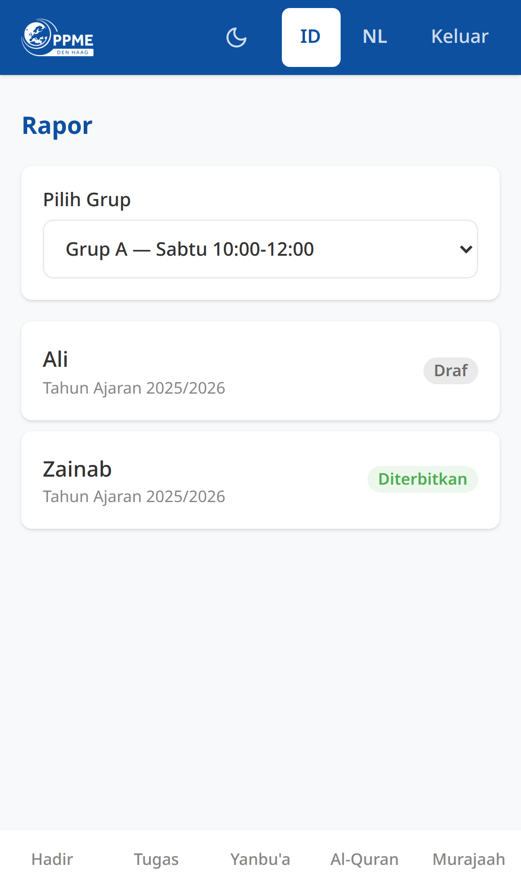

| Elemen | Fungsi |
|---|---|
| *(Khusus admin)* Panel **"Buat Draf Rapor"** | Admin bisa membuat draf rapor untuk seluruh grup atau satu grup tertentu, untuk satu tahun ajaran (format "2025/2026"). Setelah dibuat, panel menampilkan jumlah draf yang berhasil dibuat serta yang dilewati (karena sudah punya rapor, atau karena grupnya tidak punya ustadz pengampu). |
| **Pilih Grup** | Sama seperti layar lain. |
| Daftar rapor | Nama santri, tahun ajaran, dan lencana status **Draf** (abu-abu) atau **Diterbitkan** (hijau). Tekan salah satu untuk membuka. |

### 10.2 Editor Rapor

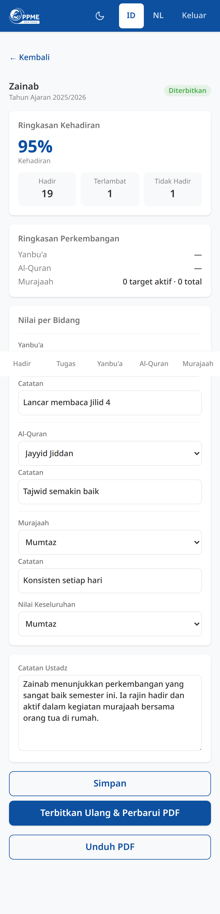

| Elemen | Fungsi |
|---|---|
| **← Kembali** | Kembali ke daftar. |
| **Ringkasan Kehadiran** | Angka persentase + jumlah Hadir/Terlambat/Tidak Hadir — **ini adalah cuplikan (snapshot)** dari saat draf dibuat, bukan data langsung, sehingga angkanya tetap sama meski catatan kehadiran diperbaiki setelahnya. |
| **Ringkasan Perkembangan** *(hanya untuk ustadz/admin, tidak muncul di tampilan keluarga)* | Posisi Yanbu'a, Al-Quran, dan jumlah target murajaah terkini — data langsung (bukan cuplikan), sebagai bahan referensi saat mengisi nilai. |
| **Nilai per Bidang**: Yanbu'a, Al-Quran, Murajaah | Masing-masing punya dropdown nilai (Mumtaz / Jayyid Jiddan / Jayyid / Maqbul / Perlu Bimbingan / "Belum dinilai") + kolom catatan singkat. |
| **Nilai Keseluruhan** | Dropdown nilai gabungan, tanpa kolom catatan. |
| **Catatan Ustadz** | Kolom teks panjang berisi narasi perkembangan santri — **wajib diisi sebelum rapor bisa diterbitkan**. |
| **Simpan** | Menyimpan perubahan tanpa menerbitkan — bisa dilakukan kapan saja, baik rapor masih draf maupun sudah diterbitkan. |
| **Terbitkan Rapor** / **Terbitkan Ulang & Perbarui PDF** | Hanya muncul untuk **ustadz penulis rapor** (bukan admin). Menampilkan kotak konfirmasi, lalu membuat berkas PDF dan mengubah status menjadi "Diterbitkan" — setelah itu orang tua dan santri bisa melihat & mengunduhnya. Nonaktif sampai kolom Catatan Ustadz terisi. |
| **Unduh PDF** | Muncul jika PDF sudah pernah dibuat. |

**Catatan untuk admin**: admin bisa mengubah nilai/catatan pada rapor apa pun, tetapi **tidak bisa menerbitkannya** — hanya ustadz penulis asli yang bisa menekan tombol terbit. Jika admin mengubah rapor yang sudah terbit, perubahan langsung tersimpan di aplikasi, tetapi berkas PDF baru menunggu sampai ustadz yang bersangkutan menerbitkan ulang.

### 10.3 Tampilan Keluarga — Melihat & Mengunduh Rapor

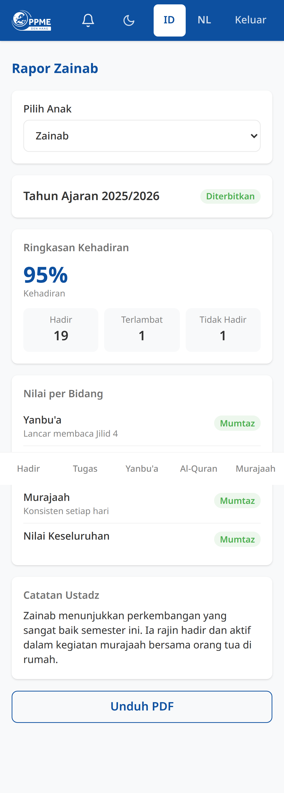

Keluarga **hanya bisa melihat rapor yang sudah diterbitkan** — rapor berstatus draf tidak akan pernah muncul di tampilan ini.

| Elemen | Fungsi |
|---|---|
| **Pilih Anak** | Sama seperti layar lain. |
| Ringkasan kehadiran, nilai per bidang, dan catatan ustadz | Sama seperti yang ditulis ustadz, hanya untuk dibaca. |
| **Unduh PDF** | Membuka berkas PDF rapor di tab baru. |

Jika belum ada rapor yang diterbitkan untuk anak tersebut, layar menampilkan pesan **"Belum ada rapor tersedia"**.

---

## 11. Notifikasi

### 11.1 Pusat Notifikasi

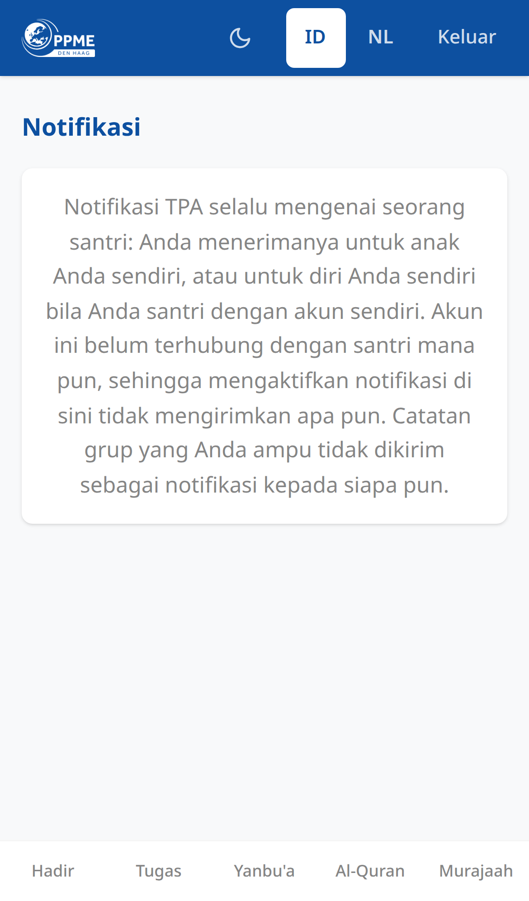

Dibuka lewat ikon lonceng di bilah atas. Hanya tersedia (berisi data) untuk akun yang berstatus penerima notifikasi (orang tua, atau santri 16+ dengan akun sendiri) — ustadz dan admin murni akan melihat pesan bahwa akun mereka belum terhubung ke santri manapun.

| Elemen | Fungsi |
|---|---|
| Daftar notifikasi | Setiap baris berupa satu peristiwa: santri tidak hadir, tugas baru, pengingat tenggat, jilid Yanbu'a selesai, surah baru dihafal, pengingat murajaah, rapor siap, atau ringkasan mingguan. Tekan salah satu untuk membuka layar terkait. |
| Membaca notifikasi | Semua notifikasi otomatis ditandai "sudah dibaca" begitu halaman ini dibuka — tidak ada tombol tersendiri untuk itu. |
| Tautan **Pengaturan notifikasi** | Membuka [§11.2](#112-pengaturan-notifikasi). |

### 11.2 Pengaturan Notifikasi

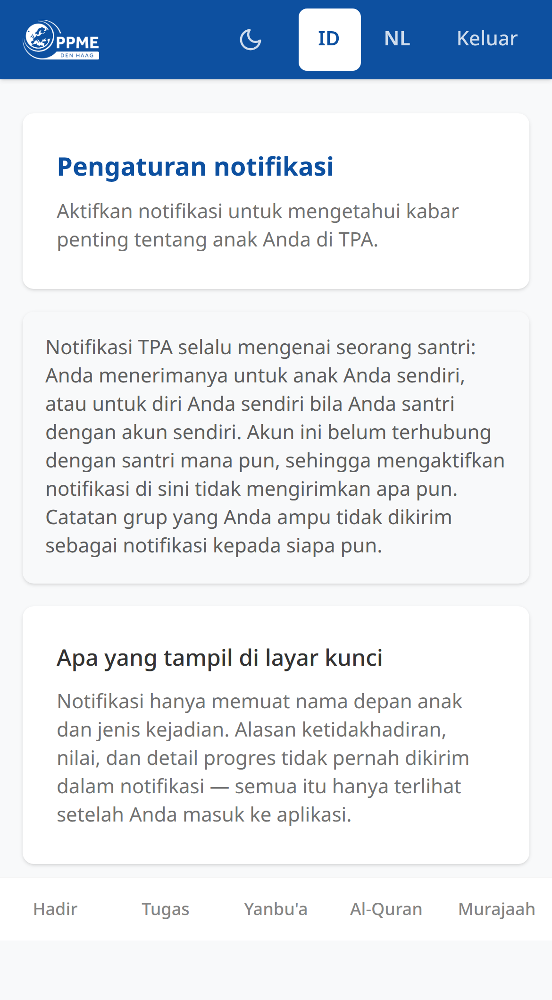

Diakses dari Beranda atau dari Pusat Notifikasi. Terbuka untuk **semua peran**, walau isinya berbeda:

| Elemen | Fungsi |
|---|---|
| Status notifikasi push saat ini | "Notifikasi aktif di perangkat ini" / "tidak aktif" / "aktif di perangkat lain" (satu akun hanya bisa menerima notifikasi di satu perangkat sekaligus). |
| **Aktifkan notifikasi** / **Matikan notifikasi** / **Pindahkan ke perangkat ini** | Tombol tunggal yang berubah label sesuai status di atas. |
| *(Khusus akun penerima notifikasi)* Daftar **"Yang akan Anda terima"** | Penjelasan singkat 4 jenis notifikasi yang akan dikirim: ketidakhadiran, tugas baru, capaian (jilid/surah selesai), dan rapor siap. |
| **"Apa yang tampil di layar kunci"** | Penjelasan privasi: notifikasi di layar kunci hanya memuat nama depan anak dan jenis peristiwa — **tidak pernah** memuat alasan ketidakhadiran, nilai, atau detail progres; semua itu baru terlihat setelah membuka aplikasi. |

Jika peramban memblokir izin notifikasi, layar menampilkan penjelasan untuk membuka pengaturan izin peramban secara manual.

---

## 12. Kelola (Khusus Admin)

Hanya bisa diakses oleh akun dengan peran Admin, lewat ubin **Kelola** di Beranda. Terdiri dari tiga sub-halaman dengan menu tab di bagian atas: **Pendaftaran · Grup · Santri**.

### 12.1 Pendaftaran

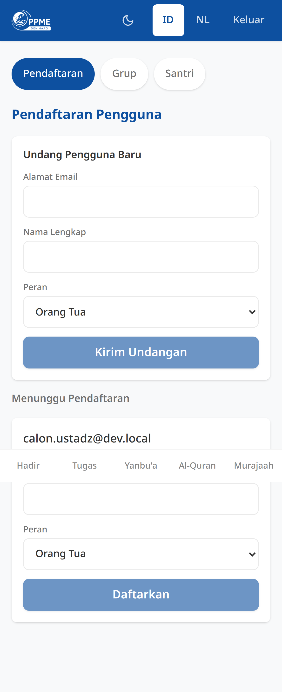

**Bagian "Undang Pengguna Baru"**

| Kolom | Fungsi |
|---|---|
| **Alamat Email** | Wajib diisi. |
| **Nama Lengkap** | Wajib diisi. |
| **Peran** | Orang Tua / Ustadz / Santri / Admin (default: Orang Tua). |
| **Kirim Undangan** | Membuat akun baru dan mengirim tautan undangan ke email tersebut. |

**Bagian "Menunggu Pendaftaran"** — daftar orang yang sudah pernah masuk lewat Google tetapi belum diberi profil/peran (misalnya karena diundang oleh orang lain, atau masuk sendiri sebelum didaftarkan admin):

| Kolom | Fungsi |
|---|---|
| Email & tanggal pertama masuk | Informasi otomatis, tidak bisa diubah. |
| **Nama Lengkap** | Diisi admin sebelum mendaftarkan. |
| **Peran** | Sama seperti di atas. |
| **Daftarkan** | Menyelesaikan pendaftaran orang tersebut — baris otomatis hilang dari daftar setelah berhasil. |

> Tidak ada tombol untuk menolak/menghapus pendaftaran yang menunggu — pilihannya hanya mendaftarkan atau membiarkannya menunggu.

### 12.2 Grup

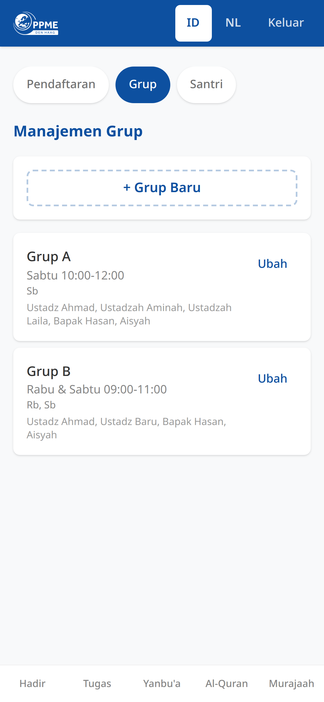

| Elemen | Fungsi |
|---|---|
| **+ Grup Baru** | Membuka formulir grup baru (lihat gambar di bawah). |
| Kartu tiap grup | Nama, jadwal, dan daftar ustadz pengampu. |
| **Ubah** | Membuka formulir edit untuk grup tersebut, terisi data yang sudah ada. |

Formulir Grup (sama untuk buat baru maupun ubah):

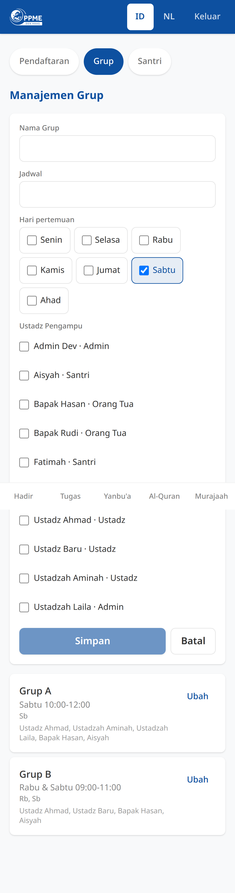

| Kolom | Fungsi |
|---|---|
| **Nama Grup** | Wajib diisi. |
| **Jadwal** | Opsional, teks bebas (mis. "Sabtu 10:00-12:00"). |
| **Ustadz Pengampu** | Daftar centang — bisa memilih lebih dari satu ustadz, atau tidak memilih sama sekali. |
| **Simpan** / **Batal** | Menyimpan atau membatalkan. |

> Tidak ada tombol hapus grup di aplikasi ini.

### 12.3 Santri

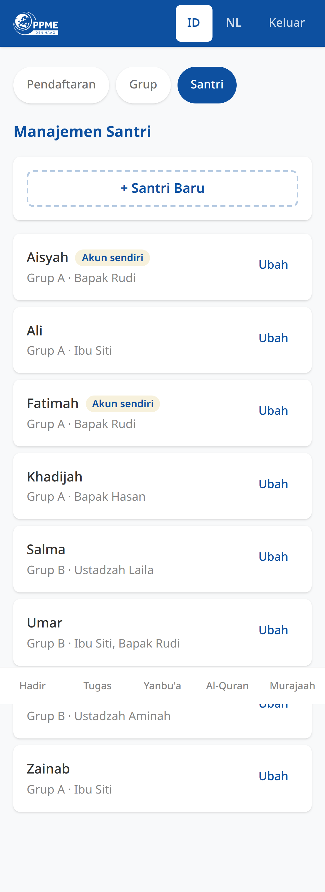

| Elemen | Fungsi |
|---|---|
| **+ Santri Baru** | Membuka formulir santri baru. |
| Kartu tiap santri | Nama, lencana **"Akun sendiri"** (jika santri punya login Google sendiri, misalnya santri 16+), grup, dan nama orang tua. |
| **Ubah** | Membuka formulir edit. |

Formulir Santri:

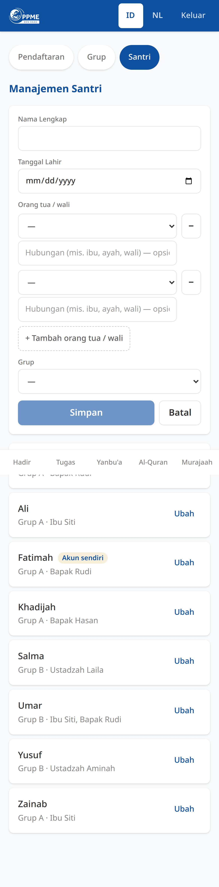

| Kolom | Fungsi |
|---|---|
| **Nama Lengkap** | Wajib diisi. |
| **Tanggal Lahir** | Wajib diisi. |
| **Orang Tua** | Wajib dipilih dari daftar pengguna terdaftar. |
| **Grup** | Opsional — bisa dikosongkan jika belum ditempatkan di grup. |
| **Tautkan Akun Login Mandiri** | Opsional — hanya muncul jika ada akun bertipe "santri" yang belum tertaut ke santri manapun. Ini cara untuk menghubungkan login Google milik santri (biasanya yang sudah 16+) ke data santri yang sudah ada, misalnya saat santri baru saja membuat akunnya sendiri. |
| **Simpan** / **Batal** | Menyimpan atau membatalkan. |

> Tidak ada tombol hapus santri di aplikasi ini.

---

## 13. Akun dengan Peran Ganda

Sebagian akun memegang lebih dari satu hubungan — misalnya seorang ustadz yang juga orang tua dari santri di grup lain (bukan grup yang ia ajar). Akun seperti ini melihat **saklar tampilan** di atas layar Kehadiran, Tugas, Yanbu'a, Al-Quran, Murajaah, dan Rapor:

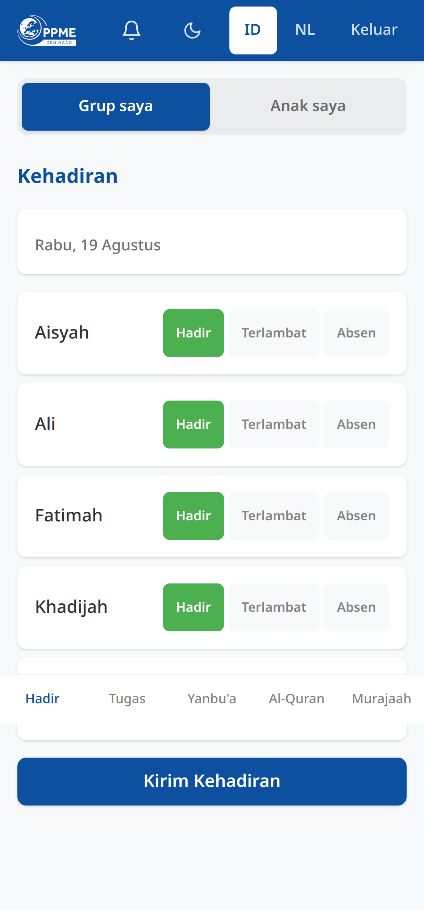

| Tombol | Fungsi |
|---|---|
| **Grup saya** | Menampilkan tampilan ustadz — grup yang diampu. |
| **Anak saya** *(atau "Saya" untuk santri 16+, atau "Keluarga saya" jika keduanya)* | Menampilkan tampilan keluarga — anak yang terkait dengan akun ini. |

Layar yang sedang dibuka **tidak berpindah** saat menekan saklar ini — hanya isinya yang berganti antara tampilan grup dan tampilan keluarga. Akun dengan satu hubungan saja (murni ustadz, murni orang tua, atau murni admin) tidak akan pernah melihat saklar ini sama sekali.

---

## 14. Elemen & Istilah Umum

Elemen berikut muncul berulang di banyak layar dan dijelaskan sekali di sini agar tidak diulang-ulang.

| Elemen | Kapan muncul | Fungsi |
|---|---|---|
| **Pilih Grup** | Layar ustadz manapun | Muncul hanya jika ustadz mengampu lebih dari satu grup. |
| **Pilih Anak** | Layar keluarga manapun | Muncul hanya jika akun memiliki lebih dari satu anak terkait. |
| *"Memuat…"* | Semua layar | Data sedang diambil dari server. |
| *"Belum ada data"* | Semua layar | Tidak ada data untuk ditampilkan pada kondisi saat ini. |
| *"Anda belum ditugaskan ke grup manapun"* | Layar ustadz | Akun ustadz belum diberi grup oleh admin. |
| *"Anda sedang offline. Data akan dikirim saat kembali online."* | Kehadiran, Yanbu'a, Al-Quran, Murajaah | Aksi Anda tersimpan di perangkat dan **akan otomatis terkirim** begitu koneksi internet kembali — tidak perlu mengulang. |
| Pesan galat (kotak merah) | Semua layar | Terjadi kesalahan saat memuat atau menyimpan data — coba lagi atau hubungi admin jika berulang. |

---

## 15. Lampiran: Istilah Indonesia ⟷ Belanda

Untuk memudahkan komunikasi dua bahasa di lingkungan TPA, berikut padanan istilah utama yang digunakan aplikasi:

| Indonesia | Belanda | Keterangan |
|---|---|---|
| Grup | Groep | Sebelumnya disebut "Kelas"/"Klas" — istilah resmi sekarang adalah "Grup"/"Groep". |
| Santri | Leerling | — |
| Ustadz / Ustadzah | Ustadz | Istilah "Ustadz" dipakai sama di kedua bahasa. |
| Orang Tua | Ouder | — |
| Hadir | Aanwezig | — |
| Tugas | Huiswerk | Sebelumnya disebut "Opdrachten" — istilah resmi sekarang adalah "Huiswerk" (PR/pekerjaan rumah). |
| Rapor | Rapport | — |
| Kelola | Beheer | Menu khusus admin. |
| Pendaftaran | Registraties | — |

---

*Dokumen ini dibuat berdasarkan tangkapan layar aplikasi versi Agustus 2026, tampilan ponsel (mobile). Tata letak dapat sedikit berbeda pada versi aplikasi yang lebih baru.*
