# Panduan Pengguna Aplikasi TPA PPME Den Haag

*Bahasa: **Indonesia** · [Nederlands](./manual-nl.md)*

Aplikasi TPA PPME Den Haag digunakan untuk mencatat dan memantau perkembangan santri di TPA (Taman Pendidikan Al-Qur'an) PPME Den Haag: kehadiran, tugas/huiswerk, bacaan Yanbu'a, tilawah Al-Qur'an, murajaah (hafalan ulang), dan rapor akhir tahun. Panduan ini menjelaskan setiap layar, kolom, dan tombol yang akan Anda temui, dengan tangkapan layar dari tampilan ponsel (mobile).

## Daftar Isi

1. [Peran Pengguna](#1-peran-pengguna)
2. [Masuk ke Aplikasi](#2-masuk-ke-aplikasi)
3. [Navigasi Umum](#3-navigasi-umum)
4. [Beranda](#4-beranda)
5. [Kehadiran](#5-kehadiran)
6. [Tugas](#6-tugas)
7. [Yanbu'a](#7-yanbua)
8. [Al-Quran](#8-al-quran)
9. [Murajaah](#9-murajaah)
10. [Rapor](#10-rapor)
11. [Pengumuman & Materi](#11-pengumuman--materi)
12. [Notifikasi](#12-notifikasi)
13. [Kelola (Khusus Admin)](#13-kelola-khusus-admin)
14. [Akun dengan Peran Ganda](#14-akun-dengan-peran-ganda)
15. [Elemen & Istilah Umum](#15-elemen--istilah-umum)
16. [Lampiran: Istilah Indonesia ⟷ Belanda](#16-lampiran-istilah-indonesia--belanda)

---

## 1. Peran Pengguna

Aplikasi ini melayani empat jenis hubungan (bukan sekadar satu "peran" tetap per akun):

| Peran | Bisa apa |
|---|---|
| **Guru** (tutor) | Mencatat kehadiran, tugas, Yanbu'a, Al-Quran, dan menetapkan target murajaah untuk grup yang diampu; menulis dan menerbitkan rapor. |
| **Orang Tua** | Melihat riwayat kehadiran, tugas, Yanbu'a, Al-Quran, dan rapor anaknya; mengonfirmasi murajaah harian di rumah. |
| **Santri** (16+ dengan akun sendiri) | Melihat riwayat miliknya sendiri, seperti orang tua, tetapi **tidak bisa** mengonfirmasi murajaah untuk dirinya sendiri — itu tetap tugas orang tua. |
| **Admin** | Mengelola pendaftaran pengguna, grup, dan data santri; memiliki akses baca/tulis penuh yang setara guru di semua grup; membuat draf rapor massal — tetapi **tidak bisa menerbitkan** rapor. |

Satu akun bisa memegang **lebih dari satu** hubungan sekaligus — misalnya seorang guru yang juga orang tua dari santri di grup lain. Akun seperti ini mendapat **saklar tampilan (scope switch)** untuk berpindah antara "Grup saya" (tampilan guru) dan "Anak saya" (tampilan orang tua) — lihat [§14](#14-akun-dengan-peran-ganda).

---

## 2. Masuk ke Aplikasi

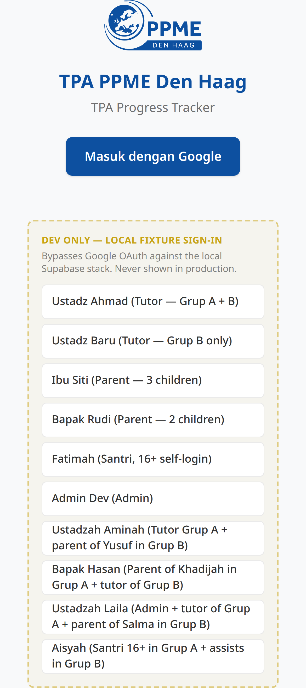

Layar pertama yang tampil sebelum masuk.

| Elemen | Fungsi |
|---|---|
| Logo & nama aplikasi | "TPA PPME Den Haag" — tampilan statis. |
| Tagline | "TPA Progress Tracker" |
| **Tombol "Masuk dengan Google"** | Memulai proses masuk melalui akun Google (Google OAuth). Ini satu-satunya cara masuk untuk pengguna sungguhan. |

> **Keluarga baru** didaftarkan lewat Google Formulir pendaftaran ulang tahunan ("Daftar Ulang"). Di sana Anda mengisi nama dan tanggal lahir setiap anak, serta nama dan alamat email Anda sendiri (Anda harus login ke Google). Ada kotak centang kebijakan privasi yang opsional — boleh dicentang, tetapi pendaftaran tetap berjalan tanpa itu. Tidak lama kemudian Anda menerima **email undangan**; jika Anda kemudian masuk dengan akun Google yang sama, akun Anda sudah siap dan Anda langsung masuk ke aplikasi. Jika Anda tidak sengaja mengirim formulir lagi untuk anak yang sama, tidak ada yang berubah — data yang ada hanya diperbarui. Admin kemudian menempatkan anak Anda ke sebuah grup. Jika pada formulir Anda juga mengisi **alamat email anak Anda**, anak akan menerima undangan sendiri untuk masuk dan melihat datanya sendiri saja (berhasil atau tidak tergantung batas usia Google).

Jika akun Google Anda belum terdaftar oleh admin TPA (misalnya karena Anda login tanpa mengisi formulir pendaftaran), setelah masuk Anda akan melihat layar **"Akun Anda belum terdaftar. Hubungi admin TPA."** dengan sebuah formulir singkat di bawahnya dan tombol **Keluar**.

**Formulir "Minta akses"** — isi agar admin dapat mendaftarkan Anda lebih cepat dan dengan peran yang tepat:

| Bidang | Fungsi |
|---|---|
| **Nama lengkap** | Wajib. Sudah terisi dengan nama dari akun Google Anda; dapat Anda ubah. |
| **Keterangan** | Opsional. Teks bebas: siapa Anda, untuk anak yang mana, mengapa Anda memerlukan akses. |
| **Kirim permintaan** | Mengirim data ke admin. Tombol nonaktif selama bidang nama masih kosong. |

Setelah dikirim, teks di atas berubah menjadi **"Permintaan Anda telah diterima. Admin akan meninjaunya sesegera mungkin."** Anda tetap di layar ini — permintaan itu sendiri tidak memberi akses. Anda dapat membuka formulir lagi dan memperbaiki data Anda selama admin belum mendaftarkan Anda. Begitu itu terjadi, saat memuat berikutnya Anda otomatis masuk ke aplikasi. Admin juga dapat **menolak** permintaan (lihat [§13.1](#131-pendaftaran)); setelah itu Anda tetap bisa masuk lagi dan mengajukan permintaan baru.

> Catatan: pada versi pengembangan (developer), muncul kotak tambahan "Dev only — local fixture sign-in" untuk menguji berbagai akun contoh tanpa Google. Kotak ini **tidak pernah muncul** di aplikasi produksi/nyata dan tidak relevan bagi pengguna sehari-hari.

---

## 3. Navigasi Umum

Setelah masuk, setiap layar memiliki bagian-bagian tetap berikut (tampak di hampir semua tangkapan layar pada panduan ini).

### Bilah Atas (Top Bar)
| Elemen | Fungsi |
|---|---|
| Logo | Tautan kembali ke Beranda. |
| 🔔 Ikon Lonceng | Hanya muncul untuk akun yang bisa menerima notifikasi (orang tua, atau santri 16+ dengan akun sendiri). Menampilkan angka jika ada notifikasi belum dibaca (maks. tampilan "9+"). Tekan untuk membuka [Pusat Notifikasi](#121-pusat-notifikasi). |
| 🌙/☀️ Ikon bulan/matahari | Beralih mode gelap/terang. |
| **ID** / **NL** | Mengganti bahasa antarmuka ke Indonesia atau Belanda. Pilihan tersimpan di perangkat. |
| **Keluar** | Keluar dari akun dan kembali ke layar masuk. |

### Bilah Bawah (Bottom Tab — hanya di ponsel)
Lima tab tetap, sama untuk semua peran termasuk admin:

**Hadir · Tugas · Yanbu'a · Al-Quran · Murajaah**

Menu **Rapor** dan **Kelola** (khusus admin) tidak ada di bilah bawah — keduanya diakses lewat ubin di Beranda, karena hanya ada ruang untuk lima tombol yang nyaman disentuh di layar ponsel.

### Saklar Tampilan (Scope Switch)
Muncul di atas konten, **hanya untuk akun dengan lebih dari satu hubungan** (misalnya guru yang juga orang tua), dan **hanya** pada enam layar berikut: Hadir, Tugas, Yanbu'a, Al-Quran, Murajaah, Rapor. Bentuknya sama dengan saklar **Santri | Guru** admin: saklar tampilan selalu di atas judul layar, saklar Santri | Guru di bawahnya. Lihat [§14](#14-akun-dengan-peran-ganda) untuk detail lengkap.

---

## 4. Beranda

Layar pertama setelah masuk. Isinya berbeda sedikit tergantung peran.

### 4.1 Tampilan Guru

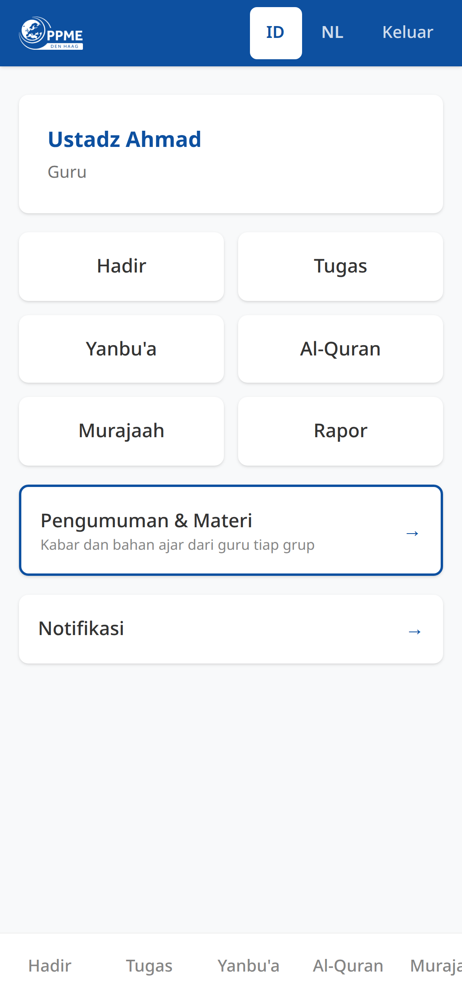

| Elemen | Fungsi |
|---|---|
| Kartu sapaan | Nama pengguna + daftar hubungan yang dimiliki (mis. "Guru", atau gabungan "Guru · Orang Tua" jika kedua-duanya). |
| Kartu **"Minggu ini"** *(hanya muncul untuk akun dengan anak/santri terkait — lihat §4.2)* | Tidak tampil untuk guru murni. |
| Ubin **Hadir / Tugas / Yanbu'a / Al-Quran / Murajaah / Rapor** | Tekan salah satu untuk membuka fitur terkait. |
| Ubin **Pengumuman & Materi →** | Membuka pengumuman dan materi grup-grup (lihat [§11](#11-pengumuman--materi)). |
| Baris **Notifikasi →** | Membuka halaman [Pengaturan Notifikasi](#122-pengaturan-notifikasi) — tersedia untuk semua peran, bukan hanya penerima notifikasi, karena semua orang berhak membaca apa isi sebuah notifikasi. |

### 4.2 Tampilan Keluarga (Orang Tua / Santri)

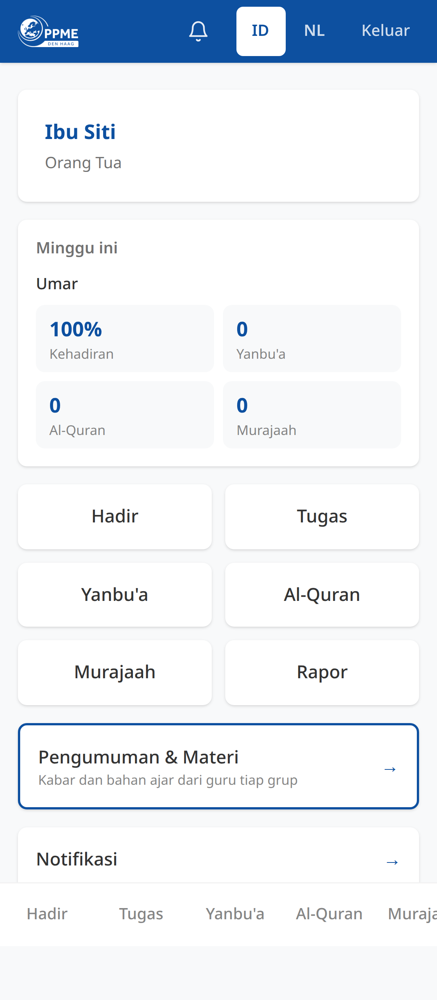

Sama seperti di atas, ditambah kartu **"Minggu ini"** yang merangkum aktivitas anak (atau diri sendiri, untuk santri 16+) sejak Senin sampai hari ini:

| Kolom di kartu "Minggu ini" | Isi |
|---|---|
| Kehadiran | Persentase kehadiran minggu ini, atau "—" jika belum ada catatan. |
| Yanbu'a | Jumlah sesi Yanbu'a yang dicatat minggu ini. |
| Al-Quran | Jumlah sesi tilawah minggu ini. |
| Murajaah | Jumlah konfirmasi murajaah minggu ini. |

Kartu ini otomatis **tersembunyi** jika tidak ada aktivitas sama sekali minggu itu — minggu yang sepi tidak ditampilkan sebagai kartu penuh angka nol. Jika anak memiliki lebih dari satu, setiap anak dengan aktivitas mendapat kartunya sendiri.

### 4.3 Tampilan Admin

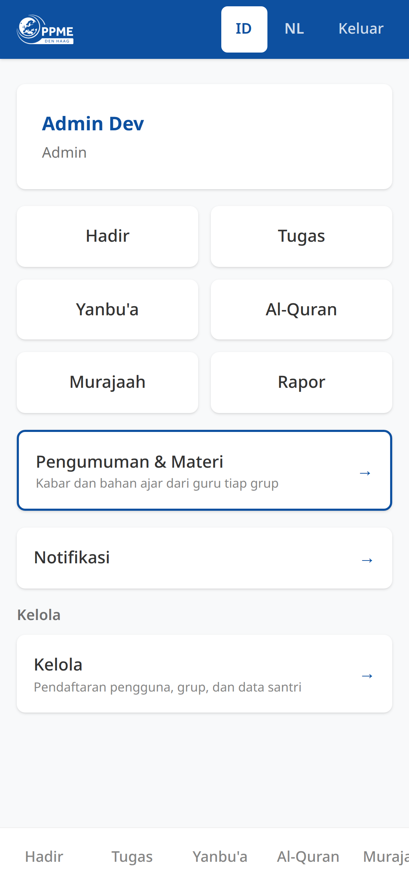

Sama seperti tampilan guru, ditambah bagian **"Kelola"** di bagian bawah — satu-satunya jalan masuk ke [halaman administrasi](#13-kelola-khusus-admin) (pendaftaran, grup, santri).

---

## 5. Kehadiran

### 5.1 Tampilan Guru — Mencatat Kehadiran

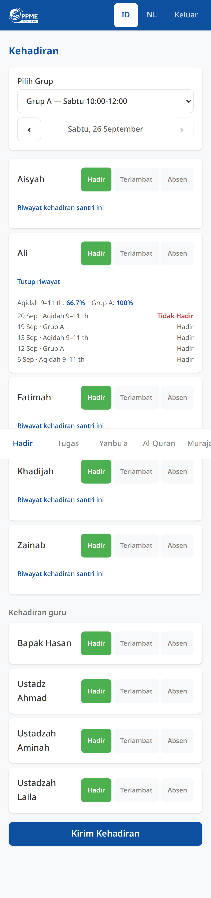

Layar untuk mencatat kehadiran per grup. Layar terbuka pada sesi terkini
grup — hari ini jika grup bertemu hari ini, jika tidak maka hari
pertemuan terakhir sebelumnya. Hari pertemuan sebuah grup diatur oleh
admin pada grup tersebut (lihat [§13.2](#132-grup) → Hari pertemuan).

| Elemen | Fungsi |
|---|---|
| **Pilih Grup** | Muncul hanya jika guru mengampu lebih dari satu grup. Memilih grup memuat ulang daftar santri dan sesinya. Grup yang diarsipkan tidak muncul di sini. Seorang santri bisa ikut lebih dari satu grup (mis. grup Yanbu'a/Al-Quran dan grup Aqidah); ia muncul di daftar hadir setiap grup, dan kehadirannya dicatat terpisah di tiap grup. |
| **Kehadiran santri** | Kartu di bawah pemilih grup: persentase kehadiran santri pada **pertemuan terakhir yang sudah dicatat**, "x dari y hadir" dengan tanggalnya, dan garis kecil 8 pertemuan terakhir (terbaru di kanan). Tekan kartu untuk melihat daftar 8 pertemuan itu beserta rata-ratanya; tekan lagi untuk menutup. Terlambat dihitung hadir. Pertemuan yang belum dicatat tidak dihitung. Setelah Anda mengirim kehadiran, angkanya langsung diperbarui. Kartu ini hanya tentang santri — tidak pernah memuat kehadiran guru. |
| Baris tanggal dengan **‹** / **›** | Menampilkan tanggal sesi yang sedang dibuka (hari, tanggal, dan bulan; tahun ikut ditampilkan bila sesi bukan pada tahun kalender berjalan). Panah memindahkan sesi mengikuti hari pertemuan grup: **‹** mundur sampai 1 Agustus tahun ajaran berjalan, **›** maju sampai sesi terkini (tidak bisa lebih maju dari itu). Jika di bawah tanggal tertulis **belum diisi**, kehadiran untuk hari pertemuan itu belum dicatat — Anda masih bisa mencatatnya; sesinya dibuat saat Anda mengirim. Sesi yang sudah dicatat selalu bisa dikoreksi, termasuk yang tanggalnya bukan hari pertemuan. |
| Baris santri + tombol **Hadir / Terlambat / Absen** | Tekan salah satu untuk menetapkan status santri tersebut. Warna hijau = status aktif yang tersimpan sementara di layar (belum terkirim ke server sampai ditekan **Kirim Kehadiran**). Status awal semua santri adalah "Hadir". |
| **Riwayat kehadiran santri ini** | Membuka, di bawah baris itu, kehadiran santri tersebut di **semua grupnya**: persentase per grup dan sepuluh sesi terakhir beserta tanggal dan grup. Untuk ketidakhadiran di grup **lain** hanya tampil "Tidak Hadir", **tanpa alasan** — alasan itu hanya untuk guru grup tersebut. |

Menekan **Absen** membuka kolom alasan tambahan:

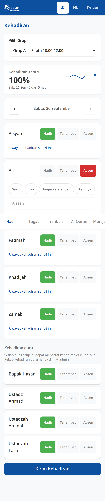

| Elemen | Fungsi |
|---|---|
| Chip **Sakit / Izin / Tanpa keterangan** | Tekan salah satu untuk langsung mengisi kolom alasan dengan teks tersebut. |
| Chip **Lainnya** | Mengosongkan kolom alasan agar Anda bisa mengetik alasan sendiri. |
| Kolom teks **Alasan** | Bisa diedit bebas, menimpa pilihan chip di atas. |

Di bagian bawah:

| Elemen | Fungsi |
|---|---|
| **Kirim Kehadiran** | Membuka kotak konfirmasi. Kotak itu menyebut jumlah santri yang akan dikirim (santri asisten yang menjadi bagian dari grup — lihat catatan di bawah — tidak dihitung) dan, pada baris terpisah, jumlah guru (lihat **Kehadiran guru** di bawah). |
| **Konfirmasi** / **Batal** | Konfirmasi mengirim data ke server; Batal membatalkan tanpa mengirim apa pun. |

**Catatan khusus — santri asisten**: jika seorang santri berusia 16+ juga membantu mengajar di grup itu, namanya tetap muncul di daftar hadir dengan status yang sudah tersimpan (tanda "Hadir" default), tetapi baris itu **tidak bisa diubah olehnya sendiri** — hanya guru lain atau admin yang bisa mencatat kehadirannya. Keterangan ini muncul langsung di bawah namanya di layar. Namanya **tidak** muncul lagi di bagian "Kehadiran guru": kehadirannya cukup dicatat sekali, sebagai santri.

**Kehadiran guru**: di bawah daftar santri ada bagian **"Kehadiran guru"** yang memuat setiap guru grup itu dengan tombol **Hadir / Terlambat / Absen** yang sama (dan kolom alasan yang sama saat Absen). Bagian ini dikirim bersama daftar santri saat Anda menekan **Kirim Kehadiran**. Seorang guru boleh mencatat kehadirannya sendiri maupun rekan segrupnya. Jika grup belum punya guru terdaftar, muncul keterangan untuk menetapkannya lewat menu **Kelola**. Di bawah judul bagian ini tertulis: *"Setiap guru grup ini dapat mencatat kehadiran guru grup ini. Rekap kehadiran guru hanya dilihat admin."* Status per pertemuan terlihat oleh guru grup itu di daftar hadir (agar bisa dilengkapi dan dikoreksi), tetapi **rekap dan persentase kehadiran guru hanya untuk admin**, di **Kehadiran › Guru** ([§5.3](#53-tampilan-admin--santri--guru)). Orang tua dan santri tidak pernah melihat kehadiran guru.

**Status offline**: jika koneksi internet terputus saat mengirim, aplikasi menyimpan data itu di perangkat dan menampilkan pesan *"Anda sedang offline. Data akan dikirim saat kembali online."* — data akan otomatis terkirim begitu koneksi kembali, tanpa perlu mencatat ulang.

### 5.2 Tampilan Keluarga — Melihat Riwayat Kehadiran

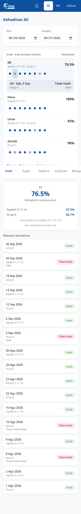

Layar ini **hanya untuk melihat** — orang tua dan santri tidak bisa mengubah data kehadiran.

| Elemen | Fungsi |
|---|---|
| Judul | "Kehadiranku" (untuk santri yang melihat datanya sendiri) atau "Kehadiran {nama anak}". |
| Kolom **Dari** / **Sampai** | Rentang tanggal untuk memfilter kartu anak, persentase dan riwayat (default: 90 hari terakhir sampai hari ini). |
| Kartu **Anak · 8 pertemuan terakhir** | **Semua anak dalam satu kartu** — menggantikan pemilih anak. Satu baris per anak: nama dan grupnya, 8 pertemuan terakhir yang tercatat dalam rentang tanggal sebagai tanda (● hadir, ○ terlambat, ✕ tidak hadir; terbaru di kanan), dan persentase kehadiran — angka yang sama dengan kartu persentase di bawah. **Tekan nama** anak untuk menampilkan persentase dan riwayat anak itu di bawah. **Tekan sebuah tanda** untuk melihat tanggal, grup, status dan (jika tidak hadir) alasannya. Dengan satu anak, kartu ini berisi satu baris. |
| Angka persentase besar | Tingkat kehadiran pada rentang tanggal yang dipilih. Jika anak ikut lebih dari satu grup, angka ini disebut **Kehadiran keseluruhan** dan di bawahnya tampil persentase **per grup** — sehingga terlihat bila anak rajin di satu grup tetapi tidak di grup lainnya. |
| **Hari pertemuan** | Baris hanya-baca di bawah persentase berisi hari dalam seminggu saat grup anak bertemu (mis. "Hari pertemuan: Sab"); untuk beberapa grup, satu baris per grup ("Hari pertemuan Aqidah 9–11 th: Ahad"). Tidak muncul jika anak belum masuk grup. |
| **Riwayat Kehadiran** | Daftar per tanggal dengan status **Hadir / Terlambat / Tidak Hadir**, dan alasan (jika ada) untuk yang tidak hadir. Untuk beberapa grup, nama grup tampil di bawah tanggal. |

**Santri 16+ dengan akun sendiri** tidak melihat kartu anak. Delapan tanda pertemuan terakhirnya ada **di dalam kartu persentase**, dengan keterangan yang sama:

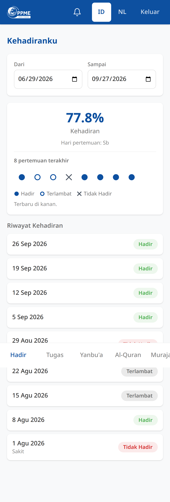

### 5.3 Tampilan Admin — Santri | Guru

Admin melihat saklar **Santri | Guru** di bawah judul Kehadiran. Saklar ini hanya untuk admin; guru tidak pernah melihatnya.

- **Santri** adalah daftar hadir persis seperti milik guru ([§5.1](#51-tampilan-guru--mencatat-kehadiran)), untuk grup mana pun — termasuk kartu **Kehadiran santri** dan bagian **Kehadiran guru**. Admin yang menggantikan guru mencatat santri dan guru di satu tempat. Jika admin juga mengajar, grup yang ia ajar tampil paling atas di **Pilih Grup** (di bawah "Grup yang Anda ajar", sisanya di bawah "Grup lain") dan layar terbuka pada grup itu. Di bagian Kehadiran guru ada tombol **Buka rekap guru** yang langsung ke tab Guru.
- **Guru** adalah rekap kehadiran semua guru. Layar ini **hanya untuk melihat** — setiap guru mencatat kehadiran guru grupnya sendiri di daftar hadir.

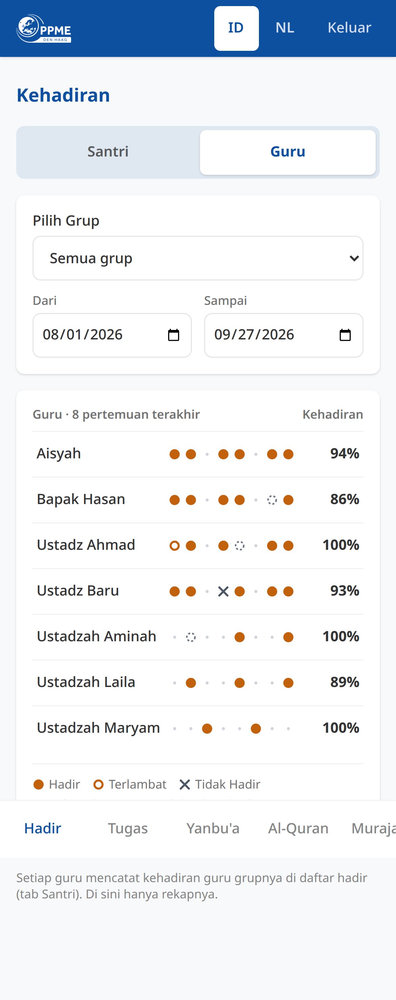

| Elemen | Fungsi |
|---|---|
| **Pilih Grup** | **Semua grup** (standar) atau satu grup. Grup yang diarsipkan hanya muncul jika bertemu dalam rentang tanggal. |
| **Dari** / **Sampai** | Rentang tanggal. Standar: 1 Agustus tahun ajaran berjalan sampai hari ini. |
| Baris per guru | Nama, **8 pertemuan terakhir** sebagai tanda, dan persentase kehadiran pada rentang terpilih. Kolom tanda sama untuk semua guru: satu kolom = satu hari pertemuan. |
| Tanda | ● **Hadir** · ○ **Terlambat** · ✕ **Tidak hadir** · ◌ (lingkaran putus-putus) **Belum dicatat** — grup yang ia ajar bertemu, tetapi kehadirannya tidak diisi · • (titik kecil abu-abu) **Tidak ada jadwal** — tidak ada grupnya yang bertemu hari itu. |
| Persentase | Terlambat dihitung hadir; hanya Tidak hadir yang mengurangi. "Belum dicatat" tidak dihitung. Guru yang belum pernah dicatat dalam rentang itu menampilkan **Belum ada**. |

"Belum dicatat" dan "Tidak ada jadwal" dihitung dari grup yang **saat ini** diajar guru tersebut. Guru yang pindah grup di tengah tahun menampilkan "Tidak ada jadwal" untuk pekan di grup lamanya yang tidak pernah dicatat; catatan yang ada selalu tampil.

Tekan baris seorang guru untuk rinciannya:

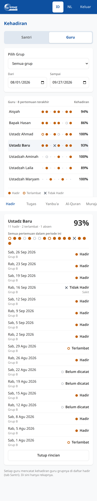

| Elemen | Fungsi |
|---|---|
| Kartu guru | Persentase dan rincian **{n} hadir · {n} terlambat · {n} absen**. |
| **Semua pertemuan dalam periode ini** | Semua pertemuan guru itu dalam rentang tanggal sebagai tanda, yang terlama di kiri. |
| Daftar | Per pertemuan: tanggal, grup, status (atau **Belum dicatat**), dan alasan jika tidak hadir. Untuk mengoreksi, buka daftar hadir grup itu di tab Santri. |
| **Tutup rincian** | Menutup kartu rincian. |

---

## 6. Tugas

### 6.1 Tampilan Guru — Membuat & Menilai Tugas

| Elemen | Fungsi |
|---|---|
| **Pilih Grup** | Sama seperti di Kehadiran. |
| **Buat** | Membuka formulir tugas baru. |
| Daftar tugas | Menampilkan judul dan tenggat waktu tiap tugas; tugas yang lewat tenggat mendapat label **"Lewat Tenggat"**. Tekan salah satu tugas untuk membuka layar penilaian. |

Formulir **Buat**:

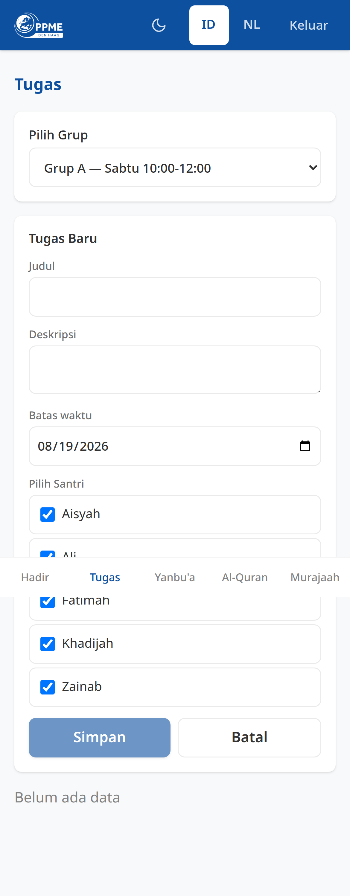

| Kolom | Fungsi |
|---|---|
| **Judul** | Wajib diisi, maksimal 200 karakter. |
| **Deskripsi** | Opsional, teks bebas. |
| **Batas waktu** | Wajib diisi, default hari ini. |
| **Pilih Santri** | Daftar centang santri di grup yang dipilih — **semua santri tercentang secara otomatis**; hilangkan centang untuk mengecualikan santri tertentu. |
| **Simpan** | Aktif hanya jika judul terisi, tanggal terisi, dan minimal satu santri dicentang. |
| **Batal** | Menutup formulir tanpa menyimpan. |

Layar penilaian (setelah menekan salah satu tugas dari daftar):

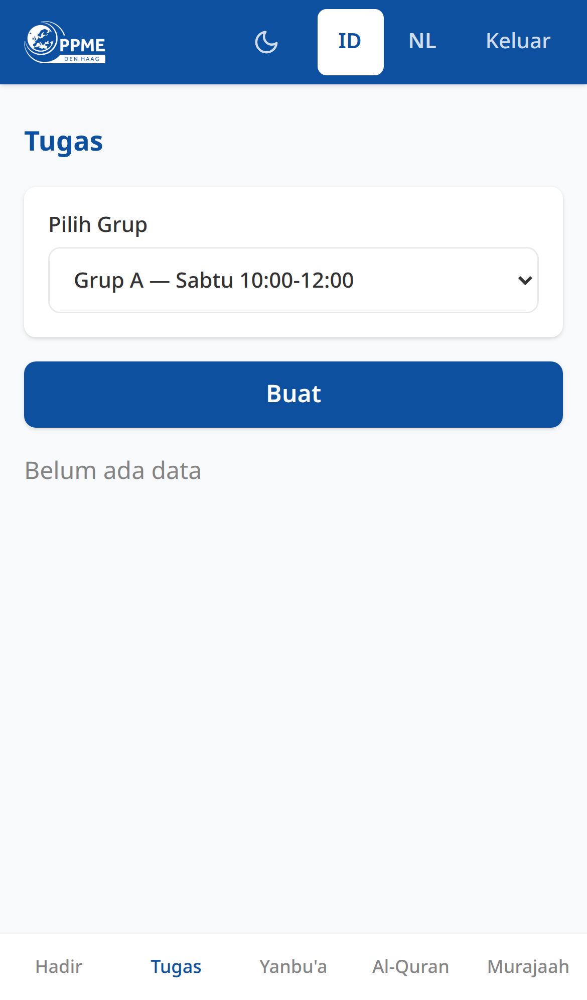

| Elemen | Fungsi |
|---|---|
| **← Kembali** | Kembali ke daftar tugas. |
| Judul, deskripsi, dan batas waktu tugas | Informasi tugas yang dipilih. |
| Baris santri + tombol **Menunggu / Selesai / Terlambat / Sebagian** | Menetapkan status pengumpulan tugas santri tersebut. Setiap kali ditekan, status **langsung tersimpan** ke server (tidak perlu tombol "Kirim" terpisah seperti di Kehadiran). |
| Kolom **Catatan** per santri | Catatan bebas dari guru untuk santri itu; tersimpan otomatis saat kolom kehilangan fokus (misalnya setelah Anda mengetik lalu menekan bagian lain layar). |

> Perhatian: label status "Terlambat" pada Tugas berarti **tugas dikumpulkan terlambat/tidak selesai**, berbeda dari "Terlambat" pada Kehadiran yang berarti **datang terlambat ke kelas** — kata yang sama, arti berbeda di dua layar berbeda.

### 6.2 Tampilan Keluarga — Melihat Tugas

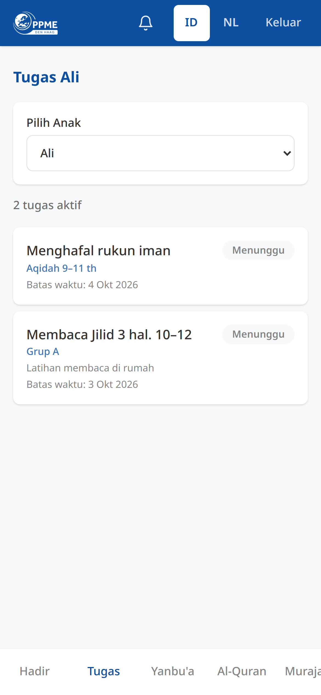

Hanya untuk melihat — status tugas hanya bisa diubah oleh guru.

| Elemen | Fungsi |
|---|---|
| **Pilih Anak** | Muncul hanya jika akun memiliki lebih dari satu anak terkait. |
| Baris jumlah tugas aktif | "{jumlah} tugas aktif" — menghitung tugas berstatus "Menunggu" atau yang sudah lewat tenggat. |
| Kartu tiap tugas | Judul, **grup** yang memberi tugas (anak yang ikut beberapa grup menerima tugas dari setiap grup), deskripsi, batas waktu, catatan dari guru (jika ada), dan lencana status: **Menunggu / Selesai / Terlambat / Sebagian / Lewat Tenggat**. |

---

## 7. Yanbu'a

Yanbu'a adalah metode belajar membaca Al-Qur'an bertahap (jilid 1–7 + halaman). Layar ini mencatat jilid, halaman, dan tingkat penguasaan bacaan santri.

> **Hanya grup yang mencatat.** Yanbu'a, Al-Quran dan Murajaah hanya dicatat di grup yang oleh admin dicentang **Pencatatan Yanbu'a/Al-Quran/Murajaah** ([§13.2](#132-grup)). Jadi **Pilih Grup** di ketiga layar ini hanya menampilkan grup seperti itu; guru yang hanya mengajar grup Aqidah tidak melihat santri di sini. Guru seorang santri tetap boleh **melihat** riwayat Yanbu'a/Al-Quran/Murajaah santri tersebut, termasuk dari grup lain.

### 7.1 Tampilan Guru — Mencatat Progres

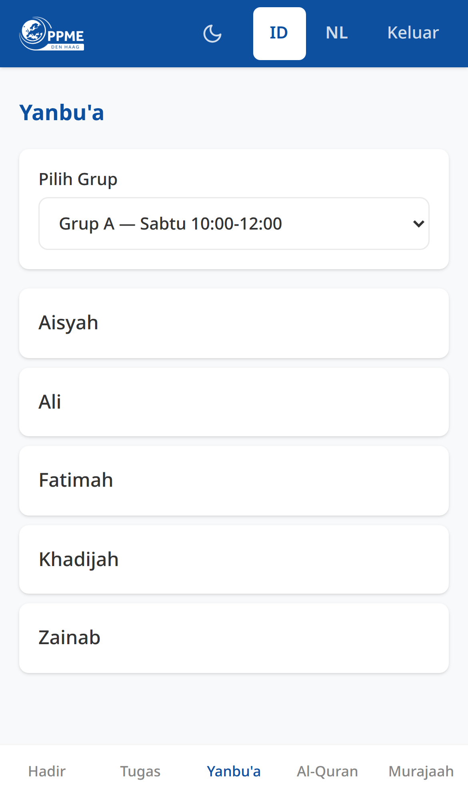

| Elemen | Fungsi |
|---|---|
| **Pilih Grup** | Sama seperti di layar lain. |
| Daftar santri | Tekan nama santri untuk membuka layar pencatatan. |

Layar pencatatan (setelah memilih santri):

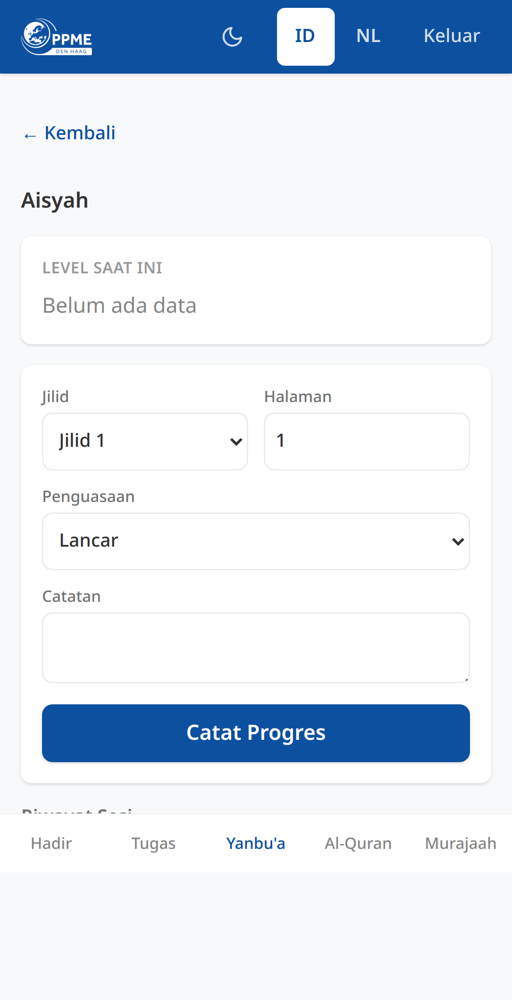

| Elemen | Fungsi |
|---|---|
| **← Kembali** | Kembali ke daftar santri. |
| Kartu **Level saat ini** | Menampilkan jilid, halaman, dan penguasaan terakhir yang tercatat untuk santri ini. |
| **Jilid** | Pilihan jilid 1–7. |
| **Halaman** | Nomor halaman **tercetak di buku**, tidak diulang dari 1 di setiap jilid — nomor halaman berlanjut terus dari jilid 1 sampai jilid 7. |
| **Penguasaan** | Lancar / Kurang Lancar / Ulang. |
| **Catatan** | Teks bebas, opsional. |
| **Catat Progres** | Menyimpan entri baru. Jika halaman yang dicatat adalah halaman terakhir jilid tersebut **dan** penguasaan "Lancar", muncul pesan perayaan **"Selesai Jilid {n}! 🎉"** dan formulir otomatis berpindah ke jilid berikutnya, dengan halaman langsung diisi ke halaman pertama jilid itu (bukan halaman 1) — siap untuk sesi berikutnya. |
| **Riwayat Sesi** | Daftar semua entri sebelumnya untuk santri ini, dengan tanggal. |

**Status offline**: sama seperti Kehadiran — jika gagal terkirim karena jaringan, data disimpan di perangkat dan dikirim otomatis saat online kembali.

### 7.2 Tampilan Keluarga — Melihat Progres

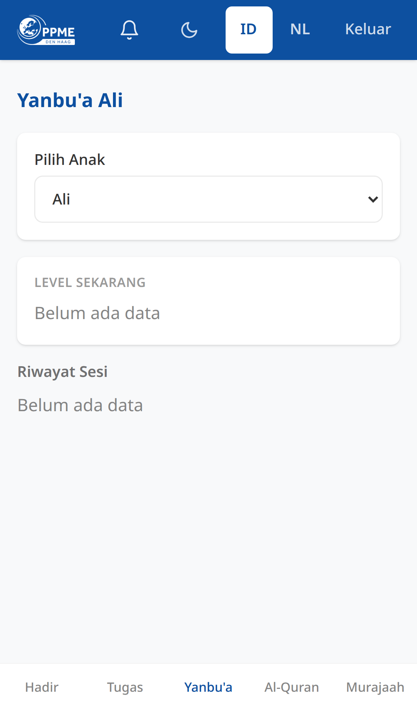

Hanya untuk melihat.

| Elemen | Fungsi |
|---|---|
| **Pilih Anak** | Sama seperti layar lain. |
| Kartu **Level sekarang** | Jilid, halaman, dan penguasaan terkini. |
| **Riwayat Sesi** | Sama seperti tampilan guru — daftar seluruh riwayat, tanpa kemampuan mengubah apa pun. |

Jika anak hanya ikut grup yang tidak mencatat Yanbu'a/Al-Quran/Murajaah (misalnya hanya grup Aqidah), layar Yanbu'a, Al-Quran dan Murajaah menampilkan penjelasan singkat sebagai ganti riwayat kosong:

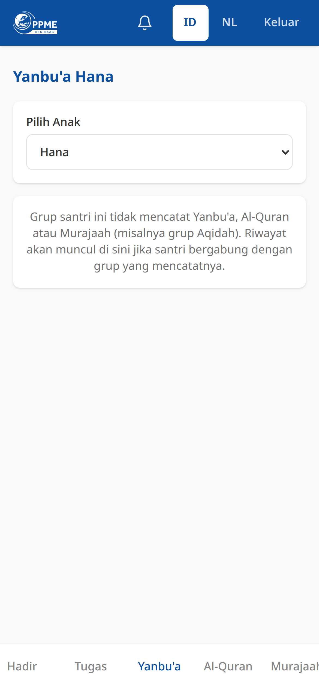

---

## 8. Al-Quran

Mencatat posisi tilawah (bacaan) Al-Qur'an santri: surah, rentang ayat, dan kualitas bacaan.

### 8.1 Tampilan Guru — Mencatat Tilawah

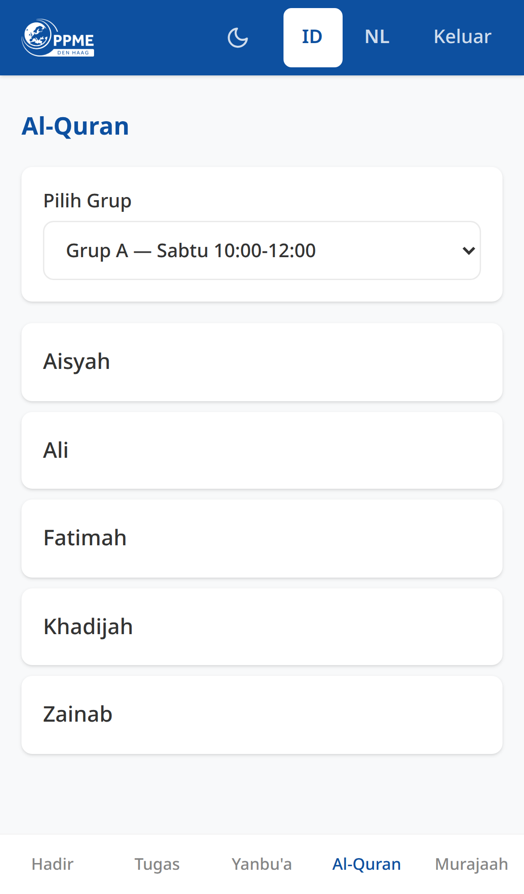

Struktur sama seperti Yanbu'a: **Pilih Grup** → daftar santri → tekan nama untuk mencatat.

Layar pencatatan:

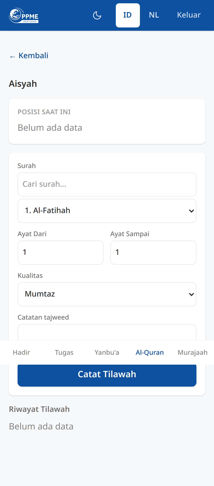

| Elemen | Fungsi |
|---|---|
| Kartu **Posisi saat ini** | Surah dan ayat terakhir yang tercatat, plus perkiraan persentase Al-Qur'an yang telah ditempuh santri (mis. "~12% Al-Quran"). |
| **Surah** | Kolom pencarian teks (ketik nama atau nomor surah untuk menyaring) + dropdown pilihan surah. |
| **Ayat Dari** / **Ayat Sampai** | Rentang ayat yang dibaca pada sesi ini. |
| **Kualitas** | Mumtaz / Jayyid Jiddan / Jayyid / Maqbul / Perlu Perbaikan (dari terbaik ke yang perlu perbaikan). |
| **Catatan tajweed** | Teks bebas, opsional. |
| **Catat Tilawah** | Menyimpan entri. Berbeda dari Yanbu'a, di sini **tidak ada** perayaan otomatis atau lompat-surah otomatis — kolom surah/ayat/kualitas tetap seperti sebelumnya untuk entri berikutnya. |
| **Riwayat Tilawah** | Daftar seluruh entri sebelumnya. |

**Status offline**: sama seperti Kehadiran/Yanbu'a.

### 8.2 Tampilan Keluarga — Melihat Tilawah

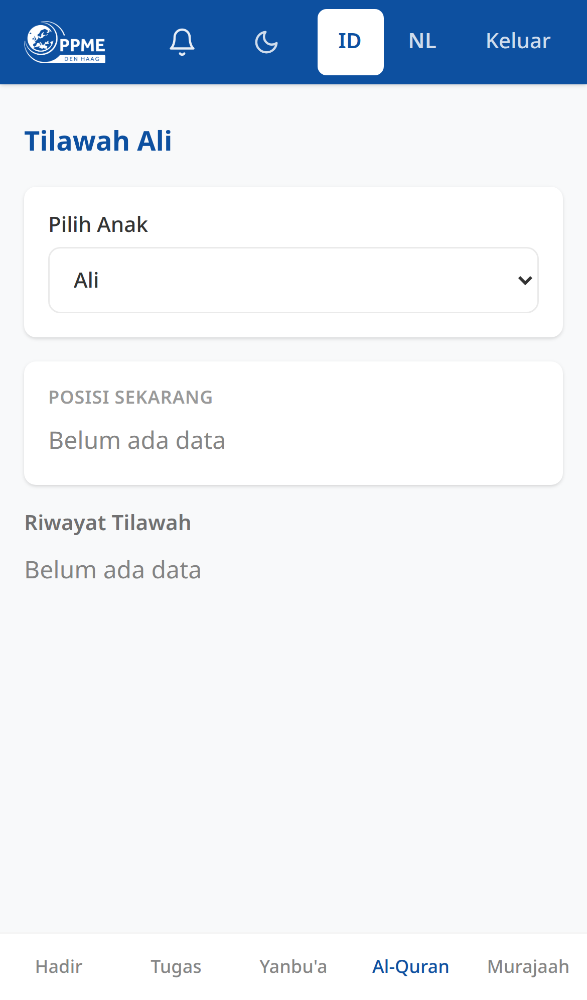

Hanya untuk melihat: kartu **Posisi sekarang** + **Riwayat Tilawah**, sama seperti Yanbu'a.

---

## 9. Murajaah

Murajaah adalah kegiatan mengulang hafalan Al-Qur'an secara rutin di rumah. Guru menetapkan target (surah + rentang ayat + frekuensi), lalu orang tua mengonfirmasi setiap kali dikerjakan di rumah.

Menu Murajaah untuk guru memiliki **dua tab**:

### 9.1 Tab "Tetapkan Target"

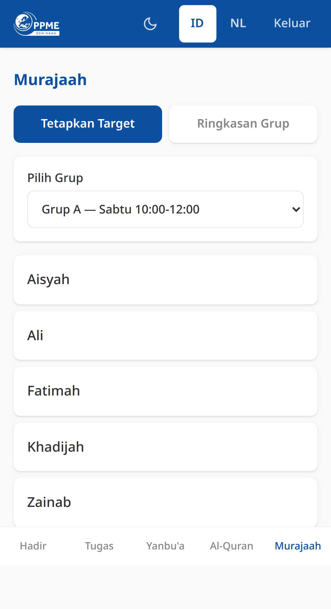

Sama seperti Yanbu'a/Al-Quran: **Pilih Grup** → daftar santri → tekan nama untuk membuka detail.

Di layar detail santri, Anda akan menemukan:

| Elemen | Fungsi |
|---|---|
| Daftar target aktif | Setiap target ditampilkan sebagai kartu: nama surah, rentang ayat, dan frekuensi (Setiap hari / 3x seminggu / Seminggu sekali). |
| **Tandai Sudah Hafal** (per kartu target) | Menandai target tersebut selesai dihafal — target berpindah ke bagian "Hafalan Selesai". |
| **Tetapkan Target Baru** | Membuka formulir target baru: pilih **Surah**, rentang **Ayat Dari/Sampai**, dan **Frekuensi**. Tombol **Simpan** aktif hanya jika rentang ayat valid. |
| **Hafalan Selesai** | Daftar target yang sudah ditandai selesai dihafal — tidak bisa diubah lagi dari sini. |
| **Riwayat Konfirmasi** | Daftar tanggal setiap kali murajaah dikonfirmasi oleh orang tua, beserta kualitasnya. |

### 9.2 Tab "Ringkasan Grup"

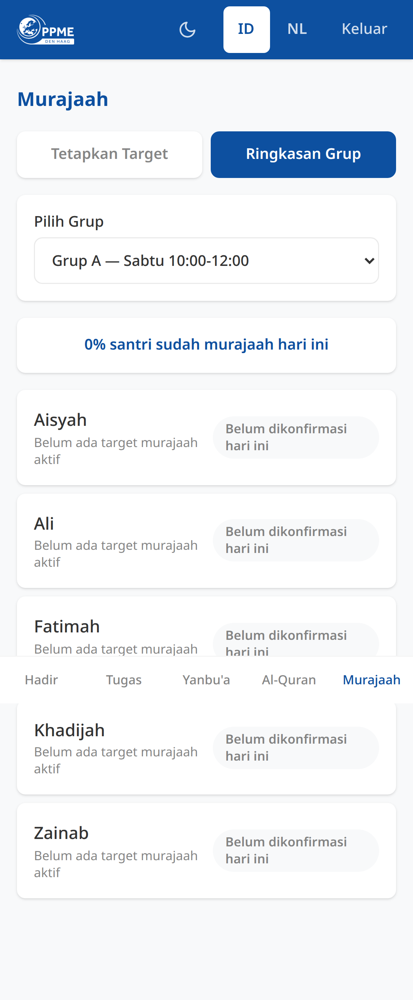

Layar ini **hanya untuk melihat** — guru tidak bisa mengonfirmasi murajaah untuk santri (hanya orang tua yang bisa).

| Elemen | Fungsi |
|---|---|
| Ringkasan persentase | "{persen}% santri sudah murajaah hari ini". |
| Baris per santri | Target aktif (jika ada), status **"✓ Selesai Murajaah"** atau **"Belum dikonfirmasi hari ini"**, dan jumlah hari terkonfirmasi minggu ini (mis. "3/7 minggu ini"). |

### 9.3 Tampilan Keluarga — Konfirmasi Murajaah

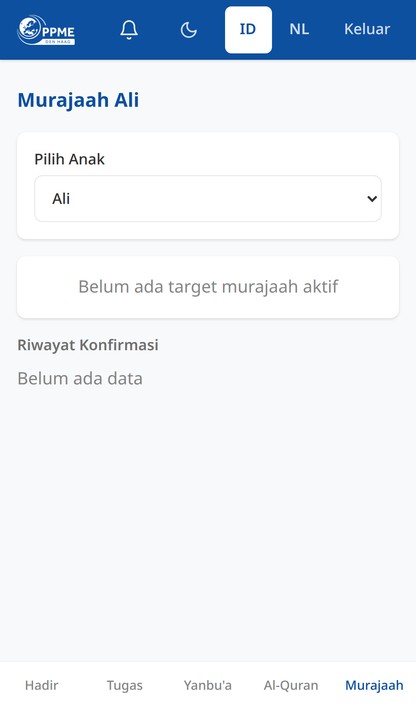

| Elemen | Fungsi |
|---|---|
| **Pilih Anak** | Sama seperti layar lain. |
| Kartu target aktif | Surah, rentang ayat, frekuensi, **jumlah hari/minggu berturut-turut (streak)**, dan rekor terbaik jika ada. |
| **Kualitas** (dropdown) | Hafal Lancar / Hafal Kurang Lancar / Belum Hafal — dipilih sebelum mengonfirmasi. |
| **✓ Selesai Murajaah** (tombol) | Mencatat bahwa murajaah hari ini sudah dilakukan. **Hanya muncul untuk orang tua/wali** — jika Anda santri 16+ yang melihat data Anda sendiri, tombol ini tidak tersedia; hanya orang tua/wali yang bisa mengonfirmasi murajaah, walaupun santri bisa melihat progresnya. |
| **Hafalan Selesai** & **Riwayat Konfirmasi** | Sama seperti tampilan guru. |

**Status offline**: jika konfirmasi gagal terkirim karena jaringan, tampil pesan *"Anda sedang offline..."* dan tercatat sementara di perangkat sampai bisa dikirim ulang otomatis.

**Sudah dikonfirmasi**: jika seorang anak punya lebih dari satu orang tua/wali, masing-masing bisa mengonfirmasi murajaah hari itu. Konfirmasi pertama yang berlaku; jika orang tua/wali kedua mengonfirmasi lagi untuk hari yang sama, muncul pesan *"Murajaah hari ini sudah dikonfirmasi."* dan tidak ada yang berubah.

---

## 10. Rapor

Rapor akhir tahun merangkum kehadiran, nilai per bidang (Yanbu'a, Al-Quran, Murajaah), dan catatan guru, lalu diterbitkan sebagai PDF yang bisa diunduh keluarga. Jika santri juga ikut grup tanpa pencatatan Yanbu'a, seperti grup Aqidah, rapor juga mendapat **bagian per grup** yang diisi oleh guru grup tersebut (lihat §10.1.1).

### 10.1 Tampilan Guru/Admin — Daftar Rapor

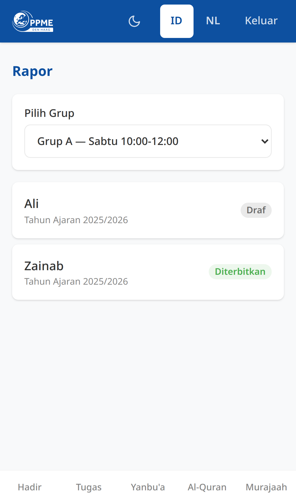

| Elemen | Fungsi |
|---|---|
| *(Khusus admin)* Panel **"Buat Draf Rapor"** | Admin bisa membuat draf rapor untuk seluruh grup atau satu grup tertentu, untuk satu tahun ajaran (format "2025/2026"). Setelah dibuat, panel menampilkan jumlah draf yang berhasil dibuat serta yang dilewati (karena sudah punya rapor, atau karena grupnya tidak punya guru pengampu), serta berapa **bagian grup** yang ditambahkan. Membuat ulang hanya menambah bagian yang belum ada, misalnya untuk anak yang baru masuk grup Aqidah. |
| **Pilih Grup** | Sama seperti layar lain. |
| Daftar rapor | Nama santri, tahun ajaran, dan lencana status **Draf** (abu-abu) atau **Diterbitkan** (hijau). Tekan salah satu untuk membuka. |
| *(Guru grup Aqidah)* Baris per bagian | Untuk anak yang juga ikut grup Yanbu'a/Al-Quran, rapornya ditulis oleh guru grup itu. Anda hanya melihat bagian Anda sendiri: nama, tahun ajaran, **penulis rapor**, dan status **Belum diisi**, **Sudah diisi** atau **Diterbitkan · terkunci**. |

#### 10.1.1 Mengisi bagian sebuah grup (mis. Aqidah)

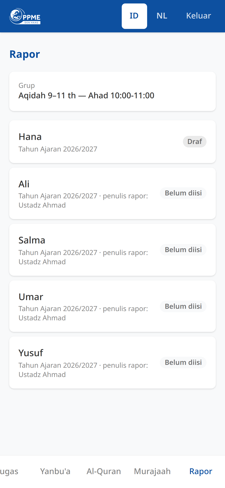

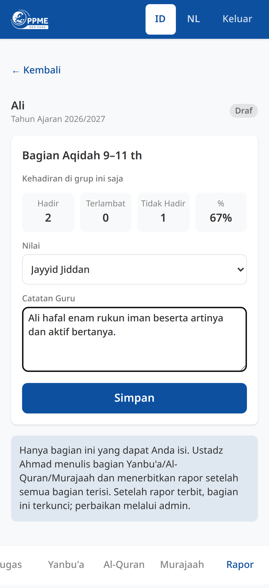

| Elemen | Fungsi |
|---|---|
| **Kehadiran di grup ini saja** | Hadir / Terlambat / Tidak hadir dan persentase, hanya untuk pertemuan grup Anda. |
| **Nilai** | Lima nilai yang sama seperti di bagian lain rapor. |
| **Catatan Guru** | Catatan Anda tentang santri di grup ini. |
| **Simpan** | Menyimpan bagian ini. |

Anda **hanya mengisi bagian grup Anda sendiri**, selama rapor masih draf. Penulis rapor baru menerbitkan rapor setelah semua bagian punya nilai dan catatan. Setelah terbit, bagian Anda **terkunci**; perbaikan melalui admin. Jika anak hanya ikut grup Anda (misalnya hanya Aqidah), Anda sendiri penulis rapornya dan mengisi rapor sekaligus bagian Anda.

### 10.2 Editor Rapor

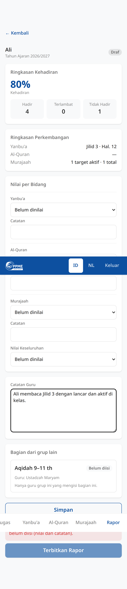

| Elemen | Fungsi |
|---|---|
| **← Kembali** | Kembali ke daftar. |
| **Ringkasan Kehadiran** | Angka persentase + jumlah Hadir/Terlambat/Tidak Hadir — **ini adalah cuplikan (snapshot)** dari saat draf dibuat, bukan data langsung, sehingga angkanya tetap sama meski catatan kehadiran diperbaiki setelahnya. |
| **Ringkasan Perkembangan** *(hanya untuk guru/admin, tidak muncul di tampilan keluarga)* | Posisi Yanbu'a, Al-Quran, dan jumlah target murajaah terkini — data langsung (bukan cuplikan), sebagai bahan referensi saat mengisi nilai. |
| **Nilai per Bidang**: Yanbu'a, Al-Quran, Murajaah | Masing-masing punya dropdown nilai (Mumtaz / Jayyid Jiddan / Jayyid / Maqbul / Perlu Bimbingan / "Belum dinilai") + kolom catatan singkat. |
| **Nilai Keseluruhan** | Dropdown nilai gabungan, tanpa kolom catatan. |
| **Catatan Guru** | Kolom teks panjang berisi narasi perkembangan santri — **wajib diisi sebelum rapor bisa diterbitkan**. |
| **Simpan** | Menyimpan perubahan tanpa menerbitkan — bisa dilakukan kapan saja, baik rapor masih draf maupun sudah diterbitkan. |
| **Bagian dari grup lain** | Setiap bagian grup Aqidah dengan gurunya, statusnya (**Sudah diisi** atau **Belum diisi**) dan, bila sudah diisi, nilai dan catatannya. Hanya guru grup itu yang mengisinya; penulis rapor tidak dapat mengubahnya. |
| *(Khusus admin, pada draf)* **Penulis rapor** | Pilihan guru dari grup-grup santri ini (bukan santri asisten). Penulis mengisi bagian Yanbu'a/Al-Quran/Murajaah dan menerbitkan rapor. |
| **Terbitkan Rapor** / **Terbitkan Ulang & Perbarui PDF** | Untuk **penulis rapor dan admin**. Menampilkan kotak konfirmasi, lalu membuat berkas PDF dan mengubah status menjadi "Diterbitkan" — setelah itu orang tua dan santri bisa melihat & mengunduhnya. Nonaktif sampai Catatan Guru terisi **dan setiap bagian grup punya nilai dan catatan**; aplikasi menyebut bagian mana yang belum diisi. |
| *(Khusus admin)* **Terbitkan tanpa bagian kosong…** | Bila guru sebuah grup tidak dapat menyelesaikan bagiannya (sudah tidak aktif, tidak dapat dihubungi). Panel menyebut bagian mana yang tidak dimuat; setelah mencentang konfirmasi, rapor terbit tanpa bagian itu, juga di PDF. |
| **Unduh PDF** | Muncul jika PDF sudah pernah dibuat. |

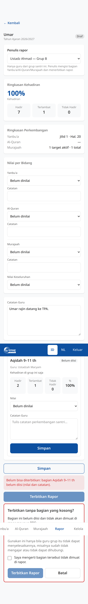

**Catatan untuk admin**: admin dapat mengubah rapor dan bagian mana pun, juga setelah terbit, dan **dapat menerbitkan (ulang) rapor**. Begitulah cara memperbaiki bagian yang sudah terkunci bagi gurunya: ubah, lalu pilih **Terbitkan Ulang & Perbarui PDF** agar PDF tetap sama dengan aplikasi.

### 10.3 Tampilan Keluarga — Melihat & Mengunduh Rapor

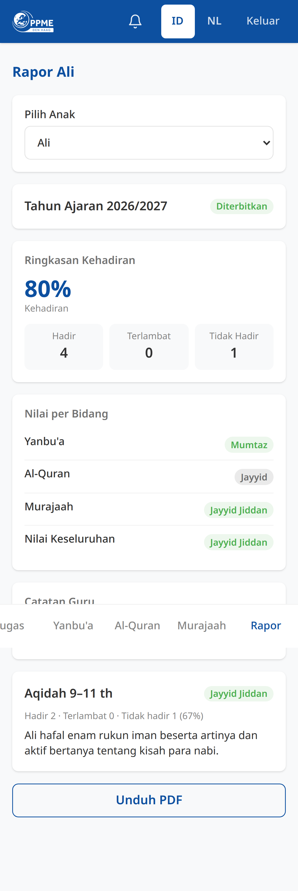

Keluarga **hanya bisa melihat rapor yang sudah diterbitkan** — rapor berstatus draf tidak akan pernah muncul di tampilan ini.

| Elemen | Fungsi |
|---|---|
| **Pilih Anak** | Sama seperti layar lain. |
| Ringkasan kehadiran, nilai per bidang, dan catatan guru | Sama seperti yang ditulis guru, hanya untuk dibaca. |
| Bagian per grup (mis. Aqidah) | Nama grup, nilai, kehadiran di grup itu dan catatan guru grup tersebut. Juga ada di PDF. |
| **Unduh PDF** | Membuka berkas PDF rapor di tab baru. |

Jika belum ada rapor yang diterbitkan untuk anak tersebut, layar menampilkan pesan **"Belum ada rapor tersedia"**.

---

## 11. Pengumuman & Materi

Setiap grup punya halaman sendiri berisi **pengumuman** dari guru dan **materi** pelajaran, misalnya slide pelajaran Aqidah. Halaman ini dibuka lewat ubin **Pengumuman & Materi** di beranda; bilah bawah tidak berubah.

### 11.1 Tampilan Keluarga — Membaca pengumuman dan materi

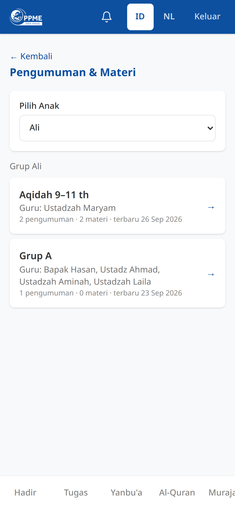

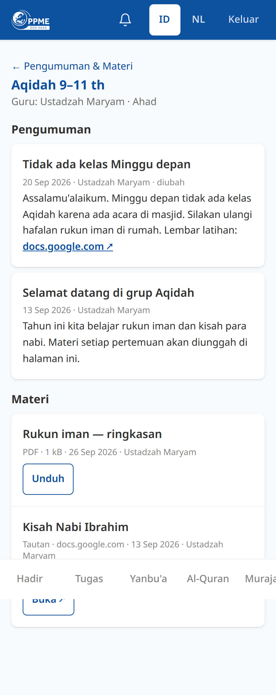

| Elemen | Fungsi |
|---|---|
| **Pilih Anak** | Hanya bila anak lebih dari satu: pilih grup anak yang ingin dilihat. |
| Kartu tiap grup | Grup-grup anak itu, dengan guru, jumlah pengumuman dan materi, dan tanggal yang terbaru. Ketuk kartu untuk membuka grup. |
| Bagian atas halaman grup | Nama grup, guru, dan hari pertemuan. |
| **Pengumuman** | Terbaru di atas, dengan tanggal dan nama guru. Tautan di dalam teks hanya menampilkan domainnya (mis. **docs.google.com ↗**) dan terbuka di tab baru. Pengumuman yang diubah menampilkan **"diubah"**. |
| **Materi** — berkas | Berkas PDF atau PowerPoint dengan ukuran dan tanggal. **Unduh** menyimpannya dengan nama aslinya. |
| **Materi** — tautan | Dokumen atau presentasi Google, satu berkas Google Drive, atau berkas OneDrive. **Buka ↗** membukanya di Google atau Microsoft. |

Saat ada pengumuman atau materi baru, Anda menerima notifikasi yang menyebut nama depan anak Anda dan nama grupnya; isinya dibaca di aplikasi (lihat [§12](#12-notifikasi)). Pengumuman tidak dapat dibalas.

### 11.2 Tampilan Guru — Mengirim pengumuman dan materi

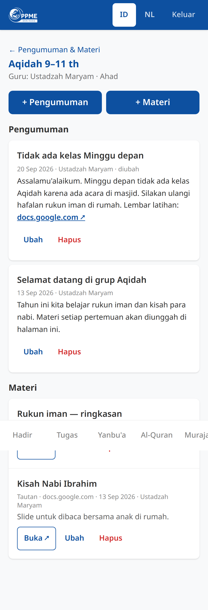

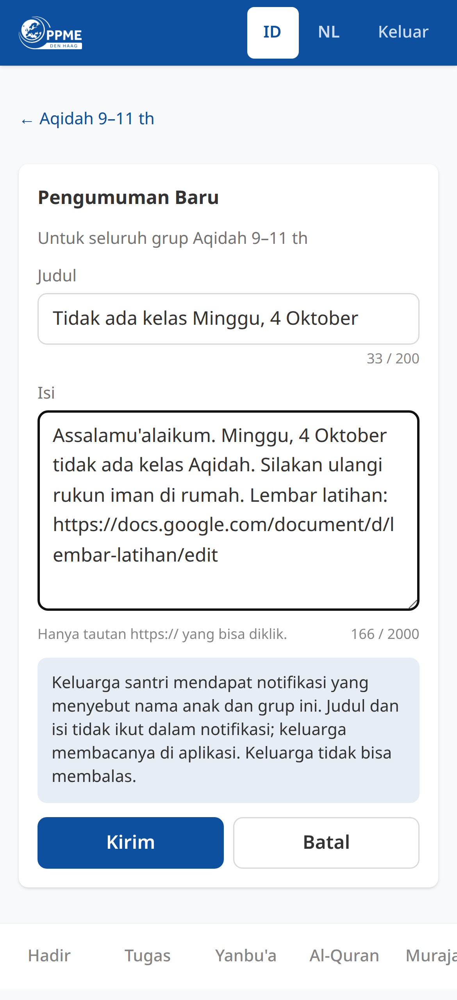

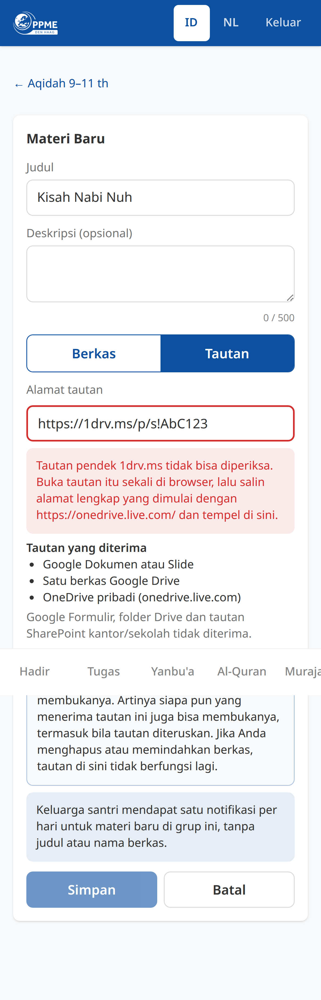

Daftar hanya menampilkan grup yang Anda ajar (admin melihat semua grup aktif). Grup santri Anda yang diajar guru lain dapat dibuka lewat tautan atau notifikasi dan dibaca, tetapi tidak dapat diubah.

| Elemen | Fungsi |
|---|---|
| **+ Pengumuman** | **Judul** (sampai 200 karakter) dan **isi** (sampai 2.000 karakter). Hanya tautan yang dimulai dengan `https://` yang bisa diklik. Pengumuman dikirim ke seluruh grup; semua keluarga menerima notifikasi yang menyebut nama anak dan grup, tanpa judul atau isi. Guru tidak menerima notifikasi. |
| **+ Materi** — **Berkas** | **PDF** atau **PowerPoint (.pptx)**, maksimal **20 MB**. Berkas lain ditolak dengan keterangan jenis yang diterima. |
| **+ Materi** — **Tautan** | Diterima: dokumen atau presentasi Google, satu berkas Google Drive, atau tautan OneDrive **pribadi** yang dimulai dengan `https://onedrive.live.com/`. Ditolak: Google Formulir, folder Drive, tautan SharePoint kantor/sekolah, dan tautan pendek `1drv.ms`. Tombol "Salin link" di OneDrive menghasilkan tautan pendek seperti itu: buka sekali di browser, lalu salin alamat lengkapnya. Atur berbagi berkas ke **"Siapa saja yang memiliki link"**; siapa pun yang menerima tautan itu dapat membukanya, jadi jangan bagikan data pribadi lewat tautan. |
| Notifikasi materi | Satu notifikasi per anak per hari untuk grup ini, berapa pun materi yang diunggah, tanpa judul atau nama berkas. |
| **Ubah** | Hanya untuk pengumuman dan materi Anda sendiri. Mengubah tidak mengirim notifikasi baru; setelah itu tampil **"diubah"**. Untuk berkas, Anda juga bisa **mengganti berkas**. |
| **Hapus** | Item Anda sendiri; admin dapat menghapus item apa pun, juga di grup yang diarsipkan. Untuk berkas, berkasnya ikut dihapus. |

Di grup yang **diarsipkan** tidak ada yang dapat ditambah atau diubah.

---

## 12. Notifikasi

### 12.1 Pusat Notifikasi

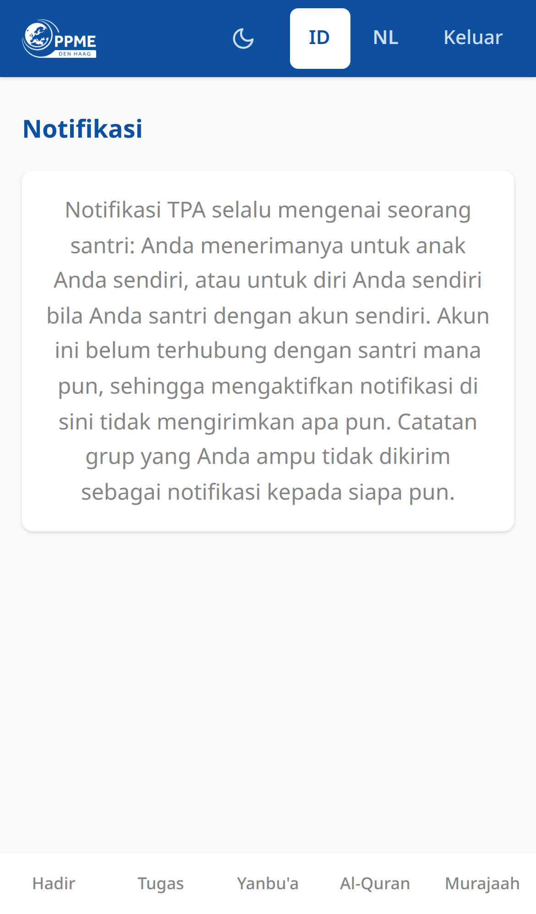

Dibuka lewat ikon lonceng di bilah atas. Hanya tersedia (berisi data) untuk akun yang berstatus penerima notifikasi (orang tua, atau santri 16+ dengan akun sendiri) — guru dan admin murni akan melihat pesan bahwa akun mereka belum terhubung ke santri manapun.

| Elemen | Fungsi |
|---|---|
| Daftar notifikasi | Setiap baris berupa satu peristiwa: santri tidak hadir, tugas baru, pengingat tenggat, jilid Yanbu'a selesai, surah baru dihafal, pengingat murajaah, rapor siap, atau ringkasan mingguan. Jika anak ikut lebih dari satu grup, notifikasi ketidakhadiran dan tugas baru menyebut **grupnya** (mis. "… tidak hadir hari ini di grup Aqidah 9–11 th"), sehingga dua ketidakhadiran pada hari yang sama bisa dibedakan. Tekan salah satu untuk membuka layar terkait. |
| Membaca notifikasi | Semua notifikasi otomatis ditandai "sudah dibaca" begitu halaman ini dibuka — tidak ada tombol tersendiri untuk itu. |
| Tautan **Pengaturan notifikasi** | Membuka [§12.2](#122-pengaturan-notifikasi). |

### 12.2 Pengaturan Notifikasi

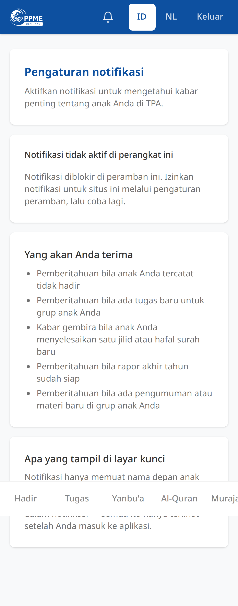

Diakses dari Beranda atau dari Pusat Notifikasi. Terbuka untuk **semua peran**, walau isinya berbeda:

| Elemen | Fungsi |
|---|---|
| Status notifikasi push saat ini | "Notifikasi aktif di perangkat ini" / "tidak aktif" / "aktif di perangkat lain" (satu akun hanya bisa menerima notifikasi di satu perangkat sekaligus). |
| **Aktifkan notifikasi** / **Matikan notifikasi** / **Pindahkan ke perangkat ini** | Tombol tunggal yang berubah label sesuai status di atas. |
| *(Khusus akun penerima notifikasi)* Daftar **"Yang akan Anda terima"** | Penjelasan singkat 5 jenis notifikasi yang akan dikirim: ketidakhadiran, tugas baru, capaian (jilid/surah selesai), rapor siap, serta pengumuman atau materi baru di grup anak. |
| **"Apa yang tampil di layar kunci"** | Penjelasan privasi: notifikasi di layar kunci hanya memuat nama depan anak dan jenis peristiwa — **tidak pernah** memuat alasan ketidakhadiran, nilai, atau detail progres; semua itu baru terlihat setelah membuka aplikasi. |

Jika peramban memblokir izin notifikasi, layar menampilkan penjelasan untuk membuka pengaturan izin peramban secara manual.

---

## 13. Kelola (Khusus Admin)

Hanya bisa diakses oleh akun dengan peran Admin, lewat ubin **Kelola** di Beranda. Terdiri dari empat sub-halaman dengan menu tab di bagian atas: **Pendaftaran · Grup · Santri · Pengguna**. Rekap kehadiran guru, yang dulu ada di sini, kini ada di **Kehadiran › Guru** ([§5.3](#53-tampilan-admin--santri--guru)); alamat lamanya langsung membuka layar itu.

### 13.1 Pendaftaran

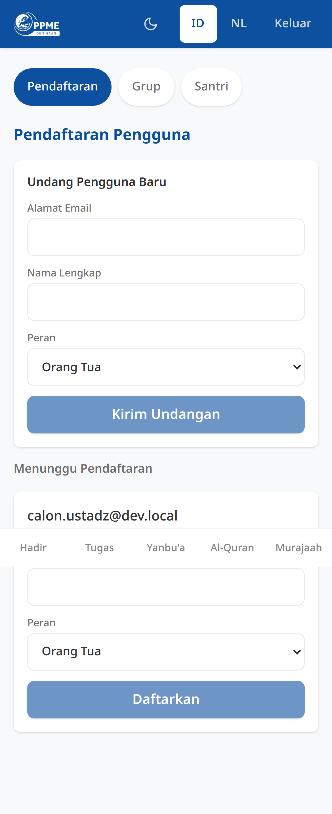

**Bagian "Undang Pengguna Baru"**

| Kolom | Fungsi |
|---|---|
| **Alamat Email** | Wajib diisi. |
| **Nama Lengkap** | Wajib diisi. |
| **Peran** | Orang Tua / Guru / Santri / Admin (default: Orang Tua). |
| **Kirim Undangan** | Membuat akun baru dan mengirim tautan undangan ke email tersebut. |

**Bagian "Menunggu Pendaftaran"** — daftar orang yang sudah pernah masuk lewat Google tetapi belum diberi profil/peran (misalnya karena diundang oleh orang lain, atau masuk sendiri sebelum didaftarkan admin):

| Kolom | Fungsi |
|---|---|
| Email & tanggal pertama masuk | Informasi otomatis, tidak bisa diubah. |
| **Keterangan dari pengguna** | Hanya tampil jika orang tersebut mengisi keterangan pada formulir permintaan (lihat [§2](#2-masuk-ke-aplikasi)). Hanya-baca. |
| **Nama Lengkap** | Sudah terisi dengan nama yang diberikan orang tersebut sendiri; kosong jika tidak ada (misalnya untuk akun yang diundang). Selalu dapat Anda ubah sebelum mendaftarkan. |
| **Peran** | Sama seperti di atas. |
| **Daftarkan** | Menyelesaikan pendaftaran orang tersebut — baris otomatis hilang dari daftar setelah berhasil, dan permintaan (beserta keterangannya) dihapus. |
| **Tolak** | Menghapus pendaftaran yang menunggu. Muncul dulu pertanyaan konfirmasi berisi alamat email. Setelah dikonfirmasi, akun (yang belum terdaftar) beserta permintaannya dihapus dan baris hilang dari daftar. **Menolak bukan pemblokiran**: pengguna Google yang sama dapat masuk lagi dan akan muncul sebagai pendaftaran menunggu yang baru. Pendaftaran yang akunnya sudah terlanjur dibuat tidak dapat ditolak. |

### 13.2 Grup

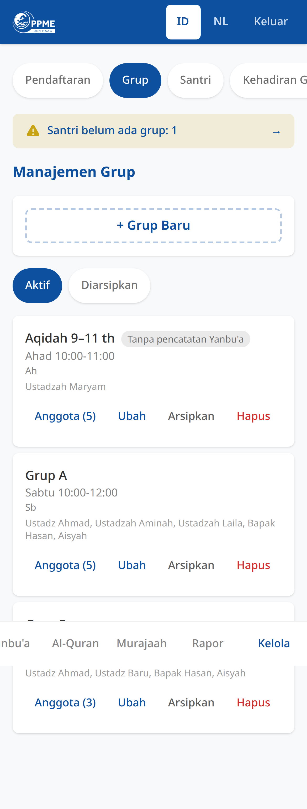

Ada dua jenis grup: **grup Yanbu'a/Al-Quran** (dibagi menurut tingkat bacaan) dan **grup Aqidah** (dibagi menurut usia). Seorang santri bisa ikut keduanya, dan sebanyak grup yang diperlukan. Perbedaan kedua jenis itu adalah satu pengaturan per grup: **Pencatatan Yanbu'a/Al-Quran/Murajaah**.

| Elemen | Fungsi |
|---|---|
| **+ Grup Baru** | Membuka formulir grup baru (lihat gambar di bawah). |
| **Aktif** / **Diarsipkan** | Menampilkan grup aktif atau grup yang diarsipkan. |
| Kartu tiap grup | Nama, bila ada lencana **"Tanpa pencatatan Yanbu'a"** (mis. grup Aqidah; lengkapnya: tanpa pencatatan Yanbu'a, Al-Quran dan Murajaah) atau **"Diarsipkan"**, jadwal, hari pertemuan (mis. "Rab, Sab"), dan daftar guru pengampu. |
| **Santri (jumlah)** | Membuka daftar santri grup, tempat menambah dan mengeluarkan santri (lihat [§13.2.1](#1321-santri-dalam-grup)). |
| **Ubah** | Membuka formulir edit untuk grup tersebut, terisi data yang sudah ada. |
| Penyimpanan materi | Di bawah judul: berapa ruang penyimpanan yang dipakai semua berkas materi (lihat [§11](#11-pengumuman--materi)). Paket gratis punya 1 GB, bersama rapor. |
| **Arsipkan** | Untuk grup tahun ajaran sebelumnya atau grup yang dibubarkan. Grup yang diarsipkan **dibekukan**: tidak bisa lagi diisi sesi, kehadiran, tugas atau santri baru, oleh siapa pun (termasuk admin). Riwayatnya tetap tersimpan dan terlihat, tetapi grup hilang dari semua pilihan grup, dan guru grup itu tidak lagi melihat data mantan santrinya di luar grup itu sendiri. Jika grup masih bertemu dalam 7 hari terakhir, aplikasi memberi peringatan: guru yang mengisi kehadiran secara offline dan belum terkirim tidak dapat mengirimnya lagi setelah diarsipkan. |
| **Aktifkan kembali** | Mengaktifkan kembali grup yang diarsipkan, misalnya untuk memperbaiki sesuatu. |
| **Hapus** | Hanya untuk grup **tanpa riwayat** (mis. terbuat tanpa sengaja). Jika grup sudah punya sesi atau tugas, grup tidak bisa dihapus — aplikasi memberi tahu dan menyarankan untuk mengarsipkannya. |

Formulir Grup (sama untuk buat baru maupun ubah):

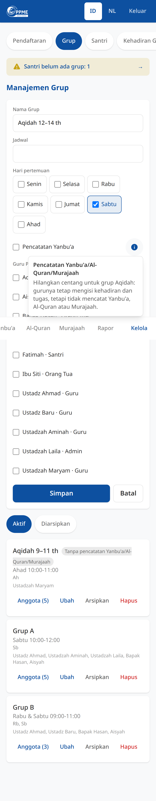

| Kolom | Fungsi |
|---|---|
| **Nama Grup** | Wajib diisi. Misalnya "Grup A" atau "Aqidah 9–11 th" — namanya bebas, aplikasi hanya melihat pengaturan di bawah ini. |
| **Jadwal** | Opsional, teks bebas untuk waktu (mis. "Sabtu 10:00-12:00"). |
| **Hari pertemuan** | Daftar centang Senin sampai Ahad. Pada grup baru, **Sabtu** sudah tercentang; boleh lebih dari satu hari. Minimal satu hari harus dipilih — jika tidak, tombol **Simpan** nonaktif dengan pesan *"Pilih minimal satu hari"*. Hari-hari ini menentukan tanggal mana yang bisa dibuatkan sesi di daftar hadir. |
| **Pencatatan Yanbu'a** + tombol **ⓘ** | Lengkapnya: *Pencatatan Yanbu'a/Al-Quran/Murajaah*. Secara bawaan **tercentang** (grup Yanbu'a/Al-Quran). **Hilangkan centang untuk grup Aqidah**: gurunya tetap mengisi kehadiran dan tugas, tetapi tidak mencatat Yanbu'a, Al-Quran atau Murajaah. Ketuk **ⓘ** untuk membaca penjelasan ini dalam jendela kecil; ketuk lagi atau di luar jendela untuk menutupnya. |
| **Guru Pengampu** | Daftar centang — bisa memilih lebih dari satu guru, atau tidak memilih sama sekali. |
| **Simpan** / **Batal** | Menyimpan atau membatalkan. |

**Target murajaah saat mengubah grup.** Jika sebuah perubahan membuat santri tidak lagi berada di **satu pun** grup yang mencatat — Anda menghilangkan centang pencatatan sebuah grup, mengarsipkan grup seperti itu, atau mengeluarkan santri darinya — tidak ada lagi yang dapat mengelola target Murajaah aktifnya. Aplikasi lebih dulu menampilkan target tersebut:

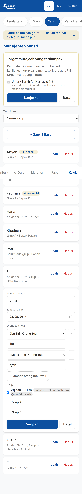

Target yang **harus ditutup** sudah tercentang dan tidak bisa diubah. Jika santri masih punya grup lain yang mencatat, target **boleh dipertahankan** (tidak tercentang). Pilih **Lanjutkan** untuk menjalankan perubahan dan menutup target yang dicentang, atau **Batal** untuk tidak mengubah apa pun.

#### 13.2.1 Santri dalam grup

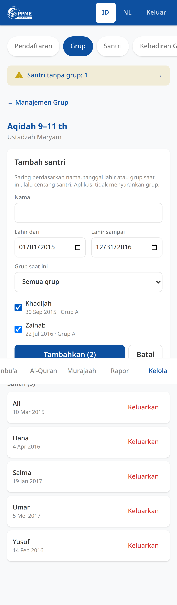

| Elemen | Fungsi |
|---|---|
| **+ Tambah santri** | Membuka daftar pilihan untuk menambahkan beberapa santri sekaligus — berguna di awal tahun ajaran, daripada mengubah data santri satu per satu. |
| Saringan **Nama**, **Lahir dari** / **Lahir sampai**, **Grup saat ini** | Mempersempit daftar. Menyaring menurut tanggal lahir adalah alat bantu untuk menemukan kelompok usia; aplikasi **tidak** menyarankan grup. Dengan **Grup saat ini → Tanpa grup** Anda menemukan santri yang belum ditempatkan. |
| Daftar dengan centang | Setiap santri dengan tanggal lahir dan grup saat ini. Santri yang sudah ada di grup ini tidak tercantum. |
| **Tambahkan ({jumlah})** | Meminta konfirmasi lebih dulu: aplikasi menyebut berapa santri yang ditambahkan dan **guru mana yang dengan itu mendapat akses** ke data mereka (riwayat Yanbu'a/Al-Quran/Murajaah, kehadiran, dan kontak orang tua). Setiap penambahan dicatat (siapa, apa, kapan). |
| Daftar santri dengan **Keluarkan** | Mengeluarkan santri dari grup, setelah konfirmasi. Kehadiran dan tugas santri sebelumnya tetap tersimpan dan terlihat oleh keluarga; pengumuman dan materi grup tidak lagi. |

Grup yang diarsipkan hanya menampilkan santrinya di sini, dengan keterangan bahwa grup telah diarsipkan.

### 13.3 Santri

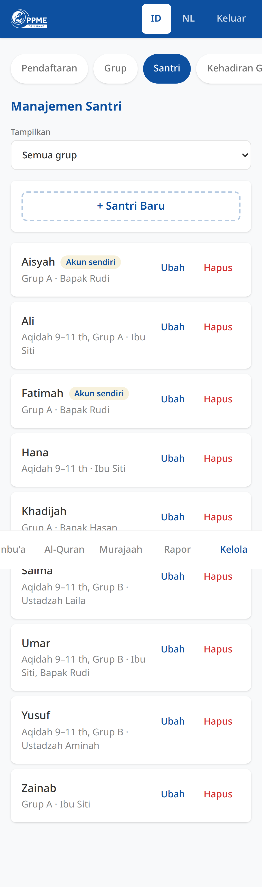

| Elemen | Fungsi |
|---|---|
| **+ Santri Baru** | Membuka formulir santri baru. |
| **Tampilkan** | Saringan: semua grup, **Tanpa grup**, atau santri satu grup. |
| Kartu tiap santri | Nama, lencana **"Akun sendiri"** (jika santri punya login Google sendiri, misalnya santri 16+), grup — atau **"Tanpa grup"** — dan nama orang tua/wali yang tertaut. |
| **Ubah** | Membuka formulir edit. |
| **Hapus** | Menghapus data santri **secara permanen**, beserta seluruh kehadiran, progres, dan rapornya (muncul pertanyaan konfirmasi lebih dulu). Gunakan hanya untuk membersihkan data ganda — misalnya jika orang tua mengirim ulang formulir pendaftaran dengan ejaan nama yang diperbaiki, sehingga muncul dua data untuk satu anak. |

Formulir Santri:

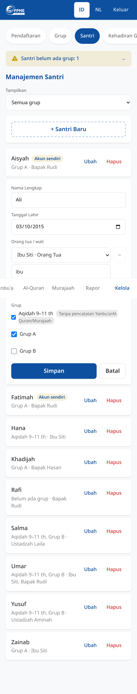

| Kolom | Fungsi |
|---|---|
| **Nama Lengkap** | Wajib diisi. |
| **Tanggal Lahir** | Wajib diisi. |
| **Orang tua / wali** | Wajib — **minimal satu**. Pilih tiap orang tua/wali dari daftar pengguna terdaftar, dan gunakan **"+ Tambah orang tua / wali"** untuk menambah yang kedua (atau lebih) bila perlu. Tiap baris boleh diberi keterangan hubungan opsional (mis. "ibu", "ayah", "wali"). Semua orang tua/wali yang tertaut memperoleh akses **yang sama**: melihat perkembangan, menerima notifikasi, dan mengonfirmasi latihan di rumah — tidak ada orang tua "utama". Tombol hapus **−** nonaktif selama baris tinggal satu; seorang anak harus selalu punya minimal satu orang tua/wali. Melepas tautan orang tua/wali langsung mengakhiri aksesnya; catatan bahwa tautan itu pernah ada tetap disimpan untuk audit. |
| **Grup** | Daftar centang semua grup aktif — seorang santri bisa ikut **beberapa** grup (mis. grup Yanbu'a/Al-Quran dan grup Aqidah), atau (belum) satu pun. Grup tanpa pencatatan berlencana "Tanpa pencatatan Yanbu'a". Grup yang diarsipkan tempat santri pernah ikut tampil di bawahnya sebagai riwayat dan tetap dipertahankan saat disimpan. |
| **Tautkan Akun Login Mandiri** | Opsional — hanya muncul jika ada akun bertipe "santri" yang belum tertaut ke santri manapun. Ini cara untuk menghubungkan login Google milik santri (biasanya yang sudah 16+) ke data santri yang sudah ada, misalnya saat santri baru saja membuat akunnya sendiri. |
| **Simpan** / **Batal** | Menyimpan atau membatalkan. |

**Tanpa grup.** Santri yang masuk lewat formulir pendaftaran belum ikut grup mana pun dan belum terlihat oleh guru mana pun. Selama masih ada santri seperti itu, di bagian atas setiap layar Kelola tampil pemberitahuan dengan segitiga peringatan, **"⚠ Santri tanpa grup: {jumlah}"**; ketuk untuk melihat mereka.

### 13.4 Pengguna

Daftar semua akun yang sudah terdaftar, untuk memperbaiki **nama** atau **peran** seseorang. Pembuatan akun tetap dilakukan di [§13.1 Pendaftaran](#131-pendaftaran).

| Elemen | Fungsi |
|---|---|
| **Cari nama atau email** | Menyaring daftar berdasarkan potongan nama atau alamat email. |
| Penyaring peran | **Semua peran** / Admin / Guru / Orang Tua / Santri. |
| **Ubah** | Membuka formulir baris: kolom **Nama Lengkap** dan pilihan **Peran**. Tekan **Simpan** atau **Batal**. |
| **Hapus** | Hanya muncul pada baris akun **Orang Tua** atau **Santri** (bukan Guru/Admin, dan bukan akun Anda sendiri). Menghapus akun **secara permanen** beserta data terkaitnya, setelah pertanyaan konfirmasi. Dipakai untuk membersihkan akun palsu dari pengiriman formulir pendaftaran yang tidak sah. Jika akun masih tertaut sebagai wali santri, hapus dulu data santrinya di [§13.3 Santri](#133-santri); selama masih tertaut, penghapusan ditolak dengan pesan yang menjelaskan hal itu. |

Beberapa aturan pengaman:

- Pada baris akun Anda sendiri, pilihan **Peran** dinonaktifkan — Anda tidak dapat mengubah peran sendiri. Namanya tetap bisa diubah.
- **Admin terakhir** tidak dapat diturunkan perannya. Beri peran Admin ke orang lain dulu.
- Menurunkan peran seorang **guru** yang masih terdaftar di satu atau beberapa grup akan memunculkan konfirmasi yang menyebutkan grup-grup itu; jika Anda lanjutkan, guru tersebut sekaligus dikeluarkan dari daftar guru grup-grup itu.
- Menurunkan peran seorang **orang tua** atau **santri 16+ dengan login** hanya memberi peringatan bahwa tautan wali / login mandiri mereka tetap ada — tautan itu **tidak** diputus (itu hubungan, bukan peran).

Setiap perubahan peran dicatat (siapa, dari peran apa ke apa, kapan) di log internal yang hanya dapat dilihat admin; perbaikan nama saja tidak dicatat. Log itu belum ditampilkan di aplikasi.

---

## 14. Akun dengan Peran Ganda

Sebagian akun memegang lebih dari satu hubungan — misalnya seorang guru yang juga orang tua dari santri di grup lain (bukan grup yang ia ajar). Akun seperti ini melihat **saklar tampilan** di atas layar Kehadiran, Tugas, Yanbu'a, Al-Quran, Murajaah, dan Rapor:

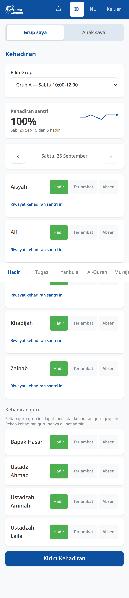
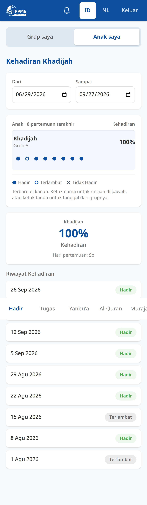

| Tombol | Fungsi |
|---|---|
| **Grup saya** | Menampilkan tampilan guru — grup yang diampu. |
| **Anak saya** *(atau "Saya" untuk santri 16+, atau "Keluarga saya" jika keduanya)* | Menampilkan tampilan keluarga — anak yang terkait dengan akun ini. |

Layar yang sedang dibuka **tidak berpindah** saat menekan saklar ini — hanya isinya yang berganti antara tampilan grup dan tampilan keluarga. Akun dengan satu hubungan saja (murni guru, murni orang tua, atau murni admin) tidak akan pernah melihat saklar ini sama sekali.

---

## 15. Elemen & Istilah Umum

Elemen berikut muncul berulang di banyak layar dan dijelaskan sekali di sini agar tidak diulang-ulang.

| Elemen | Kapan muncul | Fungsi |
|---|---|---|
| **Pilih Grup** | Layar guru manapun | Muncul hanya jika guru mengampu lebih dari satu grup. |
| **Pilih Anak** | Layar keluarga manapun (kecuali Kehadiran) | Muncul hanya jika akun memiliki lebih dari satu anak terkait. Di Kehadiran, semua anak tampil dalam satu kartu ([§5.2](#52-tampilan-keluarga--melihat-riwayat-kehadiran)). |
| *"Memuat…"* | Semua layar | Data sedang diambil dari server. |
| *"Belum ada data"* | Semua layar | Tidak ada data untuk ditampilkan pada kondisi saat ini. |
| *"Anda belum ditugaskan ke grup manapun"* | Layar guru | Akun guru belum diberi grup oleh admin. |
| *"Anda sedang offline. Data akan dikirim saat kembali online."* | Kehadiran, Yanbu'a, Al-Quran, Murajaah | Aksi Anda tersimpan di perangkat dan **akan otomatis terkirim** begitu koneksi internet kembali — tidak perlu mengulang. |
| Pesan galat (kotak merah) | Semua layar | Terjadi kesalahan saat memuat atau menyimpan data — coba lagi atau hubungi admin jika berulang. |

---

## 16. Lampiran: Istilah Indonesia ⟷ Belanda

Untuk memudahkan komunikasi dua bahasa di lingkungan TPA, berikut padanan istilah utama yang digunakan aplikasi:

| Indonesia | Belanda | Keterangan |
|---|---|---|
| Grup | Groep | Sebelumnya disebut "Kelas"/"Klas" — istilah resmi sekarang adalah "Grup"/"Groep". |
| Santri | Leerling | — |
| Guru | Docent | Istilah netral untuk pengajar; menggantikan "Ustadz/Ustadzah". |
| Orang Tua | Ouder | — |
| Hadir | Aanwezig | — |
| Tugas | Huiswerk | Sebelumnya disebut "Opdrachten" — istilah resmi sekarang adalah "Huiswerk" (PR/pekerjaan rumah). |
| Rapor | Rapport | — |
| Kelola | Beheer | Menu khusus admin. |
| Pendaftaran | Registraties | — |
| Pengguna | Gebruikers | Sub-halaman admin untuk mengubah nama dan peran akun. |
| Pencatatan Yanbu'a/Al-Quran/Murajaah | Registratie Yanbu'a/Al-Quran/Murajaah | Pengaturan per grup: aktif untuk grup Yanbu'a/Al-Quran, nonaktif untuk grup Aqidah. |
| Arsipkan | Archiveren | Membekukan grup dan menghapusnya dari pilihan grup; riwayatnya tetap ada. |
| Santri (dalam grup) | Leerlingen (van een groep) | Santri yang ikut sebuah grup. |

---

*Dokumen ini dibuat berdasarkan tangkapan layar aplikasi versi Agustus 2026, tampilan ponsel (mobile), dengan layar untuk **5. Kehadiran** dan **13.2 Grup** diambil ulang untuk hari pertemuan grup dan daftar hadir yang mengikuti jadwal (ADR-037, September 2026), serta **§5.1 dilengkapi dengan bagian "Kehadiran guru"** dan **§13.4 ditambahkan untuk layar peninjauan "Kehadiran Guru" admin** (ADR-041, September 2026), **§13.5 ditambahkan untuk layar "Pengguna" admin** (ADR-042, September 2026), dan diperbarui untuk **santri yang ikut beberapa grup** (ADR-045, September 2026): §5, §6.2, §7, §12.1, §13.2 (dengan §13.2.1 "Santri dalam grup" yang baru) dan §13.3, serta **§11 ditambahkan untuk "Pengumuman & Materi"** (ADR-045 rilis 8b-1, September 2026; bab-bab sesudahnya bergeser satu nomor), dan **§10 diperbarui untuk bagian per grup di rapor akhir tahun** (§10.1.1 baru; ADR-045 rilis 8b-2, September 2026). **§5 diperbarui untuk grafik kehadiran** (kartu Kehadiran santri, kartu semua anak, §5.3 Santri | Guru yang baru) dan rekap kehadiran guru dipindahkan dari §13.4 ke §5.3, sehingga "Pengguna" kini §13.4 (ADR-046, September 2026). Tata letak dapat sedikit berbeda pada versi aplikasi yang lebih baru. Versi PDF dibuat ulang dari teks ini dengan `scripts/gen-manual-pdf.mjs`; layar §13.4 belum memiliki tangkapan layar.*
