# Gebruikershandleiding TPA PPME Den Haag-app

*Taal: **Nederlands** · [Bahasa Indonesia](./manual-id.md)*

De TPA PPME Den Haag-app wordt gebruikt om de voortgang van leerlingen bij de TPA (Taman Pendidikan Al-Qur'an) van PPME Den Haag bij te houden: aanwezigheid, huiswerk, Yanbu'a-lezen, Al-Qur'an-tilawah, murajaah (herhaling van memorisatie) en het jaarrapport. Deze handleiding beschrijft elk scherm, veld en knop die u tegenkomt, met schermafbeeldingen van de mobiele weergave.

## Inhoudsopgave

1. [Gebruikersrollen](#1-gebruikersrollen)
2. [Inloggen](#2-inloggen)
3. [Algemene navigatie](#3-algemene-navigatie)
4. [Startscherm](#4-startscherm)
5. [Aanwezigheid](#5-aanwezigheid)
6. [Huiswerk](#6-huiswerk)
7. [Yanbu'a](#7-yanbua)
8. [Al-Quran](#8-al-quran)
9. [Murajaah](#9-murajaah)
10. [Rapport](#10-rapport)
11. [Meldingen](#11-meldingen)
12. [Beheer (alleen beheerder)](#12-beheer-alleen-beheerder)
13. [Accounts met een dubbele rol](#13-accounts-met-een-dubbele-rol)
14. [Algemene elementen & begrippen](#14-algemene-elementen--begrippen)
15. [Bijlage: begrippenlijst Nederlands ⟷ Indonesisch](#15-bijlage-begrippenlijst-nederlands--indonesisch)

---

## 1. Gebruikersrollen

De app bedient vier soorten relaties (geen vast "account-type", maar wat een account daadwerkelijk is ten opzichte van een groep of leerling):

| Rol | Wat kan deze persoon |
|---|---|
| **Docent** (begeleider/leraar) | Aanwezigheid, huiswerk, Yanbu'a en Al-Quran registreren, en murajaah-doelen instellen voor de groep(en) die hij/zij begeleidt; rapporten schrijven en publiceren. |
| **Ouder** | De aanwezigheids-, huiswerk-, Yanbu'a-, Al-Quran- en rapportgeschiedenis van het eigen kind bekijken; dagelijkse murajaah thuis bevestigen. |
| **Leerling** (16+ met eigen account) | De eigen geschiedenis bekijken, net als een ouder, maar **kan geen** murajaah voor zichzelf bevestigen — dat blijft de taak van een ouder. |
| **Beheerder** | Gebruikersregistraties, groepen en leerlinggegevens beheren; heeft dezelfde lees-/schrijftoegang als een docent op elke groep — maar **kan geen** rapporten publiceren. |

Eén account kan **meer dan één** relatie tegelijk hebben — bijvoorbeeld een docent die ook ouder is van een leerling in een andere groep. Zo'n account krijgt een **weergaveschakelaar (scope switch)** om te wisselen tussen "Mijn groep" (docentweergave) en "Mijn kind" (ouder-weergave) — zie [§13](#13-accounts-met-een-dubbele-rol).

---

## 2. Inloggen

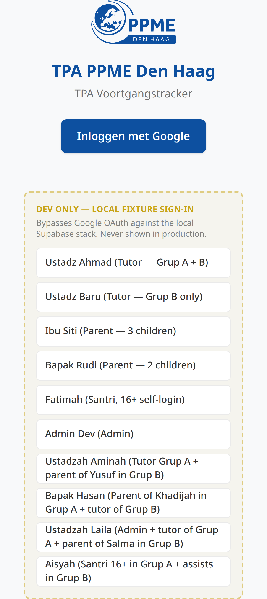

Het eerste scherm dat verschijnt voordat u bent ingelogd.

| Element | Functie |
|---|---|
| Logo en app-naam | "TPA PPME Den Haag" — statisch. |
| Tagline | "TPA Voortgangstracker" |
| **Knop "Inloggen met Google"** | Start het inlogproces via een Google-account (Google OAuth). Dit is de enige inlogmethode voor echte gebruikers. |

Als uw Google-account nog niet door de TPA-beheerder is geregistreerd, ziet u na het inloggen het scherm **"Uw account is nog niet geregistreerd. Neem contact op met de TPA-beheerder."** met daaronder een klein formulier en een knop **Uitloggen**.

**Formulier "Toegang aanvragen"** — vul dit in zodat de beheerder u sneller en met de juiste rol kan registreren:

| Veld | Functie |
|---|---|
| **Volledige naam** | Verplicht. Wordt alvast ingevuld met de naam uit uw Google-account; u kunt hem aanpassen. |
| **Toelichting** | Optioneel. Vrije tekst: wie u bent, om welk kind het gaat, waarom u toegang nodig heeft. |
| **Aanvraag versturen** | Verstuurt de gegevens naar de beheerder. De knop is uitgeschakeld zolang het naamveld leeg is. |

Na het versturen verandert de tekst bovenaan in **"Uw aanvraag is ontvangen. Een beheerder beoordeelt deze zo snel mogelijk."** U blijft op dit scherm — de aanvraag geeft zelf geen toegang. U kunt het formulier opnieuw openen en uw gegevens corrigeren zolang de beheerder u nog niet heeft geregistreerd. Zodra dat gebeurt, komt u bij de volgende keer laden vanzelf in de app. Een beheerder kan een aanvraag ook **weigeren** (zie [§12.1](#121-registraties)); u kunt daarna gewoon opnieuw inloggen en een nieuwe aanvraag indienen.

> Let op: in de ontwikkelversie verschijnt een extra vak "Dev only — local fixture sign-in" om verschillende testaccounts te proberen zonder Google. Dit vak **verschijnt nooit** in de echte/productieomgeving en is niet relevant voor dagelijkse gebruikers.

---

## 3. Algemene navigatie

Na het inloggen heeft elk scherm de volgende vaste onderdelen (zichtbaar op bijna elke schermafbeelding in deze handleiding).

### Bovenbalk
| Element | Functie |
|---|---|
| Logo | Link terug naar het startscherm. |
| 🔔 Belletje | Alleen zichtbaar voor accounts die meldingen kunnen ontvangen (ouder, of een leerling van 16+ met eigen account). Toont een aantal ongelezen meldingen (max. weergave "9+"). Tikken opent het [Meldingencentrum](#111-meldingencentrum). |
| 🌙/☀️ Maan/zon-icoon | Schakelt tussen donkere en lichte modus. |
| **ID** / **NL** | Wisselt de taal van de app tussen Indonesisch en Nederlands. De keuze wordt op het apparaat onthouden. |
| **Uitloggen** | Logt uit en keert terug naar het inlogscherm. |

### Onderbalk (alleen op mobiel)
Vijf vaste tabbladen, hetzelfde voor elke rol inclusief beheerder:

**Aanwezig · Huiswerk · Yanbu'a · Al-Quran · Murajaah**

**Rapport** en **Beheer** (alleen beheerder) staan niet in de onderbalk — beide zijn bereikbaar via een tegel op het startscherm, omdat er op een mobiel scherm maar ruimte is voor vijf goed aantikbare knoppen.

### Weergaveschakelaar (Scope Switch)
Verschijnt boven de inhoud, **alleen voor accounts met meer dan één relatie** (bijvoorbeeld een docent die ook ouder is), en **alleen** op deze zes schermen: Aanwezig, Huiswerk, Yanbu'a, Al-Quran, Murajaah, Rapport. Zie [§13](#13-accounts-met-een-dubbele-rol) voor de volledige uitleg.

---

## 4. Startscherm

Het eerste scherm na het inloggen. De inhoud verschilt licht per rol.

### 4.1 Weergave voor een docent

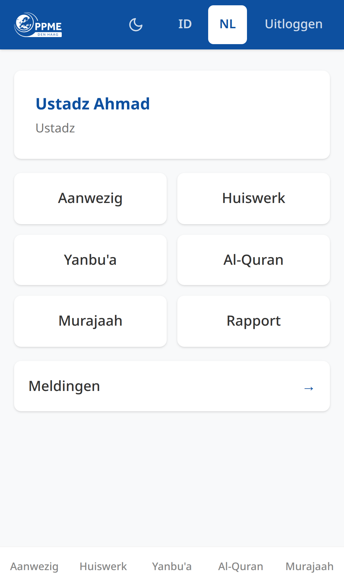

| Element | Functie |
|---|---|
| Begroetingskaart | Naam van de gebruiker + de relaties die het account heeft (bijv. "Docent", of "Docent · Ouder" als beide gelden). |
| Kaart **"Deze week"** *(alleen voor accounts met een gekoppeld kind/leerling — zie §4.2)* | Wordt niet getoond voor een zuivere docent. |
| Tegels **Aanwezig / Huiswerk / Yanbu'a / Al-Quran / Murajaah / Rapport** | Tik op een tegel om die functie te openen. |
| Regel **Meldingen →** | Opent de pagina [Meldingsinstellingen](#112-meldingsinstellingen) — beschikbaar voor elke rol, niet alleen voor ontvangers van meldingen, omdat iedereen moet kunnen lezen wat een melding precies inhoudt. |

### 4.2 Weergave voor een gezin (ouder / leerling)

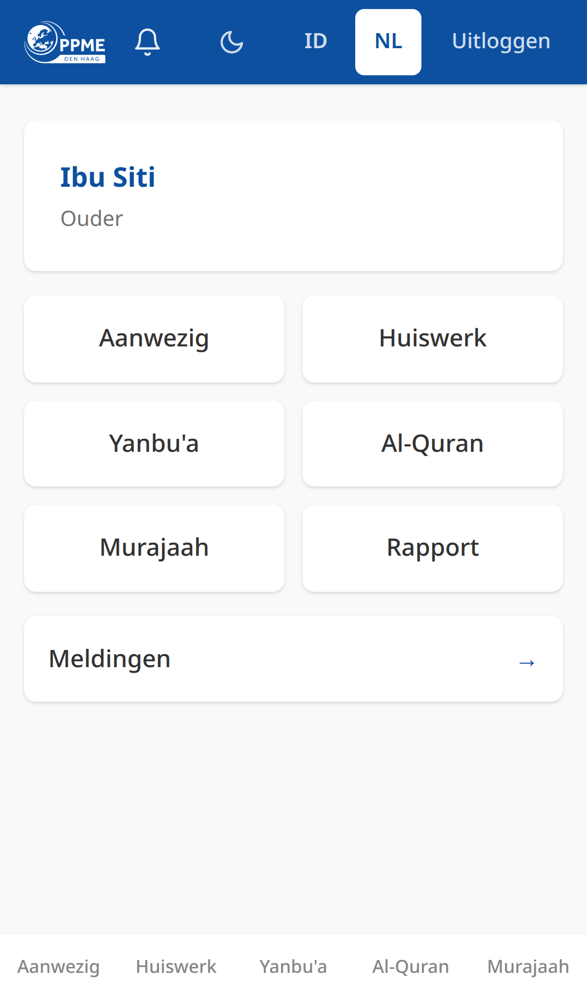

Hetzelfde als hierboven, plus een kaart **"Deze week"** met een samenvatting van de activiteit van het kind (of van uzelf, voor een 16+ leerling) van maandag tot vandaag:

| Kolom op de kaart "Deze week" | Inhoud |
|---|---|
| Aanwezigheid | Aanwezigheidspercentage deze week, of "—" als er nog geen registratie is. |
| Yanbu'a | Aantal geregistreerde Yanbu'a-sessies deze week. |
| Al-Quran | Aantal tilawah-sessies deze week. |
| Murajaah | Aantal murajaah-bevestigingen deze week. |

Deze kaart wordt automatisch **verborgen** als er die week helemaal geen activiteit is geweest — een rustige week wordt niet getoond als een kaart vol nullen. Bij meerdere kinderen krijgt elk kind met activiteit een eigen kaart.

### 4.3 Weergave voor een beheerder

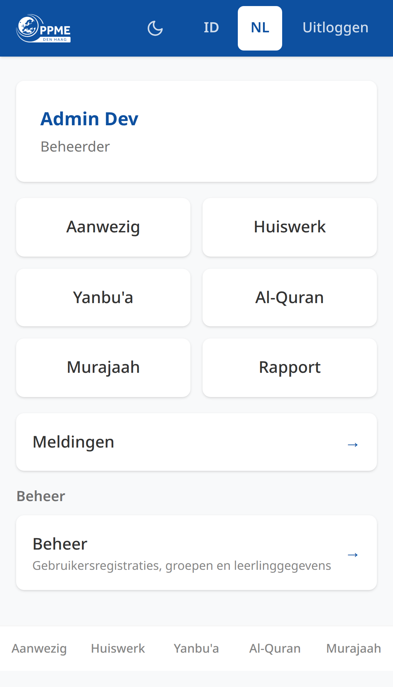

Hetzelfde als de docentweergave, plus een sectie **"Beheer"** onderaan — de enige toegang tot de [beheerpagina's](#12-beheer-alleen-beheerder) (registraties, groepen, leerlingen).

---

## 5. Aanwezigheid

### 5.1 Docentweergave — Aanwezigheid registreren

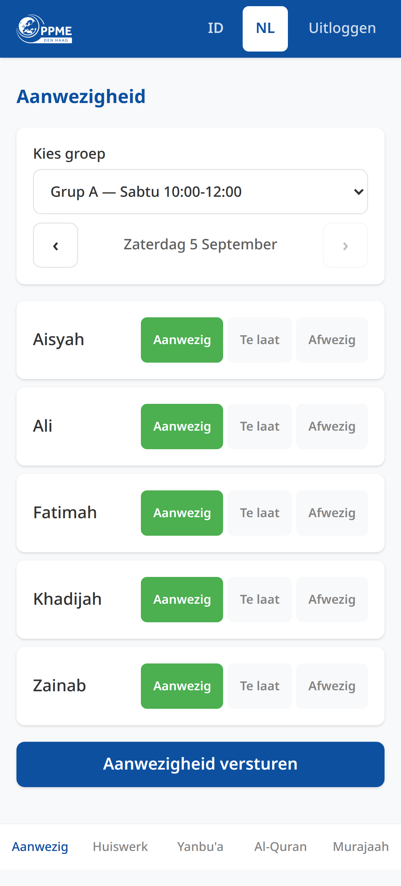

Het scherm om de aanwezigheid per groep te registreren. Het opent op de
huidige les van de groep — vandaag als de groep vandaag samenkomt, anders
de meest recente lesdag daarvoor. Welke dagen een groep samenkomt, stelt
de beheerder in bij de groep (zie [§12.2](#122-groepen) → Lesdagen).

| Element | Functie |
|---|---|
| **Kies groep** | Verschijnt alleen als de docent meer dan één groep begeleidt. Bij het wisselen worden de leerlingenlijst en de les opnieuw geladen. |
| Datumbalk met **‹** / **›** | Toont de datum van de getoonde les (weekdag, dag en maand; het jaartal erbij als de les niet in het huidige kalenderjaar valt). Met de pijlen stapt u door de lesdagen van de groep: **‹** terug tot 1 augustus van het huidige schooljaar, **›** vooruit tot en met de huidige les (verder vooruit kan niet). Staat er **niet ingevuld** onder de datum, dan is voor die lesdag nog geen aanwezigheid vastgelegd — u kunt dat alsnog doen; de les wordt aangemaakt zodra u verstuurt. Een al vastgelegde les blijft altijd te corrigeren, ook een die niet op een lesdag valt. |
| Leerlingregel + knoppen **Aanwezig / Te laat / Afwezig** | Tik op een van de knoppen om de status van die leerling in te stellen. Groen = de status die op dit moment op het scherm staat (nog niet naar de server verstuurd totdat u op **Aanwezigheid versturen** tikt). De standaardstatus voor elke leerling is "Aanwezig". |

Als u op **Afwezig** tikt, verschijnt een extra veld voor de reden:

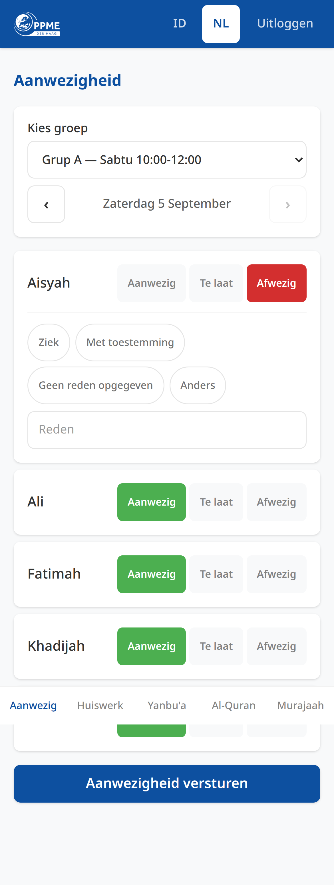

| Element | Functie |
|---|---|
| Chip **Ziek / Met toestemming / Geen reden opgegeven** | Vult het redenveld direct met deze tekst. |
| Chip **Anders** | Maakt het redenveld leeg zodat u zelf een reden kunt typen. |
| Tekstveld **Reden** | Vrij te bewerken, overschrijft de bovenstaande chip-keuze. |

Onderaan:

| Element | Functie |
|---|---|
| **Aanwezigheid versturen** | Opent een bevestigingsvak. Dat noemt het aantal leerlingen dat wordt verstuurd (een leerling-assistent die deel uitmaakt van de groep — zie de opmerking hieronder — telt niet mee) en, op een aparte regel, het aantal docenten (zie **Aanwezigheid docenten** hieronder). |
| **Bevestigen** / **Annuleren** | Bevestigen verstuurt de gegevens naar de server; Annuleren stopt zonder iets te versturen. |

**Bijzonderheid — leerling-assistent**: als een leerling van 16+ ook meehelpt met lesgeven in die groep, blijft haar/zijn naam op de presentielijst staan met een reeds opgeslagen status (standaard "Aanwezig"), maar die regel **kan niet door haarzelf/hemzelf** worden aangepast — alleen een andere docent of de beheerder kan haar/zijn aanwezigheid registreren. Deze uitleg staat direct onder de naam op het scherm. Haar/zijn naam verschijnt **niet** nog een keer in de sectie "Aanwezigheid docenten": de aanwezigheid wordt één keer vastgelegd, als leerling.

**Aanwezigheid docenten**: onder de leerlingenlijst staat een sectie **"Aanwezigheid docenten"** met elke docent van die groep en dezelfde knoppen **Aanwezig / Te laat / Afwezig** (en hetzelfde redenveld bij Afwezig). Deze sectie wordt samen met de presentielijst verstuurd als u op **Aanwezigheid versturen** tikt. Een docent mag zowel de eigen aanwezigheid als die van een collega uit dezelfde groep registreren. Heeft de groep nog geen docent toegewezen, dan verschijnt een aanwijzing om dat via **Beheer** te doen. De aanwezigheidsgegevens van docenten zijn **alleen zichtbaar voor de beheerder en voor de andere docenten van dezelfde groep** — nooit voor ouders of leerlingen — en de TPA-leiding gebruikt ze om de aanwezigheid van docenten periodiek na te kijken.

**Offline-status**: als de internetverbinding wegvalt tijdens het versturen, slaat de app de gegevens lokaal op en toont *"U bent offline. Gegevens worden verzonden zodra u weer online bent."* — de gegevens worden automatisch verstuurd zodra de verbinding terugkeert, zonder dat u opnieuw hoeft te registreren.

### 5.2 Gezinsweergave — Aanwezigheidsgeschiedenis bekijken

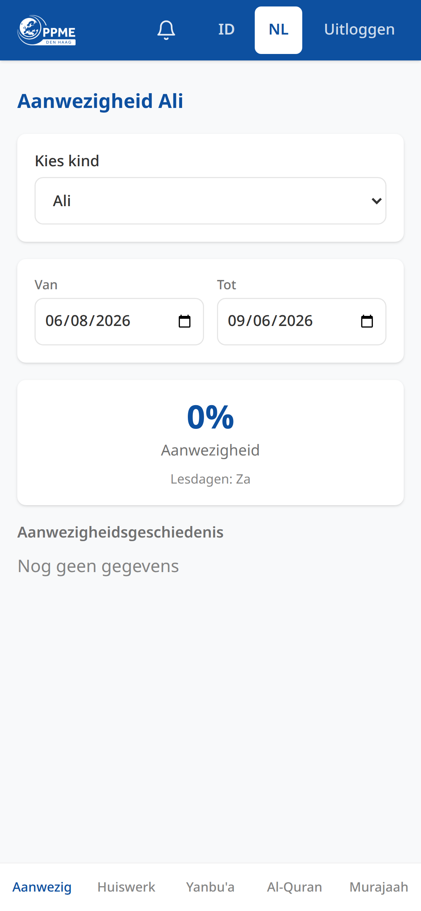

Dit scherm is **alleen om te bekijken** — ouders en leerlingen kunnen de aanwezigheidsgegevens niet wijzigen.

| Element | Functie |
|---|---|
| **Kies kind** | Verschijnt alleen als het account meer dan één gekoppeld kind heeft. |
| Titel | "Mijn aanwezigheid" (voor een leerling die de eigen gegevens bekijkt) of "Aanwezigheid {naam kind}". |
| Velden **Van** / **Tot** | Datumbereik om de geschiedenis te filteren (standaard: de laatste 90 dagen tot vandaag). |
| Groot percentage | Aanwezigheidspercentage binnen het gekozen datumbereik. |
| **Lesdagen** | Alleen-lezen regel onder het percentage met de weekdag(en) waarop de groep van het kind samenkomt (bijv. "Lesdagen: za"). Verschijnt niet als het kind nog niet in een groep zit. |
| **Aanwezigheidsgeschiedenis** | Lijst per datum met status **Aanwezig / Te laat / Niet aanwezig**, en de reden (indien opgegeven) bij afwezigheid. |

---

## 6. Huiswerk

### 6.1 Docentweergave — Huiswerk aanmaken & beoordelen

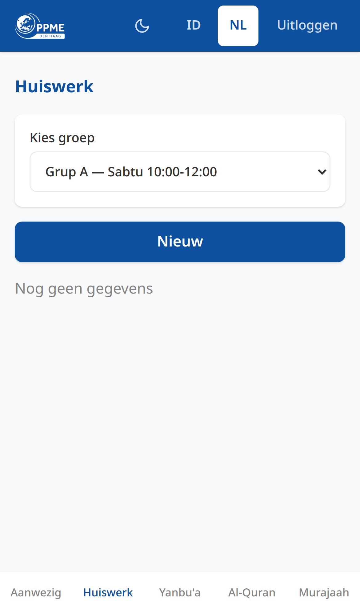

| Element | Functie |
|---|---|
| **Kies groep** | Zoals bij Aanwezigheid. |
| **Nieuw** | Opent het formulier voor nieuw huiswerk. |
| Huiswerklijst | Toont titel en deadline per opdracht; opdrachten waarvan de deadline is verstreken krijgen het label **"Termijn Verlopen"**. Tik op een opdracht om het beoordelingsscherm te openen. |

Formulier **Nieuw**:

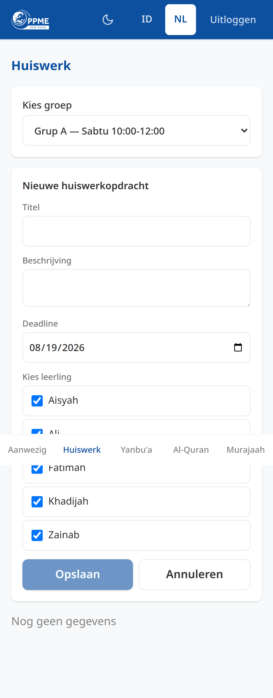

| Veld | Functie |
|---|---|
| **Titel** | Verplicht, maximaal 200 tekens. |
| **Beschrijving** | Optioneel, vrije tekst. |
| **Deadline** | Verplicht, standaard vandaag. |
| **Kies leerling** | Aanvinklijst van leerlingen in de gekozen groep — **standaard zijn alle leerlingen aangevinkt**; vink een leerling uit om die uit te sluiten. |
| **Opslaan** | Alleen actief als de titel is ingevuld, er een deadline is gekozen, en minstens één leerling is aangevinkt. |
| **Annuleren** | Sluit het formulier zonder op te slaan. |

Beoordelingsscherm (na het tikken op een opdracht in de lijst):

| Element | Functie |
|---|---|
| **← Terug** | Terug naar de lijst. |
| Titel, beschrijving en deadline | Informatie over de gekozen opdracht. |
| Leerlingregel + knoppen **In afwachting / Voltooid / Te laat / Gedeeltelijk** | Stelt de inleverstatus van die leerling in. Elke tik wordt **direct opgeslagen** op de server (geen apart "versturen"-knop zoals bij Aanwezigheid). |
| Veld **Notities** per leerling | Vrije notitie van de docent voor die leerling; wordt automatisch opgeslagen zodra het veld de focus verliest (bijvoorbeeld na typen en dan elders op het scherm tikken). |

> Let op: de statuslabel "Te laat" bij Huiswerk betekent **te laat/onvolledig ingeleverd**, iets anders dan "Te laat" bij Aanwezigheid, wat **te laat op les komen** betekent — hetzelfde woord, andere betekenis op twee verschillende schermen.

### 6.2 Gezinsweergave — Huiswerk bekijken

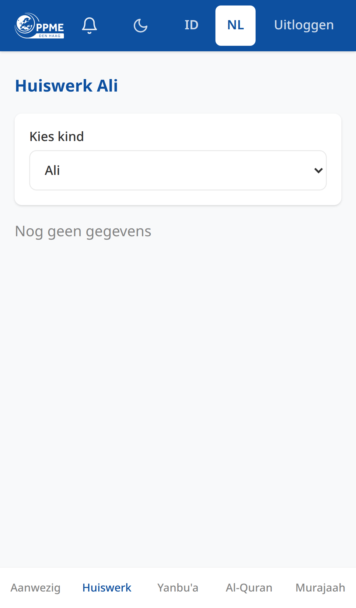

Alleen om te bekijken — de status kan alleen door de docent worden gewijzigd.

| Element | Functie |
|---|---|
| **Kies kind** | Zoals bij Aanwezigheid. |
| Regel met aantal actieve opdrachten | "{aantal} actieve huiswerkopdrachten" — telt opdrachten met status "In afwachting" of waarvan de deadline is verstreken. |
| Kaart per opdracht | Titel, beschrijving, deadline, notities van de docent (indien aanwezig), en statuslabel: **In afwachting / Voltooid / Te laat / Gedeeltelijk / Termijn Verlopen**. |

---

## 7. Yanbu'a

Yanbu'a is een stapsgewijze leesmethode voor het Arabisch/Koranlezen (jilid 1–7 + pagina's). Dit scherm registreert de jilid, pagina en het beheersingsniveau van de leerling.

### 7.1 Docentweergave — Voortgang registreren

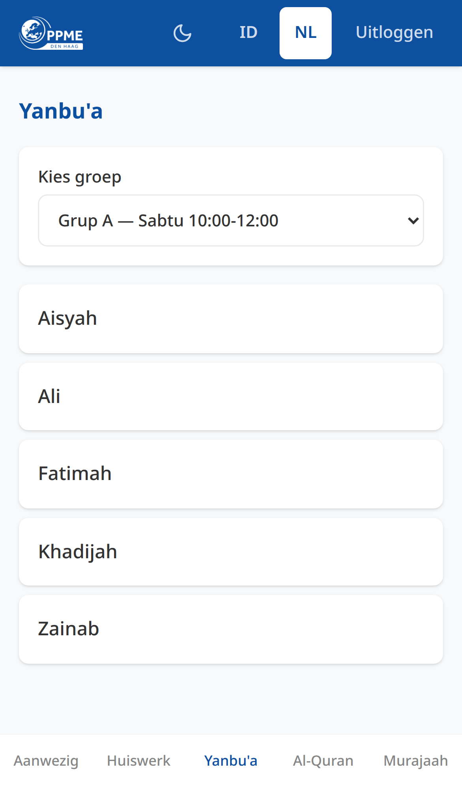

| Element | Functie |
|---|---|
| **Kies groep** | Zoals bij andere schermen. |
| Leerlingenlijst | Tik op een naam om het registratiescherm te openen. |

Registratiescherm (na het kiezen van een leerling):

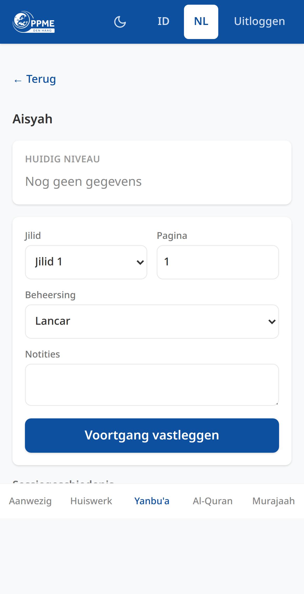

| Element | Functie |
|---|---|
| **← Terug** | Terug naar de leerlingenlijst. |
| Kaart **Huidig niveau** | Toont de laatst geregistreerde jilid, pagina en beheersing voor deze leerling. |
| **Jilid** | Keuze uit jilid 1–7. |
| **Pagina** | Paginanummer binnen die jilid. |
| **Beheersing** | Lancar (vloeiend) / Kurang Lancar (nog niet vloeiend) / Ulang (herhalen). |
| **Notities** | Vrije tekst, optioneel. |
| **Voortgang vastleggen** | Slaat een nieuwe registratie op. Als de geregistreerde pagina de laatste pagina van die jilid is **én** de beheersing "Lancar" is, verschijnt een felicitatiebericht **"Jilid {n} voltooid! 🎉"** en springt het formulier automatisch naar de volgende jilid, pagina 1 — klaar voor de volgende sessie. |
| **Sessiegeschiedenis** | Lijst van alle eerdere registraties voor deze leerling, met datum. |

**Offline-status**: net als bij Aanwezigheid — als het versturen mislukt door een netwerkprobleem, worden de gegevens lokaal opgeslagen en automatisch verstuurd zodra de verbinding terugkeert.

### 7.2 Gezinsweergave — Voortgang bekijken

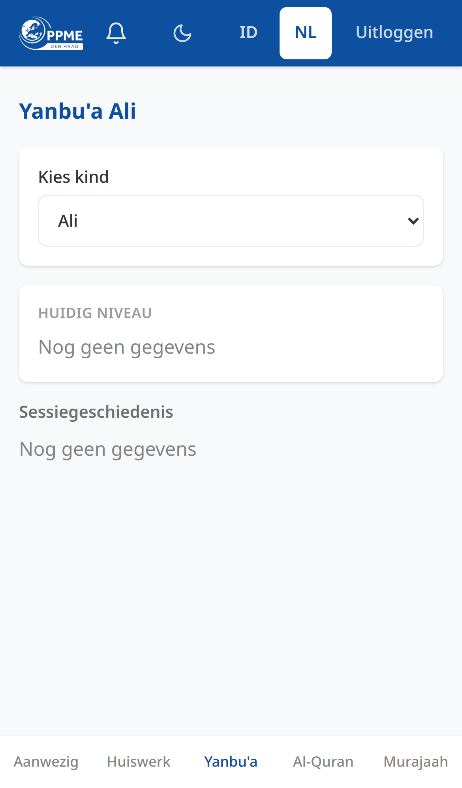

Alleen om te bekijken.

| Element | Functie |
|---|---|
| **Kies kind** | Zoals bij andere schermen. |
| Kaart **Huidig niveau** | Actuele jilid, pagina en beheersing. |
| **Sessiegeschiedenis** | Net als bij de docentweergave — de volledige geschiedenis, zonder mogelijkheid om iets te wijzigen. |

---

## 8. Al-Quran

Registreert de tilawah-positie (leespositie) van de leerling in de Al-Quran: surah, versbereik en leeskwaliteit.

### 8.1 Docentweergave — Tilawah registreren

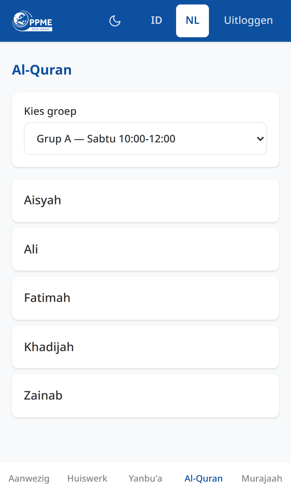

Zelfde structuur als Yanbu'a: **Kies groep** → leerlingenlijst → tik op een naam om te registreren.

Registratiescherm:

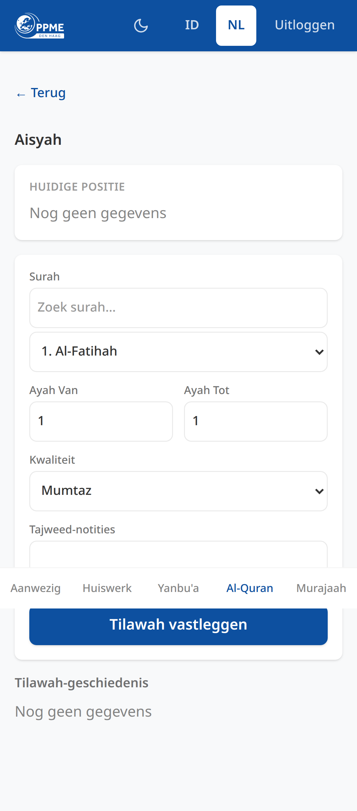

| Element | Functie |
|---|---|
| Kaart **Huidige positie** | Laatst geregistreerde surah en ayah, plus een geschat percentage van de Al-Quran dat de leerling heeft doorlopen (bijv. "~12% Al-Quran"). |
| **Surah** | Zoekveld (typ de naam of het nummer om te filteren) + keuzelijst met surahs. |
| **Ayah Van** / **Ayah Tot** | Het versbereik dat tijdens deze sessie is gelezen. |
| **Kwaliteit** | Mumtaz / Jayyid Jiddan / Jayyid / Maqbul / Verbetering nodig (van beste naar verbetering nodig). |
| **Tajweed-notities** | Vrije tekst, optioneel. |
| **Tilawah vastleggen** | Slaat de registratie op. In tegenstelling tot Yanbu'a is er hier **geen** automatisch felicitatiebericht of automatische sprong naar de volgende surah — de velden surah/ayah/kwaliteit blijven staan zoals ze waren voor de volgende registratie. |
| **Tilawah-geschiedenis** | Lijst van alle eerdere registraties. |

**Offline-status**: zelfde als bij Aanwezigheid/Yanbu'a.

### 8.2 Gezinsweergave — Tilawah bekijken

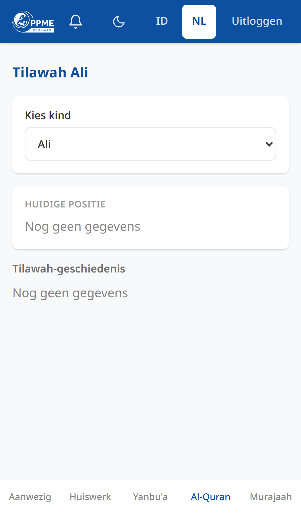

Alleen om te bekijken: kaart **Huidige positie** + **Tilawah-geschiedenis**, net als bij Yanbu'a.

---

## 9. Murajaah

Murajaah is het regelmatig thuis herhalen van gememoriseerde Qur'an-verzen. Een docent stelt een doel in (surah + versbereik + frequentie), waarna een ouder elke keer bevestigt dat het thuis is gedaan.

Het Murajaah-menu voor een docent heeft **twee tabbladen**:

### 9.1 Tabblad "Doel toewijzen"

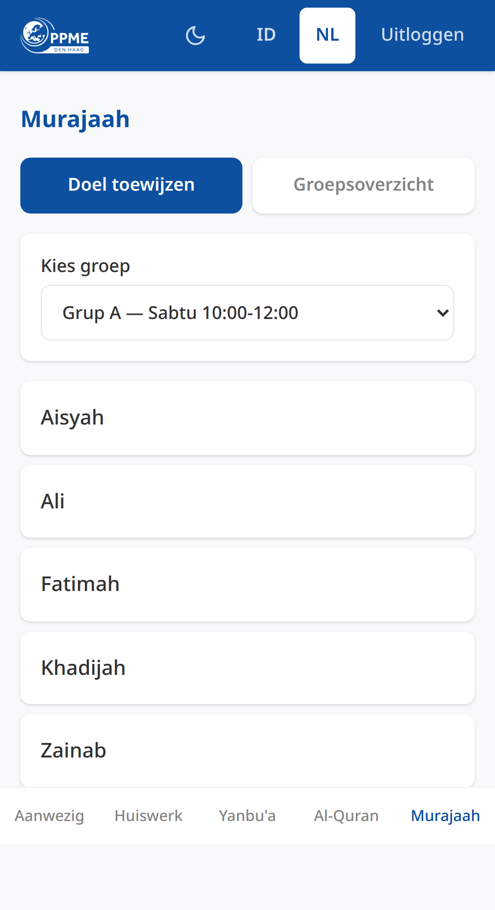

Net als bij Yanbu'a/Al-Quran: **Kies groep** → leerlingenlijst → tik op een naam om de details te openen.

Op het detailscherm van een leerling vindt u:

| Element | Functie |
|---|---|
| Lijst met actieve doelen | Elk doel wordt getoond als kaart: surahnaam, versbereik en frequentie (Elke dag / 3x per week / 1x per week). |
| **Markeer als gememoriseerd** (per doelkaart) | Markeert dat doel als volledig gememoriseerd — het doel verplaatst naar "Voltooide memorisatie". |
| **Nieuw doel toewijzen** | Opent het formulier voor een nieuw doel: kies **Surah**, versbereik **Ayah Van/Tot**, en **Frequentie**. De knop **Opslaan** is alleen actief bij een geldig versbereik. |
| **Voltooide memorisatie** | Lijst van doelen die al als voltooid zijn gemarkeerd — kan hier niet meer worden gewijzigd. |
| **Bevestigingsgeschiedenis** | Lijst van elke datum waarop murajaah door een ouder is bevestigd, met de kwaliteit. |

### 9.2 Tabblad "Groepsoverzicht"

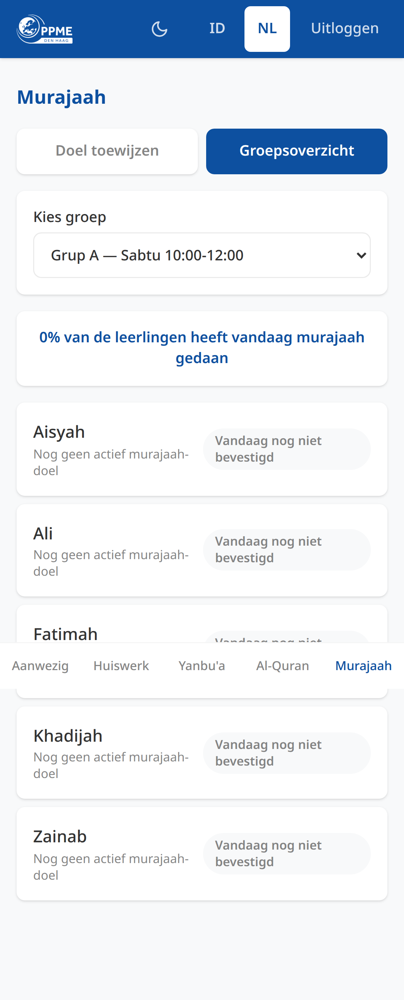

Dit scherm is **alleen om te bekijken** — een docent kan geen murajaah bevestigen namens een leerling (dat kan alleen een ouder).

| Element | Functie |
|---|---|
| Percentagesamenvatting | "{percentage}% van de leerlingen heeft vandaag murajaah gedaan". |
| Regel per leerling | Actief doel (indien aanwezig), status **"✓ Murajaah voltooid"** of **"Vandaag nog niet bevestigd"**, en het aantal bevestigde dagen deze week (bijv. "3/7 deze week"). |

### 9.3 Gezinsweergave — Murajaah bevestigen

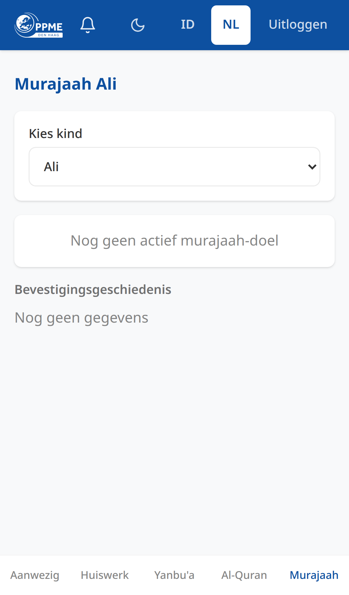

| Element | Functie |
|---|---|
| **Kies kind** | Zoals bij andere schermen. |
| Kaart met actief doel | Surah, versbereik, frequentie, **aantal dagen/weken op rij (streak)**, en het beste record indien van toepassing. |
| **Kwaliteit** (keuzelijst) | Vloeiend gememoriseerd / Gememoriseerd, nog niet vloeiend / Nog niet gememoriseerd — te kiezen vóór het bevestigen. |
| **✓ Murajaah voltooid** (knop) | Registreert dat de murajaah van vandaag is gedaan. **Alleen zichtbaar voor een ouder/verzorger** — als u een leerling van 16+ bent die de eigen gegevens bekijkt, is deze knop niet beschikbaar; alleen een ouder/verzorger kan murajaah bevestigen, ook al kan de leerling wel de eigen voortgang zien. |
| **Voltooide memorisatie** & **Bevestigingsgeschiedenis** | Net als bij de docentweergave. |

**Offline-status**: als een bevestiging niet kan worden verstuurd door een netwerkprobleem, verschijnt *"U bent offline..."* en wordt deze tijdelijk lokaal bewaard totdat automatisch opnieuw kan worden verstuurd.

**Al bevestigd**: heeft een kind meer dan één ouder/verzorger, dan kan elk van hen de murajaah van die dag bevestigen. De eerste bevestiging telt; bevestigt een tweede ouder/verzorger daarna nog eens voor dezelfde dag, dan verschijnt *"Murajaah is vandaag al bevestigd."* en verandert er niets.

---

## 10. Rapport

Het jaarrapport vat de aanwezigheid, cijfers per vak (Yanbu'a, Al-Quran, Murajaah) en de opmerking van de docent samen, en wordt vervolgens gepubliceerd als PDF die het gezin kan downloaden.

### 10.1 Docent-/beheerderweergave — Rapportenlijst

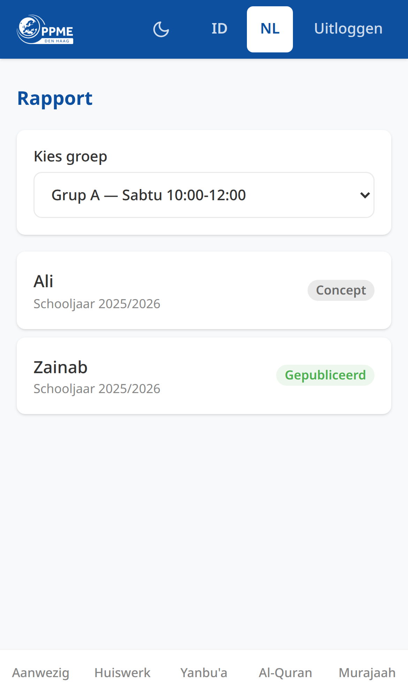

| Element | Functie |
|---|---|
| *(Alleen beheerder)* Paneel **"Conceptrapporten aanmaken"** | De beheerder kan conceptrapporten aanmaken voor alle groepen of voor één specifieke groep, voor één schooljaar (formaat "2025/2026"). Na het aanmaken toont het paneel het aantal succesvol aangemaakte concepten, plus het aantal overgeslagen (omdat er al een rapport bestond, of omdat de groep geen docent heeft). |
| **Kies groep** | Zoals bij andere schermen. |
| Rapportenlijst | Naam van de leerling, schooljaar, en statuslabel **Concept** (grijs) of **Gepubliceerd** (groen). Tik op een rij om te openen. |

### 10.2 Rapporteditor

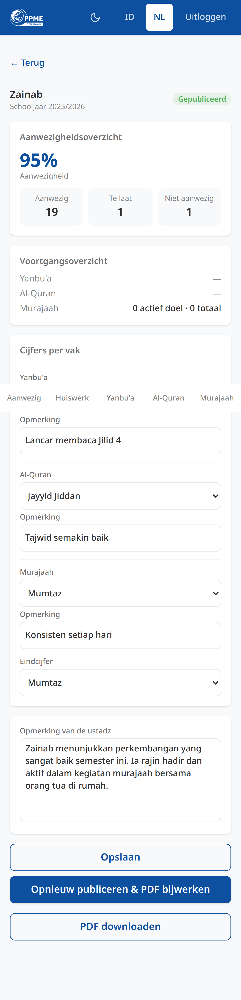

| Element | Functie |
|---|---|
| **← Terug** | Terug naar de lijst. |
| **Aanwezigheidsoverzicht** | Percentage + aantal Aanwezig/Te laat/Niet aanwezig — dit is een **momentopname** van het moment waarop het concept werd aangemaakt, geen live gegevens, zodat het cijfer hetzelfde blijft ook als aanwezigheidsgegevens achteraf worden gecorrigeerd. |
| **Voortgangsoverzicht** *(alleen voor docent/beheerder, niet zichtbaar in de gezinsweergave)* | Actuele positie in Yanbu'a en Al-Quran, en het aantal actuele murajaah-doelen — live gegevens, als hulpmiddel bij het invullen van de cijfers. |
| **Cijfers per vak**: Yanbu'a, Al-Quran, Murajaah | Elk vak heeft een cijferkeuzelijst (Mumtaz / Jayyid Jiddan / Jayyid / Maqbul / Begeleiding nodig / "Nog geen cijfer") + een kort notitieveld. |
| **Eindcijfer** | Keuzelijst voor het gecombineerde eindcijfer, zonder notitieveld. |
| **Opmerking van de docent** | Lang tekstveld met een verhaal over de voortgang van de leerling — **verplicht in te vullen voordat het rapport gepubliceerd kan worden**. |
| **Opslaan** | Slaat wijzigingen op zonder te publiceren — kan altijd, zowel bij een concept als bij een al gepubliceerd rapport. |
| **Rapport publiceren** / **Opnieuw publiceren & PDF bijwerken** | Alleen zichtbaar voor de **docent die het rapport heeft geschreven** (niet voor de beheerder). Toont een bevestigingsvak, maakt daarna een PDF-bestand aan en verandert de status in "Gepubliceerd" — daarna kunnen ouder en leerling het bekijken en downloaden. Niet actief totdat het veld Opmerking van de docent is ingevuld. |
| **PDF downloaden** | Verschijnt zodra er al eens een PDF is aangemaakt. |

**Opmerking voor beheerders**: een beheerder kan de cijfers/opmerkingen van elk rapport wijzigen, maar **kan het niet publiceren** — alleen de oorspronkelijke docent kan op de publiceerknop drukken. Als een beheerder een al gepubliceerd rapport wijzigt, wordt de wijziging direct in de app opgeslagen, maar het PDF-bestand blijft verouderd totdat de betreffende docent het opnieuw publiceert.

### 10.3 Gezinsweergave — Rapport bekijken & downloaden

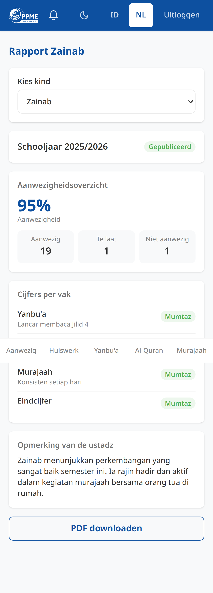

Een gezin **kan alleen gepubliceerde rapporten zien** — een rapport met de status concept verschijnt hier nooit.

| Element | Functie |
|---|---|
| **Kies kind** | Zoals bij andere schermen. |
| Aanwezigheidsoverzicht, cijfers per vak en opmerking van de docent | Zoals door de docent geschreven, alleen om te lezen. |
| **PDF downloaden** | Opent het PDF-bestand van het rapport in een nieuw tabblad. |

Als er nog geen rapport is gepubliceerd voor dat kind, toont het scherm het bericht **"Nog geen rapporten beschikbaar"**.

---

## 11. Meldingen

### 11.1 Meldingencentrum

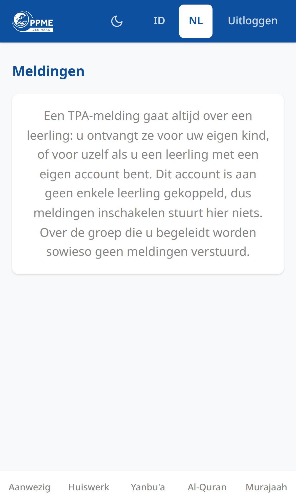

Wordt geopend via het belletje in de bovenbalk. Bevat alleen gegevens voor accounts die als ontvanger van meldingen gelden (ouder, of een leerling van 16+ met eigen account) — een zuivere docent of beheerder ziet hier het bericht dat het account nog aan geen enkele leerling is gekoppeld.

| Element | Functie |
|---|---|
| Meldingenlijst | Elke regel is één gebeurtenis: leerling afwezig, nieuw huiswerk, deadline-herinnering, Yanbu'a-jilid voltooid, nieuwe surah gememoriseerd, murajaah-herinnering, rapport klaar, of het wekelijkse overzicht. Tik op een regel om het bijbehorende scherm te openen. |
| Meldingen lezen | Alle meldingen worden automatisch als "gelezen" gemarkeerd zodra deze pagina wordt geopend — er is geen aparte knop hiervoor. |
| Link **Meldingsinstellingen** | Opent [§11.2](#112-meldingsinstellingen). |

### 11.2 Meldingsinstellingen

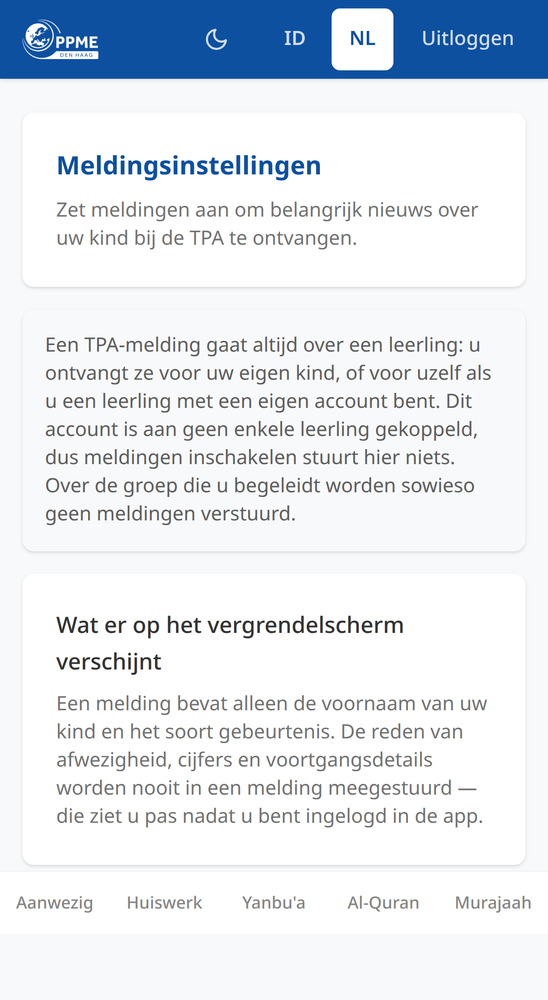

Bereikbaar vanaf het startscherm of vanuit het Meldingencentrum. Open voor **elke rol**, al verschilt de inhoud:

| Element | Functie |
|---|---|
| Huidige pushmeldingsstatus | "Meldingen staan aan op dit apparaat" / "staan uit" / "staan aan op een ander apparaat" (één account kan meldingen maar op één apparaat tegelijk ontvangen). |
| **Meldingen inschakelen** / **Meldingen uitschakelen** / **Verplaats naar dit apparaat** | Eén knop waarvan het label verandert afhankelijk van de bovenstaande status. |
| *(Alleen voor accounts die meldingen ontvangen)* Lijst **"Wat u ontvangt"** | Korte uitleg van de 4 soorten meldingen die worden verstuurd: afwezigheid, nieuw huiswerk, prestaties (jilid/surah voltooid), en rapport klaar. |
| **"Wat er op het vergrendelscherm verschijnt"** | Privacytoelichting: een melding op het vergrendelscherm bevat alleen de voornaam van het kind en het soort gebeurtenis — **nooit** de reden van afwezigheid, cijfers of voortgangsdetails; die zijn pas zichtbaar na het openen van de app. |

Als de browser meldingsrechten blokkeert, toont het scherm uitleg om deze handmatig via de browserinstellingen toe te staan.

---

## 12. Beheer (alleen beheerder)

Alleen toegankelijk voor een account met de rol Beheerder, via de tegel **Beheer** op het startscherm. Bestaat uit drie subpagina's met een tabmenu bovenaan: **Registraties · Groepen · Leerlingen**.

### 12.1 Registraties

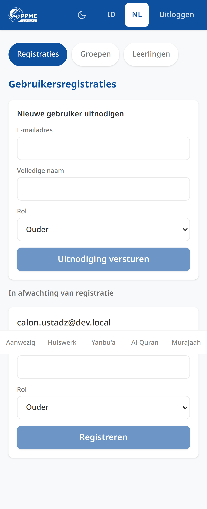

**Sectie "Nieuwe gebruiker uitnodigen"**

| Veld | Functie |
|---|---|
| **E-mailadres** | Verplicht. |
| **Volledige naam** | Verplicht. |
| **Rol** | Ouder / Docent / Leerling / Beheerder (standaard: Ouder). |
| **Uitnodiging versturen** | Maakt een nieuw account aan en stuurt een uitnodigingslink naar dat e-mailadres. |

**Sectie "In afwachting van registratie"** — mensen die al eerder via Google zijn ingelogd, maar nog geen profiel/rol hebben gekregen (bijvoorbeeld omdat ze door iemand anders zijn uitgenodigd, of zelf inlogden voordat de beheerder ze registreerde):

| Veld | Functie |
|---|---|
| E-mail en datum eerste keer ingelogd | Automatische informatie, niet te wijzigen. |
| **Toelichting van de gebruiker** | Alleen zichtbaar als de persoon zelf een toelichting heeft ingevuld op het aanvraagformulier (zie [§2](#2-inloggen)). Alleen-lezen. |
| **Volledige naam** | Alvast ingevuld met de naam die de persoon zelf heeft opgegeven; leeg als die er niet is (bijvoorbeeld bij een uitgenodigd account). U kunt hem altijd aanpassen vóór het registreren. |
| **Rol** | Zoals hierboven. |
| **Registreren** | Voltooit de registratie van die persoon — de rij verdwijnt automatisch uit de lijst na succes, en de aanvraag (met toelichting) wordt verwijderd. |
| **Weigeren** | Verwijdert de wachtende aanmelding. Er verschijnt eerst een bevestigingsvraag met het e-mailadres. Na bevestiging worden het (nog niet-geregistreerde) account en de bijbehorende aanvraag verwijderd en verdwijnt de rij uit de lijst. **Weigeren is geen blokkade**: dezelfde Google-gebruiker kan opnieuw inloggen en verschijnt dan als een nieuwe wachtende aanmelding. Een aanmelding waarvan het account inmiddels wél is aangemaakt, kan niet worden geweigerd. |

### 12.2 Groepen

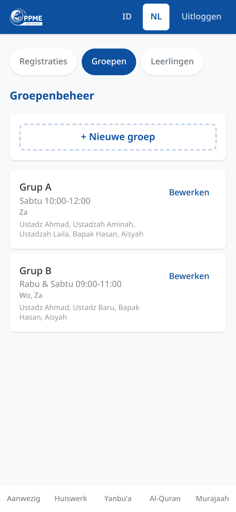

| Element | Functie |
|---|---|
| **+ Nieuwe groep** | Opent het formulier voor een nieuwe groep (zie afbeelding hieronder). |
| Kaart per groep | Naam, rooster, lesdagen (bijv. "wo, za"), en lijst van toegewezen docenten. |
| **Bewerken** | Opent het bewerkingsformulier voor die groep, al ingevuld met bestaande gegevens. |

Groepsformulier (hetzelfde voor nieuw aanmaken of bewerken):

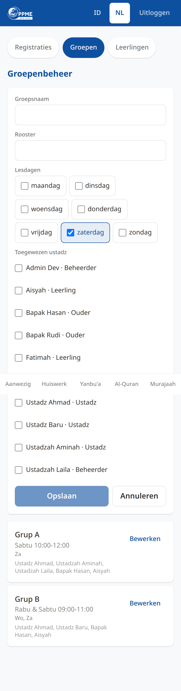

| Veld | Functie |
|---|---|
| **Groepsnaam** | Verplicht. |
| **Rooster** | Optioneel, vrije tekst voor de tijd (bijv. "Sabtu 10:00-12:00"). |
| **Lesdagen** | Aanvinklijst maandag t/m zondag. Bij een nieuwe groep staat **zaterdag** al aangevinkt; meerdere dagen mag. Er moet minstens één dag gekozen zijn — anders is **Opslaan** uitgeschakeld met de melding *"Kies minstens één dag"*. Deze dagen bepalen op welke datums de aanwezigheidslijst een les kan aanmaken. |
| **Toegewezen docenten** | Aanvinklijst — er kan meer dan één docent worden gekozen, of geen enkele. |
| **Opslaan** / **Annuleren** | Opslaan of annuleren. |

> Er is geen knop om een groep te verwijderen in deze app.

### 12.3 Leerlingen

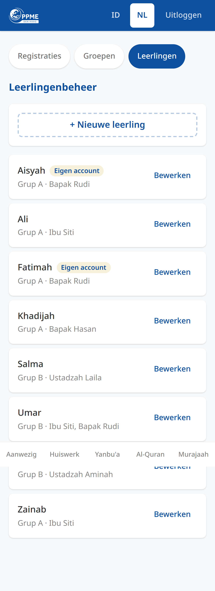

| Element | Functie |
|---|---|
| **+ Nieuwe leerling** | Opent het formulier voor een nieuwe leerling. |
| Kaart per leerling | Naam, label **"Eigen account"** (als de leerling een eigen Google-login heeft, bijvoorbeeld een leerling van 16+), groep, en de namen van de gekoppelde ouders/verzorgers. |
| **Bewerken** | Opent het bewerkingsformulier. |

Leerlingformulier:

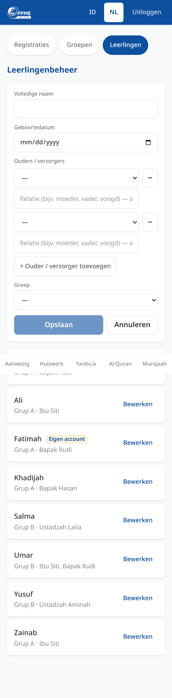

| Veld | Functie |
|---|---|
| **Volledige naam** | Verplicht. |
| **Geboortedatum** | Verplicht. |
| **Ouders / verzorgers** | Verplicht — **minstens één**. Kies elke ouder/verzorger uit de lijst van geregistreerde gebruikers en voeg met **"+ Ouder / verzorger toevoegen"** zo nodig een tweede (of meer) toe. Per regel kan een optionele relatie worden ingevuld (bijv. "moeder", "vader", "voogd"). Alle gekoppelde ouders/verzorgers krijgen **dezelfde** toegang: zij zien de voortgang, ontvangen de meldingen en kunnen thuisoefening bevestigen — er is geen "hoofd"-ouder. De verwijderknop **−** is uitgeschakeld zolang er nog maar één regel is; een kind moet altijd minstens één ouder/verzorger houden. Een ouder/verzorger verwijderen laat de toegang direct vervallen; dat de koppeling ooit heeft bestaan blijft geregistreerd voor controle. |
| **Groep** | Optioneel — kan leeg blijven als de leerling nog niet in een groep is geplaatst. |
| **Koppel zelfstandig account** | Optioneel — verschijnt alleen als er een account van het type "leerling" bestaat dat nog aan geen enkele leerling is gekoppeld. Dit is de manier om de Google-login van een leerling (meestal 16+) te koppelen aan bestaande leerlinggegevens, bijvoorbeeld wanneer de leerling net een eigen account heeft aangemaakt. |
| **Opslaan** / **Annuleren** | Opslaan of annuleren. |

> Er is geen knop om een leerling te verwijderen in deze app.

---

## 13. Accounts met een dubbele rol

Sommige accounts hebben meer dan één relatie — bijvoorbeeld een docent die ook ouder is van een leerling in een andere groep (niet de groep die hij/zij zelf begeleidt). Zulke accounts zien een **weergaveschakelaar** boven de schermen Aanwezigheid, Huiswerk, Yanbu'a, Al-Quran, Murajaah en Rapport:

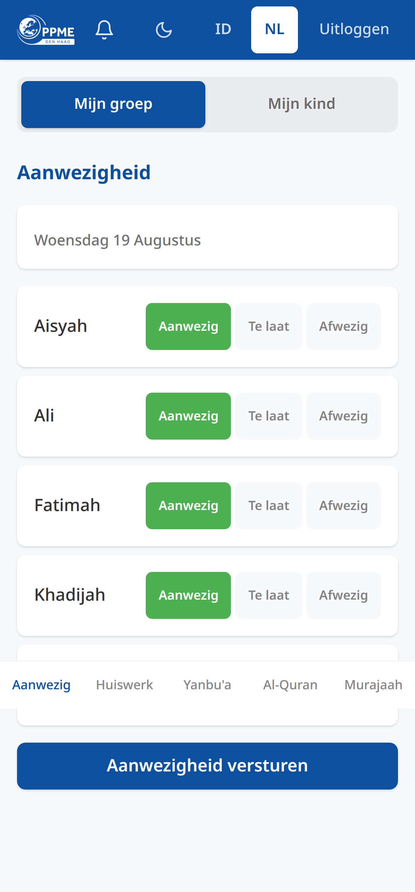

| Knop | Functie |
|---|---|
| **Mijn groep** | Toont de docentweergave — de groep(en) die wordt/worden begeleid. |
| **Mijn kind** *(of "Mijzelf" voor een 16+ leerling, of "Mijn gezin" als beide gelden)* | Toont de gezinsweergave — het kind dat aan dit account gekoppeld is. |

Het geopende scherm **verandert niet** bij het indrukken van deze schakelaar — alleen de inhoud wisselt tussen de groepsweergave en de gezinsweergave. Een account met slechts één relatie (uitsluitend docent, uitsluitend ouder, of uitsluitend beheerder) ziet deze schakelaar nooit.

---

## 14. Algemene elementen & begrippen

De volgende elementen komen op veel schermen terug en worden hier één keer uitgelegd om herhaling te voorkomen.

| Element | Wanneer zichtbaar | Functie |
|---|---|---|
| **Kies groep** | Elk docentscherm | Verschijnt alleen als de docent meer dan één groep begeleidt. |
| **Kies kind** | Elk gezinsscherm | Verschijnt alleen als het account meer dan één gekoppeld kind heeft. |
| *"Laden…"* | Alle schermen | Gegevens worden van de server opgehaald. |
| *"Nog geen gegevens"* | Alle schermen | Er zijn geen gegevens om te tonen in de huidige situatie. |
| *"U bent nog aan geen enkele groep toegewezen"* | Docentschermen | Het docentaccount heeft nog geen groep(en) van de beheerder gekregen. |
| *"U bent offline. Gegevens worden verzonden zodra u weer online bent."* | Aanwezigheid, Yanbu'a, Al-Quran, Murajaah | Uw actie is lokaal opgeslagen en **wordt automatisch verstuurd** zodra de internetverbinding terugkeert — geen herhaling nodig. |
| Foutmelding (rood vak) | Alle schermen | Er is iets misgegaan bij het laden of opslaan van gegevens — probeer het opnieuw of neem contact op met de beheerder bij herhaling. |

---

## 15. Bijlage: begrippenlijst Nederlands ⟷ Indonesisch

Om tweetalige communicatie binnen de TPA te vergemakkelijken, hier de belangrijkste begrippen die de app gebruikt:

| Nederlands | Indonesisch | Toelichting |
|---|---|---|
| Groep | Grup | Voorheen "Klas"/"Kelas" genoemd — de officiële term is nu "Groep"/"Grup". |
| Leerling | Santri | — |
| Docent | Guru | Neutrale term voor een begeleider; vervangt "Ustadz/Ustadzah". |
| Ouder | Orang Tua | — |
| Aanwezig | Hadir | — |
| Huiswerk | Tugas | Voorheen "Opdrachten" genoemd — de officiële term is nu "Huiswerk"/"Tugas". |
| Rapport | Rapor | — |
| Beheer | Kelola | Menu alleen voor de beheerder. |
| Registraties | Pendaftaran | — |

---

*Dit document is opgesteld op basis van schermafbeeldingen van de app-versie van augustus 2026, mobiele weergave, met de schermen voor **5. Aanwezigheid** en **12.2 Groepen** opnieuw vastgelegd voor de lesdagen van een groep en de op het rooster gebaseerde aanwezigheidslijst (ADR-037, september 2026), en met **§5.1 aangevuld voor de sectie "Aanwezigheid docenten"** (ADR-041, september 2026). De indeling kan in latere app-versies licht afwijken. De PDF-versie moet uit deze bijgewerkte tekst opnieuw worden gegenereerd.*
